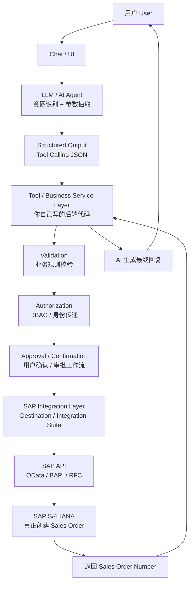

# Part 1：总体架构认知

## 1.1 "AI + SAP"项目本质是什么

本质是一个 **"自然语言接口 + 业务规则引擎 + 企业系统集成"** 的三段式系统：

1. **LLM 负责"理解"**：把人类模糊的语言，转成结构化、机器可执行的意图（intent）和参数（entities）。
2. **中间层（Backend / Business Service）负责"判断和把关"**：补全数据、校验业务规则、控制权限、生成审批、保证幂等和可追溯。
3. **SAP 负责"执行和记账"**：作为 System of Record，真正创建、存储、并驱动后续的 Order-to-Cash 流程（交货、开票、记账）。

**LLM 不是在"操作 SAP"，而是在"操作一个受控的 Tool 接口"，这个接口背后才是 SAP。** 这是整个架构设计最核心的一条原则，贯穿全文。

## 1.2 谁负责什么（一句话版）

| 角色 | 负责 | 不负责 |
|---|---|---|
| LLM / AI Agent | 理解意图、抽取参数、生成自然语言、决定调用哪个 Tool、组织回复 | 直接拼 SAP 请求、做最终业务合法性判断、绕过确认直接写数据 |
| Tool / Business Service 层（你写的代码） | 参数校验、主数据查询、幂等控制、权限检查、审批编排、错误处理、日志 | 理解自然语言、猜测用户意图 |
| SAP Integration 层（Destination/Integration Suite/Adapter） | 协议转换、认证、路由、重试、监控 | 业务规则判断 |
| SAP S/4HANA 自身 | Sales Area 有效性、Credit Check、ATP、Pricing、数据一致性、事务完整性 | 理解自然语言，判断"用户是否真的想要这个" |

## 1.3 典型架构分层图

## 1.4 每一层详解

### 1.4.1 Chat / UI

- **职责**：接收用户输入，展示对话历史，展示确认卡片（confirmation card），展示最终结果。
- **输入**：用户文本/语音。
- **输出**：结构化的用户消息 + session/conversation ID。
- **谁实现**：前端团队，或直接用 SAP Joule / 自建 Web Chat / Teams/Slack Bot。
- **常见技术**：React/Vue、SAP Fiori Chat 组件、SAP Joule（⚠️ 需按当前版本核实其可扩展性和自定义 Skill 机制）。
- **易错点**：把"展示层的确认按钮"误当作"安全边界"——真正的写操作校验必须在后端重新做一遍，不能信任前端传回的"已确认"标志未经签名/校验。

### 1.4.2 LLM / AI Agent（意图识别 + Structured Output）

- **职责**：自然语言 → intent + 结构化参数（JSON），决定是否调用 Tool，调用哪个 Tool。
- **输入**：用户消息 + 对话历史 + System Prompt + Tool 定义（JSON Schema）。
- **输出**：Tool Call 请求（function name + arguments），或澄清追问，或最终自然语言回复。
- **谁实现**：AI/Agent 工程师。
- **常见技术**：OpenAI/Anthropic/Azure OpenAI 的 Function Calling / Tool Use API，LangChain/LlamaIndex/自建 Agent Loop，SAP Generative AI Hub（⚠️ 需核实）。
- **易错点**：
  - 让 LLM 直接"发挥创造力"填充业务字段（比如自己编一个 Sales Organization）。
  - 把 SAP 底层技术字段直接暴露给 LLM 作为 Tool 参数，导致模型产生幻觉字段值。
  - 没有对 Tool 调用做 Schema 校验，模型输出格式错误直接透传到后端。

### 1.4.3 Structured Output / Tool Calling

- **职责**：把 LLM 的"意图"转成强类型、可校验的调用请求。
- **输入**：LLM 原始输出（可能是 JSON 字符串）。
- **输出**：经过 JSON Schema 校验的 `{tool_name, arguments}`。
- **谁实现**：Agent 框架层，通常是 LLM API 自带能力 + 你的校验代码。
- **常见技术**：JSON Schema、Zod/Pydantic 校验、OpenAPI。
- **易错点**：校验只做"类型对不对"，没做"业务上合不合理"（比如 quantity 是负数、日期是过去时间）。

### 1.4.4 Tool / Business Service Layer（你自己的后端代码，核心）

- **职责**：这是整个系统的"大脑和安全阀"。包括：主数据查询与解析（客户名"ABC"→ Business Partner Number）、参数补全、组合多个 SAP 调用、业务规则前置校验、幂等 key 管理、错误归类。
- **输入**：Tool Call 参数（业务语义级，如 `customer`, `material`, `quantity`）。
- **输出**：给 SAP Integration 层的标准化请求，或给上层的"还缺什么参数/校验失败"结果。
- **谁实现**：后端工程师（你）。
- **常见技术**：Node.js/TypeScript、Java Spring、Python FastAPI；也可以用 **SAP CAP (Cloud Application Programming Model)**。
- **易错点**：把这一层做薄，图省事直接把 LLM 参数透传给 SAP——这是本教程反复强调要避免的反模式。

### 1.4.5 Validation（业务校验）

- **职责**：在真正调用 SAP 写操作之前，做**能提前发现的**校验：客户是否存在、是否被 Block、物料是否存在、数量是否合法、日期是否在未来。
- **注意**：**不是所有校验都能在这一层做完**——Credit Check、ATP、Pricing 这些必须依赖 SAP 实时计算的规则，不应该在中间层"重新实现一遍"（否则两边逻辑不一致，未来 SAP 规则变了你这边不知道）。中间层做的是"能快速失败、减少无效调用"的**前置粗校验**，SAP 自己做**权威校验**。
- **常见技术**：规则引擎、简单的 if/schema 校验；或调用 SAP 侧的只读校验 API（如库存查询 API）提前问一遍。

### 1.4.6 Authorization（权限）

- **职责**：判断"这个用户/这个 AI 请求，有没有权限执行这个动作"。
- **关键问题**：AI Backend 到 SAP，到底以谁的身份执行？（详见 Part 9）
- **常见技术**：OAuth2 Client Credentials（技术账号）、Principal Propagation（终端用户身份透传）、SAP XSUAA、RBAC。

### 1.4.7 Approval / Confirmation（确认/审批）

- **职责**：写操作在真正提交前，给用户一个"最终确认"的机会；对高风险/大额操作，触发人工审批工作流。
- **为什么重要**：LLM 有幻觉风险，用户口述也可能被误解；写操作一旦提交，撤销成本很高（销售订单一旦创建，可能已经触发 ATP 预留、信用额度占用，取消不是"什么都没发生"）。
- **常见技术**：自建审批状态机、SAP Build Process Automation、企业已有的 Workflow 引擎。

### 1.4.8 SAP Integration Layer

- **职责**：协议转换（业务语义 JSON → OData Payload）、认证凭据管理、路由、重试、限流、监控、错误码翻译。
- **常见技术**：SAP BTP Destination Service + Connectivity Service、SAP Integration Suite (CPI)、直接用 SDK/HTTP Client 调 OData（简单场景）。

### 1.4.9 SAP API → SAP S/4HANA

- **职责**：真正的业务执行——Sales Area 校验、Credit Check、ATP、Pricing 计算、创建凭证、写数据库、触发后续流程（交货/开票）的前置条件。
- **谁保证**：SAP 系统自身（这是它存在的意义——它是这些规则的"唯一真相来源"）。

### 1.4.10 返回 & AI 最终回复

- **职责**：把 SAP 返回的凭证号、状态码、错误信息，转成用户能理解的自然语言，同时把"事实"记录进日志（不能让 LLM 在没有明确成功信号时"editorialize"成"已创建成功"）。

## 1.5 逻辑分配表（谁该做什么）

| 逻辑 | 可以交给 LLM | 不应该交给 LLM | 必须由后端代码保证 | 必须由 SAP 自身保证 |
|---|---|---|---|---|
| 理解"下周五"是哪天 | ✅ | | 二次校验（时区、工作日） | |
| 客户名"ABC"找到 Business Partner Number | 提出候选/追问 | ❌ 直接编号 | ✅ 精确匹配/模糊搜索+确认 | 数据本身的存在性 |
| Sales Organization 取值 | ❌ | ❌ 不能猜 | ✅ 从用户默认配置/客户主数据推导 | 校验组合有效性 |
| Credit Check 是否通过 | ❌ | ❌ | 可先查询提示 | ✅ 权威判断 |
| ATP 库存是否够 | ❌ | ❌ | 可先查询提示 | ✅ 权威判断 |
| 是否需要用户确认 | 生成确认文案 | | ✅ 强制流程控制 | |
| 幂等去重 | ❌ | ❌ | ✅ | 部分（凭证号唯一性） |
| 最终是否"创建成功" | 只能转述 | ❌ 不能自行判断 | ✅ 依据 SAP HTTP 状态+凭证号 | ✅ 唯一真相来源 |

## 1.6 为什么不能让 LLM 直接自由生成 SAP 请求并执行生产写操作

1. **幻觉（Hallucination）**：LLM 可能编造一个看起来合理但实际不存在的 Sales Organization 或 Material Number，SAP 可能因为字段格式合法而"部分接受"，产生脏数据。
2. **权限越权**：如果 LLM 能自由构造任意 OData payload，理论上可以构造出修改 Ship-to Party、绕过 Credit Check 字段的请求（如果 SAP 侧防护不足）。
3. **Prompt Injection**：如果客户资料、历史工单等外部文本被拼进 Prompt，恶意文本可以诱导模型"忘记规则，执行别的操作"。如果 LLM 直接有 SAP 写权限，注入攻击直接变成数据破坏。
4. **不可控的重试/重复提交**：LLM 的输出具有一定随机性，同一个意图可能被多次解释成多次 Tool 调用，直接写 SAP 会产生重复订单。
5. **审计困难**：如果 SAP 请求是 LLM 现场"现编"的，你很难对"这个请求为什么长这样"做审计和回溯；而如果所有请求都经过一个固定的、参数受限的 Tool（如 `create_sales_order(customer, material, qty, date)`），审计只需要看这几个业务参数即可。
6. **业务规则漂移**：SAP 的业务规则（哪些字段必填、Sales Area 组合规则等）会随配置变化，LLM 的"知识"是静态的训练数据，无法感知系统当前配置——这类"系统当前事实"必须由代码实时查询 SAP，而不是让模型"记住"。

**结论**：LLM 只应该被允许调用**参数收窄、语义明确、有硬编码业务规则包裹**的 Tool，Tool 内部才去做真正复杂的 SAP 交互。这也是"Tool Abstraction Layer"设计的核心动机（Part 7 详述）。

## 1.7 项目中你需要记住什么

- 整个系统是"三段式"：LLM 理解 → 后端把关 → SAP 执行；三段各司其职，不能互相越界。
- **永远不要**让模型直接输出可执行的 SAP 底层请求（OData payload / BAPI 参数）并直接提交。
- 写操作前必须有：业务校验 → 权限检查 → 用户确认/审批 → 幂等控制，这四道关卡缺一不可。
- "创建成功"这句话，只有在拿到 SAP 明确返回的凭证号和成功状态后，才允许说出口。
- 本章讲的是"SAP 内部谁负责什么"，"SAP 系统本身的边界该怎么碰"这个问题的延伸讨论（Clean Core、Released API、什么时候能扩展/不能扩展）详见 Part 21。
