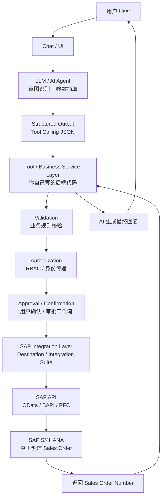

# Part 1：总体架构认知（全体アーキテクチャの理解）

## 1.1 "AI + SAP"项目本质是什么（1.1 「AI + SAP」プロジェクトの本質とは何か）

本质是一个 **"自然语言接口 + 业务规则引擎 + 企业系统集成"** 的三段式系统：

本質は **「自然言語インターフェース＋業務ルールエンジン＋企業システムインテグレーション」** という三段構成のシステムです。

1. **LLM 负责"理解"**：把人类模糊的语言，转成结构化、机器可执行的意图（intent）和参数（entities）。 **LLM は「理解」を担当します**：人間の曖昧な言葉を、構造化された機械実行可能な意図（intent）とパラメータ（entities）に変換します。
2. **中间层（Backend / Business Service）负责"判断和把关"**：补全数据、校验业务规则、控制权限、生成审批、保证幂等和可追溯。 **中間層（Backend / Business Service）は「判断とゲートキーピング」を担当します**：データの補完、業務ルールの検証、権限の制御、承認の生成、冪等性とトレーサビリティの保証を行います。
3. **SAP 负责"执行和记账"**：作为 System of Record，真正创建、存储、并驱动后续的 Order-to-Cash 流程（交货、开票、记账）。 **SAP は「実行と記帳」を担当します**：System of Record として、実際に作成・保存を行い、後続の Order-to-Cash プロセス（出荷、請求、記帳）を駆動します。

**LLM 不是在"操作 SAP"，而是在"操作一个受控的 Tool 接口"，这个接口背后才是 SAP。** 这是整个架构设计最核心的一条原则，贯穿全文。

**LLM は「SAP を操作している」のではなく、「制御された Tool インターフェースを操作している」のであり、その先にあるものこそが SAP です。** これは全体アーキテクチャ設計における最も核心的な原則であり、本書全体を貫いています。

## 1.2 谁负责什么（一句话版）（1.2 誰が何を担当するか（一言でまとめると））

| 角色 | 负责 | 不负责 |
|---|---|---|
| LLM / AI Agent | 理解意图、抽取参数、生成自然语言、决定调用哪个 Tool、组织回复 意図の理解、パラメータの抽出、自然言語の生成、どの Tool を呼ぶかの決定、返答の構成 | 直接拼 SAP 请求、做最终业务合法性判断、绕过确认直接写数据 SAP リクエストを直接組み立てること、最終的な業務上の適法性判断、確認を飛ばして直接データを書き込むこと |
| Tool / Business Service 层（你写的代码） Tool / Business Service 層（あなたが書くコード） | 参数校验、主数据查询、幂等控制、权限检查、审批编排、错误处理、日志 パラメータ検証、マスタデータ照会、冪等性制御、権限チェック、承認オーケストレーション、エラー処理、ログ記録 | 理解自然语言、猜测用户意图 自然言語の理解、ユーザー意図の推測 |
| SAP Integration 层（Destination/Integration Suite/Adapter） SAP Integration 層（Destination/Integration Suite/Adapter） | 协议转换、认证、路由、重试、监控 プロトコル変換、認証、ルーティング、リトライ、監視 | 业务规则判断 業務ルールの判断 |
| SAP S/4HANA 自身 SAP S/4HANA 自体 | Sales Area 有效性、Credit Check、ATP、Pricing、数据一致性、事务完整性 Sales Area の有効性、Credit Check、ATP、Pricing、データ整合性、トランザクションの完全性 | 理解自然语言，判断"用户是否真的想要这个" 自然言語の理解、「ユーザーが本当にこれを望んでいるか」の判断 |

## 1.3 典型架构分层图（1.3 典型的なアーキテクチャ階層図）

## 1.4 每一层详解（1.4 各層の詳細解説）

### 1.4.1 Chat / UI

- **职责**：接收用户输入，展示对话历史，展示确认卡片（confirmation card），展示最终结果。 **役割**：ユーザー入力の受付、対話履歴の表示、確認カード（confirmation card）の表示、最終結果の表示。
- **输入**：用户文本/语音。 **入力**：ユーザーのテキスト/音声。
- **输出**：结构化的用户消息 + session/conversation ID。 **出力**：構造化されたユーザーメッセージ＋ session/conversation ID。
- **谁实现**：前端团队，或直接用 SAP Joule / 自建 Web Chat / Teams/Slack Bot。 **誰が実装するか**：フロントエンドチーム、あるいは SAP Joule / 自前構築の Web Chat / Teams/Slack Bot を直接利用。
- **常见技术**：React/Vue、SAP Fiori Chat 组件、SAP Joule（⚠️ 需按当前版本核实其可扩展性和自定义 Skill 机制）。 **よく使う技術**：React/Vue、SAP Fiori Chat コンポーネント、SAP Joule（⚠️ 拡張性とカスタム Skill 機構は現行バージョンに応じて要確認）。
- **易错点**：把"展示层的确认按钮"误当作"安全边界"——真正的写操作校验必须在后端重新做一遍，不能信任前端传回的"已确认"标志未经签名/校验。 **よくある誤り**：「表示層の確認ボタン」を「セキュリティ境界」と誤認すること——実際の書き込み操作の検証は必ずバックエンド側でもう一度行う必要があり、フロントエンドから返される署名・検証されていない「確認済み」フラグを信用してはいけません。

### 1.4.2 LLM / AI Agent（意图识别 + Structured Output）（1.4.2 LLM / AI Agent（意図認識＋ Structured Output））

- **职责**：自然语言 → intent + 结构化参数（JSON），决定是否调用 Tool，调用哪个 Tool。 **役割**：自然言語 → intent＋構造化パラメータ（JSON）への変換、Tool を呼ぶかどうか、どの Tool を呼ぶかの決定。
- **输入**：用户消息 + 对话历史 + System Prompt + Tool 定义（JSON Schema）。 **入力**：ユーザーメッセージ＋対話履歴＋ System Prompt＋ Tool 定義（JSON Schema）。
- **输出**：Tool Call 请求（function name + arguments），或澄清追问，或最终自然语言回复。 **出力**：Tool Call リクエスト（function name + arguments）、または確認の追加質問、または最終的な自然言語での返答。
- **谁实现**：AI/Agent 工程师。 **誰が実装するか**：AI/Agent エンジニア。
- **常见技术**：OpenAI/Anthropic/Azure OpenAI 的 Function Calling / Tool Use API，LangChain/LlamaIndex/自建 Agent Loop，SAP Generative AI Hub（⚠️ 需核实）。 **よく使う技術**：OpenAI/Anthropic/Azure OpenAI の Function Calling / Tool Use API、LangChain/LlamaIndex/自前構築の Agent Loop、SAP Generative AI Hub（⚠️要確認）。
- **易错点**： **よくある誤り**：
  - 让 LLM 直接"发挥创造力"填充业务字段（比如自己编一个 Sales Organization）。 LLM に業務フィールドを直接「創造力を発揮して」埋めさせること（例えば Sales Organization を自分ででっち上げるなど）。
  - 把 SAP 底层技术字段直接暴露给 LLM 作为 Tool 参数，导致模型产生幻觉字段值。 SAP の基盤技術フィールドを Tool パラメータとして LLM に直接露出させ、モデルが幻覚のフィールド値を生成する原因を作ること。
  - 没有对 Tool 调用做 Schema 校验，模型输出格式错误直接透传到后端。 Tool 呼び出しに対する Schema 検証を行わず、モデルの出力形式エラーがそのままバックエンドに透過してしまうこと。

### 1.4.3 Structured Output / Tool Calling

- **职责**：把 LLM 的"意图"转成强类型、可校验的调用请求。 **役割**：LLM の「意図」を強く型付けされ検証可能な呼び出しリクエストに変換する。
- **输入**：LLM 原始输出（可能是 JSON 字符串）。 **入力**：LLM の生出力（JSON 文字列の場合がある）。
- **输出**：经过 JSON Schema 校验的 `{tool_name, arguments}`。 **出力**：JSON Schema 検証を経た `{tool_name, arguments}`。
- **谁实现**：Agent 框架层，通常是 LLM API 自带能力 + 你的校验代码。 **誰が実装するか**：Agent フレームワーク層。通常は LLM API に備わる機能＋独自の検証コード。
- **常见技术**：JSON Schema、Zod/Pydantic 校验、OpenAPI。 **よく使う技術**：JSON Schema、Zod/Pydantic による検証、OpenAPI。
- **易错点**：校验只做"类型对不对"，没做"业务上合不合理"（比如 quantity 是负数、日期是过去时间）。 **よくある誤り**：検証が「型が正しいか」だけにとどまり、「業務上妥当か」（例えば quantity が負数である、日付が過去である等）を行っていないこと。

### 1.4.4 Tool / Business Service Layer（你自己的后端代码，核心）（1.4.4 Tool / Business Service Layer（自前のバックエンドコード、核心部分））

- **职责**：这是整个系统的"大脑和安全阀"。包括：主数据查询与解析（客户名"ABC"→ Business Partner Number）、参数补全、组合多个 SAP 调用、业务规则前置校验、幂等 key 管理、错误归类。 **役割**：これはシステム全体の「頭脳であり安全弁」です。含まれる内容：マスタデータの照会と解析（顧客名「ABC」→ Business Partner Number）、パラメータ補完、複数の SAP 呼び出しの組み合わせ、業務ルールの事前検証、冪等キーの管理、エラー分類。
- **输入**：Tool Call 参数（业务语义级，如 `customer`, `material`, `quantity`）。 **入力**：Tool Call パラメータ（業務的な意味レベル、例えば `customer`、`material`、`quantity`）。
- **输出**：给 SAP Integration 层的标准化请求，或给上层的"还缺什么参数/校验失败"结果。 **出力**：SAP Integration 層への標準化されたリクエスト、または上位層への「不足しているパラメータ/検証失敗」の結果。
- **谁实现**：后端工程师（你）。 **誰が実装するか**：バックエンドエンジニア（あなた）。
- **常见技术**：Node.js/TypeScript、Java Spring、Python FastAPI；也可以用 **SAP CAP (Cloud Application Programming Model)**。 **よく使う技術**：Node.js/TypeScript、Java Spring、Python FastAPI。**SAP CAP (Cloud Application Programming Model)** を使うこともできます。
- **易错点**：把这一层做薄，图省事直接把 LLM 参数透传给 SAP——这是本教程反复强调要避免的反模式。 **よくある誤り**：この層を薄くしすぎて、手間を省くために LLM のパラメータをそのまま SAP へ透過してしまうこと——これは本チュートリアルが繰り返し強調して避けるべきとしているアンチパターンです。

### 1.4.5 Validation（业务校验）（1.4.5 Validation（業務検証））

- **职责**：在真正调用 SAP 写操作之前，做**能提前发现的**校验：客户是否存在、是否被 Block、物料是否存在、数量是否合法、日期是否在未来。 **役割**：実際に SAP の書き込み操作を呼び出す前に、**事前に発見できる**検証を行うこと：顧客が存在するか、Block されていないか、物料が存在するか、数量が妥当か、日付が未来であるか。
- **注意**：**不是所有校验都能在这一层做完**——Credit Check、ATP、Pricing 这些必须依赖 SAP 实时计算的规则，不应该在中间层"重新实现一遍"（否则两边逻辑不一致，未来 SAP 规则变了你这边不知道）。中间层做的是"能快速失败、减少无效调用"的**前置粗校验**，SAP 自己做**权威校验**。 **注意**：**すべての検証がこの層で完結するわけではありません**——Credit Check、ATP、Pricing など SAP のリアルタイム計算に依存しなければならないルールは、中間層で「再実装」すべきではありません（そうしないと両者のロジックが不一致になり、将来 SAP 側のルールが変わっても中間層は気づけません）。中間層が行うのは「早期に失敗させ、無効な呼び出しを減らす」ための**事前の大まかな検証**であり、SAP 自身が**権威的な検証**を行います。
- **常见技术**：规则引擎、简单的 if/schema 校验；或调用 SAP 侧的只读校验 API（如库存查询 API）提前问一遍。 **よく使う技術**：ルールエンジン、シンプルな if/schema 検証。あるいは SAP 側の読み取り専用検証 API（在庫照会 API など）を事前に呼び出して確認すること。

### 1.4.6 Authorization（权限）（1.4.6 Authorization（権限））

- **职责**：判断"这个用户/这个 AI 请求，有没有权限执行这个动作"。 **役割**：「このユーザー/この AI リクエストに、この動作を実行する権限があるか」を判断すること。
- **关键问题**：AI Backend 到 SAP，到底以谁的身份执行？（详见 Part 9） **重要な問い**：AI Backend から SAP へ、いったい誰の身元で実行するのか？（詳細は Part 9 参照）
- **常见技术**：OAuth2 Client Credentials（技术账号）、Principal Propagation（终端用户身份透传）、SAP XSUAA、RBAC。 **よく使う技術**：OAuth2 Client Credentials（テクニカルアカウント）、Principal Propagation（エンドユーザー身元の伝播）、SAP XSUAA、RBAC。

### 1.4.7 Approval / Confirmation（确认/审批）（1.4.7 Approval / Confirmation（確認/承認））

- **职责**：写操作在真正提交前，给用户一个"最终确认"的机会；对高风险/大额操作，触发人工审批工作流。 **役割**：書き込み操作を実際に提出する前に、ユーザーへ「最終確認」の機会を与えること。高リスク/高額の操作に対しては、人による承認ワークフローをトリガーすること。
- **为什么重要**：LLM 有幻觉风险，用户口述也可能被误解；写操作一旦提交，撤销成本很高（销售订单一旦创建，可能已经触发 ATP 预留、信用额度占用，取消不是"什么都没发生"）。 **なぜ重要か**：LLM には幻覚のリスクがあり、ユーザーの口頭説明も誤解される可能性があります。書き込み操作は一度提出すると取り消しコストが高くなります（販売オーダーが一度作成されると、ATP 引当や与信枠の占有がすでにトリガーされている可能性があり、キャンセルしても「何もなかったこと」にはなりません）。
- **常见技术**：自建审批状态机、SAP Build Process Automation、企业已有的 Workflow 引擎。 **よく使う技術**：自前構築の承認ステートマシン、SAP Build Process Automation、企業が既に持つ Workflow エンジン。

### 1.4.8 SAP Integration Layer

- **职责**：协议转换（业务语义 JSON → OData Payload）、认证凭据管理、路由、重试、限流、监控、错误码翻译。 **役割**：プロトコル変換（業務的意味の JSON → OData Payload）、認証情報の管理、ルーティング、リトライ、レート制限、監視、エラーコードの翻訳。
- **常见技术**：SAP BTP Destination Service + Connectivity Service、SAP Integration Suite (CPI)、直接用 SDK/HTTP Client 调 OData（简单场景）。 **よく使う技術**：SAP BTP Destination Service + Connectivity Service、SAP Integration Suite (CPI)、SDK/HTTP クライアントで OData を直接呼び出す（シンプルなシナリオ）。

### 1.4.9 SAP API → SAP S/4HANA

- **职责**：真正的业务执行——Sales Area 校验、Credit Check、ATP、Pricing 计算、创建凭证、写数据库、触发后续流程（交货/开票）的前置条件。 **役割**：実際の業務実行——Sales Area の検証、Credit Check、ATP、Pricing の計算、伝票の作成、データベースへの書き込み、後続プロセス（出荷/請求）の前提条件のトリガー。
- **谁保证**：SAP 系统自身（这是它存在的意义——它是这些规则的"唯一真相来源"）。 **誰が保証するか**：SAP システム自体（これがその存在意義です——これらのルールの「唯一の信頼できる情報源」です）。

### 1.4.10 返回 & AI 最终回复（1.4.10 返却＆ AI の最終返答）

- **职责**：把 SAP 返回的凭证号、状态码、错误信息，转成用户能理解的自然语言，同时把"事实"记录进日志（不能让 LLM 在没有明确成功信号时"editorialize"成"已创建成功"）。 **役割**：SAP が返す伝票番号、ステータスコード、エラー情報を、ユーザーが理解できる自然言語に変換すると同時に、「事実」をログに記録すること（LLM が明確な成功シグナルがないのに「作成成功」と“脚色”してはいけません）。

## 1.5 逻辑分配表（谁该做什么）（1.5 ロジック分担表（誰が何をすべきか））

| 逻辑 | 可以交给 LLM | 不应该交给 LLM | 必须由后端代码保证 | 必须由 SAP 自身保证 |
|---|---|---|---|---|
| 理解"下周五"是哪天 「来週金曜日」がいつかを理解する | ✅ | | 二次校验（时区、工作日） 二次検証（タイムゾーン、営業日） | |
| 客户名"ABC"找到 Business Partner Number 顧客名「ABC」から Business Partner Number を見つける | 提出候选/追问 候補の提示/追加質問 | ❌ 直接编号 ❌ 番号を直接決めること | ✅ 精确匹配/模糊搜索+确认 ✅ 完全一致/曖昧検索＋確認 | 数据本身的存在性 データ自体の存在性 |
| Sales Organization 取值 | ❌ | ❌ 不能猜 ❌ 推測してはならない | ✅ 从用户默认配置/客户主数据推导 ✅ ユーザーのデフォルト設定/顧客マスタから導出 | 校验组合有效性 組み合わせの有効性を検証 |
| Credit Check 是否通过 | ❌ | ❌ | 可先查询提示 事前照会して提示は可能 | ✅ 权威判断 ✅ 権威的判断 |
| ATP 库存是否够 | ❌ | ❌ | 可先查询提示 事前照会して提示は可能 | ✅ 权威判断 ✅ 権威的判断 |
| 是否需要用户确认 ユーザー確認が必要かどうか | 生成确认文案 確認文言の生成 | | ✅ 强制流程控制 ✅ 強制的なフロー制御 | |
| 幂等去重 冪等な重複排除 | ❌ | ❌ | ✅ | 部分（凭证号唯一性） 部分的（伝票番号の一意性） |
| 最终是否"创建成功" 最終的に「作成成功」かどうか | 只能转述 転述のみ可能 | ❌ 不能自行判断 ❌ 自ら判断してはならない | ✅ 依据 SAP HTTP 状态+凭证号 ✅ SAP の HTTP ステータス＋伝票番号に基づく | ✅ 唯一真相来源 ✅ 唯一の信頼できる情報源 |

## 1.6 为什么不能让 LLM 直接自由生成 SAP 请求并执行生产写操作（1.6 なぜ LLM に自由に SAP リクエストを生成させ本番の書き込み操作を実行させてはいけないのか）

1. **幻觉（Hallucination）**：LLM 可能编造一个看起来合理但实际不存在的 Sales Organization 或 Material Number，SAP 可能因为字段格式合法而"部分接受"，产生脏数据。 **幻覚（Hallucination）**：LLM は一見妥当に見えるが実際には存在しない Sales Organization や Material Number をでっち上げる可能性があり、SAP はフィールド形式が合法であるために「部分的に受け入れて」しまい、不正なデータを生む可能性があります。
2. **权限越权**：如果 LLM 能自由构造任意 OData payload，理论上可以构造出修改 Ship-to Party、绕过 Credit Check 字段的请求（如果 SAP 侧防护不足）。 **権限の逸脱**：LLM が任意の OData payload を自由に構築できる場合、理論上 Ship-to Party を変更したり Credit Check フィールドを回避したりするリクエストを構築できてしまいます（SAP 側の防御が不十分な場合）。
3. **Prompt Injection**：如果客户资料、历史工单等外部文本被拼进 Prompt，恶意文本可以诱导模型"忘记规则，执行别的操作"。如果 LLM 直接有 SAP 写权限，注入攻击直接变成数据破坏。 **Prompt Injection**：顧客資料や過去のチケットなどの外部テキストが Prompt に組み込まれる場合、悪意あるテキストがモデルに「ルールを忘れて別の操作を実行する」よう誘導する可能性があります。LLM が直接 SAP への書き込み権限を持っていれば、インジェクション攻撃はそのままデータ破壊につながります。
4. **不可控的重试/重复提交**：LLM 的输出具有一定随机性，同一个意图可能被多次解释成多次 Tool 调用，直接写 SAP 会产生重复订单。 **制御不能なリトライ/重複提出**：LLM の出力には一定のランダム性があり、同一の意図が複数回の Tool 呼び出しとして解釈される可能性があります。直接 SAP に書き込むと重複オーダーが発生します。
5. **审计困难**：如果 SAP 请求是 LLM 现场"现编"的，你很难对"这个请求为什么长这样"做审计和回溯；而如果所有请求都经过一个固定的、参数受限的 Tool（如 `create_sales_order(customer, material, qty, date)`），审计只需要看这几个业务参数即可。 **監査の困難さ**：SAP リクエストが LLM によってその場で「即興で作られた」ものであれば、「なぜこのリクエストがこの形になったのか」を監査・追跡することは非常に困難です。一方、すべてのリクエストが固定された、パラメータが限定された Tool（例えば `create_sales_order(customer, material, qty, date)`）を経由するのであれば、監査はこれらの業務パラメータを見るだけで済みます。
6. **业务规则漂移**：SAP 的业务规则（哪些字段必填、Sales Area 组合规则等）会随配置变化，LLM 的"知识"是静态的训练数据，无法感知系统当前配置——这类"系统当前事实"必须由代码实时查询 SAP，而不是让模型"记住"。 **業務ルールのドリフト**：SAP の業務ルール（どのフィールドが必須か、Sales Area の組み合わせルールなど）は設定によって変化しますが、LLM の「知識」は静的な学習データであり、システムの現在の設定を認識できません——このような「システムの現在の事実」は、モデルに「記憶させる」のではなく、コードがリアルタイムに SAP へ照会しなければなりません。

**结论**：LLM 只应该被允许调用**参数收窄、语义明确、有硬编码业务规则包裹**的 Tool，Tool 内部才去做真正复杂的 SAP 交互。这也是"Tool Abstraction Layer"设计的核心动机（Part 7 详述）。

**結論**：LLM は**パラメータが絞り込まれ、意味が明確で、ハードコードされた業務ルールに包まれた** Tool のみを呼び出すことを許されるべきであり、Tool の内部で初めて実際に複雑な SAP とのやり取りが行われます。これが「Tool Abstraction Layer」設計の中核的な動機でもあります（詳細は Part 7）。

## 1.7 项目中你需要记住什么（1.7 プロジェクトで覚えておくべきこと）

- 整个系统是"三段式"：LLM 理解 → 后端把关 → SAP 执行；三段各司其职，不能互相越界。 システム全体は「三段構成」です：LLM が理解 → バックエンドがゲートキーピング → SAP が実行。三段はそれぞれの役割を担い、互いに越境してはいけません。
- **永远不要**让模型直接输出可执行的 SAP 底层请求（OData payload / BAPI 参数）并直接提交。 **絶対に**モデルに実行可能な SAP の基盤リクエスト（OData payload / BAPI パラメータ）を直接出力させ、そのまま提出させてはいけません。
- 写操作前必须有：业务校验 → 权限检查 → 用户确认/审批 → 幂等控制，这四道关卡缺一不可。 書き込み操作の前には必ず：業務検証 → 権限チェック → ユーザー確認/承認 → 冪等性制御、という 4 つの関門が必要であり、どれも欠かせません。
- "创建成功"这句话，只有在拿到 SAP 明确返回的凭证号和成功状态后，才允许说出口。 「作成成功」という言葉は、SAP から明確に返された伝票番号と成功ステータスを受け取って初めて、口にすることが許されます。
- 本章讲的是"SAP 内部谁负责什么"，"SAP 系统本身的边界该怎么碰"这个问题的延伸讨论（Clean Core、Released API、什么时候能扩展/不能扩展）详见 Part 21。 本章では「SAP 内部で誰が何を担当するか」を扱いました。「SAP システム自体の境界にどう触れるべきか」という問題の発展的な議論（Clean Core、Released API、いつ拡張できるか/できないか）は Part 21 を参照してください。
