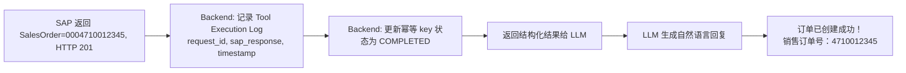

# Part 2：主案例完整拆解——"给客户 ABC 创建销售订单"（Part 2：メインケースの完全分解——「顧客ABCのために受注を作成する」）

用户输入（假设对话发生在 **2026-09-01，周二**，全文日期计算均以此为基准）：

ユーザー入力（会話は **2026-09-01（火曜日）** に行われたと仮定し、本文全体の日付計算はこれを基準とします）：

> "帮我给客户 ABC 创建一个销售订单，物料 M-100，数量 100 个，下周五交货。"
>
> 「顧客ABCのために受注を作成してください。品目はM-100、数量は100個、来週金曜日に納品してください。」

按此基准，"本周五"是 2026-09-04，"下周五"（下一周的周五）是 **2026-09-11**——这正是日期归一化容易出错的地方（"这周/下周"的边界定义），下文的确认卡片和 OData 示例都以 2026-09-11 为准。

この基準によると、「今週金曜日」は2026-09-04、「来週金曜日」（次の週の金曜日）は **2026-09-11** です——これはまさに日付の正規化でミスが起きやすい箇所であり（「今週/来週」の境界定義）、以下の確認カードとOData例はすべて2026-09-11を基準としています。

## 第一步：自然语言理解（NLU / Intent Extraction）（第一歩：自然言語理解（NLU / Intent Extraction））

LLM 的任务：识别 intent，抽取 slot/entity。这一步**只产出"候选值"，不产出"最终业务值"**。

LLMのタスクは、intentを識別し、slot/entityを抽出することです。このステップでは**「候補値」のみを生成し、「最終的な業務値」は生成しません**。

```json
{
  "intent": "create_sales_order",
  "confidence": 0.93,
  "entities": {
    "customer_name_raw": "ABC",
    "material_raw": "M-100",
    "quantity": 100,
    "unit_raw": null,
    "delivery_date_raw": "下周五"
  }
}
```

要点：

ポイント：

- `customer_name_raw` 是**用户说的文本**，不是 SAP Business Partner Number——这一点必须在数据结构上明确区分，避免后面代码把"ABC"当成客户号直接传给 SAP。<br>`customer_name_raw` は**ユーザーが発した文字列**であり、SAP Business Partner Numberではありません——この点はデータ構造上で明確に区別しなければならず、後続のコードが「ABC」をそのまま顧客番号としてSAPに渡してしまう事態を避ける必要があります。
- `delivery_date_raw` 先保留原文，日期归一化（"下周五" → 具体日期）建议由**后端代码**结合当前系统时间和时区计算，而不是完全依赖 LLM 计算日期算术（LLM 在日期推理上容易出错，尤其涉及时区和"本周/下周"的边界定义）。<br>`delivery_date_raw` はまず原文のまま保持し、日付の正規化（「来週金曜日」→具体的な日付）は**バックエンドコード**が現在のシステム時刻とタイムゾーンを組み合わせて計算することを推奨します。LLMの日付演算に完全に依存すべきではありません（LLMは日付推論、特にタイムゾーンや「今週/来週」の境界定義が絡む場面でミスをしやすいためです）。
- `unit_raw` 为空——这是一个"缺失参数"的例子，见第二步。<br>`unit_raw` は空です——これは「パラメータ欠落」の一例であり、第二歩を参照してください。

## 第二步：缺失参数判断（第二歩：欠落パラメータの判断）

创建 Sales Order 至少还需要（以 `API_SALES_ORDER_SRV` 为例，字段名⚠️需按你系统的 metadata 核实）：

Sales Orderを作成するには少なくとも以下が必要です（`API_SALES_ORDER_SRV` を例とし、フィールド名は⚠️お使いのシステムのmetadataで確認してください）：

| 字段<br>フィールド | 能否从主数据推导<br>マスタデータから導出できるか | 能否用用户默认配置<br>ユーザーのデフォルト設定を使えるか | 是否需要问用户<br>ユーザーに確認が必要か | 是否绝对不能由 AI 猜<br>AIが絶対に推測してはいけないか |
|---|---|---|---|---|
| Sales Organization | 部分可推导（客户主数据里有默认 Sales Area）<br>一部導出可能（顧客マスタにデフォルトのSales Areaがある） | ✅ 常见做法<br>✅ よくある方法 | 仅当有多个候选时<br>候補が複数ある場合のみ | ✅ 不能凭空猜测<br>✅ 根拠なく推測してはならない |
| Distribution Channel | 同上<br>同上 | ✅ | 同上<br>同上 | ✅ |
| Division | 同上<br>同上 | ✅ | 同上<br>同上 | ✅ |
| Sales Document Type (Order Type) | 可有业务默认值（如 OR=标准订单）<br>業務上のデフォルト値を持つ場合がある（例：OR=標準受注） | ✅ 常见做用户/租户级默认<br>✅ ユーザー/テナントレベルのデフォルトとするのが一般的 | 特殊订单类型需要问<br>特殊な受注タイプの場合は確認が必要 | ✅ |
| Plant (交货工厂)<br>Plant（出荷プラント） | 可从物料主数据/客户主数据推导<br>品目マスタ/顧客マスタから導出可能 | 部分可以<br>一部可能 | 多工厂供货时需要问<br>複数プラントから供給する場合は確認が必要 | ✅ |
| Ship-to Party | 默认等于 Sold-to Party，除非客户有多个收货方<br>デフォルトではSold-to Partyと同じ。ただし顧客に複数の出荷先がある場合を除く | ✅ | 有多个 Ship-to 时必须问<br>Ship-to Partyが複数ある場合は必ず確認が必要 | ✅ |
| Currency | 通常从 Sales Area / 客户主数据推导<br>通常はSales Area／顧客マスタから導出 | ✅ | 极少需要问<br>確認が必要になることは極めて稀 | ✅ |
| Unit of Measure | 可从物料主数据的基本计量单位推导<br>品目マスタの基本計量単位から導出可能 | 一般不需要用户配置<br>通常ユーザー設定は不要 | 如果物料有多种销售单位才问<br>品目に複数の販売単位がある場合のみ確認 | ✅ |

**原则**：

**原則**：

1. **能从 SAP 主数据唯一确定的，绝不问用户**（比如物料的基本单位只有一个，就不要多此一举去问）。<br>**SAPのマスタデータから一意に確定できるものは、絶対にユーザーに聞かない**（例えば品目の基本単位が1つしかない場合、わざわざ聞く必要はない）。
2. **能用"用户/租户默认配置"合理推断，但存在歧义时，用默认值 + 在确认卡片里显式展示出来**，让用户有机会纠正，而不是静默使用。<br>**「ユーザー/テナントのデフォルト設定」で合理的に推測できるが曖昧さが残る場合は、デフォルト値を使用し、かつ確認カードに明示的に表示する**ことで、ユーザーに訂正の機会を与える。黙って使用してはならない。
3. **有多个候选且业务影响大的（比如客户有 3 个 Ship-to Party），必须主动追问**，不能替用户决定。<br>**候補が複数あり、かつ業務への影響が大きい場合（例えば顧客に3つのShip-to Partyがある場合）は、必ず能動的に確認しなければならない**。ユーザーに代わって決定してはならない。
4. **Sales Organization / Distribution Channel / Division（合称 Sales Area）这种组合关系强、错了会导致后续凭证类型全错的字段，AI 绝对不能凭训练知识"猜一个看起来合理的"**，必须查询系统真实配置或客户主数据。<br>**Sales Organization / Distribution Channel / Division（総称してSales Area）のような組み合わせの関連性が強く、誤ると後続の伝票タイプがすべて誤ってしまうフィールドについて、AIは学習知識に基づいて「もっともらしいものを推測する」ことは絶対に許されない**。システムの実際の設定または顧客マスタを必ず照会しなければならない。

## 第三步：主数据解析（第三歩：マスタデータの解析）

### "ABC" → SAP Business Partner / Customer Number

正确做法是调用一个**只读的模糊搜索 Tool**（例如 `search_customer(name="ABC")`），返回候选列表：

正しいやり方は、**読み取り専用のあいまい検索Tool**（例えば `search_customer(name="ABC")`）を呼び出し、候補リストを返すことです：

```json
[
  { "customerNumber": "0010001234", "name": "ABC Trading Co., Ltd.", "salesArea": {"salesOrg": "1000", "distrChannel": "10", "division": "00"} },
  { "customerNumber": "0010009876", "name": "ABC Manufacturing GmbH", "salesArea": {"salesOrg": "2000", "distrChannel": "10", "division": "00"} }
]
```

- 如果只有一个高置信度匹配 → 使用，但在确认卡片里展示全名和客户号，让用户能立刻发现"这不是我要的 ABC"。<br>高信頼度の一致が1件のみの場合 → 使用するが、確認カードに正式名称と顧客番号を表示し、ユーザーが「これは自分が求めているABCではない」とすぐに気づけるようにする。
- 如果有多个匹配 → 必须追问："找到两个名为 ABC 的客户，请问是哪一个？"<br>複数一致した場合 → 必ず確認する：「ABCという名前の顧客が2件見つかりました。どちらでしょうか？」
- **绝不允许**：LLM 自己"记得"或"猜测"一个客户编号。<br>**絶対に許されない**：LLMが自分で顧客番号を「覚えている」または「推測する」こと。

### "M-100" → Material / Product Number

同理，调用 `search_material(code="M-100")` 或 `get_material("M-100")`，确认物料存在、是否可销售（Sales: General/Plant data 里的 X-Plant Status、销售状态）。

同様に、`search_material(code="M-100")` または `get_material("M-100")` を呼び出し、品目が存在するか、販売可能かどうかを確認します（Sales: General/Plant data のX-Plant Status、販売ステータス）。

### 关键主数据概念速查（详见 Part 3 展开）（重要マスタデータ概念早見表（詳細はPart 3で展開））

| 概念<br>概念 | SAP 英文<br>SAP英語表記 | 一句话<br>一言で |
|---|---|---|
| 业务伙伴<br>ビジネスパートナー | Business Partner (BP) | S/4HANA 统一的主数据模型，Customer/Vendor 都是 BP 的角色<br>S/4HANAの統一されたマスタデータモデルであり、Customer/VendorはいずれもBPのロールである |
| 客户<br>顧客 | Customer | BP 在销售场景下的角色（FI/SD 视角）<br>販売シナリオにおけるBPのロール（FI/SD視点） |
| 委托方<br>委託方（受注先） | Sold-to Party | 下订单的一方<br>注文を行う側 |
| 收货方<br>出荷先 | Ship-to Party | 实际收货地址<br>実際の商品受取先住所 |
| 开票方<br>請求先 | Bill-to Party | 接收发票的一方<br>請求書を受け取る側 |
| 付款方<br>支払人 | Payer | 实际付款的一方<br>実際に支払いを行う側 |
| 物料/产品<br>品目/マテリアル | Material / Product | 被销售的商品<br>販売される商品 |
| 销售范围<br>販売エリア | Sales Area | Sales Org + Distribution Channel + Division 的组合<br>Sales Org + Distribution Channel + Divisionの組み合わせ |

## 第四步：业务校验（第四歩：業務検証）

| 校验项<br>検証項目 | 谁做<br>誰が行うか | 说明<br>説明 |
|---|---|---|
| Customer 是否存在<br>Customerが存在するか | Backend（查询 API）<br>Backend（照会API） | 只读校验，快速失败<br>読み取り専用の検証、フェイルファスト |
| Material 是否存在、是否可售<br>Materialが存在するか、販売可能か | Backend（查询 API）<br>Backend（照会API） | 同上<br>同上 |
| Customer 主数据是否被 Block（如订单冻结）<br>Customerマスタが Block されているか（受注凍結など） | Backend 先查，SAP 权威判断<br>Backendが先に照会し、SAPが権威的に判断 | Block 状态是 SAP 主数据字段，可查询；注意这与下面的 Credit Check（信用冻结）是两种不同机制，不要混为一谈<br>Block状態はSAPマスタデータのフィールドであり照会可能。以下のCredit Check（与信凍結）とは別の仕組みであることに注意し、混同してはならない |
| Sales Area 是否有效组合<br>Sales Areaが有効な組み合わせか | Backend 结合客户主数据推导，SAP 最终校验<br>Backendが顧客マスタと組み合わせて推導し、SAPが最終検証 | |
| Quantity 是否合法（>0，整数/小数规则）<br>Quantityが妥当か（>0、整数/小数のルール） | Backend | 简单规则，前置拦截明显错误<br>単純なルールであり、明らかな誤りを事前に遮断する |
| Availability / ATP | ❌ Backend 不重算，只能调用 SAP 的 ATP 查询接口获取结果<br>❌ Backendは再計算せず、SAPのATP照会インターフェースを呼び出して結果を取得するのみ | SAP 权威<br>SAPが権威 |
| Credit Check | ❌ Backend 不重算<br>❌ Backendは再計算しない | SAP 权威（涉及信用额度实时占用）——**注意结果不是简单的"通过/拒绝"，见下方澄清**<br>SAPが権威（与信枠のリアルタイム占有が絡む）——**結果は単純な「合格/拒否」ではないことに注意。下の補足を参照** |
| Pricing | ❌ Backend 不重算，可调用 SAP 定价模拟接口预览<br>❌ Backendは再計算しないが、SAPの価格シミュレーションインターフェースを呼び出してプレビュー可能 | SAP 权威（定价条件、税、折扣）<br>SAPが権威（価格条件、税金、割引） |
| Delivery Date 合法性（不能是过去时间）<br>Delivery Dateの妥当性（過去の日付であってはならない） | Backend | 简单规则前置校验<br>単純なルールによる事前検証 |

**AI 做**：把校验结果转成自然语言解释给用户（如"客户 ABC 主数据当前被冻结，无法创建订单"——这是 Customer Block 场景；Credit Check 场景的正确转述方式见下方澄清，不能简单套用同一句话）。
**Backend 做**：编排调用顺序、快速失败、把 SAP 错误码翻译成结构化的错误类型。
**SAP 做**：一切涉及实时业务规则计算的最终判断。

**AIが行うこと**：検証結果を自然言語に変換してユーザーに説明する（例えば「顧客ABCのマスタデータが現在凍結されており、受注を作成できません」——これはCustomer Blockのケースです。Credit Checkのケースにおける正しい説明の仕方は下記の補足を参照してください。同じ一文をそのまま流用してはいけません）。
**Backendが行うこと**：呼び出し順序のオーケストレーション、フェイルファスト、SAPのエラーコードを構造化されたエラータイプに変換する。
**SAPが行うこと**：リアルタイムの業務ルール計算に関わるすべての最終判断。

**重要澄清：Credit Check 不通过，不等于"订单没有被创建"**。SAP 的实际行为通常是：Sales Order 仍然可能被正常创建（凭证号照常生成），只是被打上 **Credit Block**（信用冻结）标记，导致它无法继续走到 Delivery 等后续处理，需要信用管理员（Credit Manager）在 SAP 里显式 Release（放行）或 Reject（拒绝）后才能继续。这一点在设计 AI 回复时非常关键：

**重要な補足：Credit Checkが通らないことは、「受注が作成されなかった」ことを意味しません**。SAPの実際の挙動は通常次の通りです。Sales Orderはそれでも正常に作成される可能性があり（伝票番号は通常通り採番される）、ただ **Credit Block**（与信凍結）のマークが付与され、Deliveryなどの後続処理に進めなくなり、信用管理者（Credit Manager）がSAP内で明示的にRelease（解除）またはReject（拒否）しない限り先に進めません。この点はAIの応答を設計する上で非常に重要です：

- ❌ 错误的处理方式：把 Credit Check 失败等价于"创建失败"，回复用户"订单创建失败"。<br>❌ 誤った処理方法：Credit Checkの失敗を「作成失敗」と同一視し、ユーザーに「受注の作成に失敗しました」と回答する。
- ✅ 正确的处理方式：以 SAP 实际返回的**凭证号**和**信用状态字段**为准——如果 SAP 返回了订单号，就必须如实告知"订单已创建，但处于信用冻结状态"，而不是笼统地说创建失败。具体是"直接拒绝创建"还是"创建后打 Credit Block"，取决于目标系统的 Customizing 配置（⚠️ 需按具体系统的信用管理配置核实），后端不能一概而论地假设其中一种行为。<br>✅ 正しい処理方法：SAPが実際に返す**伝票番号**と**信用ステータスフィールド**を基準とする——SAPが受注番号を返した場合は、必ず「受注は作成されましたが、信用凍結状態です」とありのまま伝えなければならず、単に作成失敗と言ってはいけません。「作成そのものを拒否する」のか「作成後にCredit Blockを付与する」のかは、対象システムのCustomizing設定に依存します（⚠️具体的なシステムの信用管理設定に基づいて確認が必要）。バックエンドはどちらか一方の挙動を一律に仮定してはいけません。

**实践建议**：ATP/Credit Check/Pricing 这三行的"查询预览"，推荐统一通过一个独立的只读 Tool `simulate_sales_order` 实现——它调用 SAP 的 Sales Order 模拟类 API（不真正创建凭证），一次性拿回价格、ATP、信用检查的真实计算结果，供下一步生成确认卡片使用，而不是后端自己东拼西凑几个接口、甚至用近似值顶替。详见 Part 5.3.4。

**実践的な提案**：ATP/Credit Check/Pricingという3つの「照会プレビュー」は、独立した読み取り専用のTool `simulate_sales_order` を通じて統一的に実装することを推奨します——これはSAPのSales Orderシミュレーション系APIを呼び出し（実際には伝票を作成しない）、価格、ATP、信用チェックの実際の計算結果を一括で取得し、次のステップの確認カード生成に利用します。バックエンドが複数のインターフェースを寄せ集めたり、近似値で代替したりするべきではありません。詳細はPart 5.3.4を参照。

## 第五步：用户确认（Confirmation）（第五歩：ユーザー確認（Confirmation））

AI 生成确认卡片：

AIが確認カードを生成します：

```
即将创建销售订单：
客户：ABC Trading Co., Ltd. (0010001234)
物料：M-100 — 工业阀门 A 型
数量：100 EA
销售组织：1000 / 分销渠道：10 / 产品组：00
预计交货日期：2026-09-11（周五）
预计金额：¥128,000.00（含税，最终以 SAP 定价为准）

是否确认创建？[确认] [取消] [修改]
```

**为什么写操作必须走确认/审批**：

**なぜ書き込み操作は必ず確認/承認を経る必要があるのか**：

1. 撤销成本高：订单一旦创建会触发 ATP 预留、信用额度占用，取消不是"无痕撤回"，可能已经影响库存计划。<br>取り消しコストが高い：受注が一度作成されるとATP引当や与信枠の占有がトリガーされ、キャンセルは「痕跡を残さない取り消し」ではなく、すでに在庫計画に影響している可能性がある。
2. LLM 幻觉风险：即使前面每一步都做了校验，仍存在"参数理解正确但用户本意不同"的情况（比如用户其实想说的是另一个"ABC"客户），人工确认是最后一道防线。<br>LLMのハルシネーションリスク：前段の各ステップで検証を行っていても、「パラメータの理解は正しいがユーザーの本来の意図とは異なる」というケースは依然として存在する（例えばユーザーが実際に言いたかったのは別の「ABC」顧客だった場合）。人による確認が最後の防衛線となる。
3. 合规与审计：许多企业的写操作需要"用户显式确认"这一动作本身作为审计证据。<br>コンプライアンスと監査：多くの企業では、書き込み操作に「ユーザーによる明示的な確認」という行為自体を監査証跡として必要とする。
4. 大额/敏感操作还可能需要**升级到人工审批**（Approval Workflow），而不仅是用户自己点确认。<br>高額/機微な操作の場合は、ユーザー自身の確認クリックだけでなく、**人による承認へのエスカレーション**（Approval Workflow）が必要になることもある。

## 第六步：调用 SAP API（第六歩：SAP APIの呼び出し）

详见 Part 5（协议全解）和 Part 6（版本差异）。这里给出以 **OData V2 / `API_SALES_ORDER_SRV`** 为例的简化 Deep Insert 请求（⚠️ 字段名和实体名请以你系统 `$metadata` 为准，下面仅作教学示例）：

詳細はPart 5（プロトコル完全解説）とPart 6（バージョンの違い）を参照。ここでは **OData V2 / `API_SALES_ORDER_SRV`** を例にした簡略版のDeep Insertリクエストを示します（⚠️フィールド名とエンティティ名はお使いのシステムの `$metadata` を基準にしてください。以下はあくまで教材用の例です）：

```http
POST /sap/opu/odata/sap/API_SALES_ORDER_SRV/A_SalesOrder
Content-Type: application/json
Authorization: Bearer <token>
x-csrf-token: <token-from-GET>

{
  "SalesOrderType": "OR",
  "SalesOrganization": "1000",
  "DistributionChannel": "10",
  "OrganizationDivision": "00",
  "SoldToParty": "0010001234",
  "TransactionCurrency": "CNY",
  "RequestedDeliveryDate": "/Date(1789084800000)/",
  "to_Item": [
    {
      "Material": "M-100",
      "RequestedQuantity": "100",
      "RequestedQuantityUnit": "EA"
    }
  ]
}
```

响应（成功）：

レスポンス（成功時）：

```json
{
  "d": {
    "SalesOrder": "0004710012345",
    "SalesOrderType": "OR",
    "SoldToParty": "0010001234",
    "TotalNetAmount": "128000.00",
    "TransactionCurrency": "CNY"
  }
}
```

要点：

ポイント：

- **Deep Insert**：一次请求同时创建 Header（`A_SalesOrder`）和 Item（`to_Item` navigation property），这是 OData 常见模式，避免多次往返和中间状态不一致。<br>**Deep Insert**：1回のリクエストでHeader（`A_SalesOrder`）とItem（`to_Item` navigation property）を同時に作成する、これはODataでよく使われるパターンであり、複数回の往復や中間状態の不整合を回避できる。
- **日期格式**：OData V2 的经典日期格式是 `/Date(epoch_ms)/`（这里的 `1789084800000` 对应 2026-09-11 00:00:00 UTC；⚠️ OData V4 用 ISO 8601 字符串如 `2026-09-11`，两者不同，务必看你用的版本）。<br>**日付形式**：OData V2の伝統的な日付形式は `/Date(epoch_ms)/` です（ここでの `1789084800000` は2026-09-11 00:00:00 UTCに対応します。⚠️OData V4は `2026-09-11` のようなISO 8601文字列を使用し、両者は異なるため、必ず使用しているバージョンを確認してください）。
- **CSRF Token**：OData 写操作（POST/PUT/DELETE）必须先发一次 `GET` 请求带 `X-CSRF-Token: Fetch` 头获取 token，再带着这个 token 做写操作（防跨站请求伪造），这是 SAP OData 的标准要求。<br>**CSRF Token**：ODataの書き込み操作（POST/PUT/DELETE）は、まず `X-CSRF-Token: Fetch` ヘッダーを付けた `GET` リクエストを一度送信してトークンを取得し、そのトークンを付けて書き込み操作を行う必要があります（クロスサイトリクエストフォージェリ対策）。これはSAP ODataの標準的な要件です。

## 第七步：返回结果（第七歩：結果の返却）



**关键规则：只有在拿到 SAP 明确的成功信号（HTTP 2xx + 凭证号非空）之后，AI 才能对用户说"创建成功"。**

**重要なルール：SAPから明確な成功シグナル（HTTP 2xx + 伝票番号が空でない）を受け取った後にのみ、AIはユーザーに「作成成功」と言うことができます。**

- 如果 HTTP 超时/网络错误 → 不能说"失败"，因为 SAP 端可能已经创建成功只是响应丢失了（详见 Part 13 的幂等性设计）。正确做法是：用幂等 key 查询/重试确认真实状态，再回复用户。<br>HTTPタイムアウト/ネットワークエラーが発生した場合 → 「失敗」と言ってはならない。SAP側ではすでに作成に成功していて、レスポンスだけが失われた可能性があるためです（詳細はPart 13の冪等性設計を参照）。正しいやり方は、冪等キーで照会/リトライして実際の状態を確認してからユーザーに回答することです。
- 如果 SAP 返回明确的业务拒绝（如 Material 停售、Sales Area 不匹配）→ 转述具体错误原因，不要笼统说"失败了"，也不能在这种情况下捏造一个凭证号。<br>SAPが明確な業務上の拒否を返した場合（例：Materialの販売停止、Sales Areaの不一致）→ 具体的なエラー理由を伝え、単に「失敗しました」と大まかに言ってはならず、このような場合に伝票番号をでっち上げてもいけない。
- 如果 SAP 返回了凭证号但同时带有 Credit Block 一类的状态标记 → 这**不是失败**，而是"订单已创建，但被冻结、需要后续处理"，回复必须同时包含凭证号和冻结状态（如"订单 4710012345 已创建，但因信用检查未通过被冻结，需信用审批后才能继续交货"），绝不能因为看到"检查未通过"字样就把它当成创建失败处理，见第四步的详细澄清。<br>SAPが伝票番号を返しつつ、同時にCredit Blockのようなステータスマークも付いていた場合 → これは**失敗ではなく**、「受注は作成されたが凍結されており、後続処理が必要」という状態であり、回答には必ず伝票番号と凍結状態の両方を含めなければなりません（例えば「受注4710012345は作成されましたが、信用チェックが通らなかったため凍結されており、信用承認後でなければ納品を続行できません」）。「チェックが通らなかった」という文言を見ただけで作成失敗として扱ってはいけません。詳細は第四歩の補足を参照。
- Tool Execution Log 必须记录：请求参数、SAP 原始响应（或至少状态码+凭证号+错误码）、耗时、correlation ID，这是后续审计和排障的基础（详见 Part 15）。<br>Tool Execution Logには必ず、リクエストパラメータ、SAPの生レスポンス（少なくともステータスコード＋伝票番号＋エラーコード）、所要時間、correlation IDを記録する必要があります。これは後の監査やトラブルシューティングの基盤となります（詳細はPart 15を参照）。

## 项目中你需要记住什么（プロジェクトで覚えておくべきこと）

- NLU 的产出是"候选值"，不是"最终值"；主数据解析必须走真实查询，绝不允许 LLM 自己编号码。<br>NLUの出力は「候補値」であり「最終値」ではない。マスタデータの解析は必ず実際の照会を経る必要があり、LLMが自分で番号をでっち上げることは絶対に許されない。
- 缺失参数的处理策略分四档：能推导→自动填；有默认→用默认但展示；有歧义→追问；核心业务字段→绝不能猜。<br>欠落パラメータの処理戦略は4段階に分かれる：導出可能→自動入力；デフォルトあり→デフォルトを使うが表示する；曖昧さあり→確認する；コアな業務フィールド→絶対に推測してはならない。
- Credit Check / ATP / Pricing 是 SAP 的权威计算，后端只能"查询展示"，不能"重新实现"。<br>Credit Check / ATP / Pricing はSAPの権威的な計算であり、バックエンドは「照会して表示する」ことしかできず、「再実装」してはならない。
- 写操作前必须有确认环节，这是产品设计问题也是安全设计问题。<br>書き込み操作の前には必ず確認ステップが必要であり、これは製品設計の問題であると同時に安全設計の問題でもある。
- "创建成功"这句话的唯一判断依据是 SAP 的明确响应，网络异常/超时不等于失败，需要幂等查询确认。<br>「作成成功」という言葉の唯一の判断根拠はSAPからの明確なレスポンスであり、ネットワーク異常/タイムアウトは失敗と同義ではなく、冪等照会による確認が必要である。
