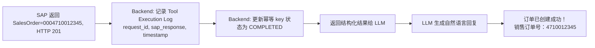

# Part 2：主案例完整拆解——"给客户 ABC 创建销售订单"

用户输入：

> "帮我给客户 ABC 创建一个销售订单，物料 M-100，数量 100 个，下周五交货。"

## 第一步：自然语言理解（NLU / Intent Extraction）

LLM 的任务：识别 intent，抽取 slot/entity。这一步**只产出"候选值"，不产出"最终业务值"**。

```json
{
  "intent": "create_sales_order",
  "confidence": 0.93,
  "entities": {
    "customer_name_raw": "ABC",
    "material_raw": "M-100",
    "quantity": 100,
    "unit_raw": null,
    "delivery_date_raw": "下周五"
  }
}
```

要点：
- `customer_name_raw` 是**用户说的文本**，不是 SAP Business Partner Number——这一点必须在数据结构上明确区分，避免后面代码把"ABC"当成客户号直接传给 SAP。
- `delivery_date_raw` 先保留原文，日期归一化（"下周五" → 具体日期）建议由**后端代码**结合当前系统时间和时区计算，而不是完全依赖 LLM 计算日期算术（LLM 在日期推理上容易出错，尤其涉及时区和"本周/下周"的边界定义）。
- `unit_raw` 为空——这是一个"缺失参数"的例子，见第二步。

## 第二步：缺失参数判断

创建 Sales Order 至少还需要（以 `API_SALES_ORDER_SRV` 为例，字段名⚠️需按你系统的 metadata 核实）：

| 字段 | 能否从主数据推导 | 能否用用户默认配置 | 是否需要问用户 | 是否绝对不能由 AI 猜 |
|---|---|---|---|---|
| Sales Organization | 部分可推导（客户主数据里有默认 Sales Area） | ✅ 常见做法 | 仅当有多个候选时 | ✅ 不能凭空猜测 |
| Distribution Channel | 同上 | ✅ | 同上 | ✅ |
| Division | 同上 | ✅ | 同上 | ✅ |
| Sales Document Type (Order Type) | 可有业务默认值（如 OR=标准订单） | ✅ 常见做用户/租户级默认 | 特殊订单类型需要问 | ✅ |
| Plant (交货工厂) | 可从物料主数据/客户主数据推导 | 部分可以 | 多工厂供货时需要问 | ✅ |
| Ship-to Party | 默认等于 Sold-to Party，除非客户有多个收货方 | ✅ | 有多个 Ship-to 时必须问 | ✅ |
| Currency | 通常从 Sales Area / 客户主数据推导 | ✅ | 极少需要问 | ✅ |
| Unit of Measure | 可从物料主数据的基本计量单位推导 | 一般不需要用户配置 | 如果物料有多种销售单位才问 | ✅ |

**原则**：
1. **能从 SAP 主数据唯一确定的，绝不问用户**（比如物料的基本单位只有一个，就不要多此一举去问）。
2. **能用"用户/租户默认配置"合理推断，但存在歧义时，用默认值 + 在确认卡片里显式展示出来**，让用户有机会纠正，而不是静默使用。
3. **有多个候选且业务影响大的（比如客户有 3 个 Ship-to Party），必须主动追问**，不能替用户决定。
4. **Sales Organization / Distribution Channel / Division（合称 Sales Area）这种组合关系强、错了会导致后续凭证类型全错的字段，AI 绝对不能凭训练知识"猜一个看起来合理的"**，必须查询系统真实配置或客户主数据。

## 第三步：主数据解析

### "ABC" → SAP Business Partner / Customer Number

正确做法是调用一个**只读的模糊搜索 Tool**（例如 `search_customer(name="ABC")`），返回候选列表：

```json
[
  { "customerNumber": "0010001234", "name": "ABC Trading Co., Ltd.", "salesArea": {"salesOrg": "1000", "distrChannel": "10", "division": "00"} },
  { "customerNumber": "0010009876", "name": "ABC Manufacturing GmbH", "salesArea": {"salesOrg": "2000", "distrChannel": "10", "division": "00"} }
]
```

- 如果只有一个高置信度匹配 → 使用，但在确认卡片里展示全名和客户号，让用户能立刻发现"这不是我要的 ABC"。
- 如果有多个匹配 → 必须追问："找到两个名为 ABC 的客户，请问是哪一个？"
- **绝不允许**：LLM 自己"记得"或"猜测"一个客户编号。

### "M-100" → Material / Product Number

同理，调用 `search_material(code="M-100")` 或 `get_material("M-100")`，确认物料存在、是否可销售（Sales: General/Plant data 里的 X-Plant Status、销售状态）。

### 关键主数据概念速查（详见 Part 3 展开）

| 概念 | SAP 英文 | 一句话 |
|---|---|---|
| 业务伙伴 | Business Partner (BP) | S/4HANA 统一的主数据模型，Customer/Vendor 都是 BP 的角色 |
| 客户 | Customer | BP 在销售场景下的角色（FI/SD 视角） |
| 委托方 | Sold-to Party | 下订单的一方 |
| 收货方 | Ship-to Party | 实际收货地址 |
| 开票方 | Bill-to Party | 接收发票的一方 |
| 付款方 | Payer | 实际付款的一方 |
| 物料/产品 | Material / Product | 被销售的商品 |
| 销售范围 | Sales Area | Sales Org + Distribution Channel + Division 的组合 |

## 第四步：业务校验

| 校验项 | 谁做 | 说明 |
|---|---|---|
| Customer 是否存在 | Backend（查询 API） | 只读校验，快速失败 |
| Material 是否存在、是否可售 | Backend（查询 API） | 同上 |
| Customer 是否被 Block（订单冻结/信用冻结） | Backend 先查，SAP 权威判断 | Block 状态是 SAP 主数据字段，可查询 |
| Sales Area 是否有效组合 | Backend 结合客户主数据推导，SAP 最终校验 | |
| Quantity 是否合法（>0，整数/小数规则） | Backend | 简单规则，前置拦截明显错误 |
| Availability / ATP | ❌ Backend 不重算，只能调用 SAP 的 ATP 查询接口获取结果 | SAP 权威 |
| Credit Check | ❌ Backend 不重算 | SAP 权威（涉及信用额度实时占用） |
| Pricing | ❌ Backend 不重算，可调用 SAP 定价模拟接口预览 | SAP 权威（定价条件、税、折扣） |
| Delivery Date 合法性（不能是过去时间） | Backend | 简单规则前置校验 |

**AI 做**：把校验结果转成自然语言解释给用户（"客户 ABC 当前被信用冻结，无法创建订单"）。
**Backend 做**：编排调用顺序、快速失败、把 SAP 错误码翻译成结构化的错误类型。
**SAP 做**：一切涉及实时业务规则计算的最终判断。

## 第五步：用户确认（Confirmation）

AI 生成确认卡片：

```
即将创建销售订单：
客户：ABC Trading Co., Ltd. (0010001234)
物料：M-100 — 工业阀门 A 型
数量：100 EA
销售组织：1000 / 分销渠道：10 / 产品组：00
预计交货日期：2026-09-04（周五）
预计金额：¥128,000.00（含税，最终以 SAP 定价为准）

是否确认创建？[确认] [取消] [修改]
```

**为什么写操作必须走确认/审批**：
1. 撤销成本高：订单一旦创建会触发 ATP 预留、信用额度占用，取消不是"无痕撤回"，可能已经影响库存计划。
2. LLM 幻觉风险：即使前面每一步都做了校验，仍存在"参数理解正确但用户本意不同"的情况（比如用户其实想说的是另一个"ABC"客户），人工确认是最后一道防线。
3. 合规与审计：许多企业的写操作需要"用户显式确认"这一动作本身作为审计证据。
4. 大额/敏感操作还可能需要**升级到人工审批**（Approval Workflow），而不仅是用户自己点确认。

## 第六步：调用 SAP API

详见 Part 5（协议全解）和 Part 6（版本差异）。这里给出以 **OData V2 / `API_SALES_ORDER_SRV`** 为例的简化 Deep Insert 请求（⚠️ 字段名和实体名请以你系统 `$metadata` 为准，下面仅作教学示例）：

```http
POST /sap/opu/odata/sap/API_SALES_ORDER_SRV/A_SalesOrder
Content-Type: application/json
Authorization: Bearer <token>
x-csrf-token: <token-from-GET>

{
  "SalesOrderType": "OR",
  "SalesOrganization": "1000",
  "DistributionChannel": "10",
  "OrganizationDivision": "00",
  "SoldToParty": "0010001234",
  "TransactionCurrency": "CNY",
  "RequestedDeliveryDate": "/Date(1757116800000)/",
  "to_Item": [
    {
      "Material": "M-100",
      "RequestedQuantity": "100",
      "RequestedQuantityUnit": "EA"
    }
  ]
}
```

响应（成功）：

```json
{
  "d": {
    "SalesOrder": "0004710012345",
    "SalesOrderType": "OR",
    "SoldToParty": "0010001234",
    "TotalNetAmount": "128000.00",
    "TransactionCurrency": "CNY"
  }
}
```

要点：
- **Deep Insert**：一次请求同时创建 Header（`A_SalesOrder`）和 Item（`to_Item` navigation property），这是 OData 常见模式，避免多次往返和中间状态不一致。
- **日期格式**：OData V2 的经典日期格式是 `/Date(epoch_ms)/`（⚠️ OData V4 用 ISO 8601 字符串如 `2026-09-04`，两者不同，务必看你用的版本）。
- **CSRF Token**：OData 写操作（POST/PUT/DELETE）必须先发一次 `GET` 请求带 `X-CSRF-Token: Fetch` 头获取 token，再带着这个 token 做写操作（防跨站请求伪造），这是 SAP OData 的标准要求。

## 第七步：返回结果



**关键规则：只有在拿到 SAP 明确的成功信号（HTTP 2xx + 凭证号非空）之后，AI 才能对用户说"创建成功"。**

- 如果 HTTP 超时/网络错误 → 不能说"失败"，因为 SAP 端可能已经创建成功只是响应丢失了（详见 Part 13 的幂等性设计）。正确做法是：用幂等 key 查询/重试确认真实状态，再回复用户。
- 如果 SAP 返回业务错误（如 Credit Check 失败）→ 转述具体错误原因，不要笼统说"失败了"。
- Tool Execution Log 必须记录：请求参数、SAP 原始响应（或至少状态码+凭证号+错误码）、耗时、correlation ID，这是后续审计和排障的基础（详见 Part 15）。

## 项目中你需要记住什么

- NLU 的产出是"候选值"，不是"最终值"；主数据解析必须走真实查询，绝不允许 LLM 自己编号码。
- 缺失参数的处理策略分四档：能推导→自动填；有默认→用默认但展示；有歧义→追问；核心业务字段→绝不能猜。
- Credit Check / ATP / Pricing 是 SAP 的权威计算，后端只能"查询展示"，不能"重新实现"。
- 写操作前必须有确认环节，这是产品设计问题也是安全设计问题。
- "创建成功"这句话的唯一判断依据是 SAP 的明确响应，网络异常/超时不等于失败，需要幂等查询确认。
