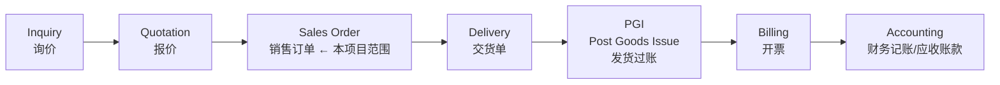
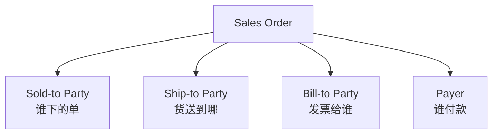

# Part 3：SAP SD 基础全解

面向没有 SAP 背景的开发者，讲清楚做这个项目最少需要掌握的 SD（Sales & Distribution）概念。

## 3.1 核心概念表

| # | 中文 | SAP 英文 | 在 Sales Order 中的作用 | AI 项目为什么要知道 | 举例 |
|---|---|---|---|---|---|
| 1 | 销售凭证 | Sales Document | Sales Order/Quotation/Inquiry 等都是"销售凭证"的一种类型，共享同一套底层数据结构（Header+Item+Schedule Line） | 决定了创建订单本质是"创建一种特定类型的销售凭证" | Sales Order = 类型为 OR 的 Sales Document |
| 2 | 销售订单 | Sales Order | 客户下单的正式记录，是 Order-to-Cash 的起点 | 本项目的核心目标对象 | 订单号 4710012345 |
| 3 | 销售凭证类型 | Sales Document Type / Order Type | 决定订单的业务行为（定价流程、是否需要信用检查、后续凭证类型等） | AI 需要知道用哪个 Order Type，不能瞎填 | OR=标准订单, RE=退货 |
| 4 | 销售范围 | Sales Area | Sales Org + Distribution Channel + Division 三元组，决定订单归属哪个销售组织体系 | 决定了很多字段的默认值和权限范围 | 1000/10/00 |
| 5 | 销售组织 | Sales Organization | 企业法律/组织架构中负责销售的单位 | 影响定价、报表归属、权限 | 1000 = 中国区销售组织 |
| 6 | 分销渠道 | Distribution Channel | 销售渠道（直销/经销商/线上等） | 影响定价策略 | 10 = 直销 |
| 7 | 产品组/事业部 | Division | 产品线维度的组织单位 | 影响定价、产品范围 | 00 = 通用 |
| 8 | 业务伙伴 | Business Partner (BP) | S/4HANA 统一主数据模型，一个 BP 可同时是客户/供应商 | 现代 S/4HANA 客户主数据的底层就是 BP | BP 号与 Customer 号在 S/4HANA 中通常一致 |
| 9 | 客户 | Customer | BP 在 SD/FI 场景下的业务角色 | 订单的下单方 | 0010001234 |
| 10 | 委托方（订货方） | Sold-to Party | 实际下单、签合同的客户 | 订单 Header 的核心字段 | ABC Trading |
| 11 | 收货方 | Ship-to Party | 货物实际送达地址方 | 影响交货单和物流 | 可能是 ABC 的某个仓库 |
| 12 | 开票方 | Bill-to Party | 接收发票的一方 | 影响开票 | 可能是 ABC 总部财务部 |
| 13 | 付款方 | Payer | 实际付款方，影响应收账款和信用管理 | Credit Check 是针对 Payer 的信用额度 | 可能与 Sold-to 相同也可能不同（集团结算） |
| 14 | 物料/产品 | Material / Product | 被销售的商品或服务 | 订单行项目的核心对象 | M-100 |
| 15 | 工厂 | Plant | 物理生产/仓储单位，决定库存和交货来源 | ATP 和交货都基于 Plant | 1000 |
| 16 | 存储地点 | Storage Location | Plant 下更细粒度的库位 | 交货单层面更细致，订单层面有时可选 | 0001 |
| 17 | 行项目 | Item | 订单里的一行（一个物料 + 数量） | 一个订单可有多个 Item | Item 10 = M-100 x100 |
| 18 | 计划行 | Schedule Line | Item 下更细的"交付计划"（可拆分成多个日期批次交付） | ATP 结果体现在 Schedule Line 上 | 100 件分两批 60+40 交付 |
| 19 | 数量 | Quantity | 订购数量 | 核心业务参数 | 100 |
| 20 | 计量单位 | Unit of Measure (UoM) | 数量的单位 | 需与物料主数据单位一致或可换算 | EA（件） |
| 21 | 定价 | Pricing | 根据条件计算最终价格 | 决定订单金额，影响用户确认展示的"预计金额" | 基础价-折扣+税=净价 |
| 22 | 定价条件 | Condition | 定价的具体规则（基础价/折扣/税/运费） | 理解为什么金额这样算 | PR00=基础价, K004=客户折扣 |
| 23 | 交货 | Delivery | 订单之后的物流出库凭证 | 本项目通常不做，但要理解订单是交货的前置 | 交货单 80001234 |
| 24 | 开票 | Billing | 交货/订单之后生成发票 | 理解 Order-to-Cash 全貌 | 发票 90001234 |
| 25 | 信用检查 | Credit Check | 判断客户信用额度是否够支撑本次订单 | 决定订单能否顺利创建/是否被阻塞 | 超额度则订单被 Block |
| 26 | 可用性检查 | ATP / Availability Check | 判断库存/产能是否能满足交货日期 | 决定交货日期是否可行、是否需要拆分交付 | 库存 80 件，订单 100 件 → 部分延期 |

## 3.2 Order-to-Cash（O2C）全流程

即使本项目只做"创建 Sales Order"，也必须理解它在整个 O2C 链条中的位置，因为很多校验（信用、库存）本质是在为后续环节把关。

- **Inquiry（询价）**：客户询问价格/交期，非承诺性凭证。
- **Quotation（报价）**：企业给出正式报价，有效期内可转成订单。
- **Sales Order（销售订单）**：本项目的目标，一旦创建即触发库存预留、信用占用。
- **Delivery（交货单）**：安排实际发货的凭证，从 Sales Order 复制生成。
- **PGI（发货过账）**：仓库实际发出货物，库存正式减少。
- **Billing（开票）**：生成客户发票，通常从 Delivery 或 Order 生成。
- **Accounting（会计记账）**：开票后自动生成财务凭证，进入应收账款。

**为什么 AI 项目要理解这条链**：
1. 创建订单不是"孤立写一条记录"，而是**触发一系列下游流程的起点**，这解释了为什么 Credit Check/ATP 在创建时就要做（提前把关，避免后面交不了货/收不了款）。
2. 未来如果项目扩展到"查询交货状态""创建交货单"，你需要知道这些凭证之间的**继承和引用关系**（Delivery 引用 Sales Order，不是独立创建的）。

## 3.3 客户主数据的四种角色如何影响 AI 参数补全

一个客户在订单中可能涉及四个"伙伴角色"（Partner Function）：

多数情况下四者相同（用户只说"客户 ABC"，系统直接用同一个 BP 填满四个角色）。但如果客户主数据里配置了多个 Ship-to Party（比如集团客户有多个收货仓库），AI 补全时**必须触发追问**，不能默认选第一个——这是 Part 2 第二步"缺失参数判断"的具体应用。

## 3.4 项目中你需要记住什么

- Sales Order 本质是一种 Sales Document Type，理解 Header/Item/Schedule Line 三层结构。
- Sales Area（Sales Org + Distribution Channel + Division）是很多默认值的锚点，AI 不能瞎猜。
- 四种伙伴角色（Sold-to/Ship-to/Bill-to/Payer）默认相同但可能不同，这是常见的追问触发点。
- Credit Check 和 ATP 是"面向未来流程的提前把关"，理解这一点才能理解为什么这些必须由 SAP 权威判断而不能后端模拟。
- 即使只做创建订单，也要理解它是 O2C 链条的起点，未来功能扩展大概率沿着这条链走。
