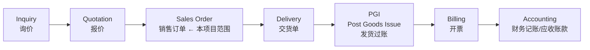
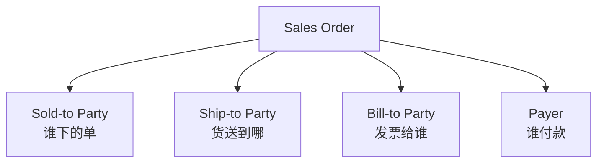

# Part 3：SAP SD 基础全解（SAP SD（販売管理）基礎完全解説）

面向没有 SAP 背景的开发者，讲清楚做这个项目最少需要掌握的 SD（Sales & Distribution）概念。

SAP のバックグラウンドを持たない開発者に向けて、このプロジェクトを進める上で最低限押さえておくべき SD（Sales & Distribution）の概念を分かりやすく解説します。

## 3.1 核心概念表（3.1 コア概念一覧）

| # | 中文 | SAP 英文 | 在 Sales Order 中的作用 | AI 项目为什么要知道 | 举例 |
|---|---|---|---|---|---|
| 1 | 销售凭证 販売伝票 | Sales Document | Sales Order/Quotation/Inquiry 等都是"销售凭证"的一种类型，共享同一套底层数据结构（Header+Item+Schedule Line） Sales Order/Quotation/Inquiry などはすべて「販売伝票」の一種であり、同一の基盤データ構造（Header+Item+Schedule Line）を共有する | 决定了创建订单本质是"创建一种特定类型的销售凭证" オーダー作成の本質が「特定タイプの販売伝票を作成すること」であると決定づける | Sales Order = 类型为 OR 的 Sales Document Sales Order = タイプ OR の Sales Document |
| 2 | 销售订单 受注 / 販売オーダー | Sales Order | 客户下单的正式记录，是 Order-to-Cash 的起点 顧客が発注した正式な記録であり、Order-to-Cash の起点である | 本项目的核心目标对象 本プロジェクトのコアとなる対象 | 订单号 4710012345 オーダー番号 4710012345 |
| 3 | 销售凭证类型 販売伝票タイプ | Sales Document Type / Order Type | 决定订单的业务行为（定价流程、是否需要信用检查、后续凭证类型等） オーダーの業務挙動を決定する（価格決定プロセス、与信チェックの要否、後続伝票タイプなど） | AI 需要知道用哪个 Order Type，不能瞎填 AI はどの Order Type を使うべきかを把握する必要があり、適当に入力してはならない | OR=标准订单, RE=退货 OR=標準オーダー、RE=返品 |
| 4 | 销售范围 販売範囲 | Sales Area | Sales Org + Distribution Channel + Division 三元组，决定订单归属哪个销售组织体系 Sales Org + Distribution Channel + Division の三要素であり、オーダーがどの販売組織体系に属するかを決定する | 决定了很多字段的默认值和权限范围 多くのフィールドのデフォルト値と権限範囲を決定する | 1000/10/00 |
| 5 | 销售组织 販売組織 | Sales Organization | 企业法律/组织架构中负责销售的单位 企業の法人/組織構造において販売を担当する単位 | 影响定价、报表归属、权限 価格決定、レポートの帰属、権限に影響する | 1000 = 中国区销售组织 1000 = 中国地区販売組織 |
| 6 | 分销渠道 流通チャネル / 販売チャネル | Distribution Channel | 销售渠道（直销/经销商/线上等） 販売チャネル（直販/代理店/オンラインなど） | 影响定价策略 価格決定戦略に影響する | 10 = 直销 10 = 直販 |
| 7 | 产品组/事业部 製品グループ / 事業部門 | Division | 产品线维度的组织单位 製品ライン軸の組織単位 | 影响定价、产品范围 価格決定、製品範囲に影響する | 00 = 通用 00 = 汎用 |
| 8 | 业务伙伴 ビジネスパートナー | Business Partner (BP) | S/4HANA 统一主数据模型，一个 BP 可同时是客户/供应商 S/4HANA の統一マスタデータモデルであり、1 つの BP が同時に顧客/仕入先になり得る | 现代 S/4HANA 客户主数据的底层就是 BP 現代の S/4HANA における顧客マスタの基盤は BP である | BP 号与 Customer 号在 S/4HANA 中通常一致 BP 番号と Customer 番号は S/4HANA では通常一致する |
| 9 | 客户 顧客 | Customer | BP 在 SD/FI 场景下的业务角色 SD/FI シナリオにおける BP の業務ロール | 订单的下单方 オーダーの発注元 | 0010001234 |
| 10 | 委托方（订货方） 受注先 / 得意先 | Sold-to Party | 实际下单、签合同的客户 実際に発注し契約を締結する顧客 | 订单 Header 的核心字段 オーダー Header のコアフィールド | ABC Trading |
| 11 | 收货方 出荷先 | Ship-to Party | 货物实际送达地址方 貨物の実際の送付先 | 影响交货单和物流 出荷伝票と物流に影響する | 可能是 ABC 的某个仓库 ABC のある倉庫である場合がある |
| 12 | 开票方 請求先 | Bill-to Party | 接收发票的一方 請求書を受け取る側 | 影响开票 請求に影響する | 可能是 ABC 总部财务部 ABC 本社の財務部である場合がある |
| 13 | 付款方 支払人 | Payer | 实际付款方，影响应收账款和信用管理 実際の支払者であり、売掛金管理と与信管理に影響する | Credit Check 是针对 Payer 的信用额度 Credit Check は Payer の与信枠に対して行われる | 可能与 Sold-to 相同也可能不同（集团结算） Sold-to と同一の場合も異なる場合もある（グループ決済） |
| 14 | 物料/产品 品目 / マテリアル | Material / Product | 被销售的商品或服务 販売される商品またはサービス | 订单行项目的核心对象 オーダー明細のコアオブジェクト | M-100 |
| 15 | 工厂 プラント | Plant | 物理生产/仓储单位，决定库存和交货来源 物理的な生産/保管単位であり、在庫と出荷元を決定する | ATP 和交货都基于 Plant ATP と出荷はいずれも Plant を基準とする | 1000 |
| 16 | 存储地点 保管場所 | Storage Location | Plant 下更细粒度的库位 Plant 配下のより細かい保管場所 | 交货单层面更细致，订单层面有时可选 出荷伝票レベルではより詳細になり、オーダーレベルでは任意の場合もある | 0001 |
| 17 | 行项目 明細 / アイテム | Item | 订单里的一行（一个物料 + 数量） オーダー内の 1 行（1 つの物料＋数量） | 一个订单可有多个 Item 1 つのオーダーに複数の Item を持てる | Item 10 = M-100 x100 |
| 18 | 计划行 スケジュールライン | Schedule Line | Item 下更细的"交付计划"（可拆分成多个日期批次交付） Item 配下のより細かい「納入計画」（複数の日付・バッチに分割して納入可能） | ATP 结果体现在 Schedule Line 上 ATP の結果は Schedule Line に反映される | 100 件分两批 60+40 交付 100 個を 2 回に分け 60+40 で納入 |
| 19 | 数量 数量 | Quantity | 订购数量 発注数量 | 核心业务参数 コアとなる業務パラメータ | 100 |
| 20 | 计量单位 単位 | Unit of Measure (UoM) | 数量的单位 数量の単位 | 需与物料主数据单位一致或可换算 マテリアルマスタの単位と一致するか、換算可能である必要がある | EA（件） EA（個） |
| 21 | 定价 価格決定 | Pricing | 根据条件计算最终价格 条件に基づき最終価格を計算する | 决定订单金额，影响用户确认展示的"预计金额" オーダー金額を決定し、ユーザー確認時に表示する「見積金額」に影響する | 基础价-折扣+税=净价 基本価格-値引き+税金=正味価格 |
| 22 | 定价条件 価格決定条件 | Condition | 定价的具体规则（基础价/折扣/税/运费） 価格決定の具体的なルール（基本価格/値引き/税金/運賃） | 理解为什么金额这样算 なぜその金額になるのかを理解できる | PR00=基础价, K004=客户折扣 PR00=基本価格、K004=顧客値引き |
| 23 | 交货 出荷 / 納品 | Delivery | 订单之后的物流出库凭证 オーダー後の物流出庫伝票 | 本项目通常不做，但要理解订单是交货的前置 本プロジェクトでは通常扱わないが、オーダーが出荷の前段であることは理解しておく必要がある | 交货单 80001234 出荷伝票 80001234 |
| 24 | 开票 請求 | Billing | 交货/订单之后生成发票 出荷/オーダーの後に請求書を生成する | 理解 Order-to-Cash 全貌 Order-to-Cash の全体像を理解する | 发票 90001234 請求書 90001234 |
| 25 | 信用检查 与信チェック | Credit Check | 判断客户信用额度是否够支撑本次订单——注意结果不一定是"拒绝创建"，很多配置下是"订单照常创建，但打上 Credit Block 冻结后续处理"，需信用管理员 Release/Reject 顧客の与信枠が今回のオーダーを支えられるかを判断する——結果は必ずしも「作成拒否」とは限らず、多くの設定では「オーダーは通常どおり作成されるが Credit Block が付与され後続処理が凍結される」形となり、与信管理者による Release/Reject が必要になる | AI 转述结果时必须以 SAP 返回的凭证号+信用状态字段为准，不能把"检查未通过"简单等价于"订单未创建"（详见 Part 2 第四步、Part 13 错误场景表） AI が結果を転述する際は、SAP が返す伝票番号＋与信ステータスフィールドを基準としなければならず、「チェック未通過」を単純に「オーダー未作成」と同一視してはならない（詳細は Part 2 の第四ステップ、Part 13 のエラーシナリオ表を参照） | 超额度可能订单被创建但 Block，也可能直接被拒绝，取决于 Customizing 限度超過の場合、オーダーは作成されるが Block される場合もあれば、直接拒否される場合もあり、Customizing 次第である |
| 26 | 可用性检查 利用可能性チェック（ATP） | ATP / Availability Check | 判断库存/产能是否能满足交货日期 在庫/生産能力が納期を満たせるかを判断する | 决定交货日期是否可行、是否需要拆分交付 納期が実現可能か、分割納入が必要かを決定する | 库存 80 件，订单 100 件 → 部分延期 在庫 80 個、オーダー 100 個 → 一部延期 |

## 3.2 Order-to-Cash（O2C）全流程（3.2 Order-to-Cash（O2C）全体フロー）

即使本项目只做"创建 Sales Order"，也必须理解它在整个 O2C 链条中的位置，因为很多校验（信用、库存）本质是在为后续环节把关。

本プロジェクトが「Sales Order の作成」のみを扱う場合でも、O2C の全体チェーンの中でそれがどの位置にあるかを理解する必要があります。多くの検証（与信、在庫）は本質的に後続工程のために事前にチェックしているものだからです。

- **Inquiry（询价）**：客户询问价格/交期，非承诺性凭证。 **Inquiry（引合）**：顧客が価格/納期を問い合わせるものであり、確約性のない伝票です。
- **Quotation（报价）**：企业给出正式报价，有效期内可转成订单。 **Quotation（見積）**：企業が正式な見積を提示し、有効期間内にオーダーへ転換できます。
- **Sales Order（销售订单）**：本项目的目标，一旦创建即触发库存预留、信用占用。 **Sales Order（受注）**：本プロジェクトの目標であり、作成されると同時に在庫引当と与信枠の占有がトリガーされます。
- **Delivery（交货单）**：安排实际发货的凭证，从 Sales Order 复制生成。 **Delivery（出荷伝票）**：実際の出荷を手配する伝票であり、Sales Order からコピーして生成されます。
- **PGI（发货过账）**：仓库实际发出货物，库存正式减少。 **PGI（出荷転記）**：倉庫が実際に貨物を出荷し、在庫が正式に減少します。
- **Billing（开票）**：生成客户发票，通常从 Delivery 或 Order 生成。 **Billing（請求）**：顧客への請求書を生成します。通常は Delivery または Order から生成されます。
- **Accounting（会计记账）**：开票后自动生成财务凭证，进入应收账款。 **Accounting（会計記帳）**：請求後に財務伝票が自動生成され、売掛金に計上されます。

**为什么 AI 项目要理解这条链**： **なぜ AI プロジェクトはこのチェーンを理解する必要があるのか**：

1. 创建订单不是"孤立写一条记录"，而是**触发一系列下游流程的起点**，这解释了为什么 Credit Check/ATP 在创建时就要做（提前把关，避免后面交不了货/收不了款）。 オーダーの作成は「単独でレコードを 1 件書き込む」ことではなく、**一連の下流プロセスをトリガーする起点**です。これが、なぜ Credit Check/ATP を作成時点で行う必要があるのか（後で出荷できない/回収できないという事態を避けるため事前にチェックする）を説明しています。
2. 未来如果项目扩展到"查询交货状态""创建交货单"，你需要知道这些凭证之间的**继承和引用关系**（Delivery 引用 Sales Order，不是独立创建的）。 将来プロジェクトが「出荷状況の照会」「出荷伝票の作成」へ拡張される場合、これらの伝票間の**継承関係と参照関係**（Delivery は Sales Order を参照するのであり、単独で作成されるものではない）を把握しておく必要があります。

## 3.3 客户主数据的四种角色如何影响 AI 参数补全（3.3 顧客マスタの 4 つの役割が AI のパラメータ補完に与える影響）

一个客户在订单中可能涉及四个"伙伴角色"（Partner Function）：

1 つの顧客はオーダーにおいて 4 つの「パートナー機能（Partner Function）」に関わる可能性があります。

多数情况下四者相同（用户只说"客户 ABC"，系统直接用同一个 BP 填满四个角色）。但如果客户主数据里配置了多个 Ship-to Party（比如集团客户有多个收货仓库），AI 补全时**必须触发追问**，不能默认选第一个——这是 Part 2 第二步"缺失参数判断"的具体应用。

多くの場合この 4 つは同一です（ユーザーが単に「顧客 ABC」と言えば、システムは同一の BP を 4 つの役割すべてに充てます）。しかし顧客マスタに複数の Ship-to Party が設定されている場合（例えばグループ顧客が複数の受入倉庫を持つ場合）、AI が補完する際は**必ず追加質問をトリガーしなければならず**、デフォルトで先頭のものを選んではいけません——これは Part 2 の第二ステップ「不足パラメータの判定」の具体的な適用例です。

## 3.4 项目中你需要记住什么（3.4 プロジェクトで覚えておくべきこと）

- Sales Order 本质是一种 Sales Document Type，理解 Header/Item/Schedule Line 三层结构。 Sales Order は本質的に Sales Document Type の一種であり、Header/Item/Schedule Line の三層構造を理解することが重要です。
- Sales Area（Sales Org + Distribution Channel + Division）是很多默认值的锚点，AI 不能瞎猜。 Sales Area（Sales Org + Distribution Channel + Division）は多くのデフォルト値の基準点であり、AI が当て推量してはいけません。
- 四种伙伴角色（Sold-to/Ship-to/Bill-to/Payer）默认相同但可能不同，这是常见的追问触发点。 4 つのパートナー役割（Sold-to/Ship-to/Bill-to/Payer）はデフォルトでは同一ですが異なる場合もあり、これはよくある追加質問のトリガーポイントです。
- Credit Check 和 ATP 是"面向未来流程的提前把关"，理解这一点才能理解为什么这些必须由 SAP 权威判断而不能后端模拟。 Credit Check と ATP は「将来のプロセスに向けた事前チェック」であり、この点を理解して初めて、なぜこれらを SAP による権威的判断に委ねなければならず、バックエンドでシミュレートしてはならないのかが理解できます。
- 即使只做创建订单，也要理解它是 O2C 链条的起点，未来功能扩展大概率沿着这条链走。 オーダー作成のみを扱う場合でも、それが O2C チェーンの起点であることを理解しておくべきであり、将来の機能拡張は高確率でこのチェーンに沿って進むことになります。
