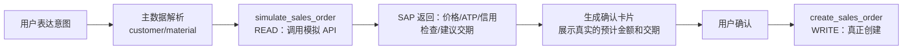
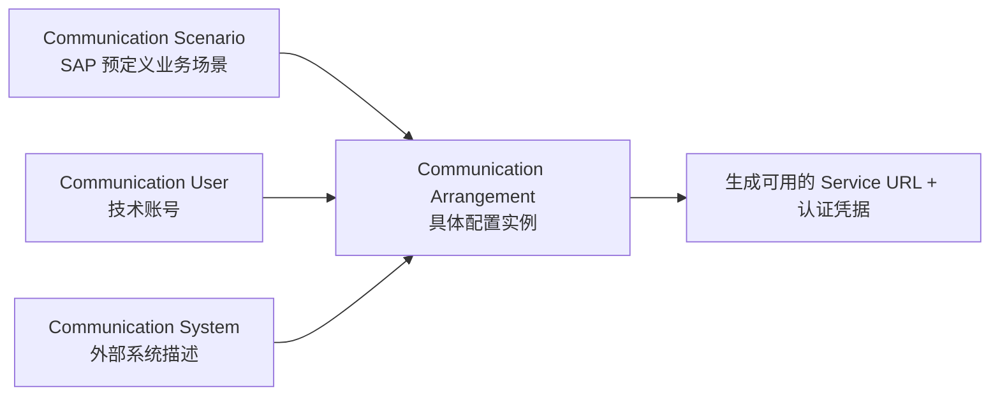

# Part 5：SAP API 与集成详解（SAP API と統合の詳細解説）

## 5.1 各类协议是什么（先建立全景）（各種プロトコルとは何か（まず全体像を把握する））

| 协议/技术 | 全称 | 一句话 | 现状 |
|---|---|---|---|
| OData | Open Data Protocol | 基于 HTTP/REST 的标准化数据协议，SAP 现代 API 的主力<br>HTTP/REST に基づく標準化されたデータプロトコルで、SAP の現代的な API の主力です | ✅ 主推，V2 广泛用于 S/4 On-Premise，V4 是新标准<br>✅ 主に推奨。V2 は S/4 On-Premise で広く使われ、V4 が新標準です |
| REST | Representational State Transfer | 通用 Web API 风格，SAP 的一些新服务（如部分 BTP 服务、Business Accelerator Hub 上的新 API）直接以 REST/JSON 形式提供<br>汎用的な Web API スタイルで、SAP の一部の新しいサービス（一部の BTP サービスや Business Accelerator Hub 上の新しい API など）は REST/JSON 形式で直接提供されます | ✅ 逐渐增多，尤其云原生服务<br>✅ 徐々に増加しており、特にクラウドネイティブなサービスで顕著です |
| SOAP | Simple Object Access Protocol | 基于 XML 的老牌 Web Service 协议<br>XML に基づく古くからある Web サービスプロトコルです | ⚠️ 存量系统仍有，新项目基本不选型<br>⚠️ 既存システムには依然として存在しますが、新規プロジェクトではほぼ選定されません |
| RFC | Remote Function Call | SAP 专有的远程过程调用协议，直接调用 ABAP Function Module<br>SAP 独自のリモートプロシージャコールプロトコルで、ABAP Function Module を直接呼び出します | ⚠️ 存量集成大量使用，新项目一般封装后再用<br>⚠️ 既存の統合で多く使われており、新規プロジェクトでは通常ラップしてから使用します |
| BAPI | Business API | 基于 RFC 的、有业务语义规范的标准化函数（如 `BAPI_SALESORDER_CREATEFROMDAT2`）<br>RFC をベースにした、業務的な意味規範を持つ標準化された関数です（`BAPI_SALESORDER_CREATEFROMDAT2` など） | ⚠️ ECC 时代主力，S/4HANA 仍支持但官方推荐迁移到 OData<br>⚠️ ECC 時代の主力でしたが、S/4HANA でも引き続きサポートされる一方、公式には OData への移行が推奨されています |
| IDoc | Intermediate Document | SAP 的异步消息/文档交换格式，常用于系统间批量/异步集成（EDI、跨系统同步）<br>SAP の非同期メッセージ/ドキュメント交換フォーマットで、システム間のバッチ/非同期統合（EDI、システム間同期）によく使われます | ✅ 异步/批量场景仍在用，不适合"实时对话式创建订单"这种同步交互场景<br>✅ 非同期/バッチのシナリオでは引き続き使用されますが、「リアルタイムの対話形式で注文を作成する」といった同期的なやり取りには適しません |

## 5.2 现代 S/4HANA 项目优先选什么（現代の S/4HANA プロジェクトでは何を優先すべきか）

**优先级：OData（V2，若目标系统支持 V4 则优先 V4）> REST（云原生服务）> RFC/BAPI（历史系统或无 OData 覆盖的场景）> SOAP（尽量避免）> IDoc（仅用于异步批量场景，不用于同步对话式交互）**

**優先順位：OData（V2。目標システムが V4 をサポートしていれば V4 を優先）> REST（クラウドネイティブサービス）> RFC/BAPI（既存システムや OData がカバーしていないシナリオ）> SOAP（可能な限り避ける）> IDoc（非同期バッチのシナリオのみに使用し、同期的な対話形式のやり取りには使わない）**

原因：（理由：）
- OData 是 SAP 官方为 Fiori/云时代设计的标准协议，有完整的 metadata 自描述能力（`$metadata`），配套的 SAP API Business Accelerator Hub 文档也最全。<br>OData は SAP が Fiori/クラウド時代向けに公式に設計した標準プロトコルであり、完全なメタデータの自己記述能力（`$metadata`）を持ち、対応する SAP API Business Accelerator Hub のドキュメントも最も充実しています。
- 对话式 AI 场景需要"同步请求-响应"，IDoc 的异步特性不适合（用户在等 AI 立刻回复"订单号是多少"）。<br>対話型 AI のシナリオでは「同期的なリクエスト・レスポンス」が必要であり、IDoc の非同期的な性質は適しません（ユーザーは AI が「注文番号は何か」をすぐに返答するのを待っています）。
- RFC/BAPI 仍大量存在于存量系统（尤其 ECC），但新项目如果目标系统是 S/4HANA 且有对应 OData 服务，应优先用 OData。<br>RFC/BAPI は依然として既存システム（特に ECC）に大量に存在しますが、新規プロジェクトで対象システムが S/4HANA であり、対応する OData サービスがある場合は OData を優先すべきです。

## 5.3 Sales Order OData API 详解（Sales Order OData API の詳細解説）

### 5.3.1 `API_SALES_ORDER_SRV`

这是 S/4HANA 标准的 Sales Order OData V2 服务（⚠️ 具体可用性、版本号、是否有 V4 版本，需按你的系统发布版本在 SAP API Business Accelerator Hub 核实——S/4HANA Cloud 和不同 On-Premise Feature Pack 之间可能存在差异）。

これは S/4HANA 標準の Sales Order OData V2 サービスです（⚠️ 具体的な利用可否、バージョン番号、V4 版があるかどうかは、あなたのシステムのリリースバージョンに応じて SAP API Business Accelerator Hub で確認する必要があります——S/4HANA Cloud と各種 On-Premise の Feature Pack の間で差異がある可能性があります）。

核心 Entity：（コアとなる Entity：）

| Entity Set | 说明 |
|---|---|
| `A_SalesOrder` | 订单 Header<br>注文の Header |
| `A_SalesOrderItem`（通过 `to_Item` navigation） | 订单行项目<br>注文の明細行 |
| `A_SalesOrderScheduleLine` | 计划行（交付日期/数量拆分）<br>スケジュールライン（納期/数量の分割） |
| `A_SalesOrderPricingElement` | 定价明细<br>価格決定の明細 |
| `A_SalesOrderPartner` | 伙伴角色（Sold-to/Ship-to/Bill-to/Payer）<br>パートナー役割（Sold-to/Ship-to/Bill-to/Payer） |

### 5.3.2 OData 基础概念（OData の基本概念）

| 概念 | 说明 |
|---|---|
| Entity | 一条数据记录的类型定义，类似"表"<br>1 件のデータレコードの型定義で、「テーブル」に似たものです |
| Entity Set | Entity 的集合，对应 URL 里的资源路径，如 `A_SalesOrder`<br>Entity の集合で、URL 内のリソースパスに対応します（`A_SalesOrder` など） |
| Metadata | `$metadata` 端点返回的 XML/EDMX，描述所有 Entity、字段、数据类型、Navigation、Nullable、MaxLength 等**数据模型结构**——这是判断"这个字段到底叫什么、结构上是否必填"的权威来源，不要凭记忆或教程猜。但要注意：EDMX 里的 `Nullable="false"` 只反映结构层面的必填，很多 SAP 业务上的"条件必填"规则（如某个订单类型下字段 X 才必填、某销售范围下字段 Y 由 Customizing 决定）并不会完整体现在 `$metadata` 里，这类业务语义和条件规则还需要结合 SAP Business Accelerator Hub / Help Portal 的说明以及目标系统的实际 Customizing 一起核实<br>`$metadata` エンドポイントが返す XML/EDMX で、すべての Entity、フィールド、データ型、Navigation、Nullable、MaxLength などの**データモデル構造**を記述します——これは「このフィールドの正式名称は何か、構造上必須かどうか」を判断する権威あるソースであり、記憶やチュートリアルで推測してはいけません。ただし注意点として、EDMX 内の `Nullable="false"` は構造レベルの必須項目を反映しているに過ぎず、多くの SAP 業務上の「条件付き必須」ルール（例えばある注文タイプでのみフィールド X が必須、あるいはある販売範囲でフィールド Y が Customizing によって決まる、など）は `$metadata` に完全には反映されません。こうした業務的な意味や条件ルールは、SAP Business Accelerator Hub / Help Portal の説明や対象システムの実際の Customizing と合わせて確認する必要があります |
| GET | 查询<br>照会 |
| POST | 创建<br>作成 |
| PATCH（V2 常用 MERGE） | 部分更新<br>部分更新 |
| DELETE | 删除<br>削除 |
| `$filter` | 类似 SQL WHERE，如 `$filter=SoldToParty eq '0010001234'`<br>SQL の WHERE に似ており、例えば `$filter=SoldToParty eq '0010001234'` |
| `$select` | 只返回指定字段，减少数据量<br>指定したフィールドのみを返し、データ量を削減します |
| `$expand` | 展开 navigation property，一次查询带出关联数据（如订单+行项目）<br>navigation property を展開し、1 回の照会で関連データ（注文＋明細行など）を取得します |
| `$batch` | 把多个操作打包成一次 HTTP 请求，减少往返<br>複数の操作を 1 回の HTTP リクエストにまとめ、往復回数を減らします |
| Deep Insert | 在一次 POST 里同时创建 Header 和通过 navigation property 关联的 Item（如 Part 2 示例）<br>1 回の POST で Header と navigation property で関連付けられた Item を同時に作成します（Part 2 の例を参照） |

### 5.3.3 SAP OData 特有机制（SAP OData 特有の仕組み）

```
https://<host>/sap/opu/odata/sap/API_SALES_ORDER_SRV/A_SalesOrder
```

- **Service**：`API_SALES_ORDER_SRV` 是一个"服务"，包含一组相关 Entity。<br>**Service**：`API_SALES_ORDER_SRV` は「サービス」であり、関連する一連の Entity を含みます。
- **CSRF Token**：写操作前必须先 `GET` 一次（通常带 `X-CSRF-Token: Fetch` 请求头）拿到 token 和 Session Cookie，再在 POST/PATCH/DELETE 请求头带上 `X-CSRF-Token: <token>` 和对应 Cookie，否则会被拒绝（403）。这是 SAP OData 对写操作的标准 CSRF 防护。<br>**CSRF Token**：書き込み操作の前には、まず `GET`（通常は `X-CSRF-Token: Fetch` ヘッダーを付与）を 1 回実行して token と Session Cookie を取得し、その後 POST/PATCH/DELETE のリクエストヘッダーに `X-CSRF-Token: <token>` と対応する Cookie を付与する必要があります。そうしないと拒否されます（403）。これは SAP OData の書き込み操作に対する標準的な CSRF 防御です。
- **Cookie / Session**：经典 OData 交互是有状态的（依赖 Session Cookie 关联 CSRF Token），在无状态的云原生 Backend 里要注意 Token 获取和复用的实现（每次请求都重新 Fetch Token 会有性能开销，但也不能跨用户共享）。<br>**Cookie / Session**：クラシックな OData のやり取りはステートフルです（Session Cookie により CSRF Token を関連付けます）。ステートレスなクラウドネイティブのバックエンドでは、Token の取得と再利用の実装に注意が必要です（リクエストごとに Token を再取得するとパフォーマンスコストが発生しますが、ユーザーをまたいで共有することもできません）。
- **HTTP Status**：`201 Created` 表示创建成功，`400` 参数错误，`403` 权限/CSRF 问题，`500` 系统内部错误（需要看错误详情判断是否可重试）。<br>**HTTP Status**：`201 Created` は作成成功、`400` はパラメータエラー、`403` は権限/CSRF の問題、`500` はシステム内部エラーを示します（リトライ可能かどうかはエラーの詳細を見て判断する必要があります）。
- **SAP Error Response**：典型结构（V2）：<br>**SAP Error Response**：典型的な構造（V2）：

```json
{
  "error": {
    "code": "SAP_SD/031",
    "message": { "lang": "zh", "value": "客户 0010009999 被冻结，无法创建订单" },
    "innererror": {
      "errordetails": [
        { "code": "SAP_SD/031", "message": "客户被冻结", "severity": "error" }
      ]
    }
  }
}
```

后端要做的是**解析 `innererror.errordetails`，把 SAP 消息码映射成结构化的业务错误类型**（如 `CUSTOMER_BLOCKED`），而不是把原始 SAP 消息直接甩给用户（消息文案可能是德语/内部术语，不友好）。

バックエンドが行うべきことは、**`innererror.errordetails` を解析し、SAP のメッセージコードを構造化された業務エラータイプにマッピングすること**です（`CUSTOMER_BLOCKED` など）。生の SAP メッセージをそのままユーザーに投げてはいけません（メッセージ文言がドイツ語や内部用語である可能性があり、ユーザーフレンドリーではありません）。

### 5.3.4 用于"预览而不落库"的 Sales Order Simulation API（「プレビューするが永続化しない」ための Sales Order Simulation API）

Part 1.6 和 Part 2 第四步反复强调：Pricing、ATP、Credit Check 必须由 SAP 权威计算，后端不能重新实现。但这不代表用户确认前只能"盲猜"这些结果——SAP 提供了专门用于**模拟（Simulate）** Sales Order 的服务（⚠️ 具体技术名和字段以你系统当前版本的 API Business Accelerator Hub 页面为准，例如围绕 `API_SALES_ORDER_SIMULATION_SRV` 一类的模拟服务），它接受和创建订单几乎一样的输入，但**不会真正保存凭证**，返回的是模拟计算出的定价、ATP 可用性、信用检查结果等信息。

Part 1.6 と Part 2 の第 4 ステップで繰り返し強調しているとおり、Pricing、ATP、Credit Check は必ず SAP が権威的に計算する必要があり、バックエンドで再実装してはいけません。しかしこれは、ユーザーが確認する前にこれらの結果を「当てずっぽうで推測する」しかないという意味ではありません——SAP は Sales Order を**シミュレーション（Simulate）**するための専用サービスを提供しています（⚠️ 具体的な技術名やフィールドは、あなたのシステムの現行バージョンの API Business Accelerator Hub のページを基準にしてください。例えば `API_SALES_ORDER_SIMULATION_SRV` のようなシミュレーションサービス群があります）。これは注文作成とほぼ同じ入力を受け付けますが、**実際には伝票を保存せず**、シミュレーション計算された価格決定、ATP の在庫可用性、与信チェックの結果などの情報を返します。

这让 Part 2 第四步的"业务校验"可以更具体地落地为一个独立的 READ 工具：

これにより、Part 2 の第 4 ステップの「業務検証」を、より具体的に独立した READ ツールとして実装できます。



- `simulate_sales_order` 在 Agent 层被归为 READ 工具，可以放心地让 Agent 在生成确认卡片前调用，不需要走 WRITE 的审批/幂等机制。**但要注意：这里的 READ/WRITE 是 Tool 风险分类（有没有副作用），不等同于底层 HTTP 方法**——模拟类 API 在协议层通常仍然是 `POST`（因为要提交完整的订单结构才能算出价格/ATP/信用结果），只是它不会持久化任何业务数据，所以在 Agent 层依然按"无副作用"归为 READ。新人第一次看到"POST 却叫 READ"容易疑惑，记住这个区分标准即可。<br>`simulate_sales_order` は Agent 層では READ ツールに分類され、確認カードを生成する前に Agent が安心して呼び出すことができ、WRITE の承認/冪等性の仕組みを経由する必要はありません。**ただし注意すべきは、ここでの READ/WRITE は Tool のリスク分類（副作用があるかどうか）であり、基盤となる HTTP メソッドと同じではないということです**——シミュレーション系の API はプロトコル層では通常やはり `POST` です（価格/ATP/与信の結果を計算するには完全な注文構造を送信する必要があるため）。ただし業務データを一切永続化しないため、Agent 層では引き続き「副作用なし」として READ に分類されます。初めて見る人は「POST なのに READ と呼ぶ」ことに疑問を持ちやすいですが、この区分基準を覚えておけば大丈夫です。
- 具体触发哪些模拟计算，通常通过请求里挂载的 navigation property（如围绕定价、计划行、信用检查的关联结构，⚠️ 具体名称以你系统的 `$metadata` 为准）来控制——不挂载对应的关联，SAP 可能不会返回那部分模拟结果，这也是"字段级细节必须查 metadata"这条原则的又一个体现。<br>具体的にどのシミュレーション計算をトリガーするかは、通常リクエストに付加する navigation property（価格決定、スケジュールライン、与信チェックに関する関連構造など、⚠️ 具体的な名称はあなたのシステムの `$metadata` を基準にしてください）によって制御されます——対応する関連を付加しないと、SAP がその部分のシミュレーション結果を返さない可能性があります。これも「フィールドレベルの詳細は必ず metadata を確認する」という原則のもう一つの表れです。
- 确认卡片里的"预计金额""预计交期"不再是后端猜测或占位符，而是 SAP 模拟计算的真实结果——这比只说"最终以 SAP 定价为准"更贴近生产项目的实际做法。<br>確認カード内の「予定金額」「予定納期」はもはやバックエンドの推測やプレースホルダーではなく、SAP がシミュレーション計算した実際の結果です——これは単に「最終的には SAP の価格決定に従う」と言うだけよりも、実際のプロダクションプロジェクトのやり方に近いものです。
- `create_sales_order` 真正提交时，仍然可能因为并发导致的库存/信用变化而与模拟结果略有出入，这属于正常的最终一致性问题，UI 文案上仍应保留"最终以创建结果为准"的提示。<br>`create_sales_order` が実際に送信される際には、並行処理による在庫/与信の変化によってシミュレーション結果と多少のずれが生じる可能性があり、これは正常な結果整合性（eventual consistency）の問題です。UI の文言には引き続き「最終的には作成結果に従う」旨の注意書きを残すべきです。

## 5.4 SAP API Business Accelerator Hub

- **是什么**：SAP 官方 API 目录网站（`api.sap.com`），列出所有标准 API（OData/REST/SOAP/事件），提供 metadata、文档、Try-out 功能、示例 payload。<br>**それは何か**：SAP 公式の API カタログサイト（`api.sap.com`）で、すべての標準 API（OData/REST/SOAP/イベント）を一覧化し、metadata、ドキュメント、Try-out 機能、サンプル payload を提供します。
- **怎么用**：<br>**使い方**：
  1. 搜索业务对象（如 "Sales Order"）找到对应服务 `API_SALES_ORDER_SRV`。<br>ビジネスオブジェクト（"Sales Order" など）を検索し、対応するサービス `API_SALES_ORDER_SRV` を見つけます。
  2. 查看 API 文档页的字段说明、必填/可选标注。<br>API ドキュメントページのフィールド説明や必須/任意の表記を確認します。
  3. 下载或查看 `$metadata` EDMX，了解完整数据模型和关系。<br>`$metadata` の EDMX をダウンロードまたは閲覧し、完全なデータモデルと関係性を把握します。
  4. 用页面自带的 "Try Out"（通常连接到 SAP 提供的沙箱系统）实际发一次请求，观察真实响应结构。<br>ページ内蔵の "Try Out"（通常は SAP が提供するサンドボックスシステムに接続）を使って実際にリクエストを送信し、実際のレスポンス構造を確認します。
  5. 查看是否标注 Deprecated，以及是否有更新版本（如从 V2 迁移到 V4）。<br>Deprecated と表示されていないか、より新しいバージョン（V2 から V4 への移行など）がないかを確認します。
- **重要性**：这是本教程反复强调"⚠️ 需按版本核实"的具体核实渠道——任何字段级细节，最终都应该回到这里和你系统的 `$metadata` 去确认，而不是相信任何二手教程（包括本教程）的具体字段名。<br>**重要性**：これは本チュートリアルが繰り返し強調している「⚠️ バージョンに応じて確認が必要」の具体的な確認手段です——あらゆるフィールドレベルの詳細は、最終的にはこことあなたのシステムの `$metadata` に戻って確認すべきであり、本チュートリアルを含むいかなる二次的なチュートリアルの具体的なフィールド名も鵜呑みにしてはいけません。

## 5.5 S/4HANA Cloud 与 On-Premise 的 API 使用差异（S/4HANA Cloud と On-Premise の API 利用における違い）

| 维度 | On-Premise / Private Cloud | Public Cloud |
|---|---|---|
| API 暴露方式<br>API の公開方法 | 可直接开放 OData 服务（需网关配置 SICF），也可经 API Management<br>OData サービスを直接公開できます（ゲートウェイで SICF の設定が必要）。API Management 経由も可能です | 必须通过 **Communication Arrangement** 显式开通，不能直接访问底层服务<br>必ず **Communication Arrangement** を通じて明示的に開通する必要があり、基盤サービスに直接アクセスすることはできません |
| 可用 API 范围<br>利用可能な API の範囲 | 相对开放，可以用自定义扩展的 OData 服务<br>比較的オープンで、カスタム拡張された OData サービスを使用できます | 仅限于 SAP 发布的"Released API"白名单（保证云端升级兼容性），自定义扩展需走 SAP 的扩展性框架（如 Key User Extensibility / Developer Extensibility）<br>SAP が公開する「Released API」のホワイトリストに限定されます（クラウドのアップグレード互換性を保証するため）。カスタム拡張は SAP の拡張性フレームワーク（Key User Extensibility / Developer Extensibility など）を経由する必要があります |
| 身份认证<br>認証方式 | 内网 Basic Auth（不推荐）、OAuth2、SAML<br>社内ネットワークの Basic Auth（非推奨）、OAuth2、SAML | 必须通过 Communication Arrangement 暴露 API，但**认证方式不是只有 OAuth2**——具体支持哪种由所选的 **Communication Scenario** 决定，常见的有 Communication User + Basic Auth、Communication User + X.509 证书、OAuth 2.0（含 mTLS 变体）、部分场景支持 Principal Propagation，⚠️需按具体 Communication Scenario 的官方说明核实；生产环境建议优先选证书或 OAuth 2.0 这类更强的认证方式，避免用 Basic Auth<br>必ず Communication Arrangement を通じて API を公開する必要がありますが、**認証方式は OAuth2 だけではありません**——具体的にどれをサポートするかは選択した **Communication Scenario** によって決まります。よくあるものとして Communication User + Basic Auth、Communication User + X.509 証明書、OAuth 2.0（mTLS バリアントを含む）があり、一部のシナリオでは Principal Propagation もサポートされます。⚠️ 具体的な Communication Scenario の公式説明に基づいて確認する必要があります。本番環境では Basic Auth を避け、証明書や OAuth 2.0 のようなより強固な認証方式を優先することを推奨します |
| 网络访问<br>ネットワークアクセス | 通常经内网或 VPN/Cloud Connector<br>通常は社内ネットワークまたは VPN/Cloud Connector 経由です | 通过公网 + Destination（可配合 Principal Propagation）<br>パブリックネットワーク + Destination 経由です（Principal Propagation と組み合わせ可能） |

## 5.6 Communication Arrangement（S/4HANA Cloud 场景）（Communication Arrangement（S/4HANA Cloud のシナリオ））

当目标是 **S/4HANA Cloud（Public 或部分 Private Cloud 场景）** 时，第三方系统要调用其 API，必须先在 SAP 侧配置：

対象が **S/4HANA Cloud（Public または一部の Private Cloud のシナリオ）** の場合、サードパーティシステムがその API を呼び出すには、まず SAP 側で以下を設定する必要があります。

1. **Communication User**：SAP 侧创建的技术用户，专门用于系统间通信（不是真人用户）。<br>**Communication User**：SAP 側で作成する技術ユーザーで、システム間通信専用です（実在の人物のユーザーではありません）。
2. **Communication System**：描述"谁在跟我通信"（外部系统的标识、主机名等）。<br>**Communication System**：「誰が自分と通信しているか」を記述します（外部システムの識別子、ホスト名など）。
3. **Communication Scenario**：SAP 预定义的"业务场景包"，规定这个场景下开放哪些 API/服务（如 "Sales Order Integration" 场景）。<br>**Communication Scenario**：SAP が事前定義した「業務シナリオパッケージ」で、このシナリオの下でどの API/サービスを公開するかを規定します（"Sales Order Integration" シナリオなど）。
4. **Communication Arrangement**：把 Communication System 和 Communication Scenario 绑定起来的具体配置实例，生成实际可用的服务 URL 和认证方式。<br>**Communication Arrangement**：Communication System と Communication Scenario を結び付ける具体的な設定インスタンスで、実際に利用可能なサービス URL と認証方式を生成します。

流程示意：（フロー図：）



## 5.7 SAP BTP Destination

- **解决什么问题**：把"目标系统的 URL、认证方式、凭据"从代码里**彻底解耦**，统一由 BTP 的 Destination Service 管理。<br>**解決する課題**：「対象システムの URL、認証方式、資格情報」をコードから**完全に切り離し**、BTP の Destination Service で一元管理します。
- **为什么不能硬编码 URL/用户名/密码/Token**：<br>**なぜ URL/ユーザー名/パスワード/トークンをハードコードしてはいけないのか**：
  1. **安全**：硬编码的凭据一旦进代码仓库，几乎无法彻底清除（Git 历史），也难以做权限隔离和轮转。<br>**セキュリティ**：ハードコードされた資格情報は一度コードリポジトリに入ると、ほぼ完全に消し去ることができず（Git の履歴に残るため）、権限の分離やローテーションも困難になります。
  2. **环境差异**：开发/测试/生产环境的 SAP 系统地址和凭据不同，硬编码会导致代码里到处是环境判断逻辑。<br>**環境の違い**：開発/テスト/本番環境で SAP システムのアドレスと資格情報が異なるため、ハードコードするとコードのあちこちに環境判定ロジックが散らばってしまいます。
  3. **凭据轮转**：企业安全策略要求定期轮转密码/证书，硬编码意味着每次轮转都要改代码重新部署；用 Destination，只需要在 BTP Cockpit 里更新配置，应用无需重新部署。<br>**資格情報のローテーション**：企業のセキュリティポリシーではパスワード/証明書の定期的なローテーションが求められますが、ハードコードしているとローテーションのたびにコードを変更して再デプロイする必要があります。Destination を使えば、BTP Cockpit で設定を更新するだけでよく、アプリケーションの再デプロイは不要です。
  4. **统一代理与网络策略**：Destination 可以配合 **Cloud Connector**（On-Premise 场景）或直接连接（Cloud 场景），代码不需要关心底层网络细节（是走 VPN 隧道还是公网）。<br>**統一されたプロキシとネットワークポリシー**：Destination は **Cloud Connector**（On-Premise のシナリオ）や直接接続（クラウドのシナリオ）と組み合わせることができ、コードは基盤のネットワークの詳細（VPN トンネル経由かパブリックネットワーク経由か）を気にする必要がありません。
  5. **Principal Propagation 支持**：Destination 可以配置为"透传当前登录用户身份"，这是实现"以终端用户身份执行 SAP 操作"的关键机制（详见 Part 9）。<br>**Principal Propagation のサポート**：Destination は「現在ログイン中のユーザー身元をそのまま伝播する」ように設定でき、これは「エンドユーザーの身元で SAP 操作を実行する」ための重要な仕組みです（詳細は Part 9 を参照）。

代码里应该只出现"Destination 名称"，例如：（コードには「Destination 名」だけが現れるべきです。例えば：）

```typescript
const destination = await getDestination("S4HANA_SALES_ORDER_API");
const client = createODataClient(destination);
```

而不是：（次のようにしてはいけません：）

```typescript
// ❌ 反面示例，不要这样做
const client = createODataClient({
  url: "https://my-s4-system.com/sap/opu/odata/...",
  username: "RFC_USER",
  password: "hardcoded_password_123"
});
```

## 5.8 项目中你需要记住什么（プロジェクトで覚えておくべきこと）

- 新项目优先 OData（尽量 V4，退而 V2），RFC/BAPI 是历史系统或缺口场景的补充，IDoc 只适合异步批量。<br>新規プロジェクトでは OData を優先し（できれば V4、次善で V2）、RFC/BAPI は既存システムやカバーできていないシナリオの補完として使い、IDoc は非同期バッチにのみ適しています。
- 任何字段级细节，最终都要回到 SAP API Business Accelerator Hub 和你系统的 `$metadata` 核实，不要凭记忆写死。<br>あらゆるフィールドレベルの詳細は、最終的には SAP API Business Accelerator Hub とあなたのシステムの `$metadata` に戻って確認すべきで、記憶に頼ってハードコードしてはいけません。
- OData 写操作要处理 CSRF Token 获取流程，这是常见的新手坑。<br>OData の書き込み操作では CSRF Token の取得フローを処理する必要があり、これは初心者がよく陥る落とし穴です。
- S/4HANA Cloud 场景必须通过 Communication Arrangement 开通 API，不能像 On-Premise 那样直接访问底层服务。<br>S/4HANA Cloud のシナリオでは必ず Communication Arrangement を通じて API を開通する必要があり、On-Premise のように基盤サービスに直接アクセスすることはできません。
- 永远不要在代码里硬编码 SAP 连接信息，一律走 BTP Destination（配合 Connectivity Service）。<br>コードに SAP の接続情報をハードコードすることは絶対に避け、必ず BTP Destination（Connectivity Service と組み合わせ）を経由してください。
- 如果标准 API 覆盖不了需求，正确的下一步是评估"能不能通过 RAP 开发一个新的 Released 服务"，而不是想办法绕过去直接读表，详见 Part 21。<br>標準 API が要件をカバーできない場合、正しい次のステップは「RAP で新しい Released サービスを開発できないか」を評価することであり、迂回してテーブルを直接読みに行く方法を考えることではありません。詳細は Part 21 を参照してください。
- 不同环境（DEV/QAS/PRD）的 `$metadata` 可能存在差异，部署前应该做自动化的契约检测，详见 Part 25.12。<br>異なる環境（DEV/QAS/PRD）の `$metadata` には差異がある可能性があるため、デプロイ前に自動化された契約検証を行うべきです。詳細は Part 25.12 を参照してください。
