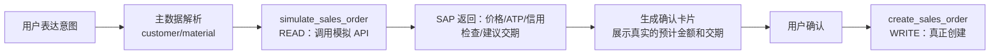
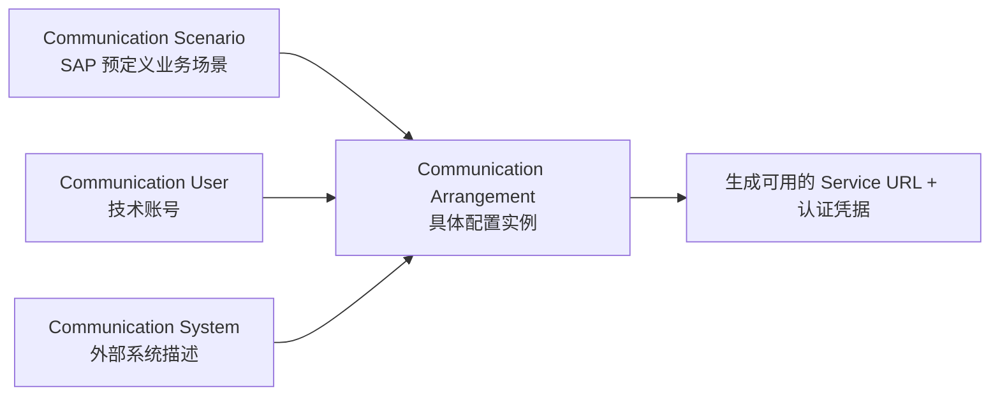

# Part 5：SAP API 与集成详解

## 5.1 各类协议是什么（先建立全景）

| 协议/技术 | 全称 | 一句话 | 现状 |
|---|---|---|---|
| OData | Open Data Protocol | 基于 HTTP/REST 的标准化数据协议，SAP 现代 API 的主力 | ✅ 主推，V2 广泛用于 S/4 On-Premise，V4 是新标准 |
| REST | Representational State Transfer | 通用 Web API 风格，SAP 的一些新服务（如部分 BTP 服务、Business Accelerator Hub 上的新 API）直接以 REST/JSON 形式提供 | ✅ 逐渐增多，尤其云原生服务 |
| SOAP | Simple Object Access Protocol | 基于 XML 的老牌 Web Service 协议 | ⚠️ 存量系统仍有，新项目基本不选型 |
| RFC | Remote Function Call | SAP 专有的远程过程调用协议，直接调用 ABAP Function Module | ⚠️ 存量集成大量使用，新项目一般封装后再用 |
| BAPI | Business API | 基于 RFC 的、有业务语义规范的标准化函数（如 `BAPI_SALESORDER_CREATEFROMDAT2`） | ⚠️ ECC 时代主力，S/4HANA 仍支持但官方推荐迁移到 OData |
| IDoc | Intermediate Document | SAP 的异步消息/文档交换格式，常用于系统间批量/异步集成（EDI、跨系统同步） | ✅ 异步/批量场景仍在用，不适合"实时对话式创建订单"这种同步交互场景 |

## 5.2 现代 S/4HANA 项目优先选什么

**优先级：OData（V2，若目标系统支持 V4 则优先 V4）> REST（云原生服务）> RFC/BAPI（历史系统或无 OData 覆盖的场景）> SOAP（尽量避免）> IDoc（仅用于异步批量场景，不用于同步对话式交互）**

原因：
- OData 是 SAP 官方为 Fiori/云时代设计的标准协议，有完整的 metadata 自描述能力（`$metadata`），配套的 SAP API Business Accelerator Hub 文档也最全。
- 对话式 AI 场景需要"同步请求-响应"，IDoc 的异步特性不适合（用户在等 AI 立刻回复"订单号是多少"）。
- RFC/BAPI 仍大量存在于存量系统（尤其 ECC），但新项目如果目标系统是 S/4HANA 且有对应 OData 服务，应优先用 OData。

## 5.3 Sales Order OData API 详解

### 5.3.1 `API_SALES_ORDER_SRV`

这是 S/4HANA 标准的 Sales Order OData V2 服务（⚠️ 具体可用性、版本号、是否有 V4 版本，需按你的系统发布版本在 SAP API Business Accelerator Hub 核实——S/4HANA Cloud 和不同 On-Premise Feature Pack 之间可能存在差异）。

核心 Entity：

| Entity Set | 说明 |
|---|---|
| `A_SalesOrder` | 订单 Header |
| `A_SalesOrderItem`（通过 `to_Item` navigation） | 订单行项目 |
| `A_SalesOrderScheduleLine` | 计划行（交付日期/数量拆分） |
| `A_SalesOrderPricingElement` | 定价明细 |
| `A_SalesOrderPartner` | 伙伴角色（Sold-to/Ship-to/Bill-to/Payer） |

### 5.3.2 OData 基础概念

| 概念 | 说明 |
|---|---|
| Entity | 一条数据记录的类型定义，类似"表" |
| Entity Set | Entity 的集合，对应 URL 里的资源路径，如 `A_SalesOrder` |
| Metadata | `$metadata` 端点返回的 XML/EDMX，描述所有 Entity、字段、数据类型、Navigation、Nullable、MaxLength 等**数据模型结构**——这是判断"这个字段到底叫什么、结构上是否必填"的权威来源，不要凭记忆或教程猜。但要注意：EDMX 里的 `Nullable="false"` 只反映结构层面的必填，很多 SAP 业务上的"条件必填"规则（如某个订单类型下字段 X 才必填、某销售范围下字段 Y 由 Customizing 决定）并不会完整体现在 `$metadata` 里，这类业务语义和条件规则还需要结合 SAP Business Accelerator Hub / Help Portal 的说明以及目标系统的实际 Customizing 一起核实 |
| GET | 查询 |
| POST | 创建 |
| PATCH（V2 常用 MERGE） | 部分更新 |
| DELETE | 删除 |
| `$filter` | 类似 SQL WHERE，如 `$filter=SoldToParty eq '0010001234'` |
| `$select` | 只返回指定字段，减少数据量 |
| `$expand` | 展开 navigation property，一次查询带出关联数据（如订单+行项目） |
| `$batch` | 把多个操作打包成一次 HTTP 请求，减少往返 |
| Deep Insert | 在一次 POST 里同时创建 Header 和通过 navigation property 关联的 Item（如 Part 2 示例） |

### 5.3.3 SAP OData 特有机制

```
https://<host>/sap/opu/odata/sap/API_SALES_ORDER_SRV/A_SalesOrder
```

- **Service**：`API_SALES_ORDER_SRV` 是一个"服务"，包含一组相关 Entity。
- **CSRF Token**：写操作前必须先 `GET` 一次（通常带 `X-CSRF-Token: Fetch` 请求头）拿到 token 和 Session Cookie，再在 POST/PATCH/DELETE 请求头带上 `X-CSRF-Token: <token>` 和对应 Cookie，否则会被拒绝（403）。这是 SAP OData 对写操作的标准 CSRF 防护。
- **Cookie / Session**：经典 OData 交互是有状态的（依赖 Session Cookie 关联 CSRF Token），在无状态的云原生 Backend 里要注意 Token 获取和复用的实现（每次请求都重新 Fetch Token 会有性能开销，但也不能跨用户共享）。
- **HTTP Status**：`201 Created` 表示创建成功，`400` 参数错误，`403` 权限/CSRF 问题，`500` 系统内部错误（需要看错误详情判断是否可重试）。
- **SAP Error Response**：典型结构（V2）：

```json
{
  "error": {
    "code": "SAP_SD/031",
    "message": { "lang": "zh", "value": "客户 0010009999 被冻结，无法创建订单" },
    "innererror": {
      "errordetails": [
        { "code": "SAP_SD/031", "message": "客户被冻结", "severity": "error" }
      ]
    }
  }
}
```

后端要做的是**解析 `innererror.errordetails`，把 SAP 消息码映射成结构化的业务错误类型**（如 `CUSTOMER_BLOCKED`），而不是把原始 SAP 消息直接甩给用户（消息文案可能是德语/内部术语，不友好）。

### 5.3.4 用于"预览而不落库"的 Sales Order Simulation API

Part 1.6 和 Part 2 第四步反复强调：Pricing、ATP、Credit Check 必须由 SAP 权威计算，后端不能重新实现。但这不代表用户确认前只能"盲猜"这些结果——SAP 提供了专门用于**模拟（Simulate）** Sales Order 的服务（⚠️ 具体技术名和字段以你系统当前版本的 API Business Accelerator Hub 页面为准，例如围绕 `API_SALES_ORDER_SIMULATION_SRV` 一类的模拟服务），它接受和创建订单几乎一样的输入，但**不会真正保存凭证**，返回的是模拟计算出的定价、ATP 可用性、信用检查结果等信息。

这让 Part 2 第四步的"业务校验"可以更具体地落地为一个独立的 READ 工具：



- `simulate_sales_order` 在 Agent 层被归为 READ 工具，可以放心地让 Agent 在生成确认卡片前调用，不需要走 WRITE 的审批/幂等机制。**但要注意：这里的 READ/WRITE 是 Tool 风险分类（有没有副作用），不等同于底层 HTTP 方法**——模拟类 API 在协议层通常仍然是 `POST`（因为要提交完整的订单结构才能算出价格/ATP/信用结果），只是它不会持久化任何业务数据，所以在 Agent 层依然按"无副作用"归为 READ。新人第一次看到"POST 却叫 READ"容易疑惑，记住这个区分标准即可。
- 具体触发哪些模拟计算，通常通过请求里挂载的 navigation property（如围绕定价、计划行、信用检查的关联结构，⚠️ 具体名称以你系统的 `$metadata` 为准）来控制——不挂载对应的关联，SAP 可能不会返回那部分模拟结果，这也是"字段级细节必须查 metadata"这条原则的又一个体现。
- 确认卡片里的"预计金额""预计交期"不再是后端猜测或占位符，而是 SAP 模拟计算的真实结果——这比只说"最终以 SAP 定价为准"更贴近生产项目的实际做法。
- `create_sales_order` 真正提交时，仍然可能因为并发导致的库存/信用变化而与模拟结果略有出入，这属于正常的最终一致性问题，UI 文案上仍应保留"最终以创建结果为准"的提示。

## 5.4 SAP API Business Accelerator Hub

- **是什么**：SAP 官方 API 目录网站（`api.sap.com`），列出所有标准 API（OData/REST/SOAP/事件），提供 metadata、文档、Try-out 功能、示例 payload。
- **怎么用**：
  1. 搜索业务对象（如 "Sales Order"）找到对应服务 `API_SALES_ORDER_SRV`。
  2. 查看 API 文档页的字段说明、必填/可选标注。
  3. 下载或查看 `$metadata` EDMX，了解完整数据模型和关系。
  4. 用页面自带的 "Try Out"（通常连接到 SAP 提供的沙箱系统）实际发一次请求，观察真实响应结构。
  5. 查看是否标注 Deprecated，以及是否有更新版本（如从 V2 迁移到 V4）。
- **重要性**：这是本教程反复强调"⚠️ 需按版本核实"的具体核实渠道——任何字段级细节，最终都应该回到这里和你系统的 `$metadata` 去确认，而不是相信任何二手教程（包括本教程）的具体字段名。

## 5.5 S/4HANA Cloud 与 On-Premise 的 API 使用差异

| 维度 | On-Premise / Private Cloud | Public Cloud |
|---|---|---|
| API 暴露方式 | 可直接开放 OData 服务（需网关配置 SICF），也可经 API Management | 必须通过 **Communication Arrangement** 显式开通，不能直接访问底层服务 |
| 可用 API 范围 | 相对开放，可以用自定义扩展的 OData 服务 | 仅限于 SAP 发布的"Released API"白名单（保证云端升级兼容性），自定义扩展需走 SAP 的扩展性框架（如 Key User Extensibility / Developer Extensibility） |
| 身份认证 | 内网 Basic Auth（不推荐）、OAuth2、SAML | 必须通过 Communication Arrangement 暴露 API，但**认证方式不是只有 OAuth2**——具体支持哪种由所选的 **Communication Scenario** 决定，常见的有 Communication User + Basic Auth、Communication User + X.509 证书、OAuth 2.0（含 mTLS 变体）、部分场景支持 Principal Propagation，⚠️需按具体 Communication Scenario 的官方说明核实；生产环境建议优先选证书或 OAuth 2.0 这类更强的认证方式，避免用 Basic Auth |
| 网络访问 | 通常经内网或 VPN/Cloud Connector | 通过公网 + Destination（可配合 Principal Propagation） |

## 5.6 Communication Arrangement（S/4HANA Cloud 场景）

当目标是 **S/4HANA Cloud（Public 或部分 Private Cloud 场景）** 时，第三方系统要调用其 API，必须先在 SAP 侧配置：

1. **Communication User**：SAP 侧创建的技术用户，专门用于系统间通信（不是真人用户）。
2. **Communication System**：描述"谁在跟我通信"（外部系统的标识、主机名等）。
3. **Communication Scenario**：SAP 预定义的"业务场景包"，规定这个场景下开放哪些 API/服务（如 "Sales Order Integration" 场景）。
4. **Communication Arrangement**：把 Communication System 和 Communication Scenario 绑定起来的具体配置实例，生成实际可用的服务 URL 和认证方式。

流程示意：



## 5.7 SAP BTP Destination

- **解决什么问题**：把"目标系统的 URL、认证方式、凭据"从代码里**彻底解耦**，统一由 BTP 的 Destination Service 管理。
- **为什么不能硬编码 URL/用户名/密码/Token**：
  1. **安全**：硬编码的凭据一旦进代码仓库，几乎无法彻底清除（Git 历史），也难以做权限隔离和轮转。
  2. **环境差异**：开发/测试/生产环境的 SAP 系统地址和凭据不同，硬编码会导致代码里到处是环境判断逻辑。
  3. **凭据轮转**：企业安全策略要求定期轮转密码/证书，硬编码意味着每次轮转都要改代码重新部署；用 Destination，只需要在 BTP Cockpit 里更新配置，应用无需重新部署。
  4. **统一代理与网络策略**：Destination 可以配合 **Cloud Connector**（On-Premise 场景）或直接连接（Cloud 场景），代码不需要关心底层网络细节（是走 VPN 隧道还是公网）。
  5. **Principal Propagation 支持**：Destination 可以配置为"透传当前登录用户身份"，这是实现"以终端用户身份执行 SAP 操作"的关键机制（详见 Part 9）。

代码里应该只出现"Destination 名称"，例如：

```typescript
const destination = await getDestination("S4HANA_SALES_ORDER_API");
const client = createODataClient(destination);
```

而不是：

```typescript
// ❌ 反面示例，不要这样做
const client = createODataClient({
  url: "https://my-s4-system.com/sap/opu/odata/...",
  username: "RFC_USER",
  password: "hardcoded_password_123"
});
```

## 5.8 项目中你需要记住什么

- 新项目优先 OData（尽量 V4，退而 V2），RFC/BAPI 是历史系统或缺口场景的补充，IDoc 只适合异步批量。
- 任何字段级细节，最终都要回到 SAP API Business Accelerator Hub 和你系统的 `$metadata` 核实，不要凭记忆写死。
- OData 写操作要处理 CSRF Token 获取流程，这是常见的新手坑。
- S/4HANA Cloud 场景必须通过 Communication Arrangement 开通 API，不能像 On-Premise 那样直接访问底层服务。
- 永远不要在代码里硬编码 SAP 连接信息，一律走 BTP Destination（配合 Connectivity Service）。
- 如果标准 API 覆盖不了需求，正确的下一步是评估"能不能通过 RAP 开发一个新的 Released 服务"，而不是想办法绕过去直接读表，详见 Part 21。
- 不同环境（DEV/QAS/PRD）的 `$metadata` 可能存在差异，部署前应该做自动化的契约检测，详见 Part 25.12。
