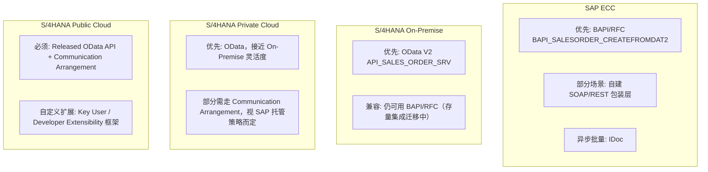
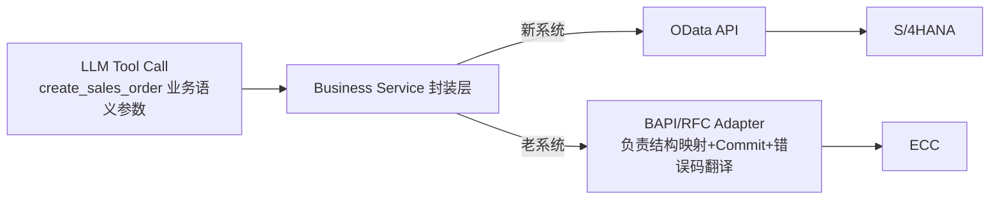

# Part 6：ECC 与 S/4HANA 的差异（集成视角）（ECC と S/4HANA の違い（インテグレーション視点））

**这是最容易被混为一谈、但对项目选型影响极大的一块，务必分清楚。**

**これは最も混同されやすいが、プロジェクトの技術選定に大きな影響を与える部分であり、必ず明確に区別する必要があります。**

## 6.1 四种系统形态（6.1 4 つのシステム形態）

| 形态 | 说明 | 部署方 | 版本升级节奏 |
|---|---|---|---|
| SAP ECC (ERP Central Component) | SAP 上一代 ERP（ECC 6.0 及其增强包），多数企业仍在运行 SAP の前世代 ERP（ECC 6.0 とその機能拡張パッケージ）であり、多くの企業がいまだ稼働させている | 客户自建机房或 IaaS 托管 顧客の自社データセンターまたは IaaS ホスティング | 客户自主，很多企业停留在多年前的增强包版本 顧客の裁量に委ねられており、多くの企業が数年前の機能拡張パッケージのバージョンにとどまっている |
| S/4HANA On-Premise | 新一代 ERP，客户自己部署维护，运行在 HANA 数据库上 新世代 ERP であり、顧客自身が導入・保守を行い、HANA データベース上で稼働する | 客户自建机房或 IaaS 顧客の自社データセンターまたは IaaS | 客户自主排期升级 顧客が自らアップグレード計画を立てる |
| S/4HANA Private Cloud (RISE with SAP, Private Cloud Edition) | SAP 或合作伙伴代管的 On-Premise 同构系统，允许一定程度自定义 SAP またはパートナーが代理運用する On-Premise 同構成のシステムであり、一定程度のカスタマイズが許容される | SAP 托管基础设施，客户仍有较大配置自由度 SAP がインフラをホスティングするが、顧客には依然として大きな設定の自由度がある | 相对可控，SAP 参与但客户仍主导部分节奏 比較的コントロール可能で、SAP が関与するが顧客が一部のペースを主導する |
| S/4HANA Public Cloud (Cloud Edition) | SAP 完全托管的多租户 SaaS 版本，标准化程度最高 SAP が完全にホスティングするマルチテナント SaaS 版であり、標準化の度合いが最も高い | 完全 SAP 托管 完全に SAP がホスティング | SAP 统一节奏（通常每年多次版本升级），客户几乎不能自定义底层 SAP が統一したペースで進める（通常年に複数回のバージョンアップ）。顧客はほぼ基盤部分をカスタマイズできない |

⚠️ 命名和边界随 SAP 商业策略调整（如 "RISE with SAP" 的具体范围），请以项目立项时 SAP 官方最新说明为准。

⚠️ 名称と境界は SAP のビジネス戦略によって調整されます（例えば「RISE with SAP」の具体的な範囲など）。プロジェクト立ち上げ時点の SAP 公式の最新情報を基準にしてください。

## 6.2 各形态下"AI 创建销售订单"可能怎么集成（6.2 各形態における「AI による販売オーダー作成」の連携方式）

| 形态 | 首选集成方式 | 备选 | 说明 |
|---|---|---|---|
| ECC | BAPI/RFC（如 `BAPI_SALESORDER_CREATEFROMDAT2`） | 自建包装 REST 层、IDoc（异步） 自前で構築した REST ラッパー層、IDoc（非同期） | ECC 时代 OData 覆盖有限，很多企业会自己在 BAPI 外面包一层 REST/OData Gateway ECC 時代は OData のカバー範囲が限定的で、多くの企業が BAPI の外側に独自の REST/OData Gateway を構築している |
| S/4HANA On-Premise | OData V2/V4 标准 API OData V2/V4 標準 API | 存量 BAPI/RFC（历史集成未迁移完） 既存の BAPI/RFC（過去のインテグレーションが移行しきれていない） | 官方推荐迁移到 OData，但存量系统常见"新老并存" 公式には OData への移行が推奨されるが、既存システムでは「新旧併存」がよく見られる |
| S/4HANA Private Cloud | OData 标准 API OData 標準 API | 视 SAP 托管协议，扩展性可能受限 SAP のホスティング契約次第で、拡張性が制限される場合がある | 接近 On-Premise，但部分底层访问权限由 SAP 托管方控制 On-Premise に近いが、一部の基盤アクセス権限は SAP のホスティング側が管理する |
| S/4HANA Public Cloud | Released OData API + Communication Arrangement（强制） Released OData API + Communication Arrangement（必須） | 无法直接用 BAPI/RFC，只能用官方 Release 的 API 或扩展性框架 BAPI/RFC は直接利用できず、公式に Release された API または拡張性フレームワークしか使えない | 标准化程度最高，"能用什么 API"完全取决于 SAP 是否 Release 了对应服务 標準化の度合いが最も高く、「どの API が使えるか」は SAP が対応するサービスを Release しているかどうかに完全に依存する |

## 6.3 各协议适用场景总结（6.3 各プロトコルの適用シナリオまとめ）

| 协议 | ECC | S/4 On-Prem | S/4 Private Cloud | S/4 Public Cloud |
|---|---|---|---|---|
| OData | 部分支持（后期增强包） 一部サポート（後期の機能拡張パッケージ） | ✅ 主力 | ✅ 主力 | ✅ 唯一/主力方式（仅限 Released API） ✅ 唯一/主力方式（Released API のみ） |
| REST（原生） REST（ネイティブ） | 少见 稀 | 逐渐增多（云原生附加服务） 徐々に増加（クラウドネイティブな付加サービス） | 同左 同左 | 逐渐增多 徐々に増加 |
| RFC | ✅ 广泛使用 ✅ 広く使用 | ✅ 仍支持（存量场景） ✅ 依然サポート（既存シナリオ） | ⚠️ 受限，需 SAP 托管方允许 ⚠️ 制限あり、SAP ホスティング側の許可が必要 | ❌ 基本不可用 ❌ 基本的に利用不可 |
| BAPI | ✅ 事实标准 ✅ 事実上の標準 | ✅ 仍支持但非推荐首选 ✅ 依然サポートだが推奨ではない | ⚠️ 受限 ⚠️ 制限あり | ❌ 不可用 ❌ 利用不可 |
| IDoc | ✅ 广泛用于异步/批量 ✅ 非同期/バッチ処理に広く使用 | ✅ 仍支持 ✅ 依然サポート | ⚠️ 受限 ⚠️ 制限あり | ⚠️ 需通过特定集成方式（如 SAP Integration Suite 桥接） ⚠️ 特定の連携方式（SAP Integration Suite によるブリッジなど）が必要 |
| SOAP | ⚠️ 部分存量 Web Service ⚠️ 一部既存の Web サービス | ⚠️ 逐渐淘汰 ⚠️ 段階的に廃止 | ⚠️ 逐渐淘汰 ⚠️ 段階的に廃止 | ❌ 新项目不建议 ❌ 新規プロジェクトでは非推奨 |

## 6.4 `BAPI_SALESORDER_CREATEFROMDAT2` 详解（6.4 `BAPI_SALESORDER_CREATEFROMDAT2` の詳細）

- **是什么**：ECC 时代创建销售订单的事实标准 BAPI，函数名意为"从数据结构 2 版本创建销售订单"（历史上有 `CREATEFROMDAT1`，`DAT2` 是增强版）。 **これは何か**：ECC 時代における販売オーダー作成の事実上の標準 BAPI であり、関数名は「データ構造バージョン 2 から販売オーダーを作成する」という意味です（歴史的には `CREATEFROMDAT1` があり、`DAT2` はその拡張版です）。
- **调用方式**：通过 RFC 协议调用，输入是一组结构化的 ABAP 结构/表（Header 数据结构、Item 内表、Partner 内表、Schedule Line 内表等），需要额外调用 `BAPI_TRANSACTION_COMMIT` 提交事务（BAPI 默认不会自动提交，这是经典的新手坑——调用了 BAPI 但没 Commit，数据实际没有写入）。 **呼び出し方法**：RFC プロトコル経由で呼び出し、入力は構造化された一連の ABAP 構造/テーブル（Header データ構造、Item 内部テーブル、Partner 内部テーブル、Schedule Line 内部テーブルなど）です。トランザクションをコミットするには別途 `BAPI_TRANSACTION_COMMIT` を呼び出す必要があります（BAPI はデフォルトで自動コミットされません。これは典型的な初心者の落とし穴で、BAPI を呼び出したのに Commit しておらず、実際にはデータが書き込まれていないというケースです）。
- **为什么老项目仍然大量使用 BAPI/RFC**： **なぜ古いプロジェクトは今も BAPI/RFC を大量に使用しているのか**：
  1. **历史包袱**：这些集成往往是十几年前建立的，稳定运行、没有业务驱动力去重写。 **歴史的な負債**：これらのインテグレーションはしばしば十数年前に構築されたもので、安定稼働しており、書き直す業務上の動機がありません。
  2. **ECC 系统本身 OData 覆盖范围不全**，很多老版本增强包根本没有对应的标准 OData 服务。 **ECC システム自体の OData カバー範囲が不完全**であり、多くの古いバージョンの機能拡張パッケージにはそもそも対応する標準 OData サービスが存在しません。
  3. **迁移成本高**：涉及大量下游系统改造和回归测试，企业往往等到 S/4HANA 转型项目时才一并迁移。 **移行コストが高い**：多数の下流システムの改修と回帰テストが伴うため、企業はしばしば S/4HANA への転換プロジェクトを待って一括で移行します。
  4. **性能与批量场景**：某些高吞吐批量场景，RFC 直连内核的效率历史上被认为优于 HTTP/OData（这一差距在现代 S/4HANA 上已大幅缩小）。 **パフォーマンスとバッチシナリオ**：一部の高スループットなバッチシナリオでは、RFC がカーネルに直接接続する効率が歴史的に HTTP/OData より優れているとされてきました（この差は現代の S/4HANA では大幅に縮小しています）。

## 6.5 什么时候应该封装 legacy SAP，而不是让 AI Agent 直接知道 BAPI 细节（6.5 レガシー SAP をカプセル化すべきタイミング——AI エージェントに BAPI の詳細を直接知らせてはいけない理由）

**结论：永远不要让 LLM 或 Tool 定义直接暴露 BAPI 的 ABAP 结构字段（如 `ORDER_HEADER_IN`, `ORDER_ITEMS_IN`, `RETURN` 表结构）。**

**結論：LLM や Tool 定義に BAPI の ABAP 構造フィールド（`ORDER_HEADER_IN`、`ORDER_ITEMS_IN`、`RETURN` テーブル構造など）を直接露出させてはなりません。**

正确做法：

正しいやり方：

- 这样即使企业未来把 ECC 迁移到 S/4HANA（换了底层协议从 BAPI 换成 OData），**Tool 的接口定义（`create_sales_order(customer, material, qty, date)`）完全不用变**，只需要替换 Business Service 内部的 Adapter 实现——这正是"Tool Abstraction Layer"的核心价值，也是为什么系统集成层的复杂性（BAPI 的 Commit 语义、内表结构、RETURN 表里各种消息类型判断成功/失败）必须被封装掉，不能泄漏给上层的 LLM 和 Tool 定义。 こうすることで、将来企業が ECC を S/4HANA へ移行し（基盤プロトコルが BAPI から OData に変わっても）、**Tool のインターフェース定義（`create_sales_order(customer, material, qty, date)`）はまったく変更する必要がなく**、Business Service 内部の Adapter 実装を差し替えるだけで済みます——これこそが「Tool Abstraction Layer」の中核的な価値であり、システム連携層の複雑さ（BAPI の Commit セマンティクス、内部テーブル構造、RETURN テーブル内の様々なメッセージタイプによる成功/失敗判定）をカプセル化しなければならず、上位の LLM や Tool 定義に漏らしてはならない理由です。
- BAPI 的 `RETURN` 表判断成功与否有专门的规则（`TYPE` 字段是 'E'/'A' 表示错误，需要检查是否有 Error/Abort 类型消息，且没有一定意味着成功——),这类"老系统特有的成功判断逻辑"完全应该被 Adapter 内部处理并转换成统一的 `{success, documentNumber, errors[]}` 结构返回给上层。 BAPI の `RETURN` テーブルには成功か否かを判定する専用のルールがあります（`TYPE` フィールドが 'E'/'A' であればエラーを意味し、Error/Abort タイプのメッセージがあるかを確認する必要があり、なければ必ずしも成功を意味するとは限りません）。こうした「レガシーシステム特有の成功判定ロジック」は、すべて Adapter 内部で処理し、統一された `{success, documentNumber, errors[]}` 構造に変換して上層に返すべきです。

## 6.6 项目中你需要记住什么（6.6 プロジェクトで覚えておくべきこと）

- ECC ≠ S/4HANA On-Premise ≠ Private Cloud ≠ Public Cloud，四者的可用集成方式差异很大，项目立项第一件事就是确认目标系统属于哪一种。 ECC ≠ S/4HANA On-Premise ≠ Private Cloud ≠ Public Cloud であり、この 4 つで利用可能な連携方式は大きく異なります。プロジェクト立ち上げ時に最初にすべきことは、対象システムがどれに属するかを確認することです。
- Public Cloud 场景下你只能用 SAP Release 的标准 API，不能像 On-Premise/ECC 那样"什么都能碰"。 Public Cloud のシナリオでは SAP が Release した標準 API しか使えず、On-Premise/ECC のように「何でも触れる」わけではありません。
- BAPI 调用要记得 Commit，且成功/失败判断要看 RETURN 表的消息类型，这套逻辑必须封装在 Adapter 层。 BAPI 呼び出しでは Commit を忘れず、成功/失敗の判定は RETURN テーブルのメッセージタイプを見る必要があります。このロジックは Adapter 層にカプセル化しなければなりません。
- Tool 定义永远只暴露业务语义参数，底层用 OData 还是 BAPI 是 Adapter 层的实现细节，对 LLM 和上层不可见。 Tool 定義は常に業務上の意味を持つパラメータのみを露出し、基盤で OData を使うか BAPI を使うかは Adapter 層の実装詳細であり、LLM や上位層からは見えません。
