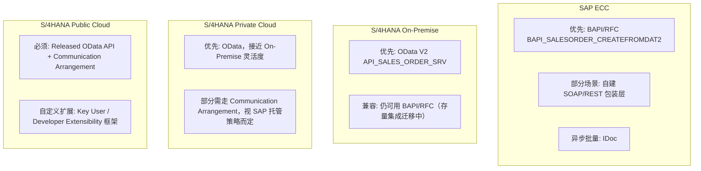
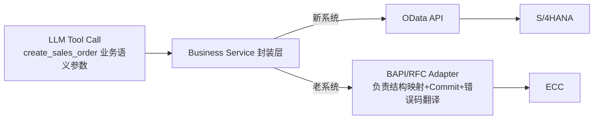

# Part 6：ECC 与 S/4HANA 的差异（集成视角）

**这是最容易被混为一谈、但对项目选型影响极大的一块，务必分清楚。**

## 6.1 四种系统形态

| 形态 | 说明 | 部署方 | 版本升级节奏 |
|---|---|---|---|
| SAP ECC (ERP Central Component) | SAP 上一代 ERP（ECC 6.0 及其增强包），多数企业仍在运行 | 客户自建机房或 IaaS 托管 | 客户自主，很多企业停留在多年前的增强包版本 |
| S/4HANA On-Premise | 新一代 ERP，客户自己部署维护，运行在 HANA 数据库上 | 客户自建机房或 IaaS | 客户自主排期升级 |
| S/4HANA Private Cloud (RISE with SAP, Private Cloud Edition) | SAP 或合作伙伴代管的 On-Premise 同构系统，允许一定程度自定义 | SAP 托管基础设施，客户仍有较大配置自由度 | 相对可控，SAP 参与但客户仍主导部分节奏 |
| S/4HANA Public Cloud (Cloud Edition) | SAP 完全托管的多租户 SaaS 版本，标准化程度最高 | 完全 SAP 托管 | SAP 统一节奏（通常每年多次版本升级），客户几乎不能自定义底层 |

⚠️ 命名和边界随 SAP 商业策略调整（如 "RISE with SAP" 的具体范围），请以项目立项时 SAP 官方最新说明为准。

## 6.2 各形态下"AI 创建销售订单"可能怎么集成

| 形态 | 首选集成方式 | 备选 | 说明 |
|---|---|---|---|
| ECC | BAPI/RFC（如 `BAPI_SALESORDER_CREATEFROMDAT2`） | 自建包装 REST 层、IDoc（异步） | ECC 时代 OData 覆盖有限，很多企业会自己在 BAPI 外面包一层 REST/OData Gateway |
| S/4HANA On-Premise | OData V2/V4 标准 API | 存量 BAPI/RFC（历史集成未迁移完） | 官方推荐迁移到 OData，但存量系统常见"新老并存" |
| S/4HANA Private Cloud | OData 标准 API | 视 SAP 托管协议，扩展性可能受限 | 接近 On-Premise，但部分底层访问权限由 SAP 托管方控制 |
| S/4HANA Public Cloud | Released OData API + Communication Arrangement（强制） | 无法直接用 BAPI/RFC，只能用官方 Release 的 API 或扩展性框架 | 标准化程度最高，"能用什么 API"完全取决于 SAP 是否 Release 了对应服务 |

## 6.3 各协议适用场景总结

| 协议 | ECC | S/4 On-Prem | S/4 Private Cloud | S/4 Public Cloud |
|---|---|---|---|---|
| OData | 部分支持（后期增强包） | ✅ 主力 | ✅ 主力 | ✅ 唯一/主力方式（仅限 Released API） |
| REST（原生） | 少见 | 逐渐增多（云原生附加服务） | 同左 | 逐渐增多 |
| RFC | ✅ 广泛使用 | ✅ 仍支持（存量场景） | ⚠️ 受限，需 SAP 托管方允许 | ❌ 基本不可用 |
| BAPI | ✅ 事实标准 | ✅ 仍支持但非推荐首选 | ⚠️ 受限 | ❌ 不可用 |
| IDoc | ✅ 广泛用于异步/批量 | ✅ 仍支持 | ⚠️ 受限 | ⚠️ 需通过特定集成方式（如 SAP Integration Suite 桥接） |
| SOAP | ⚠️ 部分存量 Web Service | ⚠️ 逐渐淘汰 | ⚠️ 逐渐淘汰 | ❌ 新项目不建议 |

## 6.4 `BAPI_SALESORDER_CREATEFROMDAT2` 详解

- **是什么**：ECC 时代创建销售订单的事实标准 BAPI，函数名意为"从数据结构 2 版本创建销售订单"（历史上有 `CREATEFROMDAT1`，`DAT2` 是增强版）。
- **调用方式**：通过 RFC 协议调用，输入是一组结构化的 ABAP 结构/表（Header 数据结构、Item 内表、Partner 内表、Schedule Line 内表等），需要额外调用 `BAPI_TRANSACTION_COMMIT` 提交事务（BAPI 默认不会自动提交，这是经典的新手坑——调用了 BAPI 但没 Commit，数据实际没有写入）。
- **为什么老项目仍然大量使用 BAPI/RFC**：
  1. **历史包袱**：这些集成往往是十几年前建立的，稳定运行、没有业务驱动力去重写。
  2. **ECC 系统本身 OData �covered 不全**，很多老版本增强包根本没有对应的标准 OData 服务。
  3. **迁移成本高**：涉及大量下游系统改造和回归测试，企业往往等到 S/4HANA 转型项目时才一并迁移。
  4. **性能与批量场景**：某些高吞吐批量场景，RFC 直连内核的效率历史上被认为优于 HTTP/OData（这一差距在现代 S/4HANA 上已大幅缩小）。

## 6.5 什么时候应该封装 legacy SAP，而不是让 AI Agent 直接知道 BAPI 细节

**结论：永远不要让 LLM 或 Tool 定义直接暴露 BAPI 的 ABAP 结构字段（如 `ORDER_HEADER_IN`, `ORDER_ITEMS_IN`, `RETURN` 表结构）。**

正确做法：

- 这样即使企业未来把 ECC 迁移到 S/4HANA（换了底层协议从 BAPI 换成 OData），**Tool 的接口定义（`create_sales_order(customer, material, qty, date)`）完全不用变**，只需要替换 Business Service 内部的 Adapter 实现——这正是"Tool Abstraction Layer"的核心价值，也是为什么系统集成层的复杂性（BAPI 的 Commit 语义、内表结构、RETURN 表里各种消息类型判断成功/失败）必须被封装掉，不能泄漏给上层的 LLM 和 Tool 定义。
- BAPI 的 `RETURN` 表判断成功与否有专门的规则（`TYPE` 字段是 'E'/'A' 表示错误，需要检查是否有 Error/Abort 类型消息，且没有一定意味着成功——),这类"老系统特有的成功判断逻辑"完全应该被 Adapter 内部处理并转换成统一的 `{success, documentNumber, errors[]}` 结构返回给上层。

## 6.6 项目中你需要记住什么

- ECC ≠ S/4HANA On-Premise ≠ Private Cloud ≠ Public Cloud，四者的可用集成方式差异很大，项目立项第一件事就是确认目标系统属于哪一种。
- Public Cloud 场景下你只能用 SAP Release 的标准 API，不能像 On-Premise/ECC 那样"什么都能碰"。
- BAPI 调用要记得 Commit，且成功/失败判断要看 RETURN 表的消息类型，这套逻辑必须封装在 Adapter 层。
- Tool 定义永远只暴露业务语义参数，底层用 OData 还是 BAPI 是 Adapter 层的实现细节，对 LLM 和上层不可见。
