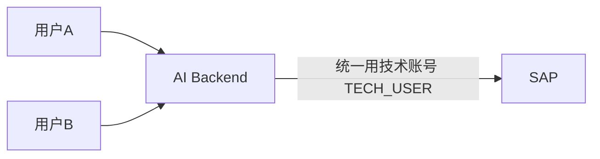
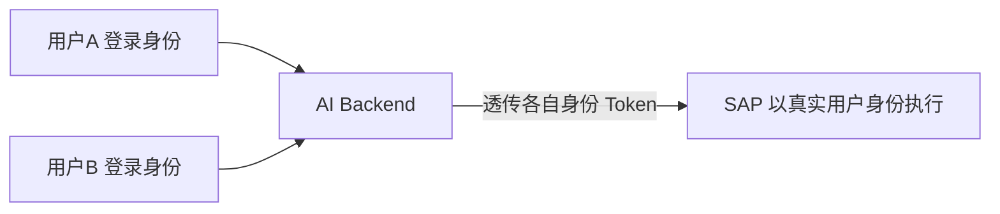

# Part 9：READ/WRITE 工具分类与身份认证

## 9.1 工具分类

| 类型 | 工具 | 说明 |
|---|---|---|
| READ | `search_customer` | 模糊搜索客户 |
| READ | `get_customer` | 按编号取客户详情 |
| READ | `search_material` | 模糊搜索物料 |
| READ | `get_material` | 按编号取物料详情 |
| READ | `check_inventory` | 查询库存/ATP 预览 |
| READ | `get_price` | 定价模拟/预览 |
| READ | `get_sales_order` | 查询订单详情 |
| READ | `list_sales_orders` | 列出订单 |
| WRITE | `create_sales_order` | 创建订单（本教程主案例） |
| WRITE | `change_sales_order` | 修改订单 |
| WRITE | `cancel_sales_order` | 取消订单（破坏性） |

## 9.2 为什么 READ 与 WRITE 必须不同权限策略

| 维度 | READ | WRITE |
|---|---|---|
| 副作用 | 无（不改变系统状态） | 有，且可能级联触发下游流程（库存预留、信用占用） |
| 出错代价 | 低（最多返回错误信息或空结果） | 高（可能产生脏数据、误导下游、需要人工介入纠正） |
| 幂等性要求 | 天然幂等 | 必须显式设计幂等机制 |
| 确认要求 | 通常不需要 | 通常需要用户确认，高风险操作需要审批 |
| 权限粒度 | 可以相对宽松（多数员工都能查） | 必须严格按业务角色和范围收紧 |
| 频率限制 | 可以较宽松 | 应该有严格 Rate Limit，防止误触发/滥用/攻击放大 |
| 审计要求 | 记录即可 | 必须完整记录请求、审批、执行、结果全链路 |

**一句话原则：READ 工具可以让 Agent 相对自由地探索（帮助它更好地理解上下文、减少追问），WRITE 工具必须假设"模型随时可能犯错"，用工程手段兜底。**

## 9.3 生产环境 WRITE Tool 的最低要求清单

1. **RBAC（基于角色的访问控制）**：调用者（最终用户或系统身份）必须有对应的 SAP 业务角色/权限对象授权，检查应同时发生在 Business Service 层（业务粒度，如"该用户是否有权为这个 Sales Org 创建订单"）和 SAP 层（Authorization Object，如 `V_VBAK_VKO`⚠️需按系统核实）。
2. **Confirmation（用户确认）**：写操作前必须展示完整参数摘要，等待用户显式确认，不能"默认执行"。
3. **Approval（审批流）**：超过一定金额/数量阈值，或涉及特定客户/物料的订单，自动路由到人工审批（不是用户自己点确认就够）。
4. **Audit Log（审计日志）**：完整记录 Who / When / What / Result（详见 Part 15）。
5. **Idempotency（幂等性）**：每次写请求携带幂等 key，后端保证同一个 key 不会产生两次真实写入（详见 Part 13）。
6. **Rate Limit（限流）**：对单用户/单会话的写操作频率做限制，防止误触发循环调用或恶意攻击放大破坏面。
7. **Validation（校验）**：多层校验（Schema 校验 → 业务前置校验 → SAP 权威校验），见 Part 1/2。
8. **Risk Control（风险控制）**：异常模式检测（比如同一用户短时间内创建大量订单、金额远超历史均值的订单），触发额外人工复核。

## 9.4 Authentication / Authorization 全景

| 技术 | 一句话 |
|---|---|
| Basic Authentication | 用户名+密码直接传输（Base64 编码，非加密），仅应在内部测试或极简场景使用，生产环境不推荐 |
| OAuth 2.0 | 业界标准授权框架，颁发有时效性的 Access Token，替代直接传密码 |
| Client Credentials（OAuth2 grant type） | 系统对系统（无终端用户参与）的认证方式，代表"应用本身"的身份，常用于技术账号场景 |
| JWT (JSON Web Token) | 一种自包含、可验证签名的 Token 格式，常用于承载身份和权限声明 |
| SAML | 基于 XML 的企业级单点登录标准，常见于传统企业身份联合场景 |
| Principal Propagation | 把"终端用户的身份"从前端一路透传到后端系统（包括 SAP），使得 SAP 侧看到的是"真实用户在操作"，而不是一个笼统的技术账号 |
| SAP Cloud Identity Services (IAS) | SAP 的云身份认证服务（Identity Authentication Service），BTP 生态的身份提供方 |
| XSUAA | SAP BTP（Cloud Foundry 环境）的授权与信任管理服务，负责发放和校验 OAuth Token、管理 Scope/Role |
| BTP Authorization | 泛指在 BTP 平台上通过 XSUAA/IAS 等服务实现的整体授权体系 |

## 9.5 核心问题："AI Backend 到 SAP，到底以谁的身份执行？"

这是企业项目里**必须在设计阶段明确决策**的问题，直接决定了权限模型、审计粒度和风险边界。

### 方案 A：所有用户共享一个技术账号（Technical User / Client Credentials）

- **优点**：实现简单，不需要处理终端用户在 SAP 侧的身份映射；适合"AI Backend 内部已经做了完整的、独立于 SAP 的权限体系"的场景。
- **缺点**：
  - SAP 侧的审计日志（谁创建了这个订单）只会显示 `TECH_USER`，看不出真实是哪个业务用户操作的——除非你在自定义字段/备注里额外记录，但这不是 SAP 原生的身份追溯机制。
  - 技术账号的权限往往被设置得比较宽（覆盖所有可能用到的场景），实际上违反了"最小权限"原则——即使某个具体用户本不该有权限创建某类订单，技术账号层面可能仍然放行，除非 Backend 自己又实现了一套完整的权限收窄逻辑（等于重新造了一遍 SAP 权限系统的轮子，且容易出现两边不一致）。
  - 一旦技术账号凭据泄露，攻击面等同于"所有用户权限的并集"。

### 方案 B：每个最终用户身份传递到 SAP（Principal Propagation）

- **优点**：
  - SAP 侧的所有校验（Authorization Object 检查、Sales Area 权限范围）**直接复用 SAP 已有的权限体系**，不需要在 Backend 重复实现一遍。
  - 审计日志天然精确到真实用户，符合合规要求（尤其涉及财务/订单类操作，审计追溯到具体责任人是常见的合规硬性要求）。
  - 遵循最小权限原则——某用户在 SAP 里本来就没有的权限，即使通过 AI 对话尝试，也会在 SAP 层被拒绝，不依赖 Backend 自己做完整覆盖的权限判断。
- **缺点**：
  - 实现复杂度更高，需要 SAP 侧支持（S/4HANA On-Premise 需要配置好 Principal Propagation 的信任链——通常涉及 SAML Bearer Assertion 或 X.509 证书；BTP 场景通过 Destination 配置 Principal Propagation 类型）。
  - 需要确保终端用户在 SAP 侧确实存在对应账号（很多企业的"外部用户"或"轻量用户"未必有 SAP 账号，这种情况无法用这个方案，只能退回方案 A 或混合方案）。

### 决策建议

- **涉及真实写操作、且终端用户在 SAP 里本身就有账号（内部员工场景）**：优先 Principal Propagation，让 SAP 的权限体系成为唯一真相来源，避免两套权限系统打架。
- **终端用户在 SAP 里没有账号（比如外部客户通过网页/小程序自助下单）**：只能用技术账号，但必须在 **Backend 自己实现完整且经过安全评审的权限模型**，并在审计日志里额外记录"实际发起人"字段，弥补 SAP 侧审计粒度不足的问题。
- **混合方案**：技术账号用于只读查询（性能更好、免去大量用户的 Principal Propagation 开销），写操作坚持 Principal Propagation——这是很多企业项目的实际折中选择。

## 9.6 项目中你需要记住什么

- READ 和 WRITE 工具必须在架构上明确区分，WRITE 工具默认按"高风险"设计。
- 生产 WRITE Tool 的八件套：RBAC、Confirmation、Approval、Audit Log、Idempotency、Rate Limit、Validation、Risk Control，缺一不可。
- "AI Backend 以谁的身份调用 SAP"是设计阶段必须拍板的决策，不是实现细节；优先考虑 Principal Propagation，只有终端用户在 SAP 无账号时才退回技术账号，且要自行补齐权限模型和审计精度。
