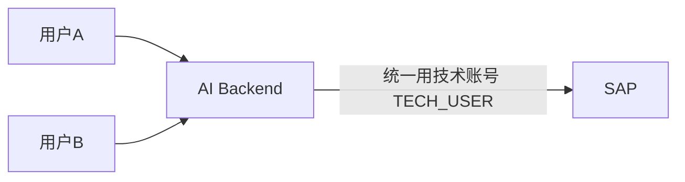
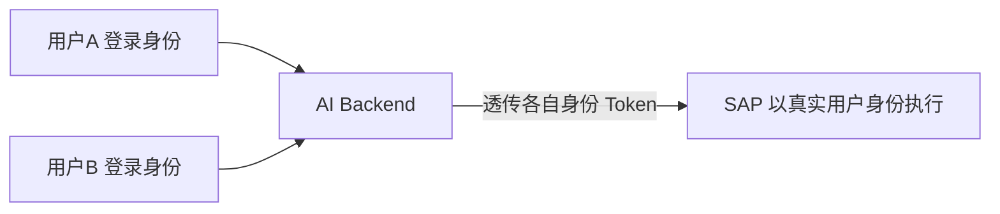

# Part 9：READ/WRITE 工具分类与身份认证（READ/WRITE ツールの分類と認証）

## 9.1 工具分类（9.1 ツール分類）

| 类型 | 工具 | 说明 |
|---|---|---|
| READ | `search_customer` | 模糊搜索客户 顧客の曖昧検索 |
| READ | `get_customer` | 按编号取客户详情 番号で顧客詳細を取得 |
| READ | `search_material` | 模糊搜索物料 物料の曖昧検索 |
| READ | `get_material` | 按编号取物料详情 番号で物料詳細を取得 |
| READ | `check_inventory` | 查询库存/ATP 预览 在庫/ATP のプレビューを照会 |
| READ | `get_price` | 定价模拟/预览 価格決定のシミュレーション/プレビュー |
| READ | `get_sales_order` | 查询订单详情 オーダー詳細を照会 |
| READ | `list_sales_orders` | 列出订单 オーダー一覧を取得 |
| WRITE | `create_sales_order` | 创建订单（本教程主案例） オーダーを作成（本チュートリアルのメインケース） |
| WRITE | `change_sales_order` | 修改订单 オーダーを変更 |
| WRITE | `cancel_sales_order` | 取消订单（破坏性） オーダーを取消（破壊的操作） |

## 9.2 为什么 READ 与 WRITE 必须不同权限策略（9.2 なぜ READ と WRITE で異なる権限ポリシーが必要なのか）

| 维度 | READ | WRITE |
|---|---|---|
| 副作用 副作用 | 无（不改变系统状态） なし（システム状態を変更しない） | 有，且可能级联触发下游流程（库存预留、信用占用） あり、さらに下流プロセスを連鎖的にトリガーする可能性がある（在庫引当、与信枠の占有） |
| 出错代价 誤りのコスト | 低（最多返回错误信息或空结果） 低い（せいぜいエラー情報や空の結果を返すだけ） | 高（可能产生脏数据、误导下游、需要人工介入纠正） 高い（不正なデータが発生し、下流を誤らせ、人手による訂正介入が必要になり得る） |
| 幂等性要求 冪等性の要求 | 天然幂等 本質的に冪等 | 必须显式设计幂等机制 冪等機構を明示的に設計する必要がある |
| 确认要求 確認の要求 | 通常不需要 通常は不要 | 通常需要用户确认，高风险操作需要审批 通常はユーザー確認が必要で、高リスク操作は承認が必要 |
| 权限粒度 権限の粒度 | 可以相对宽松（多数员工都能查） 比較的緩やかでよい（多くの社員が照会できる） | 必须严格按业务角色和范围收紧 業務ロールと範囲に基づき厳格に絞り込む必要がある |
| 频率限制 頻度制限 | 可以较宽松 比較的緩やかでよい | 应该有严格 Rate Limit，防止误触发/滥用/攻击放大 誤トリガー/濫用/攻撃の増幅を防ぐため厳格な Rate Limit が必要 |
| 审计要求 監査の要求 | 记录即可 記録すれば十分 | 必须完整记录请求、审批、执行、结果全链路 リクエスト、承認、実行、結果の全チェーンを完全に記録する必要がある |

**一句话原则：READ 工具可以让 Agent 相对自由地探索（帮助它更好地理解上下文、减少追问），WRITE 工具必须假设"模型随时可能犯错"，用工程手段兜底。**

**一言原則：READ ツールはエージェントに比較的自由な探索を許し（コンテキスト理解を助け、追加質問を減らす）、WRITE ツールは常に「モデルはいつでも誤りうる」という前提に立ち、エンジニアリング手段でセーフティネットを敷かなければなりません。**

## 9.3 生产环境 WRITE Tool 的最低要求清单（9.3 本番環境における WRITE Tool の最低要件チェックリスト）

1. **RBAC（基于角色的访问控制）**：调用者（最终用户或系统身份）必须有对应的 SAP 业务角色/权限对象授权，检查应同时发生在 Business Service 层（业务粒度，如"该用户是否有权为这个 Sales Org 创建订单"）和 SAP 层（Authorization Object，如 `V_VBAK_VKO`⚠️需按系统核实）。 **RBAC（ロールベースアクセス制御）**：呼び出し元（エンドユーザーまたはシステムの身元）は対応する SAP の業務ロール/権限オブジェクトの認可を持たなければならず、チェックは Business Service 層（業務粒度、例えば「このユーザーはこの Sales Org でオーダーを作成する権限があるか」）と SAP 層（Authorization Object、例えば `V_VBAK_VKO`⚠️システムに応じて要確認）の両方で行われるべきです。
2. **Confirmation（用户确认）**：写操作前必须展示完整参数摘要，等待用户显式确认，不能"默认执行"。**确认状态必须由后端记录并校验，不能只写在 Prompt 里要求模型"记得先确认"**——具体做法是把写操作拆成"准备确认"和"真正执行"两个 Tool，中间插入一个只有后端能写入的确认记录（含状态机、归属用户、过期时间），执行 Tool 只接受一个指向该记录的不透明 ID，具体实现见 Part 7.3 和 Part 11.6。 **Confirmation（ユーザー確認）**：書き込み操作の前に必ず完全なパラメータ要約を表示し、ユーザーの明示的な確認を待たなければならず、「デフォルトで実行」してはいけません。**確認状態は必ずバックエンドで記録・検証しなければならず、単に Prompt に「先に確認することを忘れずに」とモデルに指示するだけでは不十分です**——具体的な方法としては、書き込み操作を「確認準備」と「実際の実行」という 2 つの Tool に分割し、その間にバックエンドのみが書き込める確認レコード（状態マシン、所属ユーザー、有効期限を含む）を挿入します。実行 Tool はそのレコードを指す不透明な ID のみを受け付けます。具体的な実装は Part 7.3 と Part 11.6 を参照してください。
3. **Approval（审批流）**：超过一定金额/数量阈值，或涉及特定客户/物料的订单，自动路由到人工审批（不是用户自己点确认就够）。 **Approval（承認フロー）**：一定の金額/数量の閾値を超える、あるいは特定の顧客/物料に関わるオーダーは、自動的に人による承認へルーティングされます（ユーザー自身が確認ボタンを押すだけでは不十分です）。
4. **Audit Log（审计日志）**：完整记录 Who / When / What / Result（详见 Part 15）。 **Audit Log（監査ログ）**：Who / When / What / Result を完全に記録します（詳細は Part 15 参照）。
5. **Idempotency（幂等性）**：每次写请求携带幂等 key，后端保证同一个 key 不会产生两次真实写入（详见 Part 13）。 **Idempotency（冪等性）**：すべての書き込みリクエストに冪等キーを付与し、バックエンドは同一のキーが 2 回の実際の書き込みを発生させないことを保証します（詳細は Part 13 参照）。
6. **Rate Limit（限流）**：对单用户/单会话的写操作频率做限制，防止误触发循环调用或恶意攻击放大破坏面。 **Rate Limit（レート制限）**：単一ユーザー/単一セッションの書き込み操作頻度を制限し、誤ったループ呼び出しや悪意ある攻撃による被害拡大を防ぎます。
7. **Validation（校验）**：多层校验（Schema 校验 → 业务前置校验 → SAP 权威校验），见 Part 1/2。 **Validation（検証）**：多層の検証（Schema 検証 → 業務事前検証 → SAP による権威検証）を行います。Part 1/2 を参照してください。
8. **Risk Control（风险控制）**：异常模式检测（比如同一用户短时间内创建大量订单、金额远超历史均值的订单），触发额外人工复核。 **Risk Control（リスク制御）**：異常パターンの検出（例えば同一ユーザーが短時間に大量のオーダーを作成する、金額が過去の平均を大きく超えるオーダーなど）を行い、追加の人的レビューをトリガーします。

## 9.4 Authentication / Authorization 全景（9.4 Authentication / Authorization 全体像）

| 技术 | 一句话 |
|---|---|
| Basic Authentication | 用户名+密码直接传输（Base64 编码，非加密），仅应在内部测试或极简场景使用，生产环境不推荐 ユーザー名＋パスワードを直接伝送する方式（Base64 エンコードであり暗号化ではない）。社内テストや極めて簡易なシナリオのみに使うべきで、本番環境では非推奨 |
| OAuth 2.0 | 业界标准授权框架，颁发有时效性的 Access Token，替代直接传密码 業界標準の認可フレームワークであり、有効期限付きの Access Token を発行し、パスワードを直接送る方式に代わる |
| Client Credentials（OAuth2 grant type） | 系统对系统（无终端用户参与）的认证方式，代表"应用本身"的身份，常用于技术账号场景 システム対システム（エンドユーザーの関与がない）の認証方式であり、「アプリケーション自体」の身元を表す。テクニカルアカウントのシナリオでよく使われる |
| JWT (JSON Web Token) | 一种自包含、可验证签名的 Token 格式，常用于承载身份和权限声明 自己完結型で署名検証可能な Token 形式であり、身元と権限のクレームを格納するためによく使われる |
| SAML | 基于 XML 的企业级单点登录标准，常见于传统企业身份联合场景 XML ベースの企業向けシングルサインオン標準であり、従来型企業のフェデレーション認証シナリオでよく見られる |
| Principal Propagation | 把"终端用户的身份"从前端一路透传到后端系统（包括 SAP），使得 SAP 侧看到的是"真实用户在操作"，而不是一个笼统的技术账号 「エンドユーザーの身元」をフロントエンドからバックエンドシステム（SAP を含む）まで一貫して伝播させ、SAP 側から見えるのが漠然としたテクニカルアカウントではなく「実際のユーザーが操作している」ことになるようにする |
| SAP Cloud Identity Services (IAS) | SAP 的云身份认证服务（Identity Authentication Service），BTP 生态的身份提供方 SAP のクラウドアイデンティティ認証サービス（Identity Authentication Service）であり、BTP エコシステムのアイデンティティプロバイダー |
| XSUAA | SAP BTP（Cloud Foundry 环境）的授权与信任管理服务，负责发放和校验 OAuth Token、管理 Scope/Role SAP BTP（Cloud Foundry 環境）の認可・信頼管理サービスであり、OAuth Token の発行・検証、Scope/Role の管理を担う |
| BTP Authorization | 泛指在 BTP 平台上通过 XSUAA/IAS 等服务实现的整体授权体系 BTP プラットフォーム上で XSUAA/IAS などのサービスを通じて実現される全体的な認可体系の総称 |

## 9.5 核心问题："AI Backend 到 SAP，到底以谁的身份执行？"（9.5 核心的な問い：「AI Backend から SAP へ、いったい誰の身元で実行するのか」）

这是企业项目里**必须在设计阶段明确决策**的问题，直接决定了权限模型、审计粒度和风险边界。

これは企業プロジェクトにおいて**設計段階で必ず明確に決定しなければならない**問題であり、権限モデル、監査粒度、リスク境界を直接左右します。

### 方案 A：所有用户共享一个技术账号（Technical User / Client Credentials）（方式 A：全ユーザーが 1 つのテクニカルアカウントを共有する（Technical User / Client Credentials）)

- **优点**：实现简单，不需要处理终端用户在 SAP 侧的身份映射；适合"AI Backend 内部已经做了完整的、独立于 SAP 的权限体系"的场景。 **利点**：実装がシンプルで、エンドユーザーの SAP 側での身元マッピングを処理する必要がありません。「AI Backend 内部にすでに SAP から独立した完全な権限体系がある」シナリオに適しています。
- **缺点**： **欠点**：
  - SAP 侧的审计日志（谁创建了这个订单）只会显示 `TECH_USER`，看不出真实是哪个业务用户操作的——除非你在自定义字段/备注里额外记录，但这不是 SAP 原生的身份追溯机制。 SAP 側の監査ログ（誰がこのオーダーを作成したか）には `TECH_USER` としか表示されず、実際にどの業務ユーザーが操作したのかが分かりません——カスタムフィールドや備考に別途記録しない限り、これは SAP ネイティブの身元追跡機構ではありません。
  - 技术账号的权限往往被设置得比较宽（覆盖所有可能用到的场景），实际上违反了"最小权限"原则——即使某个具体用户本不该有权限创建某类订单，技术账号层面可能仍然放行，除非 Backend 自己又实现了一套完整的权限收窄逻辑（等于重新造了一遍 SAP 权限系统的轮子，且容易出现两边不一致）。 テクニカルアカウントの権限はしばしば広めに設定され（想定されるすべてのシナリオをカバーするため）、実質的に「最小権限」の原則に反します——ある特定のユーザーが本来ある種のオーダーを作成する権限を持たない場合でも、テクニカルアカウントのレベルでは許可されてしまう可能性があり、Backend 自身が完全な権限絞り込みロジックを実装しない限り（それは SAP の権限システムをもう一度作り直すことに等しく、両者の不整合も起きやすくなります）解決できません。
  - 一旦技术账号凭据泄露，攻击面等同于"所有用户权限的并集"。 ひとたびテクニカルアカウントの認証情報が漏洩すると、攻撃対象範囲は「全ユーザー権限の和集合」に相当します。

### 方案 B：每个最终用户身份传递到 SAP（Principal Propagation）（方式 B：各エンドユーザーの身元を SAP へ伝播させる（Principal Propagation）)

- **优点**： **利点**：
  - SAP 侧的所有校验（Authorization Object 检查、Sales Area 权限范围）**直接复用 SAP 已有的权限体系**，不需要在 Backend 重复实现一遍。 SAP 側のすべての検証（Authorization Object のチェック、Sales Area の権限範囲）は**SAP に既存の権限体系をそのまま再利用**でき、Backend 側で重複実装する必要がありません。
  - 审计日志天然精确到真实用户，符合合规要求（尤其涉及财务/订单类操作，审计追溯到具体责任人是常见的合规硬性要求）。 監査ログは自然に実際のユーザーまで正確に紐づき、コンプライアンス要件に適合します（特に財務/オーダー系の操作では、具体的な責任者まで監査追跡できることがよくある必須のコンプライアンス要件です）。
  - 遵循最小权限原则——某用户在 SAP 里本来就没有的权限，即使通过 AI 对话尝试，也会在 SAP 层被拒绝，不依赖 Backend 自己做完整覆盖的权限判断。 最小権限の原則に従います——あるユーザーが SAP に元々持っていない権限は、AI との対話を通じて試みても SAP 層で拒否され、Backend 自身による網羅的な権限判定に依存しません。
- **缺点**： **欠点**：
  - 实现复杂度更高，需要 SAP 侧支持（S/4HANA On-Premise 需要配置好 Principal Propagation 的信任链——通常涉及 SAML Bearer Assertion 或 X.509 证书；BTP 场景通过 Destination 配置 Principal Propagation 类型）。 実装の複雑度が高く、SAP 側のサポートが必要です（S/4HANA On-Premise では Principal Propagation の信頼チェーンを設定する必要があり——通常 SAML Bearer Assertion または X.509 証明書が関わります。BTP シナリオでは Destination で Principal Propagation のタイプを設定します）。
  - 需要确保终端用户在 SAP 侧确实存在对应账号（很多企业的"外部用户"或"轻量用户"未必有 SAP 账号，这种情况无法用这个方案，只能退回方案 A 或混合方案）。 エンドユーザーが SAP 側に対応するアカウントを確実に持っている必要があります（多くの企業の「外部ユーザー」や「軽量ユーザー」は必ずしも SAP アカウントを持っておらず、この場合はこの方式が使えず、方式 A またはハイブリッド方式に戻すしかありません）。

### 决策建议（決定の推奨事項）

- **涉及真实写操作、且终端用户在 SAP 里本身就有账号（内部员工场景）**：优先 Principal Propagation，让 SAP 的权限体系成为唯一真相来源，避免两套权限系统打架。 **実際の書き込み操作が関わり、かつエンドユーザーが SAP に元々アカウントを持っている（社内従業員のシナリオ）場合**：Principal Propagation を優先し、SAP の権限体系を唯一の信頼できる情報源とし、2 つの権限システムが衝突するのを避けます。
- **终端用户在 SAP 里没有账号（比如外部客户通过网页/小程序自助下单）**：只能用技术账号，但必须在 **Backend 自己实现完整且经过安全评审的权限模型**，并在审计日志里额外记录"实际发起人"字段，弥补 SAP 侧审计粒度不足的问题。 **エンドユーザーが SAP にアカウントを持たない（例えば外部顧客が Web/ミニプログラムでセルフ発注する）場合**：テクニカルアカウントを使うしかありませんが、必ず **Backend 側でセキュリティレビューを経た完全な権限モデルを自前で実装**し、監査ログに「実際の発起人」フィールドを別途記録して、SAP 側の監査粒度不足を補う必要があります。
- **混合方案**：技术账号用于只读查询（性能更好、免去大量用户的 Principal Propagation 开销），写操作坚持 Principal Propagation——这是很多企业项目的实际折中选择。 **ハイブリッド方式**：テクニカルアカウントは読み取り専用の照会に使用し（パフォーマンスが良く、大量ユーザーの Principal Propagation のオーバーヘッドを省ける）、書き込み操作は Principal Propagation を貫く——これは多くの企業プロジェクトにおける実際の折衷案です。

## 9.6 项目中你需要记住什么（9.6 プロジェクトで覚えておくべきこと）

- READ 和 WRITE 工具必须在架构上明确区分，WRITE 工具默认按"高风险"设计。 READ と WRITE のツールはアーキテクチャ上で明確に区別しなければならず、WRITE ツールはデフォルトで「高リスク」として設計します。
- 生产 WRITE Tool 的八件套：RBAC、Confirmation、Approval、Audit Log、Idempotency、Rate Limit、Validation、Risk Control，缺一不可。 本番の WRITE Tool の八点セット：RBAC、Confirmation、Approval、Audit Log、Idempotency、Rate Limit、Validation、Risk Control であり、どれも欠かせません。
- "AI Backend 以谁的身份调用 SAP"是设计阶段必须拍板的决策，不是实现细节；优先考虑 Principal Propagation，只有终端用户在 SAP 无账号时才退回技术账号，且要自行补齐权限模型和审计精度。 「AI Backend が誰の身元で SAP を呼び出すか」は設計段階で必ず決定すべき事項であり、実装の詳細ではありません。Principal Propagation を優先的に検討し、エンドユーザーが SAP にアカウントを持たない場合に限りテクニカルアカウントへ戻し、その際は権限モデルと監査精度を自前で補完する必要があります。
