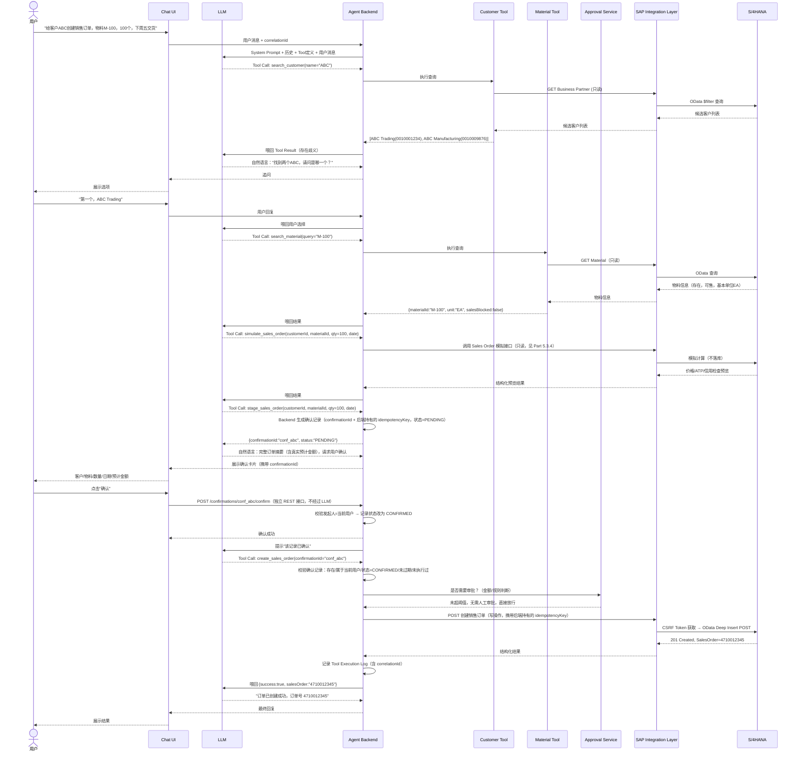
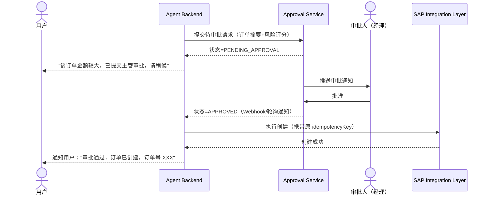
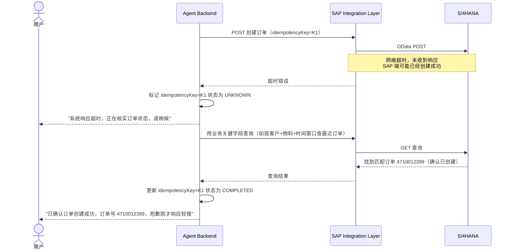

# Part 12：完整时序图（完全なシーケンス図）

## 12.1 端到端主流程（含参数补全、确认、创建、返回）（12.1 エンドツーエンドのメインフロー（パラメータ補完、確認、作成、返却を含む））

## 12.2 审批分支（大额/高风险订单）（12.2 承認分岐（高額/高リスクなオーダー））

## 12.3 超时/状态不确定分支（12.3 タイムアウト/状態不確定の分岐）

## 12.4 项目中你需要记住什么（12.4 プロジェクトで覚えておくべきこと）

- 时序图要体现"歧义必须追问"（第一张图里的 search_customer 返回多个候选）而不是省略这一步。 シーケンス図は「曖昧な場合は必ず追加質問する」ことを表現しなければならず（最初の図の search_customer が複数の候補を返す部分）、このステップを省略してはいけません。
- 审批分支是一个独立的异步等待状态，Agent Backend 需要有机制在审批完成后"回来"继续执行（Webhook 回调或轮询），而不是让用户的对话 Session 一直同步阻塞等待。 承認分岐は独立した非同期の待機状態であり、Agent Backend には承認完了後に「戻ってきて」処理を継続する仕組み（Webhook コールバックまたはポーリング）が必要であり、ユーザーの対話セッションをずっと同期的にブロックして待たせてはいけません。
- 超时分支的核心不是"重试"，而是"用另一种方式核实真实状态"，这是幂等设计里最容易被忽视但最重要的一环（详见 Part 13）。 タイムアウト分岐の核心は「リトライ」ではなく「別の方法で実際の状態を確認する」ことであり、これは冪等設計において最も見落とされがちでありながら最も重要な部分です（詳細は Part 13 参照）。
