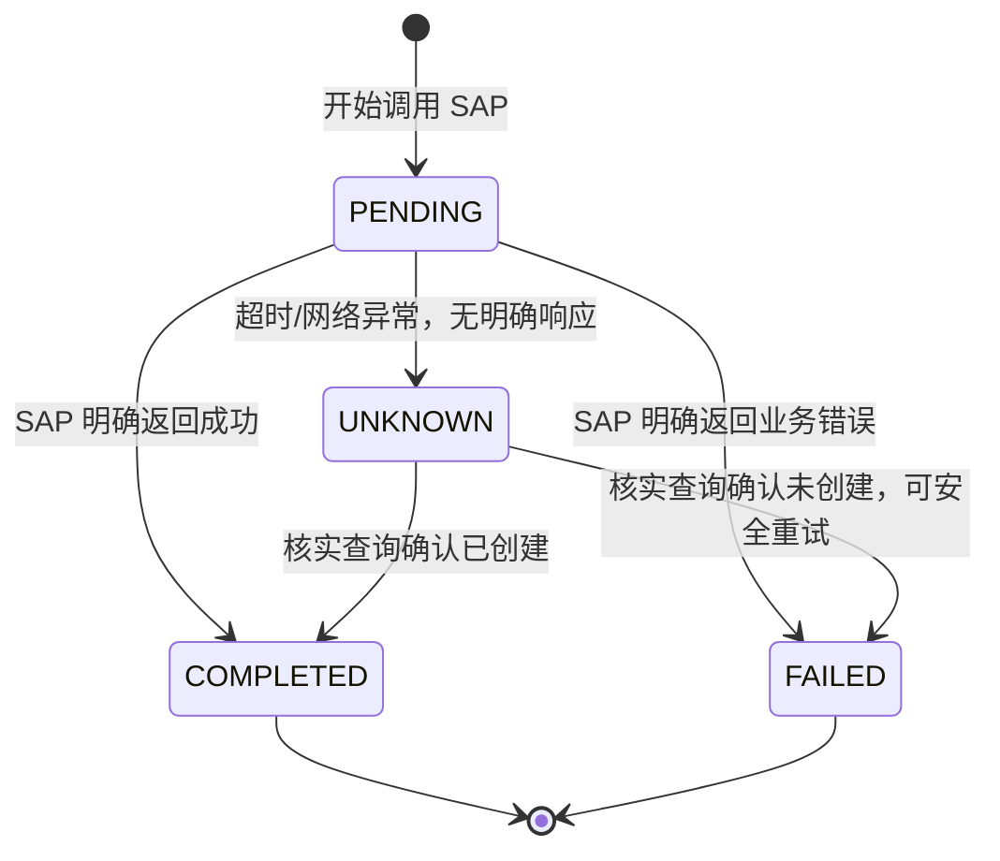

# Part 13：错误场景全集 + 幂等性设计（エラーシナリオ全集 + べき等性設計）

## 13.1 错误场景清单与处理策略（エラーシナリオ一覧と対応方針）

| # | 场景 シナリオ | 谁检测 誰が検知するか | 处理策略 対応方針 | AI 回复要点 AI の応答のポイント |
|---|---|---|---|---|
| 1 | Customer 不存在 Customer が存在しない | Backend（search_customer 返回空） Backend（search_customer が空を返す） | 终止，不进入创建流程 処理を中止し、作成フローに進まない | "没有找到名为 XX 的客户，能否提供更准确的名称或客户编号？" 「XX という名前の顧客が見つかりませんでした。より正確な名前または顧客番号を教えていただけますか？」 |
| 2 | Material 不存在 Material が存在しない | Backend | 终止 処理を中止 | "没有找到物料 M-100，请确认物料编号是否正确" 「品目 M-100 が見つかりませんでした。品目番号が正しいかご確認ください」 |
| 3 | Material 被 Block（销售冻结） Material が Block されている（販売凍結） | SAP 权威（Backend 可先查状态字段提示） SAP が権威（Backend は先にステータス項目を確認して案内できる） | 终止，明确原因 処理を中止し、理由を明示する | "物料 M-100 当前已停售，无法下单" 「品目 M-100 は現在販売停止中のため、オーダーできません」 |
| 4 | Sales Area 不匹配 Sales Area が一致しない | SAP 权威 SAP が権威 | 终止或询问是否需要不同的销售组织/渠道 処理を中止するか、異なる Sales Organization／Distribution Channel が必要かを確認する | "该客户在销售组织 1000 下没有对应的销售数据，需要先补充客户主数据或确认其他销售范围" 「この顧客は Sales Organization 1000 に対応する販売データがありません。先に顧客マスタを補完するか、他の Sales Area をご確認ください」 |
| 5 | 库存不足（ATP） 在庫不足（ATP） | SAP 权威 SAP が権威 | 不阻断创建（订单仍可创建，只是交货日期可能延后/拆分），如实告知 作成をブロックしない（オーダーは作成できるが、納期が遅延／分割される可能性がある）。事実をそのまま伝える | "库存暂时不足，系统建议交货日期调整为 XX，是否接受？" 「在庫が一時的に不足しています。システムは納期を XX に調整することを提案していますが、よろしいですか？」 |
| 6 | Credit Check 未通过 Credit Check が未通過 | SAP 权威 SAP が権威 | **不要默认等价于"创建失败"**：取决于系统 Customizing，订单可能仍被正常创建但打上 Credit Block（信用冻结），也可能被直接拒绝创建，必须以 SAP 返回的凭证号+信用状态字段为准（见 Part 2 第四步的详细澄清），再决定回复措辞和是否需要走信用审批流程 **「作成失敗」と安易に同一視してはいけない**：システムの Customizing 次第で、オーダーは正常に作成されつつ Credit Block（信用凍結）が付与される場合もあれば、作成自体が拒否される場合もある。必ず SAP が返す伝票番号と信用ステータス項目を基準とし（Part 2 のステップ 4 の詳細な補足を参照）、それに応じて応答の文言と信用承認フローの要否を決定すること | 若已创建但冻结："订单 4710012345 已创建，但因信用检查未通过被冻结，需财务审批后才能继续交货"；若被直接拒绝创建："该客户当前信用额度不足，订单未能创建，需财务审批后才能重新提交" 作成済みだが凍結の場合：「オーダー 4710012345 は作成されましたが、Credit Check が未通過のため凍結されています。財務部門の承認後に出荷が可能になります」／作成自体が拒否された場合：「この顧客の現在の信用枠が不足しているため、オーダーを作成できませんでした。財務部門の承認後に再提出が必要です」 |
| 7 | Pricing 失败（定价条件缺失等） Pricing 失敗（価格決定条件の欠落など） | SAP 权威 SAP が権威 | 终止，转人工 処理を中止し、人手対応に切り替える | "系统无法为该物料/客户组合计算价格，请联系销售支持" 「このシステムはこの品目／顧客の組み合わせに対して価格を計算できませんでした。営業サポートにお問い合わせください」 |
| 8 | API timeout API タイムアウト | Backend/Integration Layer | 状态标记为 UNKNOWN，触发核实查询，不直接判定成功或失败 ステータスを UNKNOWN としてマークし、確認クエリをトリガーする。成功・失敗を直ちに判定しない | "响应超时，正在核实订单状态，请稍候" 「応答がタイムアウトしました。オーダーの状態を確認していますので、しばらくお待ちください」 |
| 9 | SAP 返回 500 SAP が 500 を返す | Backend | 判断是否瞬时故障（可有限次重试）还是持续故障（终止+告警） 一時的な障害（有限回数の再試行が可能）か、継続的な障害（中止＋アラート）かを判断する | "系统暂时不可用，请稍后重试"或转人工 「システムが一時的に利用できません。しばらくしてから再試行してください」、または人手対応に切り替える |
| 10 | SAP 创建成功但 Backend timeout（Backend 自己没收到响应但 SAP 已落库） SAP 側は作成成功だが Backend がタイムアウト（Backend は応答を受け取れなかったが SAP には既に登録されている） | 幂等核实机制 べき等性の確認メカニズム | 通过核实查询确认真实状态，纠正为成功 確認クエリによって実際の状態を確認し、成功に訂正する | 见 Part 12.3 时序图 Part 12.3 のシーケンス図を参照 |
| 11 | 用户重复说"创建" ユーザーが「作成して」を繰り返す | Agent/对话状态机 Agent／対話ステートマシン | 识别为重复意图，复用同一 confirmationId（若仍有效）或提示"已经创建过了" 重複した意図として識別し、同一の confirmationId を再利用する（有効な場合）か、「すでに作成済みです」と案内する | "这个订单已经创建成功了（订单号 XXX），需要再创建一个新的吗？" 「このオーダーはすでに作成成功しています（オーダー番号 XXX）。新しく別のオーダーを作成しますか？」 |
| 12 | LLM 重复调用 Tool（同一轮内） LLM が Tool を重複呼び出しする（同一ターン内） | Agent Backend | 幂等 key（后端持有，见 13.2）兜底，第二次调用直接返回第一次结果 べき等キー（Backend が保持、13.2 参照）でカバーし、2 回目の呼び出しは 1 回目の結果をそのまま返す | 对用户透明，不应重复创建 ユーザーには見えない形で処理し、重複作成してはいけない |
| 13 | 请求重复提交（前端重试/双击） リクエストの重複送信（フロントエンドの再試行／ダブルクリック） | 前端防抖 + 后端幂等 key フロントエンドのデバウンス＋バックエンドのべき等キー | 前端层面防抖是第一道，后端幂等是最终保障 フロントエンドのデバウンスが第一防衛線であり、バックエンドのべき等性が最終的な保証である | 对用户透明 ユーザーには見えない形で処理する |
| 14 | SAP 已创建但 AI 认为失败（误判） SAP 側は作成済みだが AI が失敗と誤判定 | 幂等核实机制 べき等性の確認メカニズム | 同 #10，核实查询是唯一可靠手段 #10 と同じ。確認クエリが唯一の信頼できる手段である | 纠正后告知用户真实状态，绝不能因为"怕说错"而对用户隐瞒之前误报的信息 訂正後、ユーザーに実際の状態を伝えること。「間違いを言うのが怖い」という理由で以前の誤報をユーザーに隠してはならない |
| 15 | 用户取消操作 ユーザーが操作をキャンセル | Agent/对话状态机 Agent／対話ステートマシン | 直接终止流程，不调用任何写 Tool 直ちにフローを終了し、いかなる書き込み Tool も呼び出さない | "好的，已取消，不会创建这个订单" 「承知しました。キャンセルしましたので、このオーダーは作成されません」 |

## 13.2 幂等性（Idempotency）设计详解（べき等性（Idempotency）設計詳解）

### 为什么需要（なぜ必要か）

用户对话、网络请求、LLM 的工具调用，任何一环都可能因为各种原因发生"重复"：用户重复表达意图、前端重试、Agent Loop 中模型意外重复调用工具、SAP 端响应丢失导致 Backend 误以为失败而重试。**没有幂等控制的写操作，在高频交互的对话式场景中几乎必然会产生重复订单。**

ユーザーとの対話、ネットワークリクエスト、LLM のツール呼び出しなど、どの段階でも様々な理由で「重複」が発生する可能性があります：ユーザーが意図を繰り返し表現する、フロントエンドの再試行、Agent Loop 内でモデルが意図せずツールを重複呼び出しする、SAP 側の応答が失われて Backend が失敗と誤認して再試行するなどです。**べき等性の制御がない書き込み操作は、対話が頻繁に発生するシナリオではほぼ必然的に重複オーダーを生み出します。**

### 设计要点（設計のポイント）

1. **幂等 Key 的生成时机和归属**：应该在"用户确认"这一刻由**后端**生成并固定下来，绑定到这一次具体的创建意图，而不是每次 Tool 调用都生成新的（那样起不到去重作用）。更重要的是：**这个 key 应该完全由后端持有，不要作为参数暴露给 LLM**——如果让模型自己生成并在每次调用时携带 `idempotencyKey`，模型的重试/重放很可能带来不同的 key 值（第一次 `uuid-A`，重试时变成 `uuid-B`），后端看到两个不同的 key 会误判成两个不同的请求，幂等机制形同虚设。正确做法是把幂等 key 和"确认记录"（见下文/Part 7.3、Part 11.6）绑定在一起：用户确认时，后端生成一条确认记录并在其中生成 `idempotencyKey`，随后 LLM 只需要传回这条确认记录的 `confirmationId`，真正执行时由后端从确认记录里取出 `idempotencyKey` 使用，模型全程不感知这个值。

   **べき等キーの生成タイミングと所有者**：「ユーザー確認」の瞬間に**バックエンド**が生成して固定し、その 1 回の具体的な作成意図に紐付けるべきです。Tool 呼び出しのたびに新しく生成するのではありません（それでは重複排除の役割を果たせません）。さらに重要なのは：**このキーは完全にバックエンドが保持すべきであり、LLM に渡すパラメータとして露出させてはいけません**——もしモデル自身に `idempotencyKey` を生成させ、呼び出しのたびに携行させると、モデルの再試行／リプレイでは異なるキー値になる可能性が高く（1 回目は `uuid-A`、再試行では `uuid-B` になるなど）、バックエンドが 2 つの異なるキーを見ると別々のリクエストと誤判定し、べき等性メカニズムが形骸化します。正しいやり方は、べき等キーを「確認レコード」（後述／Part 7.3、Part 11.6 参照）と紐付けることです：ユーザーが確認した時点で、バックエンドが確認レコードを生成し、その中で `idempotencyKey` を生成します。その後 LLM はこの確認レコードの `confirmationId` を返すだけでよく、実際の実行時にバックエンドが確認レコードから `idempotencyKey` を取り出して使用します。モデルはこの値を一切認識しません。

2. **状态机**（比"成功/失败"更精细）：

   **ステートマシン**（「成功／失敗」よりも細かい粒度）：

   **关键点**：`UNKNOWN` 状态不能被简单地当作"失败"处理然后允许重试——如果 SAP 端其实已经创建成功，重试会产生第二个真实订单。必须先走"核实查询"（用业务关键字段如客户+物料+时间窗口去查询是否已存在匹配订单），确认后才能转为 `COMPLETED` 或 `FAILED`。

   **重要なポイント**：`UNKNOWN` 状態を単純に「失敗」として扱い再試行を許可してはいけません——SAP 側で実際にはすでに作成が成功している場合、再試行によって 2 件目の実オーダーが発生してしまいます。必ず先に「確認クエリ」（顧客＋品目＋時間ウィンドウなどの業務上の主要項目を使って、一致するオーダーが既に存在するかを照会する）を行い、確認後にのみ `COMPLETED` または `FAILED` に遷移させる必要があります。

3. **幂等存储**：生产环境用 Redis 或数据库表持久化（不能像 Demo 那样用内存 Map，进程重启会丢失状态），设置合理 TTL（如 24-72 小时），并对幂等 key 加唯一索引防止并发场景下的竞态创建。

   **べき等性ストレージ**：本番環境では Redis またはデータベーステーブルで永続化します（Demo のようにメモリ上の Map を使ってはいけません。プロセス再起動で状態が失われます）。妥当な TTL（例：24～72 時間）を設定し、べき等キーに一意インデックスを付与して、並行シナリオでの競合作成を防ぎます。

4. **幂等 Key 也要传给 SAP（如果 API 支持）**：部分 SAP API/场景支持在请求中携带客户端生成的引用号（如 `PurchaseOrderByCustomer` 字段挂一个内部追踪号，⚠️ 需核实具体 API 是否有天然幂等支持字段），这样即使 Backend 自己的幂等表出问题，也可以用这个字段在 SAP 侧兜底查重。多数标准 Sales Order 创建 API **本身不保证幂等**（重复提交完全相同的 payload 两次，通常会创建两个订单），所以 Backend 侧的幂等控制是必需的，不能假设 SAP 会替你去重。

   **べき等キーは SAP にも渡すべき（API が対応していれば）**：一部の SAP API／シナリオでは、リクエストにクライアント生成の参照番号を含めることができます（例えば `PurchaseOrderByCustomer` 項目に内部追跡番号を付与する。⚠️ 具体的な API にべき等性をネイティブにサポートする項目があるかは確認が必要）。これにより、Backend 自身のべき等性テーブルに問題が起きても、この項目を使って SAP 側で重複チェックのフォールバックができます。多くの標準 Sales Order 作成 API は**それ自体ではべき等性を保証しません**（まったく同じ payload を 2 回送信すると、通常 2 件のオーダーが作成されます）。そのため Backend 側でのべき等性制御は必須であり、SAP が代わりに重複排除してくれると想定してはいけません。

5. **并发保护**：同一个幂等 key 的并发请求（比如用户手抖点了两次确认按钮，两个请求几乎同时到达），要用 `markPending` + 数据库唯一约束或分布式锁保证只有一个请求真正执行创建，另一个等待/复用结果，而不是两个都判断"还没有记录"然后都发起创建。

   **並行保護**：同一のべき等キーに対する並行リクエスト（ユーザーが誤って確認ボタンを 2 回押し、2 つのリクエストがほぼ同時に到達する場合など）では、`markPending` ＋データベースの一意制約または分散ロックを使って、実際に作成を実行するのは 1 件のリクエストのみとし、もう一方は待機／結果を再利用するようにします。両方が「まだレコードがない」と判断してどちらも作成を開始してしまうことがないようにします。

## 13.3 项目中你需要记住什么（プロジェクトで覚えておくべきこと）

- 错误处理的第一原则：**区分"确定失败"和"状态不确定"，两者的后续动作完全不同**——前者可以安全提示用户重新操作，后者必须先核实再决策。

  エラー処理の第一原則：**「確定的な失敗」と「状態が不確定」を区別すること。両者のその後の対応は完全に異なります**——前者はユーザーに安全に再操作を促せますが、後者は必ず先に確認してから判断しなければなりません。

- 幂等 key 在"用户确认"时生成并固定，不是每次 Tool 调用都新生成。

  べき等キーは「ユーザー確認」の時点で生成・固定され、Tool 呼び出しのたびに新しく生成するものではありません。

- 幂等状态机至少要有 PENDING/COMPLETED/FAILED/UNKNOWN 四态，UNKNOWN 是最容易被新手遗漏但最重要的一态。

  べき等性ステートマシンには少なくとも PENDING/COMPLETED/FAILED/UNKNOWN の 4 状態が必要であり、UNKNOWN は初心者が最も見落としがちですが最も重要な状態です。

- 不要假设 SAP API 天然幂等，重复提交默认会创建重复数据，去重责任在 Backend。

  SAP API がネイティブにべき等であると想定してはいけません。重複送信はデフォルトで重複データを作成し、重複排除の責任は Backend 側にあります。

- 并发场景下幂等存储需要唯一约束/锁，避免"检查-创建"之间的竞态。

  並行シナリオでは、べき等性ストレージに一意制約／ロックが必要であり、「チェック」と「作成」の間の競合を回避します。

- 本章重点讲了"要不要重试、幂等 key 怎么管"，更完整的分布式系统可靠性知识（熔断、限流、舱壁隔离、Retry Storm、Saga）见 Part 24；事件驱动场景下的幂等处理（事件 ID 去重）复用的是同一套基础设施，见 Part 22.13、22.19。

  本章では「再試行すべきかどうか、べき等キーをどう管理するか」を重点的に扱いました。より完全な分散システムの信頼性に関する知識（サーキットブレーカー、レート制限、バルクヘッド分離、Retry Storm、Saga）については Part 24 を参照してください。イベント駆動シナリオにおけるべき等性処理（イベント ID の重複排除）は同じインフラストラクチャを再利用しています。Part 22.13、22.19 を参照してください。
