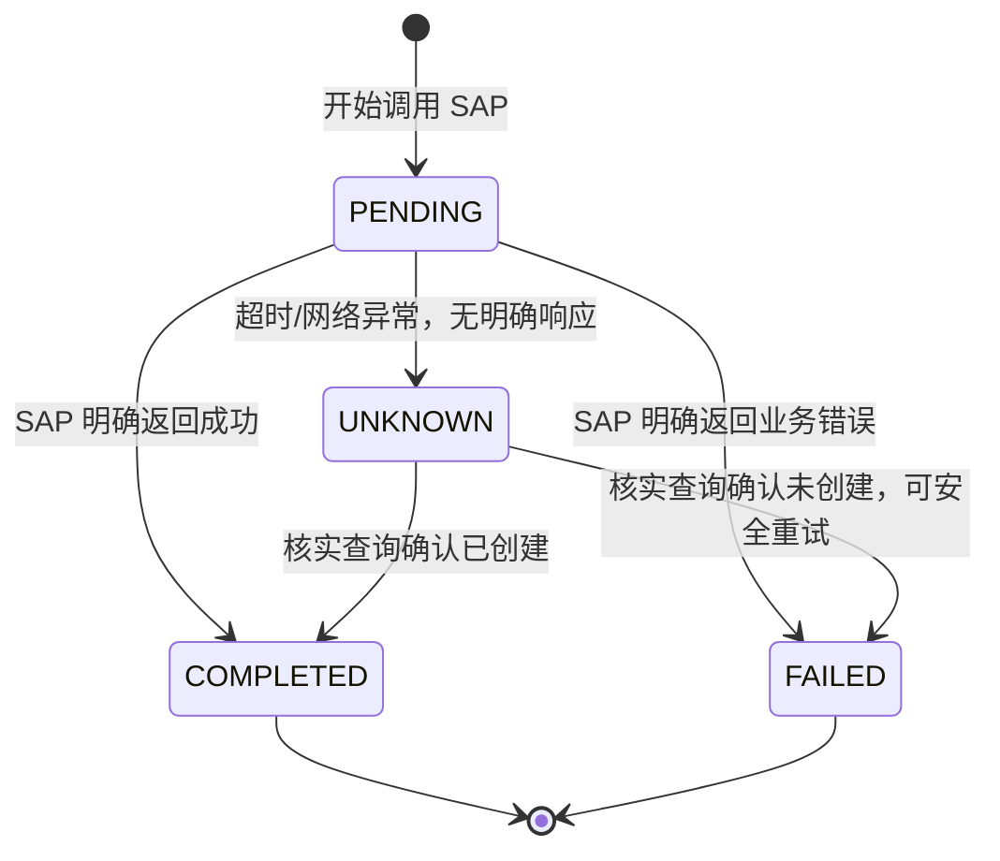

# Part 13：错误场景全集 + 幂等性设计

## 13.1 错误场景清单与处理策略

| # | 场景 | 谁检测 | 处理策略 | AI 回复要点 |
|---|---|---|---|---|
| 1 | Customer 不存在 | Backend（search_customer 返回空） | 终止，不进入创建流程 | "没有找到名为 XX 的客户，能否提供更准确的名称或客户编号？" |
| 2 | Material 不存在 | Backend | 终止 | "没有找到物料 M-100，请确认物料编号是否正确" |
| 3 | Material 被 Block（销售冻结） | SAP 权威（Backend 可先查状态字段提示） | 终止，明确原因 | "物料 M-100 当前已停售，无法下单" |
| 4 | Sales Area 不匹配 | SAP 权威 | 终止或询问是否需要不同的销售组织/渠道 | "该客户在销售组织 1000 下没有对应的销售数据，需要先补充客户主数据或确认其他销售范围" |
| 5 | 库存不足（ATP） | SAP 权威 | 不阻断创建（订单仍可创建，只是交货日期可能延后/拆分），如实告知 | "库存暂时不足，系统建议交货日期调整为 XX，是否接受？" |
| 6 | Credit Check 失败 | SAP 权威 | 终止或走信用审批流程 | "该客户当前信用额度不足，订单已被系统标记为信用冻结，需财务审批后才能继续" |
| 7 | Pricing 失败（定价条件缺失等） | SAP 权威 | 终止，转人工 | "系统无法为该物料/客户组合计算价格，请联系销售支持" |
| 8 | API timeout | Backend/Integration Layer | 状态标记为 UNKNOWN，触发核实查询，不直接判定成功或失败 | "响应超时，正在核实订单状态，请稍候" |
| 9 | SAP 返回 500 | Backend | 判断是否瞬时故障（可有限次重试）还是持续故障（终止+告警） | "系统暂时不可用，请稍后重试"或转人工 |
| 10 | SAP 创建成功但 Backend timeout（Backend 自己没收到响应但 SAP 已落库） | 幂等核实机制 | 通过核实查询确认真实状态，纠正为成功 | 见 Part 12.3 时序图 |
| 11 | 用户重复说"创建" | Agent/对话状态机 | 识别为重复意图，复用同一 idempotencyKey 或提示"已经创建过了" | "这个订单已经创建成功了（订单号 XXX），需要再创建一个新的吗？" |
| 12 | LLM 重复调用 Tool（同一轮内） | Agent Backend | 幂等 key 兜底，第二次调用直接返回第一次结果 | 对用户透明，不应重复创建 |
| 13 | 请求重复提交（前端重试/双击） | 前端防抖 + 后端幂等 key | 前端层面防抖是第一道，后端幂等是最终保障 | 对用户透明 |
| 14 | SAP 已创建但 AI 认为失败（误判） | 幂等核实机制 | 同 #10，核实查询是唯一可靠手段 | 纠正后告知用户真实状态，绝不能因为"怕说错"而对用户隐瞒之前误报的信息 |
| 15 | 用户取消操作 | Agent/对话状态机 | 直接终止流程，不调用任何写 Tool | "好的，已取消，不会创建这个订单" |

## 13.2 幂等性（Idempotency）设计详解

### 为什么需要

用户对话、网络请求、LLM 的工具调用，任何一环都可能因为各种原因发生"重复"：用户重复表达意图、前端重试、Agent Loop 中模型意外重复调用工具、SAP 端响应丢失导致 Backend 误以为失败而重试。**没有幂等控制的写操作，在高频交互的对话式场景中几乎必然会产生重复订单。**

### 设计要点

1. **幂等 Key 的生成时机**：应该在"用户确认"这一刻生成并固定下来，绑定到这一次具体的创建意图，而不是每次 Tool 调用都生成新的（那样起不到去重作用）。可以用 `hash(conversationId + confirmedParams + confirmationTimestamp)` 或简单地在生成确认卡片时生成一个 UUID 并存入对话状态。

2. **状态机**（比"成功/失败"更精细）：

   **关键点**：`UNKNOWN` 状态不能被简单地当作"失败"处理然后允许重试——如果 SAP 端其实已经创建成功，重试会产生第二个真实订单。必须先走"核实查询"（用业务关键字段如客户+物料+时间窗口去查询是否已存在匹配订单），确认后才能转为 `COMPLETED` 或 `FAILED`。

3. **幂等存储**：生产环境用 Redis 或数据库表持久化（不能像 Demo 那样用内存 Map，进程重启会丢失状态），设置合理 TTL（如 24-72 小时），并对幂等 key 加唯一索引防止并发场景下的竞态创建。

4. **幂等 Key 也要传给 SAP（如果 API 支持）**：部分 SAP API/场景支持在请求中携带客户端生成的引用号（如 `PurchaseOrderByCustomer` 字段挂一个内部追踪号，⚠️ 需核实具体 API 是否有天然幂等支持字段），这样即使 Backend 自己的幂等表出问题，也可以用这个字段在 SAP 侧兜底查重。多数标准 Sales Order 创建 API **本身不保证幂等**（重复提交完全相同的 payload 两次，通常会创建两个订单），所以 Backend 侧的幂等控制是必需的，不能假设 SAP 会替你去重。

5. **并发保护**：同一个幂等 key 的并发请求（比如用户手抖点了两次确认按钮，两个请求几乎同时到达），要用 `markPending` + 数据库唯一约束或分布式锁保证只有一个请求真正执行创建，另一个等待/复用结果，而不是两个都判断"还没有记录"然后都发起创建。

## 13.3 项目中你需要记住什么

- 错误处理的第一原则：**区分"确定失败"和"状态不确定"，两者的后续动作完全不同**——前者可以安全提示用户重新操作，后者必须先核实再决策。
- 幂等 key 在"用户确认"时生成并固定，不是每次 Tool 调用都新生成。
- 幂等状态机至少要有 PENDING/COMPLETED/FAILED/UNKNOWN 四态，UNKNOWN 是最容易被新手遗漏但最重要的一态。
- 不要假设 SAP API 天然幂等，重复提交默认会创建重复数据，去重责任在 Backend。
- 并发场景下幂等存储需要唯一约束/锁，避免"检查-创建"之间的竞态。
