# Part 15：Observability / Audit（可観測性／監査）

## 15.1 必须记录什么（何を記録すべきか）

### AI 层（AI 層）

| 字段 フィールド | 说明 説明 |
|---|---|
| User Prompt | 用户原始输入（脱敏后存储，或分级访问控制） ユーザーの元の入力（マスキング後に保存する、またはアクセス権限を段階的に制御する） |
| Parsed Intent | 模型识别出的意图和抽取的实体（NLU 结果） モデルが識別した意図と抽出したエンティティ（NLU の結果） |
| Tool Call | 模型决定调用的工具名称 モデルが呼び出すことを決定した Tool の名前 |
| Tool Arguments | 传给工具的具体参数 Tool に渡す具体的なパラメータ |
| Tool Result | 工具返回的结果（成功数据或错误信息） Tool が返す結果（成功データまたはエラー情報） |
| Model/Prompt Version | 使用的模型版本号、System Prompt 版本（用于问题回溯——"这个错误是不是因为我们上周改了 Prompt"） 使用しているモデルのバージョン番号、System Prompt のバージョン（問題の追跡に使用する——「このエラーは先週 Prompt を変更したせいではないか」など） |

### Backend 层（Backend 層）

| 字段 フィールド | 说明 説明 |
|---|---|
| Request ID | 单次 HTTP 请求的唯一标识 1 回の HTTP リクエストの一意な識別子 |
| User ID | 发起请求的最终用户身份 リクエストを発行したエンドユーザーの身元 |
| Correlation ID | 贯穿整条调用链（从用户消息到 SAP 响应）的唯一标识，见下文 一連の呼び出しチェーン全体（ユーザーメッセージから SAP レスポンスまで）を貫く一意な識別子。詳細は下記参照 |
| Validation Result | 前置校验的通过/拒绝结果及原因 事前検証の合格／拒否の結果とその理由 |
| Approval Result | 审批流程的状态和审批人（如果触发了审批） 承認フローの状態と承認者（承認がトリガーされた場合） |
| Idempotency Key & State | 幂等键及其状态变化 べき等キーとその状態変化 |

### SAP 层（SAP 層）

| 字段 フィールド | 说明 説明 |
|---|---|
| SAP User | 实际执行操作的 SAP 身份（技术账号或透传的终端用户） 実際に操作を実行する SAP 上の身元（テクニカルアカウントまたは伝播されたエンドユーザー） |
| Document Number | 创建/修改的凭证号（如 Sales Order Number） 作成／変更された伝票番号（Sales Order Number など） |
| Timestamp | SAP 侧记录的操作时间戳 SAP 側が記録した操作のタイムスタンプ |
| Change Log | SAP 系统自身的变更日志（如 CDHDR/CDPOS，⚠️ 具体机制随版本而异），用于与你自己系统的日志交叉核对 SAP システム自身の変更ログ（CDHDR/CDPOS など、⚠️ 具体的な仕組みはバージョンにより異なる）。自システムのログとの突き合わせに使用する |

## 15.2 为什么需要端到端 Correlation ID（なぜエンドツーエンドの Correlation ID が必要か）

```mermaid
flowchart LR
    A[用户消息] -->|correlationId=abc123| B[LLM 调用]
    B -->|correlationId=abc123| C[Tool 执行]
    C -->|correlationId=abc123| D[Business Service]
    D -->|correlationId=abc123| E[SAP Integration Layer]
    E -->|correlationId=abc123| F[SAP API 调用]
    F -->|correlationId=abc123 附加到自定义头/日志关联字段| G[SAP 侧日志]
```

- **排障效率**：没有统一 ID，出问题时你需要在 LLM 日志、Backend 日志、Integration 日志、SAP 日志之间凭时间戳和业务参数"猜测"哪几条记录属于同一次请求，效率极低且容易猜错（尤其高并发场景下多个相似请求交织在一起）。

  **トラブルシューティングの効率**：統一された ID がなければ、問題発生時に LLM ログ、Backend ログ、Integration ログ、SAP ログの間で、タイムスタンプや業務パラメータを頼りに「どのレコードが同じリクエストに属するか」を推測する必要があり、効率が非常に悪く、誤って推測しやすくなります（特に高並行のシナリオでは、類似したリクエストが複数入り乱れます）。

- **审计完整性**：合规审计经常要求"证明某个业务结果的完整因果链"（用户说了什么 → 模型做了什么决定 → 系统做了什么校验 → SAP 最终记录了什么），Correlation ID 是把这条链串起来的唯一可靠手段。

  **監査の完全性**：コンプライアンス監査ではしばしば「ある業務結果の完全な因果連鎖を証明すること」（ユーザーが何を言ったか → モデルがどんな判断をしたか → システムがどんな検証を行ったか → SAP が最終的に何を記録したか）が求められます。Correlation ID は、この連鎖をつなぎ合わせる唯一の信頼できる手段です。

- **实现方式**：在用户消息进入系统的最早时刻生成（如 HTTP 网关层），通过日志上下文（如 Node.js 的 AsyncLocalStorage 或显式参数传递）贯穿到每一层，并尽可能作为自定义 HTTP Header（如 `X-Correlation-Id`）传递到 SAP 侧（如果 SAP/Integration Suite 支持记录自定义关联字段）。

  **実装方法**：ユーザーメッセージがシステムに入る最も早いタイミング（HTTP ゲートウェイ層など）で生成し、ログコンテキスト（Node.js の AsyncLocalStorage や明示的なパラメータ渡しなど）を通じてすべての層に貫通させます。可能な限りカスタム HTTP ヘッダー（`X-Correlation-Id` など）として SAP 側にも渡します（SAP/Integration Suite がカスタム関連フィールドの記録をサポートしている場合）。

## 15.3 日志设计原则（ログ設計の原則）

1. **结构化日志**（JSON 格式，而非自由文本拼接），便于查询和聚合分析。

   **構造化ログ**（自由テキストの連結ではなく JSON 形式）にすることで、クエリと集計分析が容易になります。

2. **分级**：INFO 记录正常业务流转，WARN 记录已被处理的异常（如校验失败），ERROR 记录未被完善处理的系统性问题。

   **レベル分け**：INFO は正常な業務フローを記録し、WARN は既に処理された異常（検証失敗など）を記録し、ERROR は十分に処理されていないシステム上の問題を記録します。

3. **敏感字段脱敏**：客户姓名/联系方式/金额等按需掩码或分级访问。

   **機密フィールドのマスキング**：顧客名／連絡先／金額などは必要に応じてマスキングするか、段階的なアクセス制御を行います。

4. **不要日志静默失败**：如果一个 catch 块吞掉了异常没有记录，未来排障会异常困难——这是实践中最常见、也最容易被忽视的问题。

   **サイレント失敗をログに残さないままにしない**：catch ブロックが例外を握りつぶして記録しない場合、将来のトラブルシューティングが非常に困難になります——これは実務で最もよく見られ、かつ最も見過ごされやすい問題です。

5. **监控告警**：对关键指标设置告警阈值，比如：

   **監視アラート**：主要な指標にアラート閾値を設定します。例えば：

   - SAP API 错误率突增 SAP API のエラー率の急増
   - 幂等冲突/重复提交次数异常 べき等性の衝突／重複送信回数の異常
   - Approval 队列积压 Approval キューの滞留
   - LLM Tool Call 失败率异常（可能意味着 Prompt/Schema 出了问题） LLM Tool Call の失敗率の異常（Prompt/Schema に問題がある可能性を示唆する）

## 15.4 项目中你需要记住什么（プロジェクトで覚えておくべきこと）

- 三层（AI/Backend/SAP）各自记录该记录的内容，缺一不可，尤其 Tool Arguments 和 Tool Result 是排查"AI 到底做了什么"的第一手证据。

  3 つの層（AI/Backend/SAP）はそれぞれ記録すべき内容を記録し、どれも欠かせません。特に Tool Arguments と Tool Result は「AI が実際に何をしたか」を調べる際の第一級の証拠です。

- Correlation ID 从最早的入口生成，贯穿全链路，是审计和排障的生命线。

  Correlation ID は最も早い入り口で生成され、全経路を貫通します。これは監査とトラブルシューティングの生命線です。

- 日志要结构化、分级、脱敏，且绝不允许"吞异常不记录"。

  ログは構造化し、レベル分けし、マスキングを施すべきであり、「例外を握りつぶして記録しない」ことは決して許されません。

- Correlation ID 是 Distributed Tracing 的基础，把"多处日志用同一个 ID 串起来"进一步工程化为"结构化记录每一跳耗时和状态"，详见 Part 24.11。

  Correlation ID は Distributed Tracing の基盤であり、「複数箇所のログを同じ ID でつなぐ」ことをさらに工学的に発展させ、「各ホップの所要時間と状態を構造化して記録する」ものです。詳細は Part 24.11 を参照してください。
