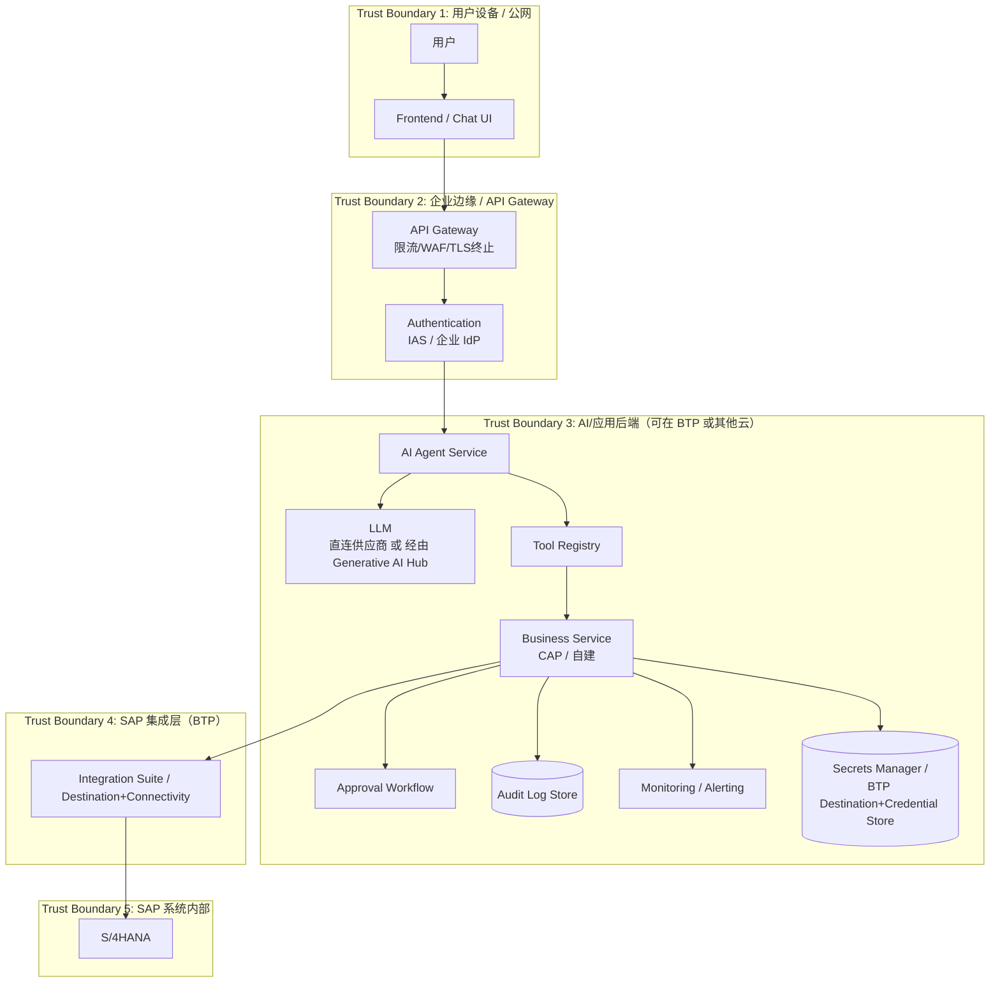

# Part 16：生产参考架构（本番参照アーキテクチャ）

## 16.1 架构图（アーキテクチャ図）

## 16.2 各组件归属：SAP BTP vs 其他云（AWS/Azure/GCP）/ On-Prem（各コンポーネントの帰属：SAP BTP vs 他クラウド（AWS/Azure/GCP）/ On-Prem）

| 组件 コンポーネント | 可在 SAP BTP SAP BTP 上に配置可能 | 可在 AWS/Azure/GCP/On-Prem AWS/Azure/GCP/On-Prem 上に配置可能 | 说明 説明 |
|---|---|---|---|
| Frontend / Chat UI | ✅（Fiori/Launchpad/BTP 静态托管） | ✅（更常见，前端部署几乎不限平台） | 无强依赖，看团队技术栈偏好 強い依存はなく、チームの技術スタックの好みによる |
| API Gateway | ✅（SAP API Management） | ✅（云厂商网关/自建 Kong/Nginx） | 两者皆可，若已有企业统一网关标准应复用 どちらでも可。すでに企業統一のゲートウェイ標準がある場合はそれを再利用すべき |
| Authentication (IdP) | ✅（SAP Cloud Identity Services / IAS） | ✅（Azure AD/Okta 等，可与 IAS 联合信任） | 企业通常已有统一身份提供商，IAS 常作为信任链的一环而非唯一 IdP 企業には通常すでに統一されたアイデンティティプロバイダーがあり、IAS は唯一の IdP としてではなく、信頼チェーンの一環として使われることが多い |
| AI Agent Service / Business Service | ✅（CAP on Cloud Foundry/Kyma） | ✅（任意云的容器/Serverless） | 如果需要 Principal Propagation 到 SAP，放在 BTP 上通常集成更顺畅（Destination/Connectivity 是 BTP 原生能力），放在其他云则需要额外打通网络和信任链 SAP への Principal Propagation が必要な場合、BTP に配置すると統合が通常よりスムーズになる（Destination/Connectivity は BTP ネイティブの機能）。他クラウドに配置する場合は、ネットワークと信頼チェーンを別途つなぎ込む必要がある |
| LLM 调用 LLM 呼び出し | ✅（Generative AI Hub，⚠️需核实覆盖的模型范围与治理能力） | ✅（直连各 LLM 厂商 API） | 企业若要求统一的 AI 治理（审计/内容过滤/成本管控），Generative AI Hub 类网关是合理选择；否则直连也是常见做法 企業が統一された AI ガバナンス（監査／コンテンツフィルタリング／コスト管理）を求める場合、Generative AI Hub のようなゲートウェイは合理的な選択肢である。そうでなければ直接接続も一般的な方法である |
| Tool Registry | ✅或✅ | ✅或✅ | 通常与 Business Service 同层部署，无平台强绑定 通常は Business Service と同じ層に配置され、プラットフォームへの強い依存はない |
| Approval Workflow | ✅（SAP Build Process Automation） | ✅（企业已有工作流引擎，如 ServiceNow/自建） | 优先复用企业已有的审批体系，避免多套审批系统并存 企業がすでに持つ承認体系を優先的に再利用し、複数の承認システムが並存することを避ける |
| Integration Suite / Destination / Connectivity | ✅（BTP 原生） | ⚠️理论上可自建协议转换层，但会失去 SAP 官方对 Destination/Principal Propagation 的原生支持 | 涉及到 SAP 系统连接的部分，强烈建议留在 BTP 上，这是 SAP 生态里"最省心"的一环 SAP システムとの接続に関わる部分は、BTP に残すことを強く推奨する。これは SAP エコシステムの中で「最も手間のかからない」部分である |
| S/4HANA | 取决于部署形态（Part 6） | On-Premise 客户自己机房；Private/Public Cloud 由 SAP 或合作伙伴托管 | |
| Audit Log Store | ✅或✅ | ✅或✅ | 需符合企业数据驻留（Data Residency）合规要求，这通常是决定放哪的关键因素而非技术因素 企業のデータレジデンシー（Data Residency）コンプライアンス要件を満たす必要があり、これは通常配置場所を決める上で技術的要因よりも重要な要因となる |
| Secrets Manager | ✅（BTP Credential Store/Destination） | ✅（云厂商 Secret Manager/Vault） | 视整体应用主体部署在哪个云而定，避免凭据管理分散在多处 アプリケーション全体の主要な配置先クラウドに応じて決める。認証情報管理が複数箇所に分散することを避ける |

## 16.3 Trust Boundary 说明（Trust Boundary の説明）

- **TB1（用户设备/公网）**：完全不可信，任何输入都要在进入 TB2 时做基础校验（格式、大小、注入特征）。

  **TB1（ユーザーデバイス／公衆インターネット）**：完全に信頼できないものとして扱い、あらゆる入力は TB2 に入る際に基本的な検証（形式、サイズ、インジェクションの特徴）を行う必要があります。

- **TB2（API Gateway/认证层）**：负责把"匿名公网流量"转换成"已认证的用户身份"，是第一道硬性关卡——未通过认证的请求不应到达 TB3。

  **TB2（API Gateway／認証層）**：「匿名の公衆インターネットトラフィック」を「認証済みのユーザーアイデンティティ」に変換する役割を担い、最初の厳格な関門です——認証を通過していないリクエストは TB3 に到達すべきではありません。

- **TB3（AI/应用后端）**：这是本教程反复强调的"业务把关层"，内部又可以细分（Agent Service 相对不可信任其自主决策，Business Service 是强制校验的关卡）。

  **TB3（AI／アプリケーションバックエンド）**：これは本チュートリアルが繰り返し強調している「業務ゲートキーパー層」であり、内部でさらに細分化できます（Agent Service はその自律的な判断を比較的信用せず、Business Service が強制検証の関門となる）。

- **TB4（SAP 集成层）**：负责协议和网络层面的信任转换（比如用 Principal Propagation 把 TB3 已验证的用户身份，转换成 SAP 能识别的身份凭证）。

  **TB4（SAP 統合層）**：プロトコルおよびネットワークレベルでの信頼の変換を担います（例えば Principal Propagation を使って、TB3 で検証済みのユーザーアイデンティティを SAP が認識できる身元証明に変換するなど）。

- **TB5（SAP 系统内部）**：最终、最权威的业务规则执行边界，即使前面所有层都被绕过或出错，SAP 自身的 Authorization Object 检查、Credit Check、ATP 仍是最后一道防线。

  **TB5（SAP システム内部）**：最終的かつ最も権威あるビジネスルール実行の境界であり、たとえ前段のすべての層が迂回されたり誤動作したりしても、SAP 自身の Authorization Object チェック、Credit Check、ATP は依然として最後の防衛線となります。

**设计原则：每跨越一个 Trust Boundary，都应该有一次显式的身份/权限重新验证，不能假设"上一层已经检查过了就不用再检查"（Defense in Depth，纵深防御）。**

**設計原則：Trust Boundary を 1 つ越えるたびに、明示的な身元／権限の再検証を行うべきであり、「前の層ですでにチェック済みだから再チェックは不要」と想定してはいけません（Defense in Depth、多層防御）。**

## 16.4 项目中你需要记住什么（プロジェクトで覚えておくべきこと）

- 生产架构的核心不是画出漂亮的框图，而是清楚标出每个 Trust Boundary，并保证跨边界时都有独立的验证逻辑。

  本番アーキテクチャの核心は、見栄えの良い図を描くことではなく、それぞれの Trust Boundary を明確に示し、境界を越えるたびに独立した検証ロジックがあることを保証することです。

- 涉及 SAP 连接的部分（Destination/Connectivity/Integration Suite）建议留在 BTP，其他组件（Frontend/Gateway/Approval）可以根据企业已有技术栈灵活选择云平台，不必强行都放在同一个云。

  SAP 接続に関わる部分（Destination/Connectivity/Integration Suite）は BTP に残すことを推奨します。その他のコンポーネント（Frontend/Gateway/Approval）は、企業が既に持つ技術スタックに応じて柔軟にクラウドプラットフォームを選択でき、無理にすべてを同一クラウドに置く必要はありません。

- 数据驻留合规要求（尤其审计日志和 PII 存储位置）往往是"放哪个云"的决定性因素，不是纯技术判断。

  データレジデンシーに関するコンプライアンス要件（特に監査ログや PII の保存場所）は、「どのクラウドに置くか」を決定する要因になることが多く、純粋な技術的判断ではありません。

- 本章的架构图默认是同步 Request/Response 视角，SAP 主动推送事件的架构补充见 Part 22；同一套架构在 DEV/QAS/PRD 多环境下如何隔离部署，见 Part 25。

  本章のアーキテクチャ図はデフォルトで同期的な Request/Response の視点によるものです。SAP が能動的にイベントをプッシュするアーキテクチャの補足については Part 22 を、同じアーキテクチャを DEV/QAS/PRD の複数環境でどのように分離配置するかについては Part 25 を参照してください。
