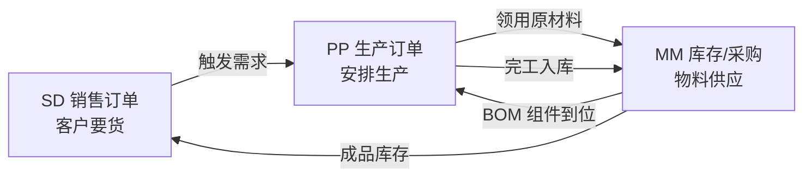

# Part 20：SAP PP（生产计划）基础全解（SAP PP（生産計画）基礎完全解説）

SD 管"卖出去"，MM 管"买进来"，**PP（Production Planning，生产计划）管"造出来"**。如果企业是制造型企业，AI 助手很可能被问到"这批订单的产能能不能满足""生产订单进度如何"，这类问题背后就是 PP 模块。本章按同样的模式补齐 PP 知识，并说明它与 SD/MM 的三角关系。

SD は「売る」を管轄し、MM は「買う」を管轄し、**PP（Production Planning、生産計画）は「作る」を管轄します**。企業が製造業であれば、AI アシスタントは「このオーダーの産能は足りているか」「生産オーダーの進捗はどうか」といった質問を受ける可能性が高く、こうした質問の背後にあるのが PP モジュールです。本章では同じパターンで PP の知識を補完し、SD/MM との三角関係を説明します。

## 20.1 SD / MM / PP 三角关系（SD / MM / PP の三角関係）

- 客户在 SD 下了销售订单，如果成品库存不够，会触发（直接或通过 MRP）PP 侧的生产计划。

  顧客が SD で販売オーダーを起票し、完成品在庫が不足している場合、（直接、あるいは MRP を通じて）PP 側の生産計画がトリガーされます。

- PP 生产时需要领用原材料，这些原材料的库存和采购由 MM 管理。

  PP が生産する際には原材料の払い出しが必要であり、これらの原材料の在庫と購買は MM が管理します。

- PP 完工后，产成品入库（也是一种库存移动，仍在 MM 的 Inventory Management 范畴），才能真正满足 SD 订单的交货。

  PP が生産を完了すると、完成品が入庫されます（これも一種の在庫移動であり、依然として MM の Inventory Management の範囲内です）。これによって初めて SD オーダーの出荷が実際に満たされます。

**一句话理解：三个模块共用同一个"物料"和"库存"概念，但站在各自业务方向上使用它——SD 消耗库存、MM 补充库存、PP 转化库存（原材料→半成品→产成品）。**

**一言で言えば：3 つのモジュールは同じ「品目」と「在庫」の概念を共有していますが、それぞれの業務方向からそれを使用しています——SD は在庫を消費し、MM は在庫を補充し、PP は在庫を転換します（原材料→半製品→完成品）。**

## 20.2 PP 核心概念表（PP 中核概念表）

| # | 中文 中国語 | SAP 英文 | 作用 役割 | AI 项目为什么要知道 AI プロジェクトでなぜ知っておくべきか | 举例 例 |
|---|---|---|---|---|---|
| 1 | 物料清单 部品表 | Bill of Material (BOM) | 描述生产一个产成品需要哪些组件、各多少数量 1 つの完成品を生産するのに必要な構成部品とその数量を記述する | 如果 AI 要回答"生产 100 个成品需要多少原材料"，答案来自 BOM 展开计算，AI 不能自己估算 AI が「完成品を 100 個生産するのに原材料はどれだけ必要か」に答える場合、その答えは BOM の展開計算から得られるものであり、AI 自身が推定することはできない | 成品 M-100 由零件 A×2 + 零件 B×1 组成 完成品 M-100 は部品 A×2 + 部品 B×1 で構成される |
| 2 | 工艺路线 作業手順 | Routing | 描述生产的工序步骤、每道工序用什么工作中心、耗时多久 生産の工程ステップ、各工程で使用する Work Center、所要時間を記述する | 决定生产提前期（Lead Time），影响交货日期承诺 生産リードタイムを決定し、納期の確約に影響する | 工序10冲压→工序20组装→工序30检验 工程10プレス→工程20組立→工程30検査 |
| 3 | 工作中心 作業区 | Work Center | 生产资源（设备/产线/人员组）的抽象，有产能限制 生産リソース（設備／ライン／人員グループ）の抽象化であり、産能に制約がある | 产能是否够，是"能否按期交货"判断的关键输入之一 産能が足りているかどうかは、「納期どおり出荷できるか」を判断する上での重要なインプットの 1 つ | 产线WC-01，日产能500件 ラインWC-01、日産能500個 |
| 4 | 生产订单 製造指図 | Production Order | 正式下达的生产任务，类似 SD 的 Sales Order、MM 的 Purchase Order 正式に発行される生産タスクであり、SD の Sales Order、MM の Purchase Order に相当する | 本章"PP 版主案例"的目标对象；理解它与销售订单的关联（Sales Order可作为需求触发生产订单） 本章の「PP 版メイン事例」の対象オブジェクト。Sales Order との関連（Sales Order が需要として生産オーダーをトリガーしうる）を理解すること | 生产订单 60001234 製造指図 60001234 |
| 5 | 计划订单 計画オーダー | Planned Order | MRP 运算后生成的"建议"，尚未正式下达，需转换为生产订单或采购订单才生效 MRP 演算の結果として生成される「提案」であり、まだ正式には発行されておらず、生産オーダーまたは購買オーダーに変換して初めて有効になる | 类似 PR 之于 PO 的关系；AI 若查询"系统建议什么时候生产"，看到的是这个对象 PR と PO の関係に類似する。AI が「システムはいつ生産することを提案しているか」を照会した場合、目にするのはこのオブジェクトである | 计划订单 10000456 計画オーダー 10000456 |
| 6 | 产能计划 能力計画 | Capacity Planning / Capacity Requirements Planning (CRP) | 校验工作中心的产能是否能承接生产订单的负荷 Work Center の産能が生産オーダーの負荷を受け入れられるかを検証する | 决定交货日期是否现实，AI 不能替代这个计算，只能查询/转述结果 納期が現実的かどうかを決定するものであり、AI はこの計算を代替できず、結果を照会・伝達することしかできない | 工作中心本周已排产120%，超负荷 作業区は今週すでに120%まで生産計画済みで、能力超過 |
| 7 | 完工确认 実績確認 | Confirmation (生产订单确认) | 记录实际生产进度/完工数量/耗用工时 実際の生産進捗／完成数量／消費工数を記録する | 若 AI 场景涉及"生产进度查询"，数据来源于此 AI のシナリオが「生産進捗の照会」に関わる場合、そのデータの出所はここである | 已完成80/100件 80/100個完了済み |
| 8 | 完工入库 生産入庫 | Goods Receipt for Production Order | 生产完工后成品入库，增加可用库存 生産完了後に完成品を入庫し、利用可能在庫を増加させる | 与 MM 的 Goods Receipt 是同一底层机制（移动类型不同，如101 vs 计划内部使用其他类型），影响 SD 侧的 ATP 结果 MM の Goods Receipt と同一の基盤メカニズムである（移動タイプが異なり、例えば101対計画内部で使用する別タイプ）。SD 側の ATP 結果に影響する | 入库80 EA，成品可售库存增加 80 EA 入庫、完成品の販売可能在庫が増加 |
| 9 | MRP 运行 MRP 実行 | MRP Run | 系统批量计算所有物料的净需求，生成计划订单/采购申请建议 システムが全品目の正味所要量を一括計算し、計画オーダー／購買申請の提案を生成する | 见 Part 19.5，AI 只能转述结果不能自算 Part 19.5 参照。AI は結果を伝達することしかできず、自ら計算することはできない | 每晚定时运行一次 MRP 毎晩定時に MRP を 1 回実行 |

## 20.3 事务代码速查（トランザクションコード早見表）

| 事务代码 トランザクションコード | 名称 | 对应 SD/MM 的 SD/MM での対応 |
|---|---|---|
| CO01 | Create Production Order | 对应 VA01 / ME21N VA01 / ME21N に対応 |
| CO02 | Change Production Order | 对应 VA02 / ME22N VA02 / ME22N に対応 |
| CO03 | Display Production Order | 对应 VA03 / ME23N VA03 / ME23N に対応 |
| CS01/CS02/CS03 | 物料清单 BOM 创建/修改/查看 部品表 BOM 作成/変更/参照 | （无直接 SD/MM 对应，PP 特有主数据） （SD/MM に直接対応するものはなく、PP 特有のマスタデータ） |
| MD04 | 库存/需求清单（Stock/Requirements List） 在庫／所要量リスト（Stock/Requirements List） | 常被顾问用来"一眼看清"某物料当前库存、在途采购、计划生产的全貌 コンサルタントが、ある品目の現在庫、輸送中の購買、計画生産の全体像を「一目で把握する」ためによく使用する |
| MD01/MD02 | MRP 运行（全部/单个物料） MRP 実行（全品目／単一品目） | |

## 20.4 与 AI 项目相关的关键澄清（AI プロジェクトに関する重要な補足）

1. **多数"AI 创建销售订单"项目不需要直接接入 PP**：如果成品库存充足，ATP 检查在 MM 层面就能给出答案，PP 是否需要接入取决于项目范围是否延伸到"生产可行性""交期精确预测"这类更深的问题。做需求澄清时应该明确问清楚："AI 需要回答的交货日期，是基于现有库存判断，还是需要结合生产排产能力判断？"——这决定了要不要涉及 PP。

   **多くの「AI による販売オーダー作成」プロジェクトは PP に直接接続する必要はありません**：完成品在庫が十分であれば、ATP チェックは MM レベルで答えを出せます。PP への接続が必要かどうかは、プロジェクトの範囲が「生産の実現可能性」「正確な納期予測」といったより深い問題まで及ぶかどうかによります。要件の明確化の際は、「AI が答えるべき納期は、現在の在庫に基づく判断なのか、それとも生産計画能力と組み合わせた判断が必要なのか？」を明確に確認すべきです——これが PP を関与させるかどうかを決定します。

2. **BOM 展开、产能校验、MRP 运算，都是 SAP 权威计算，不能被 AI 或后端"简化重算"**：这是 Part 1.6 原则在 PP 场景的延伸，原因相同——这些计算依赖复杂的、随时变化的系统配置（工艺路线版本、产能日历、批量策略），后端自己实现一套简化逻辑，会与 SAP 实际结果不一致，产生"AI 说能交货但系统实际排不出产能"的信任问题。

   **BOM 展開、産能検証、MRP 演算は、いずれも SAP による権威ある計算であり、AI やバックエンドが「簡略化して再計算」してはいけません**：これは Part 1.6 の原則を PP のシナリオに拡張したものであり、理由は同じです——これらの計算は複雑で常に変化するシステム設定（作業手順のバージョン、産能カレンダー、ロットサイズ戦略）に依存しており、バックエンドが独自の簡略化ロジックを実装すると SAP の実際の結果と食い違いが生じ、「AI は出荷できると言ったのに、システム上は実際には産能を確保できなかった」という信頼性の問題を引き起こします。

3. **生产订单是比销售/采购订单更"重"的写操作**：下达一个生产订单会占用产能、领用物料库存、影响其他订单的排产,如果项目范围包含"AI 创建生产订单"，八件套安全设计（Part 9.3）里的 Approval 和 Risk Control 应该设置得比销售订单更保守，通常不建议在 AI 对话场景里让最终用户直接触发生产订单创建，更常见的模式是"AI 只做查询和建议展示，生产订单的正式下达仍由计划员在 SAP 内操作"。

   **生産オーダーは販売／購買オーダーよりも「重い」書き込み操作です**：生産オーダーを 1 件発行すると、産能が占有され、品目在庫が払い出され、他のオーダーの生産計画に影響します。プロジェクトの範囲に「AI による生産オーダー作成」が含まれる場合、八点セットのセキュリティ設計（Part 9.3）における Approval と Risk Control は、販売オーダーよりも保守的に設定すべきです。AI との対話シナリオでエンドユーザーに生産オーダー作成を直接トリガーさせることは通常推奨されず、より一般的なパターンは「AI は照会と提案の表示のみを行い、生産オーダーの正式な発行は引き続き計画担当者が SAP 内で操作する」というものです。

## 20.5 项目中你需要记住什么（プロジェクトで覚えておくべきこと）

- SD/MM/PP 是围绕"物料"和"库存"的三角关系：SD 消耗、MM 供应、PP 转化，理解这个三角能帮你快速判断一个新需求该接入哪个模块。

  SD/MM/PP は「品目」と「在庫」を巡る三角関係です：SD は消費し、MM は供給し、PP は転換します。この三角関係を理解すると、新しい要件がどのモジュールに接続すべきかを素早く判断できます。

- PP 的核心写对象是 Production Order（对应 SD 的 Sales Order、MM 的 Purchase Order），事务代码 CO01/02/03 与 VA01/02/03、ME21N/22N/23N 是同构的。

  PP の中核となる書き込みオブジェクトは Production Order です（SD の Sales Order、MM の Purchase Order に対応）。トランザクションコード CO01/02/03 は VA01/02/03、ME21N/22N/23N と同型構造です。

- BOM 展开、产能校验、MRP 运算都是 SAP 权威计算，AI/后端只能查询转述，不能重新实现。

  BOM 展開、産能検証、MRP 演算はいずれも SAP による権威ある計算であり、AI／バックエンドは照会・伝達することしかできず、再実装してはいけません。

- 生产订单的写操作风险和影响面通常大于销售/采购订单，在项目范围评审阶段就要明确"AI 是否真的需要直接创建生产订单"，多数场景下"只读查询+人工触发"是更稳妥的选择。

  生産オーダーの書き込み操作のリスクと影響範囲は、通常販売／購買オーダーよりも大きいため、プロジェクト範囲のレビュー段階で「AI は本当に生産オーダーを直接作成する必要があるのか」を明確にすべきです。多くのシナリオでは「読み取り専用の照会＋人手によるトリガー」がより安全な選択です。
