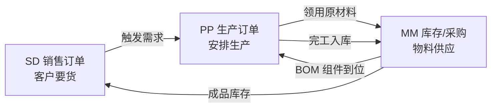

# Part 20：SAP PP（生产计划）基础全解

SD 管"卖出去"，MM 管"买进来"，**PP（Production Planning，生产计划）管"造出来"**。如果企业是制造型企业，AI 助手很可能被问到"这批订单的产能能不能满足""生产订单进度如何"，这类问题背后就是 PP 模块。本章按同样的模式补齐 PP 知识，并说明它与 SD/MM 的三角关系。

## 20.1 SD / MM / PP 三角关系

- 客户在 SD 下了销售订单，如果成品库存不够，会触发（直接或通过 MRP）PP 侧的生产计划。
- PP 生产时需要领用原材料，这些原材料的库存和采购由 MM 管理。
- PP 完工后，产成品入库（也是一种库存移动，仍在 MM 的 Inventory Management 范畴），才能真正满足 SD 订单的交货。

**一句话理解：三个模块共用同一个"物料"和"库存"概念，但站在各自业务方向上使用它——SD 消耗库存、MM 补充库存、PP 转化库存（原材料→半成品→产成品）。**

## 20.2 PP 核心概念表

| # | 中文 | SAP 英文 | 作用 | AI 项目为什么要知道 | 举例 |
|---|---|---|---|---|---|
| 1 | 物料清单 | Bill of Material (BOM) | 描述生产一个产成品需要哪些组件、各多少数量 | 如果 AI 要回答"生产 100 个成品需要多少原材料"，答案来自 BOM 展开计算，AI 不能自己估算 | 成品 M-100 由零件 A×2 + 零件 B×1 组成 |
| 2 | 工艺路线 | Routing | 描述生产的工序步骤、每道工序用什么工作中心、耗时多久 | 决定生产提前期（Lead Time），影响交货日期承诺 | 工序10冲压→工序20组装→工序30检验 |
| 3 | 工作中心 | Work Center | 生产资源（设备/产线/人员组）的抽象，有产能限制 | 产能是否够，是"能否按期交货"判断的关键输入之一 | 产线WC-01，日产能500件 |
| 4 | 生产订单 | Production Order | 正式下达的生产任务，类似 SD 的 Sales Order、MM 的 Purchase Order | 本章"PP 版主案例"的目标对象；理解它与销售订单的关联（Sales Order可作为需求触发生产订单） | 生产订单 60001234 |
| 5 | 计划订单 | Planned Order | MRP 运算后生成的"建议"，尚未正式下达，需转换为生产订单或采购订单才生效 | 类似 PR 之于 PO 的关系；AI 若查询"系统建议什么时候生产"，看到的是这个对象 | 计划订单 10000456 |
| 6 | 产能计划 | Capacity Planning / Capacity Requirements Planning (CRP) | 校验工作中心的产能是否能承接生产订单的负荷 | 决定交货日期是否现实，AI 不能替代这个计算，只能查询/转述结果 | 工作中心本周已排产120%，超负荷 |
| 7 | 完工确认 | Confirmation (生产订单确认) | 记录实际生产进度/完工数量/耗用工时 | 若 AI 场景涉及"生产进度查询"，数据来源于此 | 已完成80/100件 |
| 8 | 完工入库 | Goods Receipt for Production Order | 生产完工后成品入库，增加可用库存 | 与 MM 的 Goods Receipt 是同一底层机制（移动类型不同，如101 vs 计划内部使用其他类型），影响 SD 侧的 ATP 结果 | 入库80 EA，成品可售库存增加 |
| 9 | MRP 运行 | MRP Run | 系统批量计算所有物料的净需求，生成计划订单/采购申请建议 | 见 Part 19.5，AI 只能转述结果不能自算 | 每晚定时运行一次 MRP |

## 20.3 事务代码速查

| 事务代码 | 名称 | 对应 SD/MM 的 |
|---|---|---|
| CO01 | Create Production Order | 对应 VA01 / ME21N |
| CO02 | Change Production Order | 对应 VA02 / ME22N |
| CO03 | Display Production Order | 对应 VA03 / ME23N |
| CS01/CS02/CS03 | 物料清单 BOM 创建/修改/查看 | （无直接 SD/MM 对应，PP 特有主数据） |
| MD04 | 库存/需求清单（Stock/Requirements List） | 常被顾问用来"一眼看清"某物料当前库存、在途采购、计划生产的全貌 |
| MD01/MD02 | MRP 运行（全部/单个物料） | |

## 20.4 与 AI 项目相关的关键澄清

1. **多数"AI 创建销售订单"项目不需要直接接入 PP**：如果成品库存充足，ATP 检查在 MM 层面就能给出答案，PP 是否需要接入取决于项目范围是否延伸到"生产可行性""交期精确预测"这类更深的问题。做需求澄清时应该明确问清楚："AI 需要回答的交货日期，是基于现有库存判断，还是需要结合生产排产能力判断？"——这决定了要不要涉及 PP。
2. **BOM 展开、产能校验、MRP 运算，都是 SAP 权威计算，不能被 AI 或后端"简化重算"**：这是 Part 1.6 原则在 PP 场景的延伸，原因相同——这些计算依赖复杂的、随时变化的系统配置（工艺路线版本、产能日历、批量策略），后端自己实现一套简化逻辑，会与 SAP 实际结果不一致，产生"AI 说能交货但系统实际排不出产能"的信任问题。
3. **生产订单是比销售/采购订单更"重"的写操作**：下达一个生产订单会占用产能、领用物料库存、影响其他订单的排产,如果项目范围包含"AI 创建生产订单"，八件套安全设计（Part 9.3）里的 Approval 和 Risk Control 应该设置得比销售订单更保守，通常不建议在 AI 对话场景里让最终用户直接触发生产订单创建，更常见的模式是"AI 只做查询和建议展示，生产订单的正式下达仍由计划员在 SAP 内操作"。

## 20.5 项目中你需要记住什么

- SD/MM/PP 是围绕"物料"和"库存"的三角关系：SD 消耗、MM 供应、PP 转化，理解这个三角能帮你快速判断一个新需求该接入哪个模块。
- PP 的核心写对象是 Production Order（对应 SD 的 Sales Order、MM 的 Purchase Order），事务代码 CO01/02/03 与 VA01/02/03、ME21N/22N/23N 是同构的。
- BOM 展开、产能校验、MRP 运算都是 SAP 权威计算，AI/后端只能查询转述，不能重新实现。
- 生产订单的写操作风险和影响面通常大于销售/采购订单，在项目范围评审阶段就要明确"AI 是否真的需要直接创建生产订单"，多数场景下"只读查询+人工触发"是更稳妥的选择。
