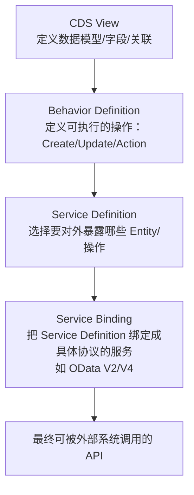
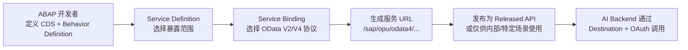
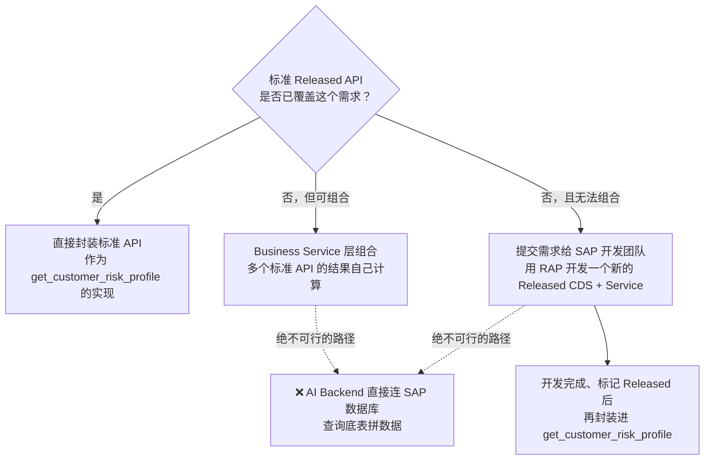
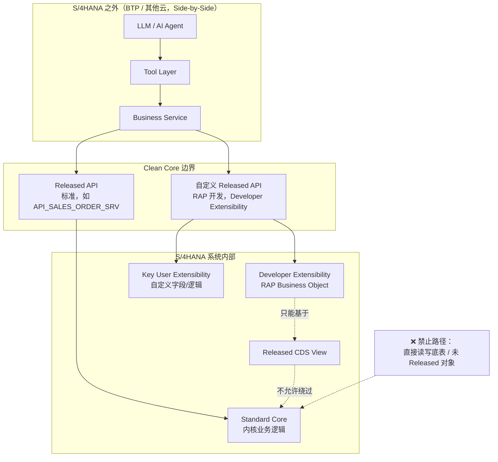

# Part 21：SAP Clean Core + Released API + ABAP Cloud + RAP

Part 5 讲了"怎么调用 SAP API"，但没回答一个更根本的问题：**当标准 API 没有你需要的字段/能力时，该怎么办？** 很多有传统 SAP 集成经验的人（尤其是从 ECC 时代过来的）第一反应是"那就直接读底表 `VBAK`/`VBAP`，或者写个自定义 Function Module"。在现代 S/4HANA 项目里，这个反应在架构上是**错误的**，本章解释为什么，以及正确的路径是什么。

## 21.1 什么是 Clean Core

**Clean Core** 是 SAP 官方推广的一套架构原则：**S/4HANA 的标准代码（Standard）和客户的自定义逻辑（Custom）要严格分离**，自定义扩展只能通过 SAP 明确开放的、有稳定性承诺的接口点进行，不允许直接修改标准对象、直接读写标准表、或者用不受支持的方式侵入内核。

它不是一句口号，而是有具体的技术抓手：Released API、Released CDS View、Key User/Developer Extensibility 框架、ABAP Cloud 开发模型等，都是"如何在不破坏 Clean Core 原则的前提下做扩展"的具体实现路径。

## 21.2 Clean Core 不等于"SAP 什么都不能改"

这是一个常见的误解，需要先纠正：

| 误解 | 实际情况 |
|---|---|
| "Clean Core 就是不让客户做任何自定义开发" | ❌ 错。Clean Core 允许扩展，只是**扩展必须走规定的路径**（Released API、Extensibility 框架），而不是随意修改标准对象或直接改表 |
| "Clean Core 只是 Public Cloud 的事，On-Premise 不用管" | ❌ 不准确。Clean Core 是 SAP 面向所有 S/4HANA 形态（尤其是走 RISE with SAP 的客户）倡导的长期方向，On-Premise/Private Cloud 虽然技术上仍然有更大自由度（能直接改表、能用经典 BAPI/RFC），但**为了未来能顺利升级、迁移到云、减少技术债**，同样建议尽量遵循 Clean Core 原则，只是约束的强制程度不同 |
| "遵循 Clean Core 就意味着功能受限，做不了定制业务" | ❌ 不对。Clean Core 明确提供了 Key User Extensibility、Developer Extensibility（ABAP Cloud）、Side-by-Side Extension 这几条正式扩展路径（见 21.11），足以覆盖绝大多数企业定制需求，只是需要换一种"在边界内扩展"的思路 |

**一句话理解：Clean Core 限制的是"怎么改"，不是"能不能改"。**

## 21.3 Standard API / Released API / Released CDS View / Released Business Object

| 概念 | 说明 |
|---|---|
| Standard（标准对象） | SAP 交付的内核代码、标准表、标准逻辑，本身不对外提供稳定性承诺，SAP 可能在任意版本升级中调整其内部实现 |
| Released API | SAP 明确把某个 API 的 **API State** 标记为 "Released"（区别于未发布/Deprecated），可以在 SAP API Business Accelerator Hub 上查到，本教程 Part 5 讲的 `API_SALES_ORDER_SRV` 就属于这一类 |
| Released CDS View | 被标记为 Released 的 Core Data Services 视图，只有 Released 的 CDS View 才被允许作为自定义开发（如 RAP）的基础 |
| Released Business Object | 在 RAP（21.8）语境下，一个业务对象（如 Sales Order）如果被标记为 Released，意味着它的 Behavior Definition、关联的 Service 具备明确的兼容性承诺，可以放心基于它做扩展或消费 |

**"Released" 只是第一层判断（这个对象是否可以被消费/扩展），第二层更重要的判断是：它具体挂的是哪一种 Release Contract（21.4）**——这决定了"允许在这个对象上做什么"以及"未来会有怎样的兼容性保证"，不是所有 Released 对象都能同样使用。

**如何在实际系统里核实一个对象是否 Released、挂的是哪种 Contract**：应该在 **ABAP Development Tools (ADT)** 里查看该对象的 **API State** 和 **Release Contract** 标注，或在 SAP API Business Accelerator Hub 上查看对应服务的发布状态，⚠️ 具体查询路径和 UI 随 ABAP 平台版本演进，请以你系统当前的官方文档和 ADT 实际显示为准。**不要用某个 CDS Annotation（如某些用于建模目的的 `@ObjectModel.*` 系列注解）来判断一个对象是否 Released**——这类注解通常服务于其他建模用途（比如描述业务对象的语义角色），并不等同于官方的 API State/Release Contract 标注，两者不能混为一谈。

## 21.4 Release Contract：不是单一的稳定性等级

**这是本章最容易被简化误解的地方，需要重点澄清：Released 不代表"从此这个对象的一切都被冻结、永远不变"，而是对应一个具体的 Release Contract，不同 Contract 对兼容性和生命周期稳定性的承诺是不同的。** SAP 的 ABAP Cloud / Release Contract 体系里，至少包含以下几种（⚠️ 以下定义基于 SAP 官方 ABAP Keyword Documentation 的公开说明整理，具体条款、是否还有更多 Contract 类型、以及各版本平台上的实际适用范围，请以你所在系统当前的官方文档为准，不要照搬本表当作某个具体系统的最终结论）：

| Release Contract | 定位 | 兼容性承诺要点 |
|---|---|---|
| **C0 — Extend** | 在 API 中预留的、明确允许被扩展的"扩展点"（Extension Point） | 保证扩展点本身的稳定性，可能进一步限定只能用于 Key User Apps 扩展、还是也允许 Cloud Development 扩展 |
| **C1 — Use System-Internally**（系统内部使用） | 面向 **ABAP Cloud 内部消费**——即同一系统内的自定义 ABAP Cloud 开发可以依赖它 | 保证一个"技术上稳定"的接口：已有的参数/字段/到其他 Released 对象的关联及其数据类型不会被移除或改变；未来版本可能新增可选的参数/字段/关联 |
| **C2 — Use as Remote API**（远程 API 使用） | 面向 **Remote API / Side-by-Side Extension** 这类系统外部消费场景——本教程"AI Backend 在 BTP 上调用 SAP API"正对应这一类 | 承诺比 C1 更严格：同样允许新增可选元素，但**已有元素/参数不允许被修改，且不允许做"元素/参数的延伸变更"**，目的是保证外部消费方在系统升级后完全不需要调整 |
| **C3 — Manage Configuration Content**（配置内容管理，⚠️ 需按官方文档核实覆盖场景） | 面向需要被导出/导入/编辑的自定义配置类持久化对象（如 Customizing 类数据表） | 承诺持久化结构（尤其 Key 字段）的稳定性：已有字段（尤其 Key）一旦发布不允许再变更，允许后续新增非 Key 字段 |

**对 AI + SAP 项目的重点提示**：
- **C1（系统内部使用）主要服务于 ABAP Cloud 内部消费场景**——比如你在 SAP 系统内部用 Developer Extensibility（21.11）开发的自定义逻辑，去消费另一个 C1 对象，这属于"系统内部"场景。
- **C2（远程 API）才是本教程"AI Backend 作为 Side-by-Side Extension 调用 SAP"这类场景应该关注的目标契约**——只有明确挂了 C2 契约的 API，才被官方认为适合给外部/远程系统消费。如果一个对象只挂了 C1，理论上不代表它对外部系统调用同样安全可靠，应该谨慎评估或寻找是否有对应的 C2 版本服务。

**不要把 Released 对象的兼容性描述成"字段永远不会删除、类型永远不会变"这种笼统的绝对承诺**——准确的说法是：**不同 Release Contract 对 compatibility / lifecycle stability 的承诺范围和严格程度不同，必须按对象实际挂载的具体 Contract，判断哪些变化届时会被官方认定为 breaking change、哪些属于契约允许的兼容性演进（如新增可选字段）。** 这个区分直接影响 Part 25.12 的 Contract Test 应该如何设计——如果依赖的是 C2 对象，"新增可选字段"通常不应该被判定为 breaking change 而阻断部署；但如果发现已有字段被修改/移除，无论挂的是 C1 还是 C2，都应该被判定为契约破坏。

这正是 Part 25（环境与契约测试）里"API Contract Drift"问题的根源之一：**依赖 Released 对象、并理解它挂载的具体 Release Contract，是防止契约漂移的第一道防线**，Part 25 讲的 contract test 是第二道防线（万一 Released 对象本身也发生了契约允许范围之外的意外变化）。

## 21.5 为什么 Public Cloud / ABAP Cloud 环境不能随意直接访问底表

| 原因 | 说明 |
|---|---|
| 技术上被禁止 | S/4HANA Cloud Public Edition（以及走 ABAP Cloud 开发模型的环境）从平台层面就不允许自定义代码直接读写标准数据库表，只能通过 Released CDS View/API 访问数据——这不是"建议"，是硬性技术限制 |
| 升级安全 | SAP 采用统一的多租户云架构，客户的自定义扩展如果能直接碰底表，一次 SAP 侧的内核升级就可能让所有客户的扩展同时失效，这与云服务"持续、无缝升级"的商业承诺是矛盾的 |
| 数据一致性 | 标准业务逻辑（Sales Area 校验、Pricing、ATP 等）往往不只是"写一行表"，而是伴随大量校验、日志、关联更新的复杂事务；直接写表会绕过这些业务逻辑，产生数据不一致 |
| 安全边界 | 底表往往包含比 API 暴露出来的字段更多、更敏感的信息，直接访问底表容易造成过度暴露 |

Private Cloud/On-Premise 场景技术上仍然可能做到直接读表（尤其是**只读**场景，如报表类需求），但即使技术上可行，也不建议在"AI + SAP"这类需要长期维护、频繁迭代的项目里这样做——原因见 21.6。

## 21.6 "直接读 VBAK/VBAP" 思维为什么要谨慎

`VBAK`（销售凭证抬头表）、`VBAP`（销售凭证行项目表）是 ECC 时代非常经典的"顾问和 ABAP 开发者张口就来"的表名。在现代项目里，即使技术上还能连上（比如某些 On-Premise 系统仍然允许），也应该谨慎使用，原因：

1. **S/4HANA 的很多经典表在底层已经变成了 Compatibility View**（为了向后兼容旧程序而保留的视图，⚠️ 具体哪些表是原生表、哪些是兼容视图，随 S/4HANA 版本而异，需要核实），性能和语义可能与 ECC 时代不完全一致。
2. **底表结构不受任何 Release Contract 约束**——它既没有被标记为 Released，也就谈不上挂载 C0/C1/C2 中的任何一种兼容性承诺，SAP 完全有权在未来版本中调整这些表的内部结构，你的 AI Backend 如果依赖这些表，随时可能在下一次系统升级后悄无声息地出错。
3. **读表拿到的是"原始数据"，不是"业务语义"**——比如订单的信用冻结状态、定价结果，往往分散在多张关联表中，需要复现 SAP 内核的一整套计算逻辑才能得出正确结论；而 Released API/CDS View 已经把这些逻辑封装好了，直接给你计算好的业务结果。**这与 Part 1.6"Credit Check/ATP/Pricing 必须由 SAP 权威计算，后端不能重新实现"是同一条原则的另一种体现**——直接读表本质上就是"绕过 SAP 计算逻辑，自己拼凑结果"的一种形式，风险类似。

## 21.7 什么是 ABAP Cloud

**ABAP Cloud** 是 SAP 面向云原生场景重新定义的 ABAP 开发模型：开发者只能使用 ABAP 语言的一个受限子集（去掉了大量与底层技术强耦合、有安全或稳定性风险的经典语法），只能基于 Released API/CDS View 进行开发，代码运行在被称为 **ABAP Environment** 的隔离运行时中（无论是 S/4HANA Cloud Public Edition，还是 BTP 上的 ABAP Environment / Steampunk）。它是"Clean Core 原则"在开发工具和语言层面的具体落地。

## 21.8 什么是 RAP（ABAP RESTful Application Programming Model）

**RAP** 是 ABAP Cloud 开发模型下用来构建业务对象（Business Object）和暴露 API 的官方框架，取代了经典的 BOPF（Business Object Processing Framework）等更早期的模型。它的核心思路是：**用声明式的方式定义一个业务对象的数据模型、行为（Create/Update/Delete/自定义 Action）、以及如何对外暴露为服务**，框架自动生成大量样板代码（事务处理、锁管理、草稿处理、OData 服务生成等）。

## 21.9 CDS View、Behavior Definition、Service Definition、Service Binding 的关系

| 组件 | 职责 |
|---|---|
| CDS View | 定义业务对象的数据结构：字段、关联（Association）、计算逻辑（如虚拟字段）。是整个 RAP 对象的数据地基 |
| Behavior Definition | 在 CDS View 之上定义这个对象"能做什么"：标准操作（Create/Update/Delete）、自定义 Action（如"审批""冻结"）、校验（Validation）、决定逻辑（Determination）、字段控制 |
| Service Definition | 从一个（或多个关联的）Behavior Definition 中，挑选出哪些 Entity/字段/操作要对外暴露，相当于"服务契约的草稿" |
| Service Binding | 把 Service Definition 绑定为具体的对外协议（最常见是 OData V2/V4，也可以绑定为 Web API 等其他形式），生成真正可以被 HTTP 调用的服务端点 |

**需要澄清的一点：不能反过来说"看到 OData 就说明底层一定是 RAP"。** RAP 是**现代 ABAP Cloud / Developer Extensibility 场景下新建业务服务的主流和官方推荐路径**，但 SAP 生态里同样存在大量历史上通过其他方式实现的标准 OData API——比如更早期基于经典 SAP Gateway 框架、或基于 SADL（Service Adaptation Description Language）等实现方式暴露的服务，这些服务同样可以是 Released、同样可以在 API Business Accelerator Hub 上查到。换句话说，**"这是一个 OData 服务"这件事本身不能反推出它的底层实现一定是 RAP 生成链**，具体某个服务是怎么实现的，属于 SAP 内部的实现细节，你不需要也通常无法从外部调用方视角确认。

**理解本节这条链路的意义**：如果你的项目需要**新建**一个自定义服务（走 Developer Extensibility），RAP 是当前应该采用的官方路径，理解 CDS → Behavior Definition → Service Definition → Service Binding 这条链，能帮你判断"这个字段能不能改""这个操作能不能扩展"这类问题该去 SAP 里的哪个环节找答案，而不是病急乱投医去改底表；但**这条链路描述的是"你自己新建服务时应该怎么做"，不是"所有你在 Business Accelerator Hub 上看到的现有 OData 服务背后都是这么实现的"这一断言**。

## 21.10 RAP Business Object 如何最终暴露成 OData API

一个 RAP Business Object 从"定义"到"可被 AI Backend 调用"的完整链路：

这和 Part 5 讲的"消费一个标准 OData 服务"在**调用方式上完全一样**（都是标准 OData 协议、都要走 CSRF Token/OAuth、都要看 `$metadata`）——区别只在于这个服务的"来源"：一个是 SAP 交付的标准服务，一个是你的 ABAP 开发团队按照 RAP 规范自己开发、并（如果需要）标记为 Released 的自定义服务。**对 AI Backend 和 Tool 层来说，这两者应该被一视同仁地对待**，都通过 SapClient/Adapter 层封装，不应该在 Tool 定义或 Prompt 里区分"这是标准的还是自定义的"。

## 21.11 三种扩展路径：Key User Extensibility / Developer Extensibility / Side-by-Side Extension

| 扩展方式 | 适合谁 | 能力范围 | 部署位置 |
|---|---|---|---|
| **Key User Extensibility** | 业务/半技术型用户（Power User），不需要专业 ABAP 开发能力 | 轻量级：自定义字段、自定义逻辑（简单的公式/条件）、自定义 CDS 视图片段、UI 调整 | S/4HANA 系统内，通过 Fiori 应用（如"自定义字段和逻辑"应用）配置 |
| **Developer Extensibility（ABAP Cloud）** | 专业 ABAP 开发者 | 完整的 RAP 开发能力：新建业务对象、自定义 Action、复杂业务逻辑，但必须只用 Released API/CDS View 作为基础，且只能用 ABAP Cloud 语言子集 | S/4HANA 系统内（in-app extension） |
| **Side-by-Side Extension** | 专业开发者（不限语言，可用 Node.js/Java/Python 等） | 最大自由度：可以调用 SAP 的 Released API，可以整合非 SAP 系统数据，可以用任意技术栈实现复杂业务逻辑/AI 能力 | SAP BTP（独立于 S/4HANA 系统之外部署） |

**"AI + SAP"项目的自然定位**：AI Agent Backend、Business Service 层、Tool 层，几乎总是应该作为 **Side-by-Side Extension** 部署在 BTP 上（或其他云平台），而不是塞进 S/4HANA 系统内部——这与 Part 1、Part 16 的架构分层是完全一致的，本节只是从"SAP 扩展性框架"这个角度重新印证了同一个结论。

## 21.12 决策表：什么时候用哪种方式

| 场景 | 推荐方式 |
|---|---|
| 需要的数据/能力已经有 Released API 覆盖 | ✅ 直接使用 Released API（Part 5、Part 6） |
| 标准 API 没有覆盖，但可以通过组合多个标准 API 拼出来 | ✅ 在 Business Service 层组合多次调用（不要动 SAP 内部） |
| 标准 API 完全没有覆盖，需要 SAP 内部新增一个业务对象/服务 | ✅ 走 Developer Extensibility，用 RAP 开发一个新的、自己 Release 的服务 |
| 只需要几个自定义字段或简单公式级别的定制 | ✅ Key User Extensibility 就够了，不需要动用完整开发流程 |
| 需要整合非 SAP 数据源、需要用 AI/复杂算法、需要独立于 SAP 版本周期迭代 | ✅ Side-by-Side Extension（BTP），这正是 AI Agent Backend 的位置 |
| 目标系统是 ECC 或老版本 On-Premise，没有 RAP/ABAP Cloud 能力 | ⚠️ 退回经典 BAPI/RFC（Part 6），但仍应把它封装在 Adapter 层，不直接暴露给 Tool/LLM |
| "标准 API 没有某个字段，干脆直接读底表" | ❌ 不允许，这是本章要纠正的反模式 |

## 21.13 示例：AI Tool `get_customer_risk_profile`

假设 AI 助手需要一个"获取客户风险画像"的只读能力（这是一个**教学用的假设场景**，不代表任何真实 SAP 标准 API 名称）：

无论走哪条路径，**AI Backend/Tool 层的实现细节都不应该让 LLM 感知**——`get_customer_risk_profile` 对模型来说永远只是一个业务语义清晰的只读工具，背后是标准 API、组合调用、还是新开发的 RAP 服务，属于 Adapter 层的实现细节（与 Part 6.5、Part 7.4 的 Tool Abstraction Layer 原则完全一致）。

## 21.14 错误做法 vs 正确做法

| 场景 | ❌ 错误做法 | ✅ 正确做法 |
|---|---|---|
| 标准 API 缺少某个字段 | AI Backend 直接连数据库读底表补字段 | 评估是否可以通过其他 Released API/CDS 组合获得；若确实没有，提交需求走 Developer Extensibility 开发一个新的 Released 服务 |
| 需要一个简单的自定义计算字段 | 找 ABAP 顾问在标准程序里"打补丁" | 用 Key User Extensibility 加自定义字段/逻辑，不侵入标准代码 |
| AI Backend 需要整合 SAP 数据和第三方系统 | 在 S/4HANA 内部写自定义程序调用外部 HTTP 接口 | 在 BTP 上用 Side-by-Side Extension 实现，S/4HANA 只暴露 Released API 供其消费 |
| 项目临时需要一个数据探索/报表查询 | 直接连生产库跑 SQL | 使用只读的 Released CDS View（通常有专门面向分析场景的 CDS View 类型），或走 SAP 官方的报表/分析工具 |
| 系统升级后 AI Backend 突然报错 | 排查很久才发现是因为读了未 Released 的内部表，表结构变了 | 从一开始就只依赖 Released API/CDS，配合 Part 25 的 Contract Test 提前在 CI 中发现潜在变化 |

## 21.15 现代 AI + SAP Clean Core 架构总览

这张图和 Part 1.3 的分层图、Part 16 的生产架构图，看的是同一套系统的不同侧面：Part 1/16 关注"谁调用谁、Trust Boundary 在哪"，本图关注"在 SAP 内部，什么能碰、什么不能碰"。三张图放在一起，才是"AI + SAP"项目完整的架构认知。

## 21.16 项目中你需要记住什么

- Clean Core 限制的是"怎么改"，不是"能不能改"——遇到标准 API 不够用的情况，第一反应应该是"走哪条正式扩展路径"，而不是"想办法绕过去"。
- 判断一个 API/CDS View/Business Object 能不能长期依赖，标准是看它是否 Released、以及它具体挂的是哪种 Release Contract（C0/C1/C2/C3，21.4）——尤其要认清 C1（系统内部）和 C2（远程 API）的区别，这直接决定了你的 AI Backend 在 SAP 升级后是否会莫名其妙地崩溃，以及哪些字段变化算是契约允许的兼容性演进、哪些算是破坏性变更。
- 直接读 `VBAK`/`VBAP` 这类底表在现代项目（尤其 Public Cloud/ABAP Cloud）里通常被平台直接禁止，即使技术上可行（On-Premise），也不建议这样做——原因和"Credit Check/ATP/Pricing 不能后端重算"是同一条原则的延伸。
- AI Agent Backend/Business Service 层应该定位为 Side-by-Side Extension，部署在 BTP 或其他云上，而不是塞进 S/4HANA 系统内部。
- 无论最终能力来自标准 Released API 还是自定义 RAP 服务，Tool 层对 LLM 暴露的接口都应该保持业务语义化、不泄漏底层实现细节——这是 Tool Abstraction Layer 原则在 Clean Core 语境下的又一次印证。
