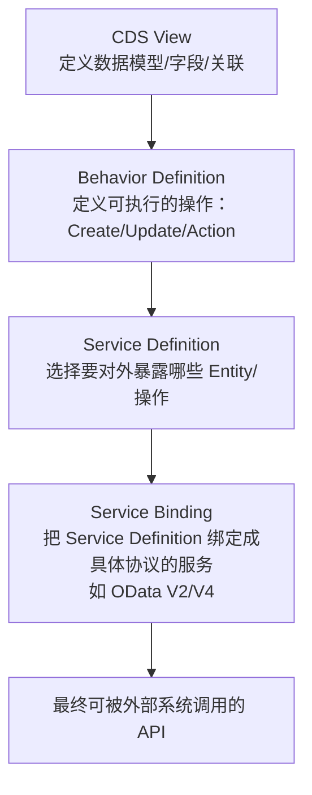
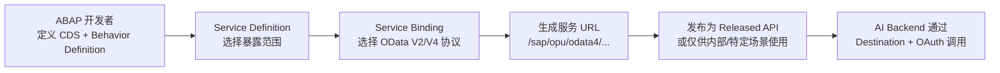
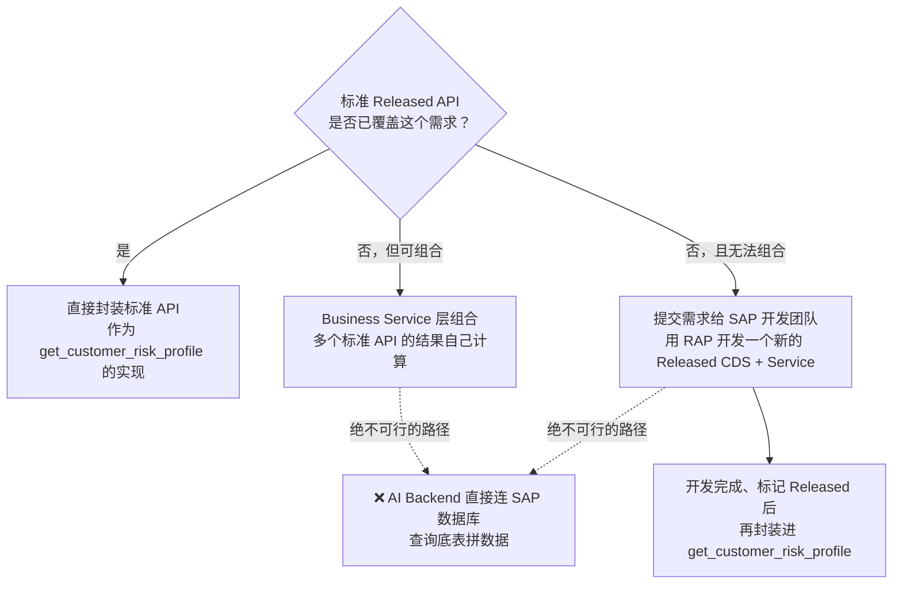
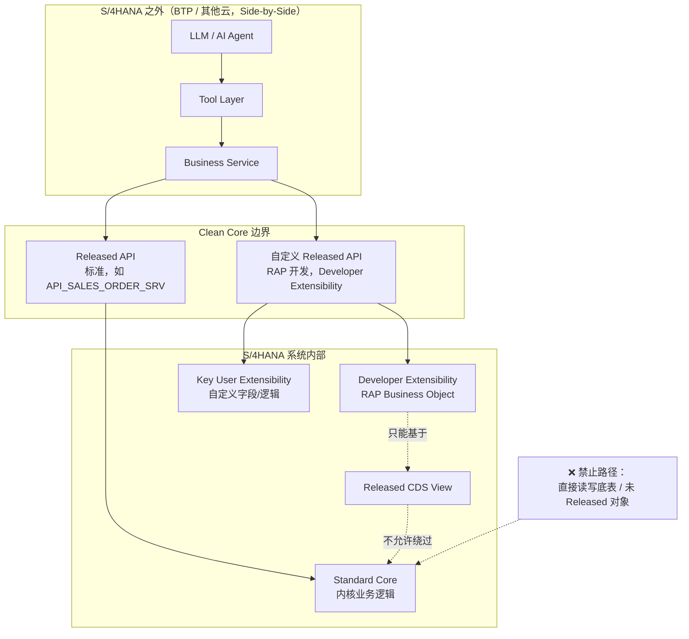

# Part 21：SAP Clean Core + Released API + ABAP Cloud + RAP

Part 5 讲了"怎么调用 SAP API"，但没回答一个更根本的问题：**当标准 API 没有你需要的字段/能力时，该怎么办？** 很多有传统 SAP 集成经验的人（尤其是从 ECC 时代过来的）第一反应是"那就直接读底表 `VBAK`/`VBAP`，或者写个自定义 Function Module"。在现代 S/4HANA 项目里，这个反应在架构上是**错误的**，本章解释为什么，以及正确的路径是什么。

Part 5では「SAP APIをどう呼び出すか」を説明しましたが、より根本的な問いには答えていません：**標準APIに必要なフィールド/機能がない場合、どうすればよいか？** 従来のSAP統合経験を持つ人の多く（特にECC時代から来た人）の最初の反応は「それなら直接底層テーブル `VBAK`/`VBAP` を読むか、カスタムのFunction Moduleを書けばいい」というものです。現代のS/4HANAプロジェクトでは、この反応はアーキテクチャ上**間違っています**。本章ではその理由と正しい進め方を説明します。

## 21.1 什么是 Clean Core（21.1 Clean Coreとは何か）

**Clean Core** 是 SAP 官方推广的一套架构原则：**S/4HANA 的标准代码（Standard）和客户的自定义逻辑（Custom）要严格分离**，自定义扩展只能通过 SAP 明确开放的、有稳定性承诺的接口点进行，不允许直接修改标准对象、直接读写标准表、或者用不受支持的方式侵入内核。

**Clean Core** はSAP公式が推進するアーキテクチャ原則であり、**S/4HANAの標準コード（Standard）と顧客のカスタムロジック（Custom）を厳格に分離する**というものです。カスタム拡張はSAPが明確に開放し、安定性を保証したインターフェースポイントを通じてのみ行うことができ、標準オブジェクトを直接変更したり、標準テーブルを直接読み書きしたり、サポートされていない方法でカーネルに侵入したりすることは許されません。

它不是一句口号，而是有具体的技术抓手：Released API、Released CDS View、Key User/Developer Extensibility 框架、ABAP Cloud 开发模型等，都是"如何在不破坏 Clean Core 原则的前提下做扩展"的具体实现路径。

これは単なるスローガンではなく、具体的な技術的手段があります：Released API、Released CDS View、Key User/Developer Extensibilityフレームワーク、ABAP Cloud開発モデルなどはいずれも「Clean Coreの原則を破壊せずに拡張を行う方法」の具体的な実装パスです。

## 21.2 Clean Core 不等于"SAP 什么都不能改"（21.2 Clean Coreは「SAPは何も変更できない」ということではない）

这是一个常见的误解，需要先纠正：

これはよくある誤解であり、まず訂正しておく必要があります：

| 误解 誤解 | 实际情况 実際の状況 |
|---|---|
| "Clean Core 就是不让客户做任何自定义开发" 「Clean Coreとは顧客に一切のカスタム開発をさせないことだ」 | ❌ 错。Clean Core 允许扩展，只是**扩展必须走规定的路径**（Released API、Extensibility 框架），而不是随意修改标准对象或直接改表 ❌ 誤り。Clean Coreは拡張を許可しますが、**拡張は定められた経路を通らなければならない**（Released API、Extensibilityフレームワーク）というだけであり、標準オブジェクトを勝手に変更したりテーブルを直接変更したりするものではありません |
| "Clean Core 只是 Public Cloud 的事，On-Premise 不用管" 「Clean CoreはPublic Cloudだけの話で、On-Premiseは気にしなくていい」 | ❌ 不准确。Clean Core 是 SAP 面向所有 S/4HANA 形态（尤其是走 RISE with SAP 的客户）倡导的长期方向，On-Premise/Private Cloud 虽然技术上仍然有更大自由度（能直接改表、能用经典 BAPI/RFC），但**为了未来能顺利升级、迁移到云、减少技术债**，同样建议尽量遵循 Clean Core 原则，只是约束的强制程度不同 ❌ 不正確。Clean Coreはすべての S/4HANA形態（特にRISE with SAPを利用する顧客）に向けてSAPが提唱する長期的な方向性であり、On-Premise/Private Cloudは技術的にはより大きな自由度がある（テーブルを直接変更できる、従来のBAPI/RFCを使える）ものの、**将来のスムーズなアップグレードやクラウドへの移行、技術的負債の削減のためには**、同様にできる限りClean Coreの原則に従うことが推奨されます。ただし制約の強制力の程度が異なるだけです |
| "遵循 Clean Core 就意味着功能受限，做不了定制业务" 「Clean Coreに従うことは機能が制限され、カスタム業務ができないことを意味する」 | ❌ 不对。Clean Core 明确提供了 Key User Extensibility、Developer Extensibility（ABAP Cloud）、Side-by-Side Extension 这几条正式扩展路径（见 21.11），足以覆盖绝大多数企业定制需求，只是需要换一种"在边界内扩展"的思路 ❌ 誤り。Clean CoreはKey User Extensibility、Developer Extensibility（ABAP Cloud）、Side-by-Side Extensionという正式な拡張経路を明確に提供しており（21.11参照）、大多数の企業のカスタマイズ要件をカバーするのに十分です。ただし「境界内で拡張する」という考え方に切り替える必要があるだけです |

**一句话理解：Clean Core 限制的是"怎么改"，不是"能不能改"。**

**一言で理解すると：Clean Coreが制限しているのは「どう変更するか」であり、「変更できるかどうか」ではありません。**

## 21.3 Standard API / Released API / Released CDS View / Released Business Object

| 概念 概念 | 说明 説明 |
|---|---|
| Standard（标准对象） Standard（標準オブジェクト） | SAP 交付的内核代码、标准表、标准逻辑，本身不对外提供稳定性承诺，SAP 可能在任意版本升级中调整其内部实现 SAPが提供するカーネルコード、標準テーブル、標準ロジックであり、それ自体は対外的な安定性の保証を提供せず、SAPは任意のバージョンアップグレードでその内部実装を調整する可能性がある |
| Released API | SAP 明确把某个 API 的 **API State** 标记为 "Released"（区别于未发布/Deprecated），可以在 SAP API Business Accelerator Hub 上查到，本教程 Part 5 讲的 `API_SALES_ORDER_SRV` 就属于这一类 SAPがあるAPIの **API State** を明確に "Released" とマークしたもの（未公開/Deprecatedと区別される）で、SAP API Business Accelerator Hub上で確認できます。本教材のPart 5で説明した `API_SALES_ORDER_SRV` はこのカテゴリに属します |
| Released CDS View | 被标记为 Released 的 Core Data Services 视图，是 ABAP Cloud 自定义开发（如 RAP）优先应该消费的对象类型——但"Released"本身不是唯一的判断条件，见下方澄清 Releasedとマークされた Core Data Services ビューであり、ABAP Cloudのカスタム開発（RAPなど）が優先的に消費すべきオブジェクトタイプです——ただし「Released」自体が唯一の判断条件ではありません。下記の補足を参照 |
| Released Business Object | 在 RAP（21.8）语境下，一个业务对象（如 Sales Order）如果被标记为 Released，意味着它的 Behavior Definition、关联的 Service 具备明确的兼容性承诺，可以放心基于它做扩展或消费 RAP（21.8）の文脈において、あるビジネスオブジェクト（Sales Orderなど）がReleasedとマークされている場合、そのBehavior Definitionや関連するServiceが明確な互換性の保証を備えており、安心してそれを基に拡張または消費できることを意味します |

**"Released" 只是第一层判断（这个对象是否可以被消费/扩展），第二层更重要的判断是：它具体挂的是哪一种 Release Contract（21.4）**——这决定了"允许在这个对象上做什么"以及"未来会有怎样的兼容性保证"，不是所有 Released 对象都能同样使用。

**「Released」は第一層の判断（このオブジェクトが消費/拡張可能かどうか）にすぎず、より重要な第二層の判断は、それが具体的にどのRelease Contract（21.4）に紐づいているかです**——これが「このオブジェクト上で何をすることが許されるか」および「将来どのような互換性保証があるか」を決定します。すべてのReleasedオブジェクトが同じように使えるわけではありません。

**如何在实际系统里核实一个对象是否 Released、挂的是哪种 Contract**：应该在 **ABAP Development Tools (ADT)** 里查看该对象的 **API State** 和 **Release Contract** 标注，或在 SAP API Business Accelerator Hub 上查看对应服务的发布状态，⚠️ 具体查询路径和 UI 随 ABAP 平台版本演进，请以你系统当前的官方文档和 ADT 实际显示为准。**不要用某个 CDS Annotation（如某些用于建模目的的 `@ObjectModel.*` 系列注解）来判断一个对象是否 Released**——这类注解通常服务于其他建模用途（比如描述业务对象的语义角色），并不等同于官方的 API State/Release Contract 标注，两者不能混为一谈。

**実際のシステムであるオブジェクトがReleasedかどうか、どのContractに紐づいているかを確認する方法**：**ABAP Development Tools (ADT)** でそのオブジェクトの **API State** と **Release Contract** の注記を確認するか、SAP API Business Accelerator Hubで対応するサービスの公開状態を確認する必要があります。⚠️具体的な確認経路とUIはABAPプラットフォームのバージョンとともに進化するため、お使いのシステムの現在の公式ドキュメントとADTの実際の表示を基準にしてください。**あるCDS Annotation（例えばモデリング目的で使われる一部の `@ObjectModel.*` 系の注釈）を使ってオブジェクトがReleasedかどうかを判断してはいけません**——この種の注釈は通常、別のモデリング用途（ビジネスオブジェクトの意味的な役割の記述など）に使われており、公式のAPI State/Release Contractの注記とは異なります。両者を混同してはいけません。

**重要澄清：不要把"Released"理解成一个可以在任何场景下随便用的万能通行证。** 在 ABAP Cloud / restricted ABAP language version 下消费 SAP 提供的对象时，"Released"只是判断能否使用的**起点**，还需要同时确认：

**重要な補足：「Released」を、どんな場面でも自由に使える万能なパスポートだと理解してはいけません。** ABAP Cloud / restricted ABAP language version の下でSAPが提供するオブジェクトを消費する際、「Released」は使用可能かどうかを判断する**出発点**にすぎず、以下も同時に確認する必要があります：

- **API State**：对象是否真的处于 Released（而不是仍在孵化、或已 Deprecated）。 **API State**：オブジェクトが本当にReleased状態にあるか（まだインキュベーション中、またはすでにDeprecatedではないか）。
- **Release Contract**（21.4）：具体挂的是 C0-C4 中的哪一种，决定了这个对象**适合被谁、以什么方式消费**。 **Release Contract**（21.4）：具体的にC0～C4のどれに紐づいているかが、このオブジェクトが**誰に、どのような方法で消費されるのに適しているか**を決定します。
- **Visibility（可见性）**：该对象在当前场景下是否对你的开发上下文可见/可用。 **Visibility（可視性）**：そのオブジェクトが現在のシナリオにおいて、あなたの開発コンテキストから可視/利用可能かどうか。
- **当前 ABAP Language Version**：ABAP Cloud 的受限语言版本下能消费的对象范围，本身就比经典 ABAP 语言版本更窄。 **現在の ABAP Language Version**：ABAP Cloudの制限された言語バージョンで消費できるオブジェクトの範囲は、それ自体が従来のABAP言語バージョンよりも狭くなっています。
- **Software Component / 具体使用场景**：同一个对象在不同的消费场景（系统内部开发 vs. 远程集成）下，"合适"的判断标准并不相同。 **Software Component / 具体的な利用シナリオ**：同じオブジェクトでも、異なる消費シナリオ（システム内部開発 vs. リモート統合）では、「適切」の判断基準が異なります。

具体来说：**系统内部的 ABAP Cloud 开发，通常应该重点关注适合内部消费的 Released 对象（对应 C1 契约）；而本教程关注的远程 Side-by-Side Integration（AI Backend 从 BTP 调用 SAP），应该重点关注适合 Remote API 消费的 C2 契约对象。"Released"本身不是唯一判断条件，还必须进一步确认它的 Release Contract 和 Visibility 是否允许你当前的消费场景**——一个只挂了 C1 契约的 Released CDS View，即使技术上"已发布"，也不代表它适合被 AI Backend 这种远程调用方直接消费。

具体的には：**システム内部のABAP Cloud開発では、通常、内部消費に適したReleasedオブジェクト（C1契約に対応）に重点を置くべきです。一方、本教材が焦点を当てるリモートのSide-by-Side Integration（AI BackendがBTPからSAPを呼び出す）では、Remote API消費に適したC2契約のオブジェクトに重点を置くべきです。「Released」自体は唯一の判断条件ではなく、そのRelease ContractとVisibilityが現在の消費シナリオを許可しているかどうかをさらに確認しなければなりません**——C1契約のみが紐づいたReleased CDS Viewは、技術的に「公開済み」であっても、AI Backendのようなリモート呼び出し元が直接消費するのに適しているとは限りません。

## 21.4 Release Contract：不是单一的稳定性等级（Release Contract：単一の安定性レベルではない）

**这是本章最容易被简化误解的地方，需要重点澄清：Released 不代表"从此这个对象的一切都被冻结、永远不变"，而是对应一个具体的 Release Contract，不同 Contract 对兼容性和生命周期稳定性的承诺是不同的。** SAP 的 ABAP Cloud / Release Contract 体系里，至少包含以下几种（⚠️ 以下定义基于 SAP 官方 ABAP Keyword Documentation 的公开说明整理，具体条款、是否还有更多 Contract 类型、以及各版本平台上的实际适用范围，请以你所在系统当前的官方文档为准，不要照搬本表当作某个具体系统的最终结论）：

**これは本章で最も単純化されて誤解されやすい箇所であり、重点的に補足が必要です：Releasedは「このオブジェクトのすべてが今後永久に凍結され、一切変わらない」ことを意味するのではなく、具体的なRelease Contractに対応しており、Contractが異なれば互換性とライフサイクル安定性に対する保証も異なります。** SAPのABAP Cloud / Release Contract体系には、少なくとも以下のようなものがあります（⚠️以下の定義はSAP公式のABAP Keyword Documentationの公開情報を整理したものであり、具体的な条項、さらに多くのContractタイプの有無、および各バージョンのプラットフォームでの実際の適用範囲は、お使いのシステムの現在の公式ドキュメントを基準にしてください。本表を特定システムの最終結論としてそのまま流用しないでください）：

| Release Contract | 定位 位置づけ | 兼容性承诺要点 互換性保証のポイント |
|---|---|---|
| **C0 — Extend** | 在 API 中预留的、明确允许被扩展的"扩展点"（Extension Point） APIの中に予約され、明確に拡張が許可された「拡張ポイント」（Extension Point） | 保证扩展点本身的稳定性，可能进一步限定只能用于 Key User Apps 扩展、还是也允许 Cloud Development 扩展 拡張ポイント自体の安定性を保証する。Key User Appsの拡張にのみ使用可能か、Cloud Developmentの拡張も許可するかがさらに限定される場合がある |
| **C1 — Use System-Internally**（系统内部使用） **C1 — Use System-Internally**（システム内部使用） | 面向 **ABAP Cloud 内部消费**——即同一系统内的自定义 ABAP Cloud 开发可以依赖它 **ABAP Cloud内部消費**向け——同一システム内のカスタムABAP Cloud開発がそれに依存できる | 保证一个"技术上稳定"的接口：已有的参数/字段/到其他 Released 对象的关联及其数据类型不会被移除或改变；未来版本可能新增可选的参数/字段/关联 「技術的に安定した」インターフェースを保証する：既存のパラメータ/フィールド/他のReleasedオブジェクトへの関連およびそのデータ型は削除・変更されない。将来のバージョンではオプションのパラメータ/フィールド/関連が新たに追加される可能性がある |
| **C2 — Use as Remote API**（远程 API 使用） **C2 — Use as Remote API**（リモートAPI使用） | 面向 **Remote API / Side-by-Side Extension** 这类系统外部消费场景——本教程"AI Backend 在 BTP 上调用 SAP API"正对应这一类 **Remote API / Side-by-Side Extension** のようなシステム外部からの消費シナリオ向け——本教材の「AI BackendがBTP上でSAP APIを呼び出す」はまさにこのケースに対応する | 承诺比 C1 更严格：同样允许新增可选元素，但**已有元素/参数不允许被修改，且不允许做"元素/参数的延伸变更"**，目的是保证外部消费方在系统升级后完全不需要调整 C1より厳格な保証：同様にオプション要素の追加は許可されるが、**既存の要素/パラメータの変更は許されず、「要素/パラメータの拡張的変更」も許されない**。これは外部消費者がシステムアップグレード後に一切の調整を必要としないことを保証するためである |
| **C3 — Manage Configuration Content**（配置内容管理，⚠️ 需按官方文档核实覆盖场景） **C3 — Manage Configuration Content**（構成コンテンツ管理、⚠️適用範囲は公式ドキュメントで要確認） | 面向需要被导出/导入/编辑的自定义配置类持久化对象（如 Customizing 类数据表） エクスポート/インポート/編集が必要なカスタム設定系の永続化オブジェクト（Customizing系データテーブルなど）向け | 承诺持久化结构（尤其 Key 字段）的稳定性：已有字段（尤其 Key）一旦发布不允许再变更，允许后续新增非 Key 字段 永続化構造（特にKeyフィールド）の安定性を保証する：既存フィールド（特にKey）は一度公開されると変更できないが、後で非Keyフィールドを追加することは可能 |
| **C4 — Use in ABAP-Managed Database Procedures**（用于 AMDP） **C4 — Use in ABAP-Managed Database Procedures**（AMDP向け） | 面向被 **AMDP（ABAP-Managed Database Procedures，用 SQLScript 编写、运行在 HANA 数据库内的存储过程）方法**消费的对象，如 AMDP 相关的 BAdI 方法 **AMDP（ABAP-Managed Database Procedures。SQLScriptで書かれ、HANAデータベース内で動作するストアドプロシージャ）メソッド**に消費されるオブジェクト向け（AMDP関連のBAdIメソッドなど） | 保证一个稳定的接口供其他 AMDP 方法调用；与 C1 类似但更严格——**一旦发布不允许再新增可选组件，也不允许做任何变更** 他のAMDPメソッドが呼び出すための安定したインターフェースを保証する。C1に似ているがより厳格——**一度公開されるとオプションのコンポーネントの追加も、いかなる変更も許されない** |

**C4 与本教程"AI + SAP 远程集成"的关系较弱**：它服务的是 SAP 系统内部、数据库层面的 AMDP 开发场景（比如需要在 HANA 内做高性能的数据库端计算），不是 AI Backend/Side-by-Side Extension 这类远程调用方需要关心的契约类型，这里不展开 AMDP/HANA SQLScript 本身的开发细节（不在本教程范围内），只需要知道有这一类契约存在、大致用于什么场景即可。

**C4は本教材の「AI + SAPリモート統合」との関連性が薄い**：これはSAPシステム内部、データベース層のAMDP開発シナリオ（HANA内での高性能なデータベース側計算が必要な場合など）に対応するものであり、AI Backend/Side-by-Side Extensionのようなリモート呼び出し側が気にする必要のある契約タイプではありません。ここではAMDP/HANA SQLScript自体の開発の詳細は展開しません（本教材の範囲外）。この種の契約が存在し、おおよそどのようなシナリオで使われるかを知っておけば十分です。

**对 AI + SAP 项目的重点提示**：

**AI + SAPプロジェクトに対する重要な指摘**：

- **C1（系统内部使用）主要服务于 ABAP Cloud 内部消费场景**——比如你在 SAP 系统内部用 Developer Extensibility（21.11）开发的自定义逻辑，去消费另一个 C1 对象，这属于"系统内部"场景。 **C1（システム内部使用）は主にABAP Cloud内部消費シナリオに対応します**——例えばSAPシステム内部でDeveloper Extensibility（21.11）を使って開発したカスタムロジックが、別のC1オブジェクトを消費する場合、これは「システム内部」シナリオに該当します。
- **C2（远程 API）才是本教程"AI Backend 作为 Side-by-Side Extension 调用 SAP"这类场景应该关注的目标契约**——只有明确挂了 C2 契约的 API，才被官方认为适合给外部/远程系统消费。如果一个对象只挂了 C1，理论上不代表它对外部系统调用同样安全可靠，应该谨慎评估或寻找是否有对应的 C2 版本服务。 **C2（リモートAPI）こそが、本教材の「AI BackendがSide-by-Side Extensionとしてサップを呼び出す」というシナリオで注目すべき目標契約です**——明確にC2契約が紐づいたAPIのみが、外部/リモートシステムからの消費に適していると公式に認められます。あるオブジェクトがC1しか紐づいていない場合、それが外部システムからの呼び出しにも同様に安全で信頼できることを理論上意味しません。慎重に評価するか、対応するC2版のサービスがあるかを探すべきです。
- **C0/C3/C4 通常不是 AI Backend 需要直接判断的契约类型**（分别对应扩展点、配置持久化、AMDP 内部调用），本教程提及它们是为了让你在 ADT 里看到这些标注时知道大致是什么意思，实际开发中 Side-by-Side Integration 场景应该始终以 C2 作为筛选标准。 **C0/C3/C4は通常、AI Backendが直接判断する必要のある契約タイプではありません**（それぞれ拡張ポイント、構成の永続化、AMDP内部呼び出しに対応）。本教材でこれらに触れているのは、ADTでこれらの注記を見たときにおおよその意味を理解できるようにするためです。実際の開発では、Side-by-Side Integrationのシナリオでは常にC2をふるい分けの基準とすべきです。

**不要把 Released 对象的兼容性描述成"字段永远不会删除、类型永远不会变"这种笼统的绝对承诺**——准确的说法是：**不同 Release Contract 对 compatibility / lifecycle stability 的承诺范围和严格程度不同，必须按对象实际挂载的具体 Contract，判断哪些变化届时会被官方认定为 breaking change、哪些属于契约允许的兼容性演进（如新增可选字段）。** 这个区分直接影响 Part 25.12 的 Contract Test 应该如何设计——如果依赖的是 C2 对象，"新增可选字段"通常不应该被判定为 breaking change 而阻断部署；但如果发现已有字段被修改/移除，无论挂的是 C1 还是 C2，都应该被判定为契约破坏。

**Releasedオブジェクトの互換性を「フィールドは絶対に削除されない、型は絶対に変わらない」といった大まかで絶対的な保証として説明してはいけません**——正確な言い方は：**異なるRelease Contractはcompatibility / lifecycle stabilityに対する保証範囲と厳格さの程度が異なり、オブジェクトが実際に紐づいている具体的なContractに基づいて、どの変更が公式にbreaking changeと認定されるか、どれが契約が許す互換性のある進化（オプションフィールドの追加など）に該当するかを判断しなければならない。** この区別はPart 25.12のContract Testをどう設計すべきかに直接影響します——依存しているのがC2オブジェクトであれば、「オプションフィールドの追加」は通常breaking changeと判定されてデプロイを阻止すべきではありません。しかし既存フィールドが変更/削除されたことが判明した場合は、C1であろうとC2であろうと、契約違反と判定すべきです。

这正是 Part 25（环境与契约测试）里"API Contract Drift"问题的根源之一：**依赖 Released 对象、并理解它挂载的具体 Release Contract，是防止契约漂移的第一道防线**，Part 25 讲的 contract test 是第二道防线（万一 Released 对象本身也发生了契约允许范围之外的意外变化）。

これはまさにPart 25（環境と契約テスト）における「API Contract Drift」問題の根源の一つです：**Releasedオブジェクトに依存し、それが紐づいている具体的なRelease Contractを理解することが、契約ドリフトを防ぐ第一の防衛線です**。Part 25で説明するcontract testは第二の防衛線です（万が一Releasedオブジェクト自体に契約が許容する範囲を超えた予期しない変化が生じた場合に備えて）。

## 21.5 为什么 Public Cloud / ABAP Cloud 环境不能随意直接访问底表（21.5 なぜPublic Cloud / ABAP Cloud環境では底層テーブルに自由に直接アクセスできないのか）

| 原因 理由 | 说明 説明 |
|---|---|
| 技术上被禁止 技術的に禁止されている | S/4HANA Cloud Public Edition（以及走 ABAP Cloud 开发模型的环境）从平台层面就不允许自定义代码直接读写标准数据库表，只能通过 Released CDS View/API 访问数据——这不是"建议"，是硬性技术限制 S/4HANA Cloud Public Edition（およびABAP Cloud開発モデルを採用する環境）は、プラットフォームレベルでカスタムコードが標準データベーステーブルを直接読み書きすることを許可しておらず、Released CDS View/APIを通じてのみデータにアクセスできます——これは「推奨」ではなく、厳格な技術的制約です |
| 升级安全 アップグレードの安全性 | SAP 采用统一的多租户云架构，客户的自定义扩展如果能直接碰底表，一次 SAP 侧的内核升级就可能让所有客户的扩展同时失效，这与云服务"持续、无缝升级"的商业承诺是矛盾的 SAPは統一されたマルチテナントクラウドアーキテクチャを採用しており、顧客のカスタム拡張が底層テーブルに直接触れられるとすると、SAP側の1回のカーネルアップグレードですべての顧客の拡張が同時に機能しなくなる可能性があります。これはクラウドサービスの「継続的でシームレスなアップグレード」というビジネス上の約束と矛盾します |
| 数据一致性 データの整合性 | 标准业务逻辑（Sales Area 校验、Pricing、ATP 等）往往不只是"写一行表"，而是伴随大量校验、日志、关联更新的复杂事务；直接写表会绕过这些业务逻辑，产生数据不一致 標準の業務ロジック（Sales Area検証、Pricing、ATPなど）は多くの場合「テーブルに1行書き込む」だけでなく、大量の検証・ログ・関連更新を伴う複雑なトランザクションです。テーブルへの直接書き込みはこれらの業務ロジックを迂回し、データの不整合を生じさせます |
| 安全边界 セキュリティ境界 | 底表往往包含比 API 暴露出来的字段更多、更敏感的信息，直接访问底表容易造成过度暴露 底層テーブルには、APIが公開しているフィールドよりも多く、より機微な情報が含まれていることが多く、底層テーブルへの直接アクセスは過度な情報露出を招きやすい |

Private Cloud/On-Premise 场景技术上仍然可能做到直接读表（尤其是**只读**场景，如报表类需求），但即使技术上可行，也不建议在"AI + SAP"这类需要长期维护、频繁迭代的项目里这样做——原因见 21.6。

Private Cloud/On-Premiseのシナリオでは技術的には依然としてテーブルを直接読む（特に**読み取り専用**のシナリオ、レポート系の要件など）ことが可能ですが、たとえ技術的に可能であっても、「AI + SAP」のような長期メンテナンスと頻繁なイテレーションが必要なプロジェクトではこのようにすることは推奨されません——理由は21.6を参照。

## 21.6 "直接读 VBAK/VBAP" 思维为什么要谨慎（21.6 「VBAK/VBAPを直接読む」という発想がなぜ慎重を要するのか）

`VBAK`（销售凭证抬头表）、`VBAP`（销售凭证行项目表）是 ECC 时代非常经典的"顾问和 ABAP 开发者张口就来"的表名。在现代项目里，即使技术上还能连上（比如某些 On-Premise 系统仍然允许），也应该谨慎使用，原因：

`VBAK`（受注伝票ヘッダーテーブル）、`VBAP`（受注伝票明細テーブル）は、ECC時代に「コンサルタントやABAP開発者が口を開けばすぐ出てくる」非常に典型的なテーブル名です。現代のプロジェクトでは、技術的にまだ接続できる場合（一部のOn-Premiseシステムでは依然として許可されているなど）であっても、慎重に使用すべきです。理由は以下の通りです：

1. **S/4HANA 的很多经典表在底层已经变成了 Compatibility View**（为了向后兼容旧程序而保留的视图，⚠️ 具体哪些表是原生表、哪些是兼容视图，随 S/4HANA 版本而异，需要核实），性能和语义可能与 ECC 时代不完全一致。 **S/4HANAの多くの従来のテーブルは、底層ではすでにCompatibility Viewになっています**（旧プログラムとの後方互換性を保つために残されたビュー、⚠️どのテーブルがネイティブテーブルでどれが互換ビューかはS/4HANAのバージョンによって異なるため確認が必要）。性能やセマンティクスがECC時代と完全に一致しない可能性があります。
2. **底表结构不受任何 Release Contract 约束**——它既没有被标记为 Released，也就谈不上挂载 C0/C1/C2 中的任何一种兼容性承诺，SAP 完全有权在未来版本中调整这些表的内部结构，你的 AI Backend 如果依赖这些表，随时可能在下一次系统升级后悄无声息地出错。 **底層テーブルの構造はいかなるRelease Contractにも拘束されません**——Releasedとマークされていないため、C0/C1/C2のいずれの互換性保証にも紐づいていません。SAPは将来のバージョンでこれらのテーブルの内部構造を自由に調整する権利を完全に持っており、あなたのAI Backendがこれらのテーブルに依存していれば、次回のシステムアップグレード後に何の前触れもなくエラーになる可能性が常にあります。
3. **读表拿到的是"原始数据"，不是"业务语义"**——比如订单的信用冻结状态、定价结果，往往分散在多张关联表中，需要复现 SAP 内核的一整套计算逻辑才能得出正确结论；而 Released API/CDS View 已经把这些逻辑封装好了，直接给你计算好的业务结果。**这与 Part 1.6"Credit Check/ATP/Pricing 必须由 SAP 权威计算，后端不能重新实现"是同一条原则的另一种体现**——直接读表本质上就是"绕过 SAP 计算逻辑，自己拼凑结果"的一种形式，风险类似。 **テーブルを読んで得られるのは「生データ」であり、「業務上の意味」ではありません**——例えば受注の信用凍結状態や価格決定結果は、多くの場合複数の関連テーブルに分散しており、正しい結論を得るにはSAPカーネルの計算ロジック一式を再現する必要があります。一方、Released API/CDS Viewはこれらのロジックをすでにカプセル化しており、計算済みの業務結果を直接提供してくれます。**これはPart 1.6の「Credit Check/ATP/PricingはSAPが権威的に計算しなければならず、バックエンドで再実装してはならない」と同じ原則の別の現れです**——テーブルを直接読むことは、本質的に「SAPの計算ロジックを迂回し、自分で結果を寄せ集める」形態の一つであり、リスクは類似しています。

## 21.7 什么是 ABAP Cloud（21.7 ABAP Cloudとは何か）

**ABAP Cloud** 是 SAP 面向云原生场景重新定义的 ABAP 开发模型：开发者只能使用 ABAP 语言的一个受限子集（去掉了大量与底层技术强耦合、有安全或稳定性风险的经典语法），只能基于 Released API/CDS View 进行开发，代码运行在被称为 **ABAP Environment** 的隔离运行时中（无论是 S/4HANA Cloud Public Edition，还是 BTP 上的 ABAP Environment / Steampunk）。它是"Clean Core 原则"在开发工具和语言层面的具体落地。

**ABAP Cloud** はSAPがクラウドネイティブなシナリオに向けて再定義したABAP開発モデルです：開発者はABAP言語の制限されたサブセットのみを使用でき（底層技術と強く結合し、安全性や安定性のリスクがある多くの従来構文が削除されています）、Released API/CDS Viewのみを基盤として開発を行い、コードは **ABAP Environment** と呼ばれる隔離されたランタイム（S/4HANA Cloud Public Editionであれ、BTP上のABAP Environment / Steampunkであれ）で実行されます。これは「Clean Coreの原則」が開発ツールと言語レベルで具体化されたものです。

## 21.8 什么是 RAP（ABAP RESTful Application Programming Model）（21.8 RAP（ABAP RESTful Application Programming Model）とは何か）

**RAP** 是 ABAP Cloud 开发模型下用来构建业务对象（Business Object）和暴露 API 的官方框架，取代了经典的 BOPF（Business Object Processing Framework）等更早期的模型。它的核心思路是：**用声明式的方式定义一个业务对象的数据模型、行为（Create/Update/Delete/自定义 Action）、以及如何对外暴露为服务**，框架自动生成大量样板代码（事务处理、锁管理、草稿处理、OData 服务生成等）。

**RAP** はABAP Cloud開発モデルの下で、ビジネスオブジェクト（Business Object）を構築しAPIを公開するための公式フレームワークであり、従来のBOPF（Business Object Processing Framework）などのより古いモデルに取って代わるものです。その核心となる考え方は：**宣言的な方法でビジネスオブジェクトのデータモデル、振る舞い（Create/Update/Delete/カスタムAction）、および対外的にサービスとしてどう公開するかを定義する**ことであり、フレームワークが大量の定型コード（トランザクション処理、ロック管理、ドラフト処理、OData サービス生成など）を自動生成します。

## 21.9 CDS View、Behavior Definition、Service Definition、Service Binding 的关系（21.9 CDS View、Behavior Definition、Service Definition、Service Bindingの関係）

| 组件 コンポーネント | 职责 役割 |
|---|---|
| CDS View | 定义业务对象的数据结构：字段、关联（Association）、计算逻辑（如虚拟字段）。是整个 RAP 对象的数据地基 ビジネスオブジェクトのデータ構造を定義する：フィールド、関連（Association）、計算ロジック（仮想フィールドなど）。RAPオブジェクト全体のデータ基盤である |
| Behavior Definition | 在 CDS View 之上定义这个对象"能做什么"：标准操作（Create/Update/Delete）、自定义 Action（如"审批""冻结"）、校验（Validation）、决定逻辑（Determination）、字段控制 CDS Viewの上に、このオブジェクトが「何をできるか」を定義する：標準操作（Create/Update/Delete）、カスタムAction（「承認」「凍結」など）、検証（Validation）、決定ロジック（Determination）、フィールド制御 |
| Service Definition | 从一个（或多个关联的）Behavior Definition 中，挑选出哪些 Entity/字段/操作要对外暴露，相当于"服务契约的草稿" 1つ（または複数の関連する）Behavior Definitionから、どのEntity/フィールド/操作を対外的に公開するかを選び出す。「サービス契約の草案」に相当する |
| Service Binding | 把 Service Definition 绑定为具体的对外协议（最常见是 OData V2/V4，也可以绑定为 Web API 等其他形式），生成真正可以被 HTTP 调用的服务端点 Service Definitionを具体的な対外プロトコルにバインドする（最も一般的なのはOData V2/V4で、Web APIなど他の形式にバインドすることも可能）。実際にHTTPで呼び出せるサービスエンドポイントを生成する |

**需要澄清的一点：不能反过来说"看到 OData 就说明底层一定是 RAP"。** RAP 是**现代 ABAP Cloud / Developer Extensibility 场景下新建业务服务的主流和官方推荐路径**，但 SAP 生态里同样存在大量历史上通过其他方式实现的标准 OData API——比如更早期基于经典 SAP Gateway 框架、或基于 SADL（Service Adaptation Description Language）等实现方式暴露的服务，这些服务同样可以是 Released、同样可以在 API Business Accelerator Hub 上查到。换句话说，**"这是一个 OData 服务"这件事本身不能反推出它的底层实现一定是 RAP 生成链**，具体某个服务是怎么实现的，属于 SAP 内部的实现细节，你不需要也通常无法从外部调用方视角确认。

**補足が必要な点：「ODataが見えたら底層は必ずRAPだ」と逆に言うことはできません。** RAPは**現代のABAP Cloud / Developer Extensibilityシナリオにおいて新規ビジネスサービスを構築する際の主流かつ公式推奨の経路**ですが、SAPのエコシステムには、それ以外の方法で実装された標準ODataAPIも歴史的に大量に存在します——例えばより古い時代の従来のSAP Gatewayフレームワーク、あるいはSADL（Service Adaptation Description Language）などの実装方法で公開されたサービスなどで、これらのサービスも同様にReleasedであり得、同様にAPI Business Accelerator Hubで確認できます。言い換えると、**「これはODataサービスである」ということ自体から、その底層実装が必ずRAP生成チェーンであると逆算することはできません**。ある特定のサービスが具体的にどう実装されているかは、SAP内部の実装の詳細に属し、あなたはそれを確認する必要も、通常外部呼び出し側の視点から確認することもできません。

**理解本节这条链路的意义**：如果你的项目需要**新建**一个自定义服务（走 Developer Extensibility），RAP 是当前应该采用的官方路径，理解 CDS → Behavior Definition → Service Definition → Service Binding 这条链，能帮你判断"这个字段能不能改""这个操作能不能扩展"这类问题该去 SAP 里的哪个环节找答案，而不是病急乱投医去改底表；但**这条链路描述的是"你自己新建服务时应该怎么做"，不是"所有你在 Business Accelerator Hub 上看到的现有 OData 服务背后都是这么实现的"这一断言**。

**本節のこのチェーンを理解する意義**：もしあなたのプロジェクトが**新規に**カスタムサービスを構築する必要がある場合（Developer Extensibilityを経由する）、RAPは現在採用すべき公式経路です。CDS → Behavior Definition → Service Definition → Service Bindingというこのチェーンを理解することで、「このフィールドは変更できるか」「この操作は拡張できるか」といった問題の答えをSAP内のどの段階で探すべきかを判断でき、慌てて底層テーブルを変更するような対処を避けられます。ただし**このチェーンが説明しているのは「自分で新規にサービスを構築する際にどうすべきか」であり、「Business Accelerator Hub上で見かけるすべての既存ODataサービスの背後がすべてこの方法で実装されている」という主張ではありません**。

## 21.10 RAP Business Object 如何最终暴露成 OData API（21.10 RAP Business Objectはどのように最終的にOData APIとして公開されるか）

一个 RAP Business Object 从"定义"到"可被 AI Backend 调用"的完整链路：

1つのRAP Business Objectが「定義」から「AI Backendから呼び出し可能」になるまでの完全なチェーン：

这和 Part 5 讲的"消费一个标准 OData 服务"在**调用方式上完全一样**（都是标准 OData 协议、都要走 CSRF Token/OAuth、都要看 `$metadata`）——区别只在于这个服务的"来源"：一个是 SAP 交付的标准服务，一个是你的 ABAP 开发团队按照 RAP 规范自己开发、并（如果需要）标记为 Released 的自定义服务。**对 AI Backend 和 Tool 层来说，这两者应该被一视同仁地对待**，都通过 SapClient/Adapter 层封装，不应该在 Tool 定义或 Prompt 里区分"这是标准的还是自定义的"。

これはPart 5で説明した「標準ODataサービスを消費する」ことと**呼び出し方はまったく同じです**（いずれも標準ODataプロトコルであり、CSRF Token/OAuthを経る必要があり、`$metadata` を確認する必要があります）——違いはこのサービスの「由来」だけです：一方はSAPが提供する標準サービス、もう一方はあなたのABAP開発チームがRAP仕様に従って自ら開発し、（必要であれば）Releasedとマークしたカスタムサービスです。**AI BackendとTool層にとって、この2つは同等に扱われるべきです**。いずれもSapClient/Adapter層を通じてカプセル化され、Tool定義やPromptの中で「これは標準か、カスタムか」を区別すべきではありません。

## 21.11 三种扩展路径：Key User Extensibility / Developer Extensibility / Side-by-Side Extension（21.11 3つの拡張経路：Key User Extensibility / Developer Extensibility / Side-by-Side Extension）

| 扩展方式 拡張方式 | 适合谁 誰に適しているか | 能力范围 能力の範囲 | 部署位置 デプロイ場所 |
|---|---|---|---|
| **Key User Extensibility** | 业务/半技术型用户（Power User），不需要专业 ABAP 开发能力 業務/準技術系ユーザー（Power User）、専門的なABAP開発能力を必要としない | 轻量级：自定义字段、自定义逻辑（简单的公式/条件）、自定义 CDS 视图片段、UI 调整 軽量級：カスタムフィールド、カスタムロジック（単純な数式/条件）、カスタムCDSビューフラグメント、UI調整 | S/4HANA 系统内，通过 Fiori 应用（如"自定义字段和逻辑"应用）配置 S/4HANAシステム内、Fioriアプリ（「カスタムフィールドとロジック」アプリなど）で設定 |
| **Developer Extensibility（ABAP Cloud）** | 专业 ABAP 开发者 専門のABAP開発者 | 完整的 RAP 开发能力：新建业务对象、自定义 Action、复杂业务逻辑，但必须只用 Released API/CDS View 作为基础，且只能用 ABAP Cloud 语言子集 完全なRAP開発能力：新規ビジネスオブジェクト、カスタムAction、複雑な業務ロジック。ただしReleased API/CDS Viewのみを基盤とし、ABAP Cloud言語サブセットのみを使用しなければならない | S/4HANA 系统内（in-app extension） S/4HANAシステム内（in-app extension） |
| **Side-by-Side Extension** | 专业开发者（不限语言，可用 Node.js/Java/Python 等） 専門開発者（言語不問、Node.js/Java/Pythonなど使用可能） | 最大自由度：可以调用 SAP 的 Released API，可以整合非 SAP 系统数据，可以用任意技术栈实现复杂业务逻辑/AI 能力 最大の自由度：SAPのReleased APIを呼び出せる、非SAPシステムのデータを統合できる、任意の技術スタックで複雑な業務ロジック/AI能力を実装できる | SAP BTP（独立于 S/4HANA 系统之外部署） SAP BTP（S/4HANAシステムとは独立して展開） |

**"AI + SAP"项目的自然定位**：AI Agent Backend、Business Service 层、Tool 层，几乎总是应该作为 **Side-by-Side Extension** 部署在 BTP 上（或其他云平台），而不是塞进 S/4HANA 系统内部——这与 Part 1、Part 16 的架构分层是完全一致的，本节只是从"SAP 扩展性框架"这个角度重新印证了同一个结论。

**「AI + SAP」プロジェクトの自然な位置づけ**：AI Agent Backend、Business Service層、Tool層は、ほとんど常に **Side-by-Side Extension** としてBTP上（または他のクラウドプラットフォーム上）にデプロイされるべきであり、S/4HANAシステムの内部に詰め込むべきではありません——これはPart 1、Part 16のアーキテクチャレイヤリングと完全に一致しており、本節は「SAP拡張性フレームワーク」という角度から同じ結論を改めて裏付けているにすぎません。

## 21.12 决策表：什么时候用哪种方式（21.12 判断表：どんな時にどの方式を使うか）

| 场景 シナリオ | 推荐方式 推奨方式 |
|---|---|
| 需要的数据/能力已经有 Released API 覆盖 必要なデータ/能力がすでにReleased APIでカバーされている | ✅ 直接使用 Released API（Part 5、Part 6） ✅ Released APIを直接使用する（Part 5、Part 6） |
| 标准 API 没有覆盖，但可以通过组合多个标准 API 拼出来 標準APIではカバーされていないが、複数の標準APIを組み合わせれば実現できる | ✅ 在 Business Service 层组合多次调用（不要动 SAP 内部） ✅ Business Service層で複数回の呼び出しを組み合わせる（SAP内部には手を加えない） |
| 标准 API 完全没有覆盖，需要 SAP 内部新增一个业务对象/服务 標準APIでまったくカバーされておらず、SAP内部に新たなビジネスオブジェクト/サービスを追加する必要がある | ✅ 走 Developer Extensibility，用 RAP 开发一个新的、自己 Release 的服务 ✅ Developer Extensibilityを経由し、RAPで新しい、自身でReleaseするサービスを開発する |
| 只需要几个自定义字段或简单公式级别的定制 いくつかのカスタムフィールドや単純な数式レベルのカスタマイズだけが必要 | ✅ Key User Extensibility 就够了，不需要动用完整开发流程 ✅ Key User Extensibilityで十分であり、完全な開発フローを動員する必要はない |
| 需要整合非 SAP 数据源、需要用 AI/复杂算法、需要独立于 SAP 版本周期迭代 非SAPデータソースの統合、AI/複雑なアルゴリズムの使用、SAPのバージョンサイクルから独立したイテレーションが必要 | ✅ Side-by-Side Extension（BTP），这正是 AI Agent Backend 的位置 ✅ Side-by-Side Extension（BTP）。これがまさにAI Agent Backendの位置づけである |
| 目标系统是 ECC 或老版本 On-Premise，没有 RAP/ABAP Cloud 能力 対象システムがECCまたは旧バージョンのOn-Premiseで、RAP/ABAP Cloud能力がない | ⚠️ 退回经典 BAPI/RFC（Part 6），但仍应把它封装在 Adapter 层，不直接暴露给 Tool/LLM ⚠️従来のBAPI/RFCに戻る（Part 6）。ただしそれでもAdapter層でカプセル化し、Tool/LLMに直接公開すべきではない |
| "标准 API 没有某个字段，干脆直接读底表" 「標準APIにあるフィールドがないなら、いっそ底層テーブルを直接読めばいい」 | ❌ 不允许，这是本章要纠正的反模式 ❌ 許されない。これは本章が是正しようとしているアンチパターンである |

## 21.13 示例：AI Tool `get_customer_risk_profile`（21.13 例：AI Tool `get_customer_risk_profile`）

假设 AI 助手需要一个"获取客户风险画像"的只读能力（这是一个**教学用的假设场景**，不代表任何真实 SAP 标准 API 名称）：

AIアシスタントが「顧客のリスクプロファイルを取得する」という読み取り専用の能力を必要とすると仮定します（これは**教材用の仮定シナリオ**であり、実際のSAP標準API名を表すものではありません）：

无论走哪条路径，**AI Backend/Tool 层的实现细节都不应该让 LLM 感知**——`get_customer_risk_profile` 对模型来说永远只是一个业务语义清晰的只读工具，背后是标准 API、组合调用、还是新开发的 RAP 服务，属于 Adapter 层的实现细节（与 Part 6.5、Part 7.4 的 Tool Abstraction Layer 原则完全一致）。

どの経路を通るにしても、**AI Backend/Tool層の実装の詳細はLLMに感知させるべきではありません**——`get_customer_risk_profile` はモデルにとって常に業務上の意味が明確な読み取り専用ツールにすぎず、その背後が標準API、組み合わせ呼び出し、あるいは新規開発のRAPサービスであるかは、Adapter層の実装の詳細に属します（Part 6.5、Part 7.4のTool Abstraction Layerの原則と完全に一致します）。

## 21.14 错误做法 vs 正确做法（21.14 誤った方法 vs 正しい方法）

| 场景 シナリオ | ❌ 错误做法 ❌ 誤った方法 | ✅ 正确做法 ✅ 正しい方法 |
|---|---|---|
| 标准 API 缺少某个字段 標準APIにあるフィールドが不足している | AI Backend 直接连数据库读底表补字段 AI Backendがデータベースに直接接続し、底層テーブルを読んでフィールドを補う | 评估是否可以通过其他 Released API/CDS 组合获得；若确实没有，提交需求走 Developer Extensibility 开发一个新的 Released 服务 他のReleased API/CDSの組み合わせで取得できないか評価する。本当にない場合は要件を提出し、Developer Extensibilityを経由して新しいReleasedサービスを開発する |
| 需要一个简单的自定义计算字段 単純なカスタム計算フィールドが必要 | 找 ABAP 顾问在标准程序里"打补丁" ABAPコンサルタントに依頼して標準プログラムに「パッチを当てる」 | 用 Key User Extensibility 加自定义字段/逻辑，不侵入标准代码 Key User Extensibilityを使ってカスタムフィールド/ロジックを追加し、標準コードに侵入しない |
| AI Backend 需要整合 SAP 数据和第三方系统 AI BackendがSAPデータとサードパーティシステムを統合する必要がある | 在 S/4HANA 内部写自定义程序调用外部 HTTP 接口 S/4HANA内部でカスタムプログラムを書いて外部HTTPインターフェースを呼び出す | 在 BTP 上用 Side-by-Side Extension 实现，S/4HANA 只暴露 Released API 供其消费 BTP上でSide-by-Side Extensionを使って実装し、S/4HANAはReleased APIのみを公開してそれに消費させる |
| 项目临时需要一个数据探索/报表查询 プロジェクトで一時的にデータ探索/レポート照会が必要 | 直接连生产库跑 SQL 本番データベースに直接接続してSQLを実行する | 使用只读的 Released CDS View（通常有专门面向分析场景的 CDS View 类型），或走 SAP 官方的报表/分析工具 読み取り専用のReleased CDS View（通常は分析シナリオ向けの専用CDS Viewタイプがある）を使用するか、SAP公式のレポート/分析ツールを経由する |
| 系统升级后 AI Backend 突然报错 システムアップグレード後にAI Backendが突然エラーになる | 排查很久才发现是因为读了未 Released 的内部表，表结构变了 長時間調査してようやく、Releasedでない内部テーブルを読んでいてテーブル構造が変わったためだと判明する | 从一开始就只依赖 Released API/CDS，配合 Part 25 的 Contract Test 提前在 CI 中发现潜在变化 最初からReleased API/CDSのみに依存し、Part 25のContract Testと組み合わせてCI内で潜在的な変化を事前に発見する |

## 21.15 现代 AI + SAP Clean Core 架构总览（21.15 現代のAI + SAP Clean Coreアーキテクチャ概観）

这张图和 Part 1.3 的分层图、Part 16 的生产架构图，看的是同一套系统的不同侧面：Part 1/16 关注"谁调用谁、Trust Boundary 在哪"，本图关注"在 SAP 内部，什么能碰、什么不能碰"。三张图放在一起，才是"AI + SAP"项目完整的架构认知。

この図はPart 1.3のレイヤー図、Part 16の本番アーキテクチャ図と、同じシステムの異なる側面を見ています：Part 1/16は「誰が誰を呼び出すか、Trust Boundaryはどこにあるか」に注目し、本図は「SAP内部で、何に触れてよく、何に触れてはいけないか」に注目します。3枚の図を合わせて初めて、「AI + SAP」プロジェクトの完全なアーキテクチャ認識となります。

## 21.16 项目中你需要记住什么（21.16 プロジェクトで覚えておくべきこと）

- Clean Core 限制的是"怎么改"，不是"能不能改"——遇到标准 API 不够用的情况，第一反应应该是"走哪条正式扩展路径"，而不是"想办法绕过去"。 Clean Coreが制限しているのは「どう変更するか」であり、「変更できるかどうか」ではない——標準APIが不十分な状況に遭遇したら、最初の反応は「どの正式な拡張経路を通るか」であるべきで、「どうにか回避する方法」ではない。
- 判断一个 API/CDS View/Business Object 能不能长期依赖，标准是看它是否 Released、以及它具体挂的是哪种 Release Contract（C0/C1/C2/C3，21.4）——尤其要认清 C1（系统内部）和 C2（远程 API）的区别，这直接决定了你的 AI Backend 在 SAP 升级后是否会莫名其妙地崩溃，以及哪些字段变化算是契约允许的兼容性演进、哪些算是破坏性变更。 あるAPI/CDS View/Business Objectを長期的に依存できるかどうかを判断する基準は、それがReleasedかどうか、および具体的にどのRelease Contract（C0/C1/C2/C3、21.4）に紐づいているかを見ることです——特にC1（システム内部）とC2（リモートAPI）の違いを明確に認識する必要があります。これはあなたのAI BackendがSAPアップグレード後に理由もなくクラッシュするかどうか、そしてどのフィールド変更が契約が許す互換性のある進化で、どれが破壊的変更であるかを直接左右します。
- 直接读 `VBAK`/`VBAP` 这类底表在现代项目（尤其 Public Cloud/ABAP Cloud）里通常被平台直接禁止，即使技术上可行（On-Premise），也不建议这样做——原因和"Credit Check/ATP/Pricing 不能后端重算"是同一条原则的延伸。 `VBAK`/`VBAP` のような底層テーブルを直接読むことは、現代のプロジェクト（特にPublic Cloud/ABAP Cloud）では通常プラットフォームによって直接禁止されており、技術的に可能な場合（On-Premise）でも推奨されません——理由は「Credit Check/ATP/Pricingはバックエンドで再計算できない」と同じ原則の延長です。
- AI Agent Backend/Business Service 层应该定位为 Side-by-Side Extension，部署在 BTP 或其他云上，而不是塞进 S/4HANA 系统内部。 AI Agent Backend/Business Service層はSide-by-Side Extensionとして位置づけられるべきであり、BTPや他のクラウド上にデプロイすべきであって、S/4HANAシステムの内部に詰め込むべきではない。
- 无论最终能力来自标准 Released API 还是自定义 RAP 服务，Tool 层对 LLM 暴露的接口都应该保持业务语义化、不泄漏底层实现细节——这是 Tool Abstraction Layer 原则在 Clean Core 语境下的又一次印证。 最終的な能力が標準のReleased APIから来るものであれ、カスタムのRAPサービスから来るものであれ、Tool層がLLMに公開するインターフェースは業務上の意味を保ち、底層の実装の詳細を漏らすべきではない——これはTool Abstraction Layerの原則がClean Coreの文脈で再び裏付けられたものである。
