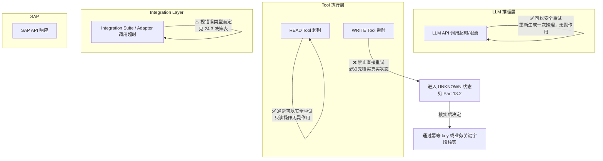
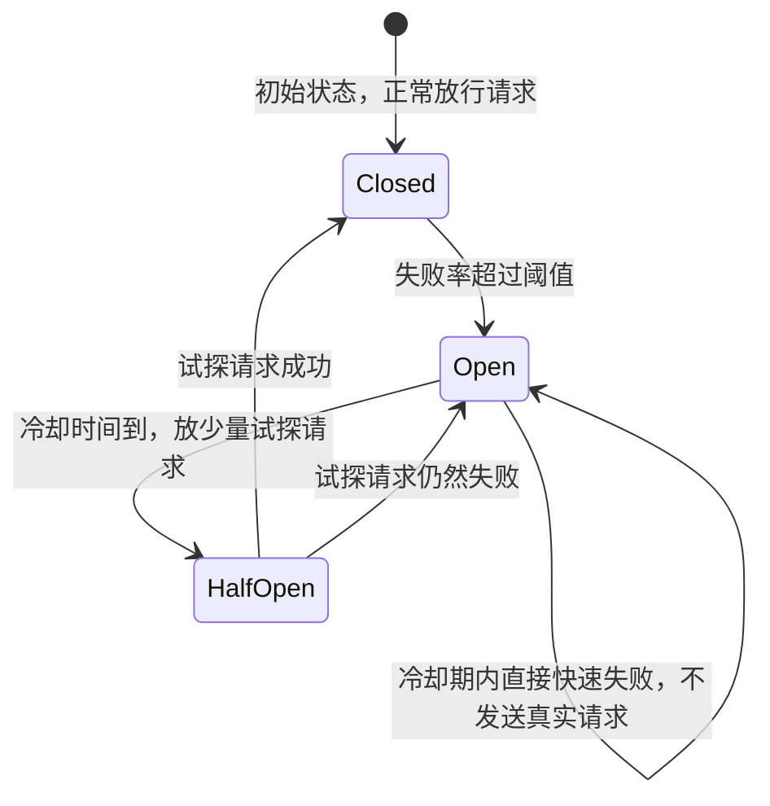

# Part 24：Resilience / Distributed Systems for AI + SAP

Part 13 已经建立了幂等性设计的基础。本章把视野扩大到完整的分布式系统可靠性知识——"AI + SAP"本质上是一个横跨多个网络边界（LLM API、Agent Backend、Integration Layer、SAP）的分布式系统，任何一环都可能超时、失败、重复、乱序，本章讲清楚每一种情况该怎么应对。

## 24.1 核心概念速览

| 概念 | 一句话 |
|---|---|
| Timeout | 给一次调用设置最长等待时间，超过就不再傻等，转入失败/未知状态处理逻辑 |
| Retry | 失败后重新尝试同一个操作 |
| Exponential Backoff | 每次重试的等待间隔按指数增长（如 1s → 2s → 4s → 8s），避免立刻重试导致的瞬时压力叠加 |
| Jitter | 在 Backoff 的等待时间上叠加一个随机扰动，避免大量客户端"同步重试"形成新的压力尖峰（见 24.9 Retry Storm） |
| Circuit Breaker | 熔断器：当下游持续失败达到阈值，直接短路后续请求（快速失败，不再打过去），给下游恢复的时间窗口 |
| Bulkhead | 舱壁隔离：把不同类型的请求（如 READ 与 WRITE、不同租户）隔离到独立的资源池（连接池/线程池/配额），一类请求打满不会拖垮另一类 |
| Rate Limit | 限流：主动控制请求发送速率，防止把下游打垮，也防止被下游限流反噬 |
| Dead Letter Queue | 见 Part 22.16，多次处理失败的消息/事件转入死信队列等待人工介入 |
| Outbox Pattern | 见 24.11，保证"业务状态变更"和"发出通知/事件"这两个动作的一致性 |
| Saga / Compensation | 见 24.12，跨多个系统的长事务用一系列本地事务+补偿动作代替传统分布式事务 |
| Eventual Consistency | 见 Part 22.15，允许系统间状态存在短暂不一致，但保证最终收敛 |
| Request Correlation | 见 Part 15.2，用统一的 Correlation ID 串联一次请求在多个系统间的完整链路 |
| Distributed Tracing | 24.13，Correlation ID 的进一步工程化：结构化地记录每一跳的耗时、状态，形成可视化的调用链 |

## 24.2 分层的重试策略：AI → Tool → Integration Suite → SAP



**核心结论——"LLM retry ≠ Tool retry ≠ SAP API retry"**，三者的安全性完全不同：

| 重试对象 | 是否安全 | 原因 |
|---|---|---|
| **LLM 推理调用**超时/失败 | ✅ 安全，可以直接重试 | LLM 推理本身没有副作用（不涉及外部系统状态变更），重新问一次模型不会产生任何业务后果 |
| **READ Tool**（如 `search_customer`、`simulate_sales_order`）超时 | ✅ 通常安全，可以直接重试 | 只读操作不改变系统状态，重复执行结果应该一致（幂等） |
| **WRITE Tool / SAP POST**（如 `create_sales_order`）超时 | ❌ **禁止直接重试** | SAP 可能已经处理了这次写请求，只是响应没有传回来（网络问题、Backend 自身超时等），直接重新 POST 可能产生第二条真实订单。必须先进入 Part 13.2 的 `UNKNOWN` 状态，通过幂等 key 或业务关键字段核实真实情况后再决定下一步 |

这条区分是本章最重要的一条原则，也是很多项目在真正上生产之前容易忽略的一点——"超时了就重试"是大多数通用 HTTP 客户端库的默认行为（很多 SDK 会自动对超时/5xx 做重试），**在写操作场景下这个默认行为是危险的，必须显式关闭自动重试，改为走 Part 13.2 的核实流程。**

## 24.3 错误分类与重试决策表

| HTTP / 错误情况 | 是否重试 | 说明 |
|---|---|---|
| HTTP 400（参数错误） | ❌ 不重试 | 请求本身有问题，重试结果不会变，应该修正参数或直接报错给上游 |
| HTTP 401 / 403（认证/权限错误） | ❌ 不直接重试 | 401 可能需要刷新 Token 后重试一次（这是"刷新后重试"，不是"原样重试"）；403 是权限问题，重试无意义，应该报错 |
| SAP 业务错误（如 Credit Check 拒绝、Material Block） | ❌ 不重试 | 这是确定性的业务判断，重试不会改变结果，应该转述给用户或走对应的业务流程（如审批） |
| HTTP 429（限流） | ⚠️ Backoff 后重试 | 说明请求速率超过了下游承受能力，应该按 Exponential Backoff + Jitter 策略延迟后重试，并考虑主动降低自身的请求速率 |
| HTTP 502 / 503（网关错误/服务不可用） | ⚠️ 有限次重试 | 通常是瞬时性故障，值得重试，但要设置重试次数上限，并配合 Circuit Breaker（24.7）防止对一个持续故障的下游反复施压 |
| TCP Reset / 连接被重置 | ⚠️ 状态可能 UNKNOWN | 如果发生在 READ 请求，可以安全重试；如果发生在 WRITE 请求发出之后、响应到达之前，必须视为状态未知，走核实流程 |
| SAP POST 超时（WRITE 操作） | ❌ **禁止直接重新 POST** | 见 24.2，必须先核实，这是本章反复强调的核心规则 |

## 24.4 Exponential Backoff + Jitter 示例

```typescript
async function callWithBackoff<T>(
  fn: () => Promise<T>,
  { maxRetries = 3, baseDelayMs = 500 }: { maxRetries?: number; baseDelayMs?: number } = {}
): Promise<T> {
  let lastError: unknown;
  for (let attempt = 0; attempt <= maxRetries; attempt++) {
    try {
      return await fn();
    } catch (err: any) {
      lastError = err;
      if (!isRetryable(err) || attempt === maxRetries) throw err;
      const backoff = baseDelayMs * 2 ** attempt;
      const jitter = Math.random() * backoff * 0.3; // ±30% 随机抖动
      await sleep(backoff + jitter);
    }
  }
  throw lastError;
}

function isRetryable(err: any): boolean {
  // 只对明确的瞬时性错误重试；4xx（除 429）、SAP 业务错误一律不重试
  return err.code === "ETIMEDOUT_READ" || err.status === 429 || err.status === 502 || err.status === 503;
}
```

要点：`isRetryable` 的判断逻辑必须与 24.3 的决策表完全一致，**尤其要确保 WRITE 操作的超时/网络错误不会被这个通用重试包装器错误地重试**——实践中建议对 READ 和 WRITE 使用完全不同的调用路径（WRITE 路径根本不接入这种自动重试包装器，而是直接进入 Part 13.2 的状态机）。

## 24.5 LLM 层面的重试

LLM API 调用失败（限流、超时、模型服务暂时不可用）时的重试相对简单，因为没有副作用问题，但仍然要注意：

- 用同样的 Exponential Backoff + Jitter 策略，避免在 LLM 服务出现问题时所有请求同时重试造成雪崩。
- 重试次数要有上限，超过上限应该给用户一个明确的"系统暂时繁忙，请稍后再试"提示，而不是无限等待。
- 如果 Agent Loop 内部已经产生了部分 Tool Call 并拿到了结果（比如已经调用过 `search_customer`），LLM 推理失败重试时应该保留这些已有的上下文/结果，不要重新从头触发一遍已经成功的只读查询（避免不必要的重复调用）。

## 24.6 Retry Storm / Cascading Failure（重试风暴/级联故障）

**Retry Storm** 是指：当下游系统（比如 SAP）出现故障或性能下降时，大量客户端几乎同时触发重试，这些重试请求叠加在一起，反而让本来只是"响应变慢"的下游系统被彻底打垮——故障被重试行为放大了。

这在多 Agent 实例、高并发对话场景下尤其危险：如果每个 Agent 实例遇到 SAP 响应变慢就立刻按固定间隔重试，成百上千个实例的重试请求会几乎同时到达 SAP，形成远超正常水平的瞬时负载尖峰。

**级联故障**（Cascading Failure）是 Retry Storm 的进一步恶化：SAP 被打垮后响应更慢/开始拒绝更多请求，这又触发更多重试，形成正反馈循环，最终可能导致原本只是"某个 API 变慢"的局部问题，扩散成整个集成链路的全面瘫痪。

**缓解手段**（组合使用）：
- Jitter（24.1）：打散重试的时间分布，避免同步。
- Circuit Breaker（24.7）：故障达到阈值后直接停止发送请求，给下游恢复空间。
- Bulkhead（24.8）：限制单一故障类型能占用的资源上限，不让它拖垮整个系统。
- Rate Limit（24.9）：从源头控制请求发送速率。

## 24.7 为什么 Circuit Breaker 很重要

如果没有熔断机制，当 SAP 因为某种原因（维护窗口、内部故障、网络问题）暂时不可用时，成百上千个 Agent 请求会持续不断地尝试连接，每一次都要等到超时才失败——这不仅浪费大量资源（连接、线程、等待时间），还会：

1. 让每个用户的等待体验变得更差（本来该在 1 秒内失败并提示"系统繁忙"，结果因为要等超时，变成 30 秒才有响应）。
2. 在 SAP 服务恢复的那一刻，如果所有积压的请求同时涌入，反而可能让刚恢复的系统再次被打垮（这也是 Retry Storm 的一种形式）。

**Circuit Breaker 的工作模式**：



- **Closed（关闭/正常）**：请求正常放行到 SAP。
- **Open（打开/熔断）**：检测到失败率超过阈值后，后续请求**不再真正发往 SAP**，而是立刻返回一个"服务暂不可用"的快速失败结果，给 SAP 恢复的时间窗口，同时避免自己的请求线程/连接被大量挂起的调用占满。
- **Half-Open（半开）**：冷却时间到后，放行少量"试探性"请求，如果成功就转回 Closed，如果仍然失败就退回 Open 继续等待。

这一机制应该部署在 **Integration Layer**（Part 1.3 的 SAP Integration Layer 这一层，无论是自建的 Adapter 还是 Integration Suite 提供的能力），保护的是"SAP 已经故障时，不应该让几千个 Agent 请求继续打爆 SAP"这个核心诉求——这与限流（Rate Limit）是互补关系：限流控制"平时"的请求速率，熔断应对"下游已经出问题"的场景。

## 24.8 Bulkhead（舱壁隔离）

借用"船舱隔离"的比喻：一个船舱进水不应该让整艘船沉没。在本教程的架构里，典型的舱壁隔离实践包括：

- **READ 请求池与 WRITE 请求池分离**：一大波只读查询（比如批量的客户搜索）不应该占满连接池，导致关键的 WRITE 请求（订单创建）无法获得资源。
- **不同租户/客户的请求隔离**：在多租户 SaaS 化部署场景下，一个租户的异常流量不应该影响其他租户的正常使用。
- **不同 SAP 系统的连接隔离**：如果 AI Backend 同时对接多个 SAP 系统（比如不同业务单元各自的 S/4HANA 实例），对一个系统的连接问题不应该耗尽整体资源池，波及对其他系统的调用。

## 24.9 Rate Limit（限流）

从请求发起方主动控制速率，是比"等下游限流/熔断后被动响应"更主动的保护手段。至少应该在两个方向上设置限流：

- **对 SAP 的出向限流**：防止 AI Backend 自己的流量突增（比如某个批量场景、或者 Bug 导致的循环调用）把 SAP 打垮。
- **对用户/租户的入向限流**：防止单个用户/租户的异常行为（如 Part 9.3 提到的"同一用户短时间内创建大量订单"）消耗过多资源或触发过多 WRITE 操作，这也是 Part 9.3"风险控制"要求的具体落地。

## 24.10 分布式系统里的"确定性"部分：Outbox Pattern 与 Saga

虽然本章主题是"应对不确定性"，但也有一些成熟的模式可以把分布式场景下的一致性问题转化成确定性可控的流程：

### Outbox Pattern

当一个操作需要同时做到"更新自己的状态"和"通知/触发下游"（比如"确认记录标记为 EXECUTED"和"发一条事件通知下游系统"）时，如果分成两次独立操作，中间可能因为进程崩溃等原因导致只完成一半（状态更新了但通知没发出，或者反过来）。**Outbox Pattern** 的做法是：把"要发出的通知"作为一条记录，和业务状态更新**在同一个数据库事务里一起写入**（写进一张 Outbox 表），再由一个独立的后台进程持续轮询/监听这张表，把记录真正发送出去（发送成功后标记为已处理）。这样"状态更新"和"通知会被发出"这两件事就变成了原子性的一个事务，不会出现"更新了但没通知"的中间态。

### Saga / Compensation

如果一个业务流程需要跨越多个系统的多个步骤（比如：先在 SAP 创建订单 → 再在另一个系统创建物流跟踪记录 → 再触发通知），传统的分布式事务（如两阶段提交）在现代云原生架构里通常不可行或代价过高。**Saga 模式**用一系列**本地事务**代替：每一步都是一个独立的、可以成功或失败的操作，如果后面某一步失败了，不是"回滚"前面的步骤（分布式系统里"回滚外部系统的写操作"往往做不到），而是执行明确定义的**补偿动作**（Compensating Action，比如"取消刚创建的物流跟踪记录"）来抵消已经发生的影响。**对于本教程的核心场景（创建 Sales Order），如果未来扩展成跨系统的多步骤流程，应该按 Saga 思路为每一步设计对应的补偿动作，而不是假设"要么全部成功、要么什么都没发生"。**

## 24.11 Correlation ID 与 Distributed Tracing

Part 15.2 已经讲过 Correlation ID 的作用（贯穿全链路、便于排障和审计）。**Distributed Tracing** 是这个思路的进一步工程化：不只是"用同一个 ID 关联多处日志"，而是用标准化的追踪协议（如业界通用的 trace/span 模型）记录每一跳调用的**开始时间、结束时间、状态、父子关系**，最终能在可视化工具里看到一次完整请求在"LLM 推理 → Tool 执行 → Integration Layer → SAP"这条链路上，每一段各花了多长时间、哪一段最慢、哪一段出错。

这对本教程的架构尤其有价值，因为一次用户对话往往涉及多次 LLM 推理和多次 Tool 调用（Part 7.2 的 Agent Loop），没有结构化的追踪能力，排查"这次对话为什么响应了 8 秒"这类性能问题会非常困难。⚠️ 具体采用哪种追踪标准/工具属于通用可观测性技术选型，不是 SAP 特有内容，这里不展开具体产品，只强调这一能力在本教程架构里的必要性。

## 24.12 项目中你需要记住什么

- 牢记这条核心区分："LLM retry 安全，READ Tool retry 通常安全，WRITE Tool / SAP POST 超时禁止直接重试"——这是本章最容易被忽视、也最容易酿成事故的一条规则，很多 HTTP 客户端库的默认自动重试行为在 WRITE 场景下是危险的，必须显式关闭。
- 建立错误分类与重试决策表（24.3）并在代码里严格执行，不要凭直觉判断"这个错误应该可以重试"。
- Retry Storm/级联故障是"重试策略设计不当"导致的次生灾害，Jitter + Circuit Breaker + Bulkhead + Rate Limit 要组合使用，不能只靠其中一种。
- Circuit Breaker 的核心价值是保护已经故障的下游（SAP），不让大量客户端的持续重试把恢复窗口也一起打没。
- Outbox Pattern 和 Saga/Compensation 是处理跨系统一致性问题的成熟模式，未来业务流程扩展到多步骤/多系统时应该优先考虑这两种模式，而不是假设分布式事务能简单解决问题。
- Distributed Tracing 是 Correlation ID 思路的工程化延伸，对排查"Agent Loop 里到底哪一步慢/哪一步错"至关重要。
