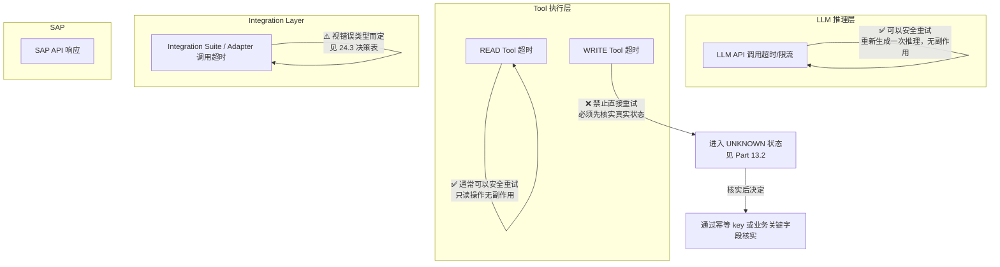
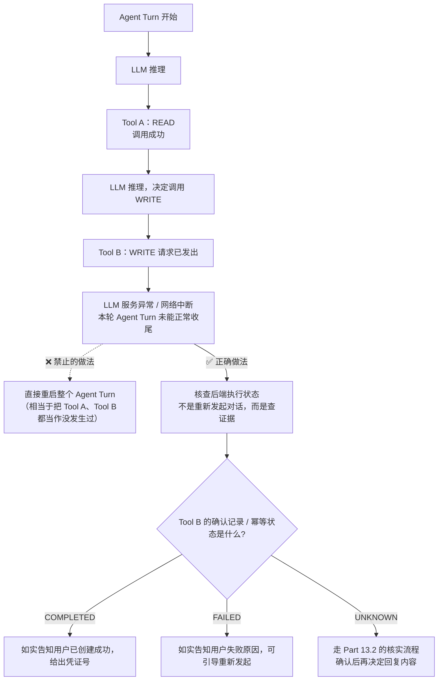
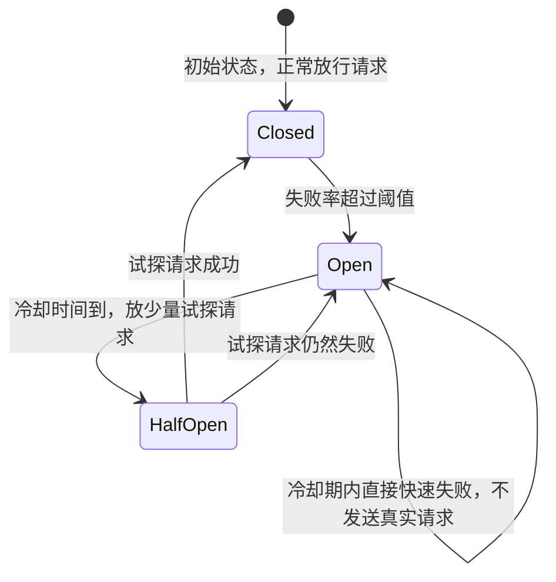

# Part 24：Resilience / Distributed Systems for AI + SAP

Part 13 已经建立了幂等性设计的基础。本章把视野扩大到完整的分布式系统可靠性知识——"AI + SAP"本质上是一个横跨多个网络边界（LLM API、Agent Backend、Integration Layer、SAP）的分布式系统，任何一环都可能超时、失败、重复、乱序，本章讲清楚每一种情况该怎么应对。

Part 13ではすでに冪等性設計の基礎を確立しました。本章では視野を分散システムの信頼性に関する完全な知識に広げます——「AI + SAP」は本質的に複数のネットワーク境界（LLM API、Agent Backend、Integration Layer、SAP）をまたぐ分散システムであり、どの一環もタイムアウト、失敗、重複、順序の乱れが起こり得ます。本章ではそれぞれのケースにどう対応すべきかを明確に説明します。

## 24.1 核心概念速览（24.1 コア概念早見表）

| 概念<br>概念 | 一句话<br>一言で |
|---|---|
| Timeout | 给一次调用设置最长等待时间，超过就不再傻等，转入失败/未知状态处理逻辑<br>1回の呼び出しに最大待機時間を設定し、超過したら漫然と待ち続けず、失敗/未知状態の処理ロジックに移行する |
| Retry | 失败后重新尝试同一个操作<br>失敗後に同じ操作を再試行する |
| Exponential Backoff | 每次重试的等待间隔按指数增长（如 1s → 2s → 4s → 8s），避免立刻重试导致的瞬时压力叠加<br>リトライごとの待機間隔を指数関数的に増加させる（1s → 2s → 4s → 8sなど）。即座のリトライによる瞬間的な負荷の重畳を避ける |
| Jitter | 在 Backoff 的等待时间上叠加一个随机扰动，避免大量客户端"同步重试"形成新的压力尖峰（见 24.9 Retry Storm）<br>Backoffの待機時間にランダムな揺らぎを重ね、大量のクライアントが「同期してリトライ」して新たな負荷のピークを形成するのを防ぐ（24.9 Retry Storm参照） |
| Circuit Breaker | 熔断器：当下游持续失败达到阈值，直接短路后续请求（快速失败，不再打过去），给下游恢复的时间窗口<br>サーキットブレーカー：下流の失敗が継続して閾値に達した場合、以降のリクエストを直接遮断し（フェイルファスト、もう送らない）、下流に回復のための時間的猶予を与える |
| Bulkhead | 舱壁隔离：把不同类型的请求（如 READ 与 WRITE、不同租户）隔离到独立的资源池（连接池/线程池/配额），一类请求打满不会拖垮另一类<br>隔壁分離：異なるタイプのリクエスト（READとWRITE、異なるテナントなど）を独立したリソースプール（コネクションプール/スレッドプール/クォータ）に分離し、あるタイプのリクエストが埋め尽くされても別のタイプを巻き込んで機能不全にしない |
| Rate Limit | 限流：主动控制请求发送速率，防止把下游打垮，也防止被下游限流反噬<br>レート制限：リクエスト送信速度を能動的に制御し、下流を打ち倒すことを防ぎ、また下流のレート制限によって逆に自分が苦しめられることも防ぐ |
| Dead Letter Queue | 见 Part 22.16，多次处理失败的消息/事件转入死信队列等待人工介入<br>Part 22.16参照。複数回処理に失敗したメッセージ/イベントはデッドレターキューに移され、人による介入を待つ |
| Outbox Pattern | 见 24.11，保证"业务状态变更"和"发出通知/事件"这两个动作的一致性<br>24.11参照。「業務状態の変更」と「通知/イベントの発行」という2つの動作の一貫性を保証する |
| Saga / Compensation | 见 24.12，跨多个系统的长事务用一系列本地事务+补偿动作代替传统分布式事务<br>24.12参照。複数システムをまたぐ長時間トランザクションを、一連のローカルトランザクション＋補償動作で従来の分散トランザクションの代わりとする |
| Eventual Consistency | 见 Part 22.15，允许系统间状态存在短暂不一致，但保证最终收敛<br>Part 22.15参照。システム間の状態に一時的な不整合が存在することを許容するが、最終的な収束を保証する |
| Request Correlation | 见 Part 15.2，用统一的 Correlation ID 串联一次请求在多个系统间的完整链路<br>Part 15.2参照。統一されたCorrelation IDを使って、1つのリクエストが複数のシステム間をたどる完全なチェーンをつなぐ |
| Distributed Tracing | 24.13，Correlation ID 的进一步工程化：结构化地记录每一跳的耗时、状态，形成可视化的调用链<br>24.13。Correlation IDのさらなる工学的発展：各ホップの所要時間、状態を構造化して記録し、可視化された呼び出しチェーンを形成する |

## 24.2 分层的重试策略：AI → Tool → Integration Suite → SAP（24.2 階層化されたリトライ戦略：AI → Tool → Integration Suite → SAP）



**核心结论——"LLM retry ≠ Tool retry ≠ SAP API retry"**，三者的安全性完全不同：

**核心的な結論——「LLM retry ≠ Tool retry ≠ SAP API retry」**、この3つの安全性はまったく異なります：

| 重试对象<br>リトライ対象 | 是否安全<br>安全かどうか | 原因<br>理由 |
|---|---|---|
| **LLM 推理调用**超时/失败<br>**LLM推論呼び出し**のタイムアウト/失敗 | ✅ 安全，可以直接重试<br>✅ 安全で、直接リトライ可能 | LLM 推理本身没有副作用（不涉及外部系统状态变更），重新问一次模型不会产生任何业务后果<br>LLM推論自体には副作用がない（外部システムの状態変更を伴わない）。モデルにもう一度問い合わせても業務上の結果は一切生じない |
| **READ Tool**（如 `search_customer`、`simulate_sales_order`）超时<br>**READ Tool**（`search_customer`、`simulate_sales_order` など）のタイムアウト | ✅ 通常安全，可以直接重试<br>✅ 通常は安全で、直接リトライ可能 | 只读操作不改变系统状态，重复执行结果应该一致（幂等）<br>読み取り専用操作はシステムの状態を変更しないため、繰り返し実行しても結果は一致するはずである（冪等） |
| **WRITE Tool / SAP POST**（如 `create_sales_order`）超时<br>**WRITE Tool / SAP POST**（`create_sales_order` など）のタイムアウト | ❌ **禁止直接重试**<br>❌ **直接のリトライは禁止** | SAP 可能已经处理了这次写请求，只是响应没有传回来（网络问题、Backend 自身超时等），直接重新 POST 可能产生第二条真实订单。必须先进入 Part 13.2 的 `UNKNOWN` 状态，通过幂等 key 或业务关键字段核实真实情况后再决定下一步<br>SAPはすでにこの書き込みリクエストを処理している可能性があり、単にレスポンスが返ってこなかっただけ（ネットワークの問題、Backend自身のタイムアウトなど）の場合があります。直接POSTをやり直すと2件目の実際の受注が発生する可能性があります。まずPart 13.2の `UNKNOWN` 状態に入り、冪等キーまたは業務上のキーとなるフィールドで実際の状況を確認してから次のステップを決定しなければなりません |

这条区分是本章最重要的一条原则，也是很多项目在真正上生产之前容易忽略的一点——"超时了就重试"是大多数通用 HTTP 客户端库的默认行为（很多 SDK 会自动对超时/5xx 做重试），**在写操作场景下这个默认行为是危险的，必须显式关闭自动重试，改为走 Part 13.2 的核实流程。**

この区別は本章で最も重要な原則であり、多くのプロジェクトが実際に本番稼働する前に見落としがちな点でもあります——「タイムアウトしたらリトライする」は、ほとんどの汎用HTTPクライアントライブラリのデフォルト動作です（多くのSDKはタイムアウト/5xxに対して自動的にリトライします）。**書き込み操作のシナリオでは、このデフォルト動作は危険であり、自動リトライを明示的に無効化し、Part 13.2の確認フローに切り替える必要があります。**

### 24.2.1 容易被混淆的另一层：纯 LLM inference retry ≠ 整个 Agent Turn retry（24.2.1 混同しやすいもう一つの層：純粋なLLM inference retry ≠ Agent Turn全体のretry）

上面的表格谈的是"某一次具体调用（LLM 推理 / 某个 Tool）该不该重试"，但实践中更容易踩的坑是**把这两者搞混，进而把"重试"的粒度错误地放大到整个 Agent Turn（Part 7.2 的一整轮 Agent Loop）**。这里必须再拆得更细一层：

上の表が扱っているのは「ある特定の呼び出し（LLM推論／あるTool）をリトライすべきかどうか」ですが、実践でより陥りやすい落とし穴は**この2つを混同し、「リトライ」の粒度を誤ってAgent Turn全体（Part 7.2の1回のAgent Loop全体）にまで拡大してしまうこと**です。ここでさらに細かく分解する必要があります：

- **纯 LLM inference retry**：如果这一次失败/超时的调用，只是一次"模型推理"本身（**这一轮 Agent Turn 到目前为止还没有执行过任何 Tool**），那么重新发起这次推理是安全的，因为还没有产生任何外部副作用。<br>**純粋なLLM inference retry**：もし今回失敗/タイムアウトした呼び出しが、単に「モデル推論」自体である場合（**今回のAgent Turnはこれまでのところ、まだいかなるToolも実行していない**）、この推論を再度発行することは安全です。まだ外部への副作用が一切発生していないためです。
- **Whole Agent Turn retry**：如果失败发生在**这一轮 Agent Turn 已经执行过 Tool 之后**（尤其是已经调用了 WRITE Tool、或者已经把确认记录推进到了某个状态），那么"从头重跑整个 Agent Turn"就完全是另一回事——**不能简单假设"重新走一遍对话流程"就是无副作用的**，因为前一次 Turn 可能已经产生了真实的 Tool side effect。<br>**Whole Agent Turn retry**：もし失敗が**このAgent Turnがすでに何らかのToolを実行した後**に発生した場合（特にすでにWRITE Toolを呼び出していた、あるいはすでに確認記録を何らかの状態まで進めていた場合）、「Agent Turn全体を最初からやり直す」ことはまったく別の話です——**「対話フローをもう一度実行する」ことが無副作用だと単純に仮定してはいけません**。前回のTurnがすでに実際のTool side effectを発生させている可能性があるためです。

**必须记住这句话：重新调用纯 LLM inference 通常无副作用，但重新执行整个 Agent Turn 未必安全，因为前一次 Turn 可能已经产生 Tool side effects。**

**この一文は必ず覚えておく必要があります：純粋なLLM inferenceの再呼び出しは通常無副作用だが、Agent Turn全体を再実行することは必ずしも安全ではない。前回のTurnがすでにTool side effects（特にWRITE）を発生させている可能性があるためだ。**



关键区分点：

重要な区別点：

- **READ Tool（如 Tool A）**：即使整轮 Agent Turn 中断了，Tool A 本身的调用可以视情况安全重放（只读操作重放没有额外风险）。<br>**READ Tool（Tool Aなど）**：Agent Turn全体が中断されたとしても、Tool A自体の呼び出しは状況に応じて安全に再生できます（読み取り専用操作の再生には追加のリスクがない）。
- **WRITE Tool（如 Tool B）绝不能因为"这一轮 Agent Turn 失败了"就被当作"没发生过"而重新触发**——无论是重新调用一次 `create_sales_order`，还是简单粗暴地"重启整个对话轮次让模型重新决策一遍"，本质上都是在用不确定的方式重放一个可能已经产生真实副作用的写操作。正确做法永远是：**查后端的确定性状态**（Part 11.6 的 `confirmationId` 状态、Part 13.2 的幂等状态机是 `COMPLETED`/`FAILED`/`UNKNOWN` 中的哪一个），而不是依赖"重新走一遍对话/推理流程"这种不确定的手段去猜测结果。<br>**WRITE Tool（Tool Bなど）は、「このAgent Turnが失敗した」という理由だけで「発生しなかったこと」として再トリガーされてはならない**——`create_sales_order` をもう一度呼び出すのであれ、単純に「対話ターン全体を再起動してモデルに再決定させる」のであれ、本質的にはいずれも、すでに実際の副作用を発生させている可能性のある書き込み操作を、不確実な方法で再生していることに変わりありません。正しいやり方は常に：**バックエンドの確定的な状態を確認する**（Part 11.6の `confirmationId` の状態、Part 13.2の冪等状態機が `COMPLETED`/`FAILED`/`UNKNOWN` のどれであるか）ことであり、「対話/推論フローをもう一度実行する」という不確実な手段で結果を推測することに頼るべきではありません。
- 这也是 Agent Loop 实现层面的一条工程要求：**Agent Turn 的失败恢复逻辑，不能简单等同于"从头重新调用 `runAgentTurn()`"**，而应该先检查这一轮 Turn 内已经发生的 Tool Call 记录（尤其是否包含 WRITE），有 WRITE 记录时必须先走状态核实，才能决定接下来是该告知用户结果、还是可以安全地引导用户重新发起一轮全新的请求（注意：即使是"重新发起一轮全新请求"，也应该使用新的幂等 key/新的确认流程，而不是复用上一轮可能已经污染的状态）。<br>これはAgent Loopの実装レベルにおける一つの工学的要件でもあります：**Agent Turnの失敗復旧ロジックは、単純に「最初から `runAgentTurn()` を再呼び出しする」ことと同一視してはならず**、まずこのTurn内ですでに発生したTool Call記録（特にWRITEが含まれているかどうか）を確認すべきです。WRITE記録がある場合は、まず状態確認を行ってから、次にユーザーに結果を伝えるべきか、あるいは安全に新しいリクエストをユーザーに促してよいかを決定する必要があります（注意：たとえ「新しいリクエストを改めて発行する」場合であっても、新しい冪等キー／新しい確認フローを使用すべきであり、前回汚染されている可能性のある状態を再利用すべきではありません）。

## 24.3 错误分类与重试决策表（24.3 エラー分類とリトライ判断表）

| HTTP / 错误情况<br>HTTP／エラー状況 | 是否重试<br>リトライするか | 说明<br>説明 |
|---|---|---|
| HTTP 400（参数错误）<br>HTTP 400（パラメータエラー） | ❌ 不重试<br>❌ リトライしない | 请求本身有问题，重试结果不会变，应该修正参数或直接报错给上游<br>リクエスト自体に問題があり、リトライしても結果は変わらない。パラメータを修正するか、上流に直接エラーを報告すべき |
| HTTP 401 / 403（认证/权限错误）<br>HTTP 401 / 403（認証/権限エラー） | ❌ 不直接重试<br>❌ そのままリトライしない | 401 可能需要刷新 Token 后重试一次（这是"刷新后重试"，不是"原样重试"）；403 是权限问题，重试无意义，应该报错<br>401はトークンを更新してから1回リトライする必要がある場合がある（これは「更新後にリトライ」であり「そのままリトライ」ではない）。403は権限の問題であり、リトライは無意味でエラーを報告すべき |
| SAP 业务错误（如 Credit Check 拒绝、Material Block）<br>SAP業務エラー（Credit Checkの拒否、Material Blockなど） | ❌ 不重试<br>❌ リトライしない | 这是确定性的业务判断，重试不会改变结果，应该转述给用户或走对应的业务流程（如审批）<br>これは確定的な業務上の判断であり、リトライしても結果は変わらない。ユーザーに伝えるか、対応する業務フロー（承認など）に進むべき |
| HTTP 429（限流）<br>HTTP 429（レート制限） | ⚠️ Backoff 后重试<br>⚠️ Backoff後にリトライ | 说明请求速率超过了下游承受能力，应该按 Exponential Backoff + Jitter 策略延迟后重试，并考虑主动降低自身的请求速率<br>リクエスト速度が下流の許容能力を超えたことを示す。Exponential Backoff + Jitter戦略で遅延させてからリトライすべきであり、自身のリクエスト速度を能動的に下げることも検討すべき |
| HTTP 502 / 503（网关错误/服务不可用）<br>HTTP 502 / 503（ゲートウェイエラー/サービス利用不可） | ⚠️ 有限次重试<br>⚠️ 有限回のリトライ | 通常是瞬时性故障，值得重试，但要设置重试次数上限，并配合 Circuit Breaker（24.7）防止对一个持续故障的下游反复施压<br>通常は一時的な障害であり、リトライする価値があるが、リトライ回数の上限を設定し、Circuit Breaker（24.7）と組み合わせて、継続的に故障している下流に繰り返し負荷をかけることを防ぐべき |
| TCP Reset / 连接被重置<br>TCP Reset／接続がリセットされた | ⚠️ 状态可能 UNKNOWN<br>⚠️ 状態がUNKNOWNの可能性 | 如果发生在 READ 请求，可以安全重试；如果发生在 WRITE 请求发出之后、响应到达之前，必须视为状态未知，走核实流程<br>READリクエストで発生した場合は安全にリトライ可能。WRITEリクエスト送信後、レスポンス到達前に発生した場合は、状態不明として確認フローに進まなければならない |
| SAP POST 超时（WRITE 操作）<br>SAP POSTのタイムアウト（WRITE操作） | ❌ **禁止直接重新 POST**<br>❌ **直接POSTをやり直すことは禁止** | 见 24.2，必须先核实，这是本章反复强调的核心规则<br>24.2参照。まず確認しなければならない。これは本章で繰り返し強調しているコアルールである |

## 24.4 Exponential Backoff + Jitter 示例（24.4 Exponential Backoff + Jitterの例）

```typescript
async function callWithBackoff<T>(
  fn: () => Promise<T>,
  { maxRetries = 3, baseDelayMs = 500 }: { maxRetries?: number; baseDelayMs?: number } = {}
): Promise<T> {
  let lastError: unknown;
  for (let attempt = 0; attempt <= maxRetries; attempt++) {
    try {
      return await fn();
    } catch (err: any) {
      lastError = err;
      if (!isRetryable(err) || attempt === maxRetries) throw err;
      const backoff = baseDelayMs * 2 ** attempt;
      const jitter = Math.random() * backoff * 0.3; // ±30% 随机抖动
      await sleep(backoff + jitter);
    }
  }
  throw lastError;
}

function isRetryable(err: any): boolean {
  // 只对明确的瞬时性错误重试；4xx（除 429）、SAP 业务错误一律不重试
  return err.code === "ETIMEDOUT_READ" || err.status === 429 || err.status === 502 || err.status === 503;
}
```

要点：`isRetryable` 的判断逻辑必须与 24.3 的决策表完全一致，**尤其要确保 WRITE 操作的超时/网络错误不会被这个通用重试包装器错误地重试**——实践中建议对 READ 和 WRITE 使用完全不同的调用路径（WRITE 路径根本不接入这种自动重试包装器，而是直接进入 Part 13.2 的状态机）。

ポイント：`isRetryable` の判断ロジックは24.3の判断表と完全に一致していなければならず、**特にWRITE操作のタイムアウト/ネットワークエラーがこの汎用リトライラッパーによって誤ってリトライされないようにする必要があります**——実践では、READとWRITEに完全に異なる呼び出し経路を使うことを推奨します（WRITE経路はそもそもこの種の自動リトライラッパーに接続せず、直接Part 13.2の状態機に入る）。

## 24.5 LLM 层面的重试（24.5 LLMレベルのリトライ）

本节讨论的是 24.2.1 定义的**纯 LLM inference retry**（这一次失败前，本轮 Agent Turn 还没有执行过 Tool）——这种重试相对简单，因为没有副作用问题，但仍然要注意：

本節で議論するのは24.2.1で定義した**純粋なLLM inference retry**（今回の失敗の前に、このAgent Turnがまだいかなるツールも実行していない状態）です——この種のリトライは副作用の問題がないため比較的単純ですが、それでも以下に注意が必要です：

- 用同样的 Exponential Backoff + Jitter 策略，避免在 LLM 服务出现问题时所有请求同时重试造成雪崩。<br>同じExponential Backoff + Jitter戦略を使用し、LLMサービスに問題が発生した際にすべてのリクエストが同時にリトライして雪崩を引き起こすことを避ける。
- 重试次数要有上限，超过上限应该给用户一个明确的"系统暂时繁忙，请稍后再试"提示，而不是无限等待。<br>リトライ回数には上限を設けるべきで、上限を超えたらユーザーに「システムが一時的に混雑しています。しばらくしてから再度お試しください」という明確な案内をすべきであり、無限に待たせるべきではない。
- 如果 Agent Loop 内部已经产生了部分 Tool Call 并拿到了结果（比如已经调用过 `search_customer`），LLM 推理失败重试时应该保留这些已有的上下文/结果，不要重新从头触发一遍已经成功的只读查询（避免不必要的重复调用）——**但这种情况下重试的仍然只是"下一步推理"这个动作本身，不是把整轮 Turn 推倒重来**。<br>もしAgent Loop内部ですでに一部のTool Callが発生し結果を得ている場合（すでに `search_customer` を呼び出しているなど）、LLM推論失敗時のリトライではこれら既存のコンテキスト/結果を保持すべきであり、すでに成功している読み取り専用クエリを最初からやり直してはいけません（不要な重複呼び出しを避ける）——**ただしこの場合にリトライされるのはあくまで「次の推論」という動作自体であり、Turn全体をひっくり返してやり直すことではありません**。
- 一旦本轮 Turn 已经执行过 WRITE Tool，就不再属于本节讨论的范围，必须切换到 24.2.1 描述的"核查后端状态"路径，绝不能简单地"重新调用一次 Agent Turn"了事。<br>いったんこのTurnがすでにWRITE Toolを実行した場合、それはもはや本節の議論の範囲には属さず、24.2.1で説明した「バックエンドの状態を確認する」経路に切り替えなければならず、単純に「Agent Turnをもう一度呼び出す」ことで済ませてはいけません。

## 24.6 Retry Storm / Cascading Failure（重试风暴/级联故障）（24.6 Retry Storm / Cascading Failure（リトライストーム/カスケード障害））

**Retry Storm** 是指：当下游系统（比如 SAP）出现故障或性能下降时，大量客户端几乎同时触发重试，这些重试请求叠加在一起，反而让本来只是"响应变慢"的下游系统被彻底打垮——故障被重试行为放大了。

**Retry Storm** とは：下流のシステム（SAPなど）に障害やパフォーマンス低下が発生した際、大量のクライアントがほぼ同時にリトライをトリガーし、これらのリトライリクエストが重なり合って、本来は「レスポンスが遅くなっただけ」だった下流のシステムを完全に打ち倒してしまうことです——障害がリトライ行動によって増幅されるのです。

这在多 Agent 实例、高并发对话场景下尤其危险：如果每个 Agent 实例遇到 SAP 响应变慢就立刻按固定间隔重试，成百上千个实例的重试请求会几乎同时到达 SAP，形成远超正常水平的瞬时负载尖峰。

これは複数のAgentインスタンス、高並行対話のシナリオで特に危険です：もし各Agentインスタンスが、SAPのレスポンスが遅くなるとすぐに固定間隔でリトライする場合、数百から数千のインスタンスのリトライリクエストがほぼ同時にSAPに到達し、通常のレベルをはるかに超える瞬間的な負荷のピークを形成します。

**级联故障**（Cascading Failure）是 Retry Storm 的进一步恶化：SAP 被打垮后响应更慢/开始拒绝更多请求，这又触发更多重试，形成正反馈循环，最终可能导致原本只是"某个 API 变慢"的局部问题，扩散成整个集成链路的全面瘫痪。

**カスケード障害**（Cascading Failure）はRetry Stormがさらに悪化したものです：SAPが打ち倒された後、レスポンスがさらに遅くなる/より多くのリクエストを拒否し始め、これがさらに多くのリトライをトリガーし、正のフィードバックループを形成します。最終的には元々「あるAPIが遅くなった」だけの局所的な問題が、統合チェーン全体の完全な機能不全にまで広がる可能性があります。

**缓解手段**（组合使用）：

**緩和策**（組み合わせて使用）：

- Jitter（24.1）：打散重试的时间分布，避免同步。<br>Jitter（24.1）：リトライの時間分布を分散させ、同期を避ける。
- Circuit Breaker（24.7）：故障达到阈值后直接停止发送请求，给下游恢复空间。<br>Circuit Breaker（24.7）：障害が閾値に達したら直接リクエストの送信を停止し、下流に回復の余地を与える。
- Bulkhead（24.8）：限制单一故障类型能占用的资源上限，不让它拖垮整个系统。<br>Bulkhead（24.8）：単一の障害タイプが占有できるリソースの上限を制限し、システム全体を巻き込んで機能不全にさせない。
- Rate Limit（24.9）：从源头控制请求发送速率。<br>Rate Limit（24.9）：発生源からリクエスト送信速度を制御する。

## 24.7 为什么 Circuit Breaker 很重要（24.7 なぜCircuit Breakerが重要なのか）

如果没有熔断机制，当 SAP 因为某种原因（维护窗口、内部故障、网络问题）暂时不可用时，成百上千个 Agent 请求会持续不断地尝试连接，每一次都要等到超时才失败——这不仅浪费大量资源（连接、线程、等待时间），还会：

熔断メカニズムがない場合、SAPが何らかの理由（メンテナンスウィンドウ、内部障害、ネットワークの問題）で一時的に利用できなくなると、数百から数千のAgentリクエストが絶え間なく接続を試み続け、毎回タイムアウトするまで待ってから失敗します——これは大量のリソース（接続、スレッド、待機時間）を無駄にするだけでなく、以下も引き起こします：

1. 让每个用户的等待体验变得更差（本来该在 1 秒内失败并提示"系统繁忙"，结果因为要等超时，变成 30 秒才有响应）。<br>各ユーザーの待機体験を悪化させる（本来なら1秒以内に失敗して「システムが混雑しています」と表示すべきところ、タイムアウトを待つ結果、30秒経ってからレスポンスが返る）。
2. 在 SAP 服务恢复的那一刻，如果所有积压的请求同时涌入，反而可能让刚恢复的系统再次被打垮（这也是 Retry Storm 的一种形式）。<br>SAPサービスが回復した瞬間、滞留していたすべてのリクエストが同時に押し寄せると、回復したばかりのシステムが再び打ち倒される可能性がある（これもRetry Stormの一種である）。

**Circuit Breaker 的工作模式**：

**Circuit Breakerの動作モード**：



- **Closed（关闭/正常）**：请求正常放行到 SAP。<br>**Closed（クローズ/正常）**：リクエストは正常にSAPへ通される。
- **Open（打开/熔断）**：检测到失败率超过阈值后，后续请求**不再真正发往 SAP**，而是立刻返回一个"服务暂不可用"的快速失败结果，给 SAP 恢复的时间窗口，同时避免自己的请求线程/连接被大量挂起的调用占满。<br>**Open（オープン/熔断）**：失敗率が閾値を超えたことを検知すると、以降のリクエストは**もはや実際にはSAPへ送信されず**、即座に「サービス一時利用不可」というフェイルファストの結果を返し、SAPに回復のための時間的猶予を与えると同時に、自身のリクエストスレッド/接続が大量の保留中の呼び出しで埋め尽くされることを避ける。
- **Half-Open（半开）**：冷却时间到后，放行少量"试探性"请求，如果成功就转回 Closed，如果仍然失败就退回 Open 继续等待。<br>**Half-Open（半開）**：クールダウン時間が経過すると、少量の「試験的な」リクエストを通し、成功すればClosedに戻り、依然として失敗すればOpenに戻って待ち続ける。

这一机制应该部署在 **Integration Layer**（Part 1.3 的 SAP Integration Layer 这一层，无论是自建的 Adapter 还是 Integration Suite 提供的能力），保护的是"SAP 已经故障时，不应该让几千个 Agent 请求继续打爆 SAP"这个核心诉求——这与限流（Rate Limit）是互补关系：限流控制"平时"的请求速率，熔断应对"下游已经出问题"的场景。

このメカニズムは **Integration Layer**（Part 1.3のSAP Integration Layer層、自前で構築したAdapterであれ、Integration Suiteが提供する機能であれ）にデプロイすべきであり、保護しているのは「SAPがすでに障害を起こしている時、数千のAgentリクエストがSAPを打ち続けることを避けるべきだ」というコアな要求です——これはレート制限（Rate Limit）と補完関係にあります：レート制限は「平常時」のリクエスト速度を制御し、熔断は「下流がすでに問題を起こしている」シナリオに対応します。

## 24.8 Bulkhead（舱壁隔离）（24.8 Bulkhead（隔壁分離））

借用"船舱隔离"的比喻：一个船舱进水不应该让整艘船沉没。在本教程的架构里，典型的舱壁隔离实践包括：

「船室隔壁」の比喩を借りると：1つの船室が浸水しても船全体が沈没すべきではありません。本教材のアーキテクチャにおいて、典型的な隔壁分離の実践には以下が含まれます：

- **READ 请求池与 WRITE 请求池分离**：一大波只读查询（比如批量的客户搜索）不应该占满连接池，导致关键的 WRITE 请求（订单创建）无法获得资源。<br>**READリクエストプールとWRITEリクエストプールの分離**：大量の読み取り専用クエリ（バッチの顧客検索など）が接続プールを占有し尽くし、重要なWRITEリクエスト（受注作成）がリソースを得られなくなるべきではない。
- **不同租户/客户的请求隔离**：在多租户 SaaS 化部署场景下，一个租户的异常流量不应该影响其他租户的正常使用。<br>**異なるテナント/顧客のリクエスト分離**：マルチテナントSaaS化されたデプロイシナリオにおいて、あるテナントの異常なトラフィックが他のテナントの正常な利用に影響を与えるべきではない。
- **不同 SAP 系统的连接隔离**：如果 AI Backend 同时对接多个 SAP 系统（比如不同业务单元各自的 S/4HANA 实例），对一个系统的连接问题不应该耗尽整体资源池，波及对其他系统的调用。<br>**異なるSAPシステムへの接続の分離**：もしAI Backendが同時に複数のSAPシステム（異なる事業部門それぞれのS/4HANAインスタンスなど）に接続している場合、ある1つのシステムへの接続の問題が全体のリソースプールを使い果たし、他のシステムへの呼び出しに影響を及ぼすべきではない。

## 24.9 Rate Limit（限流）（24.9 Rate Limit（レート制限））

从请求发起方主动控制速率，是比"等下游限流/熔断后被动响应"更主动的保护手段。至少应该在两个方向上设置限流：

リクエスト発行側から能動的に速度を制御することは、「下流のレート制限/熔断を待ってから受動的に対応する」よりも能動的な保護手段です。少なくとも2つの方向でレート制限を設定すべきです：

- **对 SAP 的出向限流**：防止 AI Backend 自己的流量突增（比如某个批量场景、或者 Bug 导致的循环调用）把 SAP 打垮。<br>**SAPへの発信方向のレート制限**：AI Backend自身のトラフィックの急増（あるバッチシナリオ、あるいはバグによるループ呼び出しなど）がSAPを打ち倒すことを防ぐ。
- **对用户/租户的入向限流**：防止单个用户/租户的异常行为（如 Part 9.3 提到的"同一用户短时间内创建大量订单"）消耗过多资源或触发过多 WRITE 操作，这也是 Part 9.3"风险控制"要求的具体落地。<br>**ユーザー/テナントからの受信方向のレート制限**：単一ユーザー/テナントの異常な行動（Part 9.3で触れた「同一ユーザーが短時間に大量の受注を作成する」など）が過剰なリソースを消費したり、過剰なWRITE操作をトリガーしたりすることを防ぐ。これもPart 9.3の「リスク制御」要件の具体的な実装である。

## 24.10 分布式系统里的"确定性"部分：Outbox Pattern 与 Saga（24.10 分散システムにおける「確定性」の部分：Outbox PatternとSaga）

虽然本章主题是"应对不确定性"，但也有一些成熟的模式可以把分布式场景下的一致性问题转化成确定性可控的流程：

本章のテーマは「不確実性への対応」ですが、分散シナリオにおける一貫性の問題を確定的で制御可能なプロセスに変換できる成熟したパターンもいくつかあります：

### Outbox Pattern

当一个操作需要同时做到"更新自己的状态"和"通知/触发下游"（比如"确认记录标记为 EXECUTED"和"发一条事件通知下游系统"）时，如果分成两次独立操作，中间可能因为进程崩溃等原因导致只完成一半（状态更新了但通知没发出，或者反过来）。**Outbox Pattern** 的做法是：把"要发出的通知"作为一条记录，和业务状态更新**在同一个数据库事务里一起写入**（写进一张 Outbox 表），再由一个独立的后台进程持续轮询/监听这张表，把记录真正发送出去（发送成功后标记为已处理）。这样"状态更新"和"通知会被发出"这两件事就变成了原子性的一个事务，不会出现"更新了但没通知"的中间态。

ある操作が「自身の状態を更新する」ことと「下流に通知/トリガーする」こと（例えば「確認記録をEXECUTEDにマークする」ことと「下流システムに1件のイベント通知を送る」こと）を同時に行う必要がある場合、これを2回の独立した操作に分けると、途中でプロセスクラッシュなどの理由により半分しか完了しない事態が起こり得ます（状態は更新されたが通知が送られなかった、またはその逆）。**Outbox Pattern** のやり方は：「送信すべき通知」を1件の記録として、業務状態の更新と**同じデータベーストランザクション内で一緒に書き込み**（Outboxテーブルに書き込む）、その後独立したバックグラウンドプロセスがこのテーブルを継続的にポーリング/監視し、記録を実際に送信します（送信成功後に処理済みとマークする）。こうすることで「状態更新」と「通知が送られること」という2つのことが原子的な1つのトランザクションとなり、「更新されたが通知されなかった」という中間状態が発生しなくなります。

### Saga / Compensation

如果一个业务流程需要跨越多个系统的多个步骤（比如：先在 SAP 创建订单 → 再在另一个系统创建物流跟踪记录 → 再触发通知），传统的分布式事务（如两阶段提交）在现代云原生架构里通常不可行或代价过高。**Saga 模式**用一系列**本地事务**代替：每一步都是一个独立的、可以成功或失败的操作，如果后面某一步失败了，不是"回滚"前面的步骤（分布式系统里"回滚外部系统的写操作"往往做不到），而是执行明确定义的**补偿动作**（Compensating Action，比如"取消刚创建的物流跟踪记录"）来抵消已经发生的影响。**对于本教程的核心场景（创建 Sales Order），如果未来扩展成跨系统的多步骤流程，应该按 Saga 思路为每一步设计对应的补偿动作，而不是假设"要么全部成功、要么什么都没发生"。**

ある業務フローが複数のシステムをまたぐ複数のステップを必要とする場合（例：まずSAPで受注を作成 → 次に別のシステムで物流追跡記録を作成 → さらに通知をトリガー）、従来の分散トランザクション（二相コミットなど）は現代のクラウドネイティブアーキテクチャでは通常実現不可能か、コストが高すぎます。**Sagaパターン**は一連の**ローカルトランザクション**で代替します：各ステップは独立した、成功または失敗し得る操作であり、後のあるステップが失敗した場合、前のステップを「ロールバック」するのではなく（分散システムでは「外部システムの書き込み操作をロールバックする」ことはしばしば不可能です）、明確に定義された**補償動作**（Compensating Action、例えば「作成したばかりの物流追跡記録を取り消す」）を実行して、すでに発生した影響を打ち消します。**本教材のコアシナリオ（Sales Orderの作成）について、将来的にシステムをまたぐ複数ステップのフローに拡張する場合は、Sagaの考え方に従って各ステップに対応する補償動作を設計すべきであり、「すべて成功するか、何も起こらないかのどちらかだ」と仮定すべきではありません。**

## 24.11 Correlation ID 与 Distributed Tracing（24.11 Correlation IDとDistributed Tracing）

Part 15.2 已经讲过 Correlation ID 的作用（贯穿全链路、便于排障和审计）。**Distributed Tracing** 是这个思路的进一步工程化：不只是"用同一个 ID 关联多处日志"，而是用标准化的追踪协议（如业界通用的 trace/span 模型）记录每一跳调用的**开始时间、结束时间、状态、父子关系**，最终能在可视化工具里看到一次完整请求在"LLM 推理 → Tool 执行 → Integration Layer → SAP"这条链路上，每一段各花了多长时间、哪一段最慢、哪一段出错。

Part 15.2ではすでにCorrelation IDの役割（チェーン全体を貫通し、トラブルシューティングや監査に役立つ）について説明しました。**Distributed Tracing** はこの考え方をさらに工学的に発展させたものです：単に「同じIDで複数箇所のログを関連付ける」だけでなく、標準化されたトレーシングプロトコル（業界で一般的なtrace/spanモデルなど）を使って、各ホップの呼び出しの**開始時刻、終了時刻、状態、親子関係**を記録し、最終的に可視化ツールの中で、1つの完全なリクエストが「LLM推論 → Tool実行 → Integration Layer → SAP」というチェーン上で、各区間がそれぞれどれくらいの時間を要したか、どの区間が最も遅いか、どの区間でエラーが発生したかを確認できるようにします。

这对本教程的架构尤其有价值，因为一次用户对话往往涉及多次 LLM 推理和多次 Tool 调用（Part 7.2 的 Agent Loop），没有结构化的追踪能力，排查"这次对话为什么响应了 8 秒"这类性能问题会非常困难。⚠️ 具体采用哪种追踪标准/工具属于通用可观测性技术选型，不是 SAP 特有内容，这里不展开具体产品，只强调这一能力在本教程架构里的必要性。

これは本教材のアーキテクチャにとって特に価値があります。1回のユーザー対話はしばしば複数回のLLM推論と複数回のTool呼び出し（Part 7.2のAgent Loop）を伴うため、構造化されたトレーシング能力がなければ、「この対話がなぜ8秒も応答にかかったのか」といった性能問題を調査するのは非常に困難です。⚠️具体的にどのトレーシング標準/ツールを採用するかは一般的な可観測性の技術選定に属し、SAP固有の内容ではありません。ここでは具体的な製品については展開せず、本教材のアーキテクチャにおけるこの能力の必要性のみを強調します。

## 24.12 项目中你需要记住什么（24.12 プロジェクトで覚えておくべきこと）

- 牢记这条核心区分："LLM retry 安全，READ Tool retry 通常安全，WRITE Tool / SAP POST 超时禁止直接重试"——这是本章最容易被忽视、也最容易酿成事故的一条规则，很多 HTTP 客户端库的默认自动重试行为在 WRITE 场景下是危险的，必须显式关闭。<br>この核心となる区別を肝に銘じておくこと：「LLM retryは安全、READ Tool retryは通常安全、WRITE Tool / SAP POSTのタイムアウトは直接のリトライを禁止する」——これは本章で最も見落とされやすく、最も事故を引き起こしやすいルールです。多くのHTTPクライアントライブラリのデフォルトの自動リトライ動作は、WRITEシナリオでは危険であり、明示的に無効化しなければなりません。
- 更进一步：**纯 LLM inference retry（本轮 Turn 还没执行过 Tool）通常安全，但重新执行整个 Agent Turn 未必安全，因为前一次 Turn 可能已经产生了 Tool side effect（尤其是 WRITE）**——失败恢复逻辑不能简单等同于"从头重新调用一次 Agent Turn"，必须先核查后端的确定性状态（confirmationId 状态、幂等状态机），见 24.2.1。<br>さらに踏み込むと：**純粋なLLM inference retry（このTurnがまだToolを実行していない）は通常安全だが、Agent Turn全体を再実行することは必ずしも安全ではない。前回のTurnがすでにTool side effect（特にWRITE）を発生させている可能性があるためだ**——失敗復旧ロジックは単純に「Agent Turnを最初から再度呼び出す」ことと同一視してはならず、まずバックエンドの確定的な状態（confirmationIdの状態、冪等状態機）を確認しなければならない。24.2.1参照。
- 建立错误分类与重试决策表（24.3）并在代码里严格执行，不要凭直觉判断"这个错误应该可以重试"。<br>エラー分類とリトライ判断表（24.3）を構築し、コード内で厳格に実行すること。「このエラーはリトライできるはずだ」と直感で判断してはいけない。
- Retry Storm/级联故障是"重试策略设计不当"导致的次生灾害，Jitter + Circuit Breaker + Bulkhead + Rate Limit 要组合使用，不能只靠其中一种。<br>Retry Storm/カスケード障害は「リトライ戦略の設計不備」によって引き起こされる二次災害であり、Jitter + Circuit Breaker + Bulkhead + Rate Limitを組み合わせて使用すべきであり、そのうちの1つだけに頼ってはならない。
- Circuit Breaker 的核心价值是保护已经故障的下游（SAP），不让大量客户端的持续重试把恢复窗口也一起打没。<br>Circuit Breakerの核心的な価値は、すでに障害を起こしている下流（SAP）を保護し、大量のクライアントによる継続的なリトライが回復のための時間的猶予まで一緒に潰してしまうことを防ぐことである。
- Outbox Pattern 和 Saga/Compensation 是处理跨系统一致性问题的成熟模式，未来业务流程扩展到多步骤/多系统时应该优先考虑这两种模式，而不是假设分布式事务能简单解决问题。<br>Outbox PatternとSaga/Compensationは、システムをまたぐ一貫性の問題を処理するための成熟したパターンであり、将来業務フローが複数ステップ/複数システムに拡張される際には、これら2つのパターンを優先的に検討すべきであり、分散トランザクションが問題を簡単に解決してくれると仮定すべきではない。
- Distributed Tracing 是 Correlation ID 思路的工程化延伸，对排查"Agent Loop 里到底哪一步慢/哪一步错"至关重要。<br>Distributed TracingはCorrelation IDの考え方を工学的に発展させたものであり、「Agent Loopの中で一体どのステップが遅いのか/どのステップが間違っているのか」を調査する上で極めて重要である。
