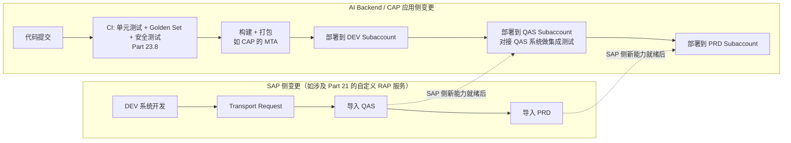
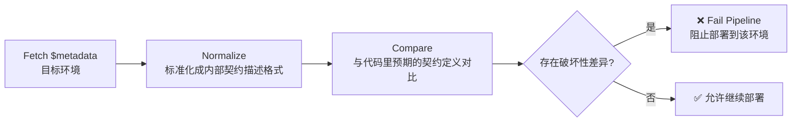

# Part 25：DEV / QAS / UAT / PRD + Transport + API Contract Drift

前面所有章节大多假设"有一个 SAP 系统可以调用"，本章补上真实企业项目里绕不开的一环：**你面对的从来不是一个 SAP 系统，而是一组分环境的系统（Landscape），配置、数据、甚至 API 行为在不同环境之间都可能有差异**，这一章讲清楚怎么把 AI Backend 安全、可控地从"本地能跑"推进到"生产可用"。

これまでの章の多くは「呼び出せる SAP システムが1つある」ことを前提としていましたが、本章では実際の企業プロジェクトで避けて通れない部分を補います。**あなたが向き合っているのは決して単一の SAP システムではなく、環境ごとに分かれたシステム群（Landscape）であり、設定・データ、さらには API の挙動までも環境間で異なる可能性があります**。本章では AI Backend を安全かつ制御可能な形で「ローカルで動く」から「本番で使える」へと進めていく方法を説明します。

## 25.1 Local / DEV / QAS / UAT / PRD 的职责

## 25.1 Local / DEV / QAS / UAT / PRD の役割

| 环境<br>環境 | 全称<br>正式名称 | 职责<br>役割 | AI Backend 侧的对应环境<br>AI Backend 側の対応環境 |
|---|---|---|---|
| Local | 本地开发环境<br>ローカル開発環境 | 开发者本机调试，通常连接 Mock SAP（Part 11）或共享的 DEV 系统<br>開発者自身のマシンでのデバッグ。通常は Mock SAP（Part 11）または共有の DEV システムに接続する | 本地运行 Agent Backend + Mock SAP Client<br>Agent Backend + Mock SAP Client をローカルで実行 |
| DEV | Development（开发）<br>Development（開発） | SAP 侧的开发配置环境，功能开发、单元测试、初步联调<br>SAP 側の開発・設定環境。機能開発、単体テスト、初期の結合確認を行う | 对接 DEV 系统做 SAP Integration Test（Part 23.1 第 2 层）<br>DEV システムと接続し SAP Integration Test を行う（Part 23.1 の第2層） |
| QAS | Quality Assurance（质量保证/测试）<br>Quality Assurance（品質保証／テスト） | 相对稳定的测试环境，用于系统测试、集成测试，数据通常是脱敏或专门构造的测试数据集<br>比較的安定したテスト環境で、システムテストや結合テストに用いる。データは通常マスキングされているか、専用に構築されたテストデータセットである | 跑完整的 End-to-End Test（Part 23.1 第 5 层）、安全对抗测试（Part 23.7）<br>完全な End-to-End Test（Part 23.1 の第5層）、セキュリティ対抗テスト（Part 23.7）を実行する |
| UAT | User Acceptance Testing（用户验收测试）<br>User Acceptance Testing（ユーザー受け入れテスト） | 业务用户参与验收，验证系统是否满足真实业务需求，通常更贴近生产配置<br>業務ユーザーが受け入れに参加し、システムが実際の業務要件を満たしているかを検証する。通常、本番の設定により近い | 邀请真实业务用户参与 Golden Dataset 之外的探索性测试，收集反馈补充进 Golden Dataset<br>実際の業務ユーザーを招き、Golden Dataset 以外の探索的テストに参加してもらい、フィードバックを収集して Golden Dataset に反映する |
| PRD | Production（生产）<br>Production（本番） | 真实业务运行环境，一切变更都需要经过前面环境的验证<br>実際に業務が稼働する環境。あらゆる変更は前段の環境での検証を経なければならない | 正式对外服务的 AI Backend 部署<br>正式に対外サービスを提供する AI Backend のデプロイ |

⚠️ 不同企业的 SAP Landscape 命名和环境数量可能有差异（有的企业没有独立的 UAT，有的企业在 QAS 和 PRD 之间还有 Staging/Pre-Prod），具体以你所在项目的实际 Landscape 设计为准，本表给出的是最常见的通用模式。

⚠️ 企業ごとに SAP Landscape の命名や環境数は異なる場合があります（独立した UAT を持たない企業もあれば、QAS と PRD の間に Staging/Pre-Prod を設けている企業もあります）。具体的には所属プロジェクトの実際の Landscape 設計に従ってください。本表が示すのは最も一般的な標準パターンです。

## 25.2 SAP Landscape 基础

## 25.2 SAP Landscape の基礎

**Landscape** 指一组相互关联、按环境分层的 SAP 系统集合，通常配合 **Transport（传输）机制**把开发环境里做的配置/开发变更，按受控的流程逐级搬运到 QAS、再到 PRD——这保证了"生产环境的变更永远是先在下游环境验证过的"，而不是直接在生产系统里改。理解 Landscape 的存在，对"AI + SAP"项目至少有两层意义：

**Landscape** とは、相互に関連し環境ごとに階層化された SAP システムの集合を指し、通常は **Transport（トランスポート）メカニズム**と組み合わせて、開発環境で行われた設定・開発変更を、制御されたプロセスで段階的に QAS、さらに PRD へと運びます――これにより「本番環境への変更は必ず事前に下流環境で検証されたものである」ことが保証され、本番システムを直接変更することはありません。Landscape の存在を理解することは、「AI + SAP」プロジェクトにとって少なくとも2つの意味を持ちます。

1. 你的 AI Backend 需要**分别对接每一个环境**，而不是"开发时连 DEV，写死配置，上线时手动改成 PRD"这种脆弱的做法（25.3 会展开）。

1. あなたの AI Backend は**それぞれの環境に個別に接続する**必要があり、「開発時は DEV に接続する設定をハードコーディングし、リリース時に手動で PRD に書き換える」といった脆弱なやり方をとってはいけません（25.3 で詳しく述べます）。

2. 如果你的项目里包含"给 SAP 侧新增自定义 API/CDS 视图"（比如 Part 21 提到的 Developer Extensibility），这部分 SAP 侧的开发同样要走标准的 Transport 流程，不能只在 DEV 系统里改完就直接指望 PRD 系统"自动"有这个新能力。

2. あなたのプロジェクトに「SAP 側にカスタム API/CDS ビューを新規追加する」内容（Part 21 で触れた Developer Extensibility など）が含まれる場合、この SAP 側の開発も同様に標準の Transport プロセスを経る必要があり、DEV システムで変更しただけで PRD システムに「自動的に」この新機能が備わることを期待してはいけません。

## 25.3 为什么不能"本地能跑就直接生产"

## 25.3 なぜ「ローカルで動けばそのまま本番へ」ではいけないのか

| 差异维度<br>差異の観点 | 具体风险<br>具体的なリスク |
|---|---|
| 数据不同<br>データが異なる | DEV/QAS 里的客户号、物料号很可能和 PRD 完全不是同一批，Demo 里硬编码测试用的 `"0010001234"` 这种客户号，在生产环境可能根本不存在或者对应完全不同的客户<br>DEV/QAS の顧客番号・品目番号は PRD とはまったく別のものである可能性が高く、デモでハードコーディングした `"0010001234"` のようなテスト用顧客番号は、本番環境ではそもそも存在しない、あるいはまったく別の顧客に対応している可能性がある |
| 配置不同<br>設定が異なる | Sales Organization、Order Type 等默认值的 Customizing 配置，各环境可能不一致<br>Sales Organization、Order Type などのデフォルト値に関する Customizing 設定は環境ごとに異なる可能性がある |
| API 可用性不同<br>API の利用可否が異なる | 一个 API 可能在 DEV 已经开通，但 PRD 的 Communication Arrangement 还没配置（尤其 S/4HANA Cloud 场景，见 Part 5.6）<br>ある API が DEV では有効化済みでも、PRD では Communication Arrangement がまだ設定されていない場合がある（特に S/4HANA Cloud のシナリオ、Part 5.6 参照） |
| 字段/契约可能有差异<br>フィールド／契約に差異がある可能性 | 见 25.9 的 API Contract Drift——不同环境的系统版本、Feature Pack、甚至補丁级别都可能不完全一致<br>25.9 の API Contract Drift を参照――環境によってシステムバージョン、Feature Pack、さらにはパッチレベルまで完全には一致しないことがある |
| 权限模型不同<br>権限モデルが異なる | DEV 环境的技术账号权限往往被放得很宽（方便开发调试），PRD 的权限应该严格按最小权限配置（Part 14.3），本地测试通过不代表生产权限配置也没问题<br>DEV 環境のテクニカルアカウントの権限は（開発・デバッグの便宜のため）広く設定されがちだが、PRD の権限は最小権限の原則に厳密に従って設定すべきである（Part 14.3）。ローカルテストの合格は本番の権限設定に問題がないことを意味しない |
| 性能特征不同<br>性能特性が異なる | DEV/QAS 系统的负载和硬件规格通常远低于 PRD，本地测试觉得"响应很快"，不代表生产环境在真实负载下同样表现良好<br>DEV/QAS システムの負荷とハードウェアスペックは通常 PRD よりはるかに低く、ローカルテストで「レスポンスが速い」と感じても、本番環境が実際の負荷の下で同様に良好なパフォーマンスを発揮するとは限らない |

## 25.4 每个环境要分开的配置项

## 25.4 環境ごとに分離すべき設定項目

以下配置**必须按环境隔离**，绝不能在代码里写死或跨环境共用：

以下の設定は**必ず環境ごとに分離しなければならず**、コードにハードコーディングしたり環境をまたいで共用したりしてはいけません。

| 配置项<br>設定項目 | 说明<br>説明 |
|---|---|
| Destination | 每个环境指向不同的目标系统，见 Part 5.7——这也是为什么强调"用 Destination Service 而不是硬编码 URL"的另一个理由：Destination 天然支持按环境切换<br>各環境が異なる接続先システムを指す。Part 5.7 参照――これは「URL をハードコーディングせず Destination Service を使う」ことを強調するもう一つの理由でもある。Destination は環境ごとの切り替えを本来的にサポートしている |
| OAuth Client | 各环境应使用独立的 OAuth Client（不同的 Client ID/Secret），避免一个环境的凭据泄露波及其他环境<br>各環境で独立した OAuth Client（異なる Client ID／Secret）を使用すべきであり、ある環境の資格情報の漏洩が他の環境に波及するのを防ぐ |
| Communication Arrangement | S/4HANA Cloud 场景下，每个环境的 Communication Arrangement 需要独立配置（Part 5.6）<br>S/4HANA Cloud のシナリオでは、各環境の Communication Arrangement を個別に設定する必要がある（Part 5.6） |
| SAP URL | 显而易见，但仍要强调：不应该出现在任何代码或版本控制的配置文件里，应该来自环境变量/密钥管理服务<br>自明ではあるが改めて強調する。いかなるコードやバージョン管理下の設定ファイルにも現れるべきではなく、環境変数／シークレット管理サービスから取得すべきである |
| Credential | 各环境凭据独立管理、独立轮转（Part 14.6）<br>各環境の資格情報は個別に管理し、個別にローテーションする（Part 14.6） |
| Sales Org 默认值<br>Sales Org のデフォルト値 | 不同环境的测试数据/Customizing 可能对应不同的默认 Sales Organization，硬编码会导致"DEV 测试通过，PRD 直接报错"这种典型事故<br>環境ごとのテストデータ／Customizing は異なるデフォルトの Sales Organization に対応する場合があり、ハードコーディングすると「DEV ではテストが通るが、PRD では即座にエラーになる」という典型的な事故を招く |
| Approval threshold（审批阈值）<br>Approval threshold（承認閾値） | 测试环境的审批阈值可能被临时调低/调高以方便测试，必须在部署到 PRD 前确认已经切换回生产应有的业务规则<br>テスト環境の承認閾値はテストの便宜のため一時的に引き下げ／引き上げられることがあるため、PRD にデプロイする前に、本番にふさわしい業務ルールに戻っていることを必ず確認しなければならない |
| Feature flags | 控制哪些能力对哪些环境/用户开放，见 25.13<br>どの機能がどの環境／ユーザーに公開されるかを制御する。25.13 参照 |
| Model configuration | 使用的 LLM 模型版本、API Key，各环境可能不同（比如测试环境用更便宜的模型节省成本）<br>使用する LLM モデルのバージョンや API Key は環境ごとに異なる場合がある（例えばテスト環境ではコスト削減のためより安価なモデルを使う） |
| Prompt version | 见 25.14，Prompt 本身也需要版本化和环境隔离<br>25.14 参照。Prompt 自体もバージョン管理と環境分離が必要である |

**核心原则：配置永远不能硬编码在 Prompt 或代码里，一律通过环境变量 + 密钥管理服务/Destination Service 注入**——这不只是工程卫生问题，也是安全问题（Part 14.6）：如果 Sales Org、Approval Threshold 这类业务规则被写进了 System Prompt 的文本里，不仅难以按环境切换，还违反了 Part 14.1"Prompt 不是安全边界"的核心原则——业务规则应该是代码里的确定性逻辑，不是指望模型"记住"Prompt 里写的某个阈值数字。

**核心原則：設定は決して Prompt やコードにハードコーディングしてはならず、一律に環境変数 + シークレット管理サービス／Destination Service 経由で注入する**――これは単なるエンジニアリング衛生の問題にとどまらず、セキュリティの問題でもあります（Part 14.6）。もし Sales Org や Approval Threshold のような業務ルールが System Prompt のテキストに書き込まれてしまうと、環境ごとの切り替えが困難になるだけでなく、Part 14.1 の「Prompt はセキュリティ境界ではない」というコア原則にも違反します――業務ルールはコード内の確定的なロジックであるべきで、モデルが Prompt に書かれた閾値の数字を「覚えている」ことに頼るべきではありません。

## 25.5 BTP Destination 的环境隔离

## 25.5 BTP Destination の環境分離

延续 Part 5.7、Part 10.4.4 的内容：在 BTP 上，不同环境（DEV/QAS/PRD）通常对应不同的 **Subaccount**（Part 10.1），每个 Subaccount 各自维护自己的 Destination 配置集合。应用代码里引用的 Destination **名称**（如 `S4HANA_SALES_ORDER_API`）在所有环境里保持一致，但这个名称在不同 Subaccount 里指向的实际连接信息（URL、认证方式、凭据）是环境特定的——这正是"代码不变、配置随环境切换"这条原则的具体落地方式。

Part 5.7、Part 10.4.4 の内容の続きです。BTP 上では、異なる環境（DEV/QAS/PRD）は通常異なる **Subaccount**（Part 10.1）に対応し、各 Subaccount がそれぞれ独自の Destination 設定集合を維持します。アプリケーションコードで参照する Destination の**名前**（`S4HANA_SALES_ORDER_API` など）はすべての環境で一貫していますが、この名前が異なる Subaccount で指す実際の接続情報（URL、認証方式、資格情報）は環境固有のものです――これはまさに「コードは変わらず、設定は環境に応じて切り替わる」という原則の具体的な実装方法です。

## 25.6 SAP Transport 概念

## 25.6 SAP Transport の概念

**Transport（传输请求，Transport Request）** 是 SAP 经典的变更管理机制：开发者在 DEV 系统里做的配置变更或开发对象（ABAP 程序、CDS 视图、Customizing 设置等）会被记录进一个 Transport Request，之后通过标准的传输流程把这个 Request 依次导入 QAS、再导入 PRD，从而保证变更是**受控、可追溯、按顺序**在各环境生效的，而不是各环境各自"手工改一遍"（那样极易产生环境间不一致）。

**Transport（トランスポートリクエスト、Transport Request）** は SAP の伝統的な変更管理メカニズムです。開発者が DEV システムで行った設定変更や開発オブジェクト（ABAP プログラム、CDS ビュー、Customizing 設定など）は Transport Request に記録され、その後標準のトランスポートプロセスを通じてこの Request が順次 QAS、次に PRD にインポートされます。これにより、変更が**制御され、追跡可能で、順序どおりに**各環境で有効化されることが保証されます。各環境で個別に「手作業で変更する」（環境間の不整合を非常に生じやすい）ことはありません。

## 25.7 Customizing Transport vs Workbench Transport

| 类型<br>タイプ | 内容<br>内容 | 说明<br>説明 |
|---|---|---|
| Customizing Transport | 业务配置类变更（如 Sales Document Type 定义、Sales Area 组合配置）<br>業務設定系の変更（Sales Document Type の定義、Sales Area の組み合わせ設定など） | 通常与具体客户端（Client）绑定<br>通常、特定のクライアント（Client）に紐づく |
| Workbench Transport | 开发对象类变更（如 ABAP 程序、CDS 视图、RAP Business Object 定义，对应 Part 21 的开发内容）<br>開発オブジェクト系の変更（ABAP プログラム、CDS ビュー、RAP Business Object の定義など、Part 21 の開発内容に対応） | 与客户端无关，是"代码"层面的变更<br>クライアントに依存しない、「コード」レベルの変更である |

⚠️ 具体的 Transport 分类机制、S/4HANA Cloud 场景下是否还沿用完全相同的经典 Transport 概念（Public Cloud 场景的变更管理机制与 On-Premise 有显著差异，很多配置通过 Fiori 应用里的"传输"能力或专门的云端变更管理流程完成），需要按目标系统的实际部署形态（Part 6）核实，不要把 On-Premise 时代的经典 Transport 概念不加区分地套用到所有场景。

⚠️ 具体的な Transport の分類メカニズム、S/4HANA Cloud のシナリオで従来と完全に同じ Transport の概念が引き続き使われるかどうか（Public Cloud シナリオの変更管理メカニズムは On-Premise と大きく異なり、多くの設定は Fiori アプリの「トランスポート」機能や専用のクラウド変更管理プロセスを通じて行われます）については、対象システムの実際のデプロイ形態（Part 6）に基づいて確認する必要があり、On-Premise 時代の従来の Transport 概念をすべてのシナリオに無差別に当てはめないようにしてください。

## 25.8 BTP / CAP 应用部署流程与 CI/CD Pipeline

## 25.8 BTP / CAP アプリのデプロイフローと CI/CD パイプライン



两条流水线（SAP 侧的 Transport 流程、应用侧的 CI/CD 流程）通常是**并行但互相依赖**的：如果一个新功能既需要 SAP 侧新增一个 Released API（Part 21 的 Developer Extensibility），又需要 AI Backend 侧新增对应的 Tool，两边的变更都需要按各自的环境顺序推进，且应用侧的部署顺序不能早于对应 SAP 能力在目标环境就绪的时间点——这也是 25.9 Contract Test 要在部署前置检查的原因之一。

2つのパイプライン（SAP 側の Transport プロセス、アプリ側の CI/CD プロセス）は通常**並行しつつも互いに依存**しています。もしある新機能が SAP 側で新しい Released API（Part 21 の Developer Extensibility）を必要とし、同時に AI Backend 側で対応する Tool の追加を必要とする場合、両側の変更はそれぞれの環境順序に従って進める必要があり、アプリ側のデプロイ順序は対象 SAP 機能が該当環境で準備完了となる時点より早くなってはいけません――これも 25.9 の Contract Test をデプロイ前のチェックとする理由の一つです。

## 25.9 Secret Rotation 与 Rollback

## 25.9 Secret Rotation と Rollback

- **Secret Rotation（凭据轮转）**：延续 Part 14.6，在多环境场景下要注意——各环境的轮转周期和流程可以独立管理（比如 PRD 的凭据轮转应该有更严格的审计要求），但轮转操作本身不应该要求重新部署应用（凭据应该在运行时从密钥管理服务/Destination 动态获取）。

- **Secret Rotation（資格情報のローテーション）**：Part 14.6 の続きです。マルチ環境のシナリオでは以下に注意してください――各環境のローテーション周期とプロセスは独立して管理できます（例えば PRD の資格情報ローテーションはより厳格な監査要件を課すべきです）が、ローテーション操作自体はアプリの再デプロイを必要とすべきではありません（資格情報はランタイムにシークレット管理サービス／Destination から動的に取得すべきです）。

- **Rollback（回滚）**：AI Backend 的部署应该保留快速回滚到上一个已知良好版本的能力。**但要注意一个容易被忽视的点**：如果本次发布同时包含了 Prompt/Tool Schema 的变更和 Business Service 代码的变更，回滚时要确保两者一起回滚到匹配的版本（Prompt 版本和代码版本不匹配可能导致 Tool 调用参数与实际实现的期望不一致），这正是 25.14 强调"Prompt 也要版本化并与代码版本绑定"的原因。

- **Rollback（ロールバック）**：AI Backend のデプロイは、直前の正常動作が確認されたバージョンへ素早くロールバックできる能力を維持すべきです。**ただし見落とされがちな点に注意してください**――今回のリリースに Prompt/Tool Schema の変更と Business Service のコード変更が同時に含まれている場合、ロールバック時には両者を一緒に整合するバージョンへ戻す必要があります（Prompt のバージョンとコードのバージョンが一致しないと、Tool 呼び出しのパラメータと実際の実装が期待するものとの間に不整合が生じる可能性があります）。これがまさに 25.11 で「Prompt もバージョン管理してコードバージョンと紐づけるべき」と強調している理由です。

## 25.10 Blue/Green 与 Canary 在 AI Backend 中的应用

## 25.10 AI Backend における Blue/Green と Canary の適用

| 策略<br>戦略 | 说明<br>説明 | 在 AI Backend 场景下的特别考量<br>AI Backend シナリオにおける特別な考慮事項 |
|---|---|---|
| Blue/Green | 同时维护两套完整环境（Blue 是当前生产、Green 是待发布版本），切流量时整体切换，出问题可以立刻切回<br>2つの完全な環境を同時に維持する（Blue が現行の本番、Green がリリース待ちのバージョン）。トラフィックを切り替える際は一括で切り替え、問題が発生すれば即座に切り戻せる | 适合 Prompt/模型版本这类"一刀切"更安全的变更——避免同一批用户在对话过程中，前几轮用旧版本、后几轮突然换成新版本行为，导致体验不一致或触发 23.5 提到的回归问题<br>Prompt／モデルバージョンのような「一括切り替え」の方が安全な変更に適している――同一のユーザー群が対話の途中で、前半のターンは旧バージョン、後半のターンで急に新バージョンの挙動に切り替わってしまい、体験の不一致や 23.5 で触れた回帰問題を引き起こすことを避けられる |
| Canary | 先把一小部分流量（或一小部分用户）切到新版本，观察指标正常后再逐步扩大比例<br>まず一部のトラフィック（または一部のユーザー）を新バージョンに切り替え、指標が正常であることを確認してから徐々に比率を拡大する | 特别适合验证 Part 23.3 的核心指标（Hallucinated Identifier Rate、Confirmation Bypass Rate、False Success Rate 等）在真实生产流量下是否符合预期，比只依赖 Golden Dataset 的离线评估更能发现真实世界的边界情况；但**灰度期间的 WRITE 操作仍然要走完整的安全机制，不能因为是"小流量试验"就放松确认/审批要求**<br>特に Part 23.3 のコア指標（Hallucinated Identifier Rate、Confirmation Bypass Rate、False Success Rate など）が実際の本番トラフィック下で期待どおりかを検証するのに適しており、Golden Dataset のオフライン評価だけに頼るよりも実世界の境界事例を発見しやすい。ただし**カナリア期間中の WRITE 操作も完全なセキュリティメカニズムを経る必要があり、「小規模なトラフィックの試験だから」といって確認／承認要件を緩めてはいけない** |

## 25.11 Prompt 部署也应该版本化

## 25.11 Prompt のデプロイもバージョン管理すべき

延续 Part 23.5"System Prompt 变更需要触发回归测试"的要求，本节强调工程实践上的落地：**System Prompt、Tool description、JSON Schema 应该被当作代码一样纳入版本控制**（哪怕它们本质上是字符串/JSON 而不是可执行代码），每次变更都对应一个明确的版本号，且部署时要能清楚知道"当前生产环境跑的是哪个 Prompt 版本"。这不仅是为了 25.9 提到的回滚一致性，也是审计要求的一部分（Part 15：出问题时，你需要能查到"这次错误行为发生时，System Prompt 到底是什么内容"）。

Part 23.5 の「System Prompt の変更は回帰テストをトリガーする必要がある」という要求の続きとして、本節ではエンジニアリング実践上の落とし込みを強調します。**System Prompt、Tool description、JSON Schema はコードと同様にバージョン管理に組み込むべきです**（それらが本質的には実行可能なコードではなく文字列／JSON であっても）。変更のたびに明確なバージョン番号を対応させ、デプロイ時には「現在の本番環境がどの Prompt バージョンを実行しているか」を明確に把握できる必要があります。これは 25.9 で触れたロールバックの整合性のためだけでなく、監査要件の一部でもあります（Part 15：問題が発生したとき、「この誤った挙動が発生した時点で System Prompt の内容が実際にはどうなっていたか」を照会できる必要があります）。

## 25.12 API Contract Drift（API 契约漂移）

## 25.12 API Contract Drift（API 契約ドリフト）

**这是本章除环境管理外的第二个核心主题。**

**これは本章において環境管理以外のもう一つのコアテーマです。**

**问题场景**：DEV 环境的某个 OData 服务 `$metadata` 里有字段 X（比如某个可选字段），但 QAS 或 PRD 环境的系统版本/补丁级别不同，字段 X 可能不存在，或者类型/是否必填发生了变化——如果你的 Adapter 层代码是照着 DEV 环境的 `$metadata` 写死的字段映射，部署到 PRD 后可能直接报错，而且这类问题往往**在部署后才被发现**，而不是在开发阶段。

**問題のシナリオ**：DEV 環境のある OData サービスの `$metadata` にフィールド X（例えばあるオプションフィールド）が存在するが、QAS や PRD 環境ではシステムバージョン／パッチレベルが異なるため、フィールド X が存在しない、あるいは型や必須かどうかが変わっている場合があります――もしあなたの Adapter 層のコードが DEV 環境の `$metadata` に基づいてフィールドマッピングをハードコーディングしていた場合、PRD にデプロイした後に即座にエラーになる可能性があります。しかもこの種の問題は多くの場合、**デプロイ後になって初めて発見され**、開発段階では発見されません。

**这类漂移的常见形式**：

**この種のドリフトの一般的な形態**：

| 漂移类型<br>ドリフトのタイプ | 说明<br>説明 |
|---|---|
| Schema Drift（结构漂移）<br>Schema Drift（構造ドリフト） | 环境间 `$metadata` 存在任何不一致，是本节所有子类型的统称<br>環境間で `$metadata` にいかなる不一致があることも指し、本節のすべてのサブタイプの総称である |
| Optional → Required | 某个环境里字段从可选变成必填（或反过来），Adapter 层如果没有传这个字段，在字段变必填的环境会直接报错<br>ある環境でフィールドがオプションから必須に変わる（またはその逆）。Adapter 層がこのフィールドを渡していない場合、フィールドが必須になった環境では即座にエラーになる |
| Type Change（类型变化）<br>Type Change（型の変化） | 字段的数据类型发生变化（如从字符串变成数值），可能导致序列化/反序列化错误<br>フィールドのデータ型が変化する（文字列から数値へなど）。シリアライズ／デシリアライズのエラーを招く可能性がある |
| Removed Entity（实体被移除）<br>Removed Entity（エンティティの削除） | 某个 Entity Set 在新版本中被移除或改名（通常发生在使用了未 Released 对象、或所依赖对象的 Release Contract 本身不覆盖这种保护范围的情况下，见 Part 21.4）<br>ある Entity Set が新バージョンで削除または改名される（通常、Released されていないオブジェクトを使用している場合、あるいは依存しているオブジェクトの Release Contract 自体がこの保護範囲をカバーしていない場合に発生する。Part 21.4 参照） |
| Renamed Navigation Property | Navigation Property 改名，导致 Deep Insert（Part 5.3.2）的关联结构失效<br>Navigation Property が改名され、Deep Insert（Part 5.3.2）の関連構造が無効になる |

### 部署前的 Contract 检查流程

### デプロイ前の Contract チェックフロー



### Contract Test 伪代码示例

### Contract Test 疑似コード例

```typescript
// scripts/contractTest.ts —— 部署流水线中的一个步骤
interface FieldContract {
  name: string;
  type: string;
  nullable: boolean;
}

interface EntityContract {
  entitySet: string;
  fields: FieldContract[];
  navigationProperties: string[];
}

// 代码里"预期"的契约定义——应该随 Adapter 层代码一起维护、评审
const EXPECTED_CONTRACT: EntityContract = {
  entitySet: "A_SalesOrder",
  fields: [
    { name: "SalesOrderType", type: "Edm.String", nullable: false },
    { name: "SoldToParty", type: "Edm.String", nullable: false },
    { name: "RequestedDeliveryDate", type: "Edm.DateTime", nullable: true },
  ],
  navigationProperties: ["to_Item", "to_Partner"],
};

async function fetchAndNormalizeMetadata(destinationName: string, entitySet: string): Promise<EntityContract> {
  const metadataXml = await fetchODataMetadata(destinationName); // 实现略：调用 $metadata 端点
  return normalizeEdmxToContract(metadataXml, entitySet);        // 实现略：解析 EDMX，抽取字段/类型/关联
}

function diffContract(expected: EntityContract, actual: EntityContract): string[] {
  const breakingChanges: string[] = [];

  for (const field of expected.fields) {
    const actualField = actual.fields.find((f) => f.name === field.name);
    if (!actualField) {
      breakingChanges.push(`字段被移除: ${field.name}`);
      continue;
    }
    if (actualField.type !== field.type) {
      breakingChanges.push(`字段类型变化: ${field.name} (${field.type} → ${actualField.type})`);
    }
    if (!field.nullable && actualField.nullable) {
      // required → optional 通常不是破坏性变更（代码仍可正常工作），不阻断
    }
    if (field.nullable === false && actualField.nullable === true) {
      // 说明见上
    }
    if (field.nullable === true && actualField.nullable === false) {
      breakingChanges.push(`字段从可选变为必填: ${field.name}（可能导致缺少该字段时被拒绝）`);
    }
  }

  for (const nav of expected.navigationProperties) {
    if (!actual.navigationProperties.includes(nav)) {
      breakingChanges.push(`Navigation Property 被移除或改名: ${nav}`);
    }
  }

  return breakingChanges;
}

async function runContractTest(destinationName: string, envName: string) {
  const actual = await fetchAndNormalizeMetadata(destinationName, "A_SalesOrder");
  const breakingChanges = diffContract(EXPECTED_CONTRACT, actual);

  if (breakingChanges.length > 0) {
    console.error(`[${envName}] 检测到破坏性契约变更，阻止部署：`);
    breakingChanges.forEach((c) => console.error(`  - ${c}`));
    process.exit(1);
  }
  console.log(`[${envName}] 契约检查通过`);
}
```

要点：这个检查应该作为 25.8 CI/CD 流水线中，**部署到每一个环境之前**都执行一次的独立步骤（不能只在开发时测一次就假设永远有效），因为 SAP 系统本身也会随时间升级、打补丁，DEV 环境今天的 `$metadata` 和三个月后的 `$metadata` 完全可能不一样。

要点：このチェックは 25.8 の CI/CD パイプラインの中で、**各環境へデプロイする前に毎回**実行する独立したステップとすべきです（開発時に一度テストしただけで永久に有効だと仮定してはいけません）。なぜなら SAP システム自体も時間とともにアップグレードやパッチ適用が行われ、DEV 環境の今日の `$metadata` と3か月後の `$metadata` はまったく異なる可能性が十分にあるからです。

## 25.13 Feature Flags

用 Feature Flag 控制新能力（新 Tool、新的确认流程逻辑、新的 Prompt 版本）按环境/按用户群灰度开放，而不是"一次性全量切换"。这与 25.10 的 Canary 策略是配套的实践，且同样要遵守一条底线：**Feature Flag 决定的是"这个能力是否对某批用户可见/可用"，绝不能被用来绕过 Part 7/9 的确认、审批、权限校验逻辑**——比如不能用"这是灰度用户，跳过确认环节直接测试"这种方式做测试，安全机制应该在所有 Feature Flag 状态下保持一致。

Feature Flag を使って新機能（新しい Tool、新しい確認フローロジック、新しい Prompt バージョン）を環境／ユーザー群ごとに段階的に公開し、「一度に全量切り替え」を避けます。これは 25.10 の Canary 戦略と対になる実践であり、同様に一つの原則を守る必要があります。**Feature Flag が決めるのは「この機能があるユーザー群に対して可視／利用可能かどうか」であり、Part 7/9 の確認・承認・権限検証ロジックを回避するために使ってはならない**――例えば「これはカナリアユーザーだから確認プロセスを飛ばして直接テストする」といったやり方でテストしてはいけません。セキュリティメカニズムはすべての Feature Flag 状態において一貫していなければなりません。

## 25.14 Production Readiness Checklist

在把一个新能力/新版本正式推向 PRD 之前，建议逐项核对：

新機能／新バージョンを正式に PRD へ展開する前に、以下を項目ごとに確認することを推奨します。

| 检查项<br>チェック項目 | 对应章节<br>対応する章 |
|---|---|
| Authentication 配置正确（各环境独立凭据，优先证书/OAuth2）<br>Authentication が正しく設定されている（各環境が独立した資格情報を持ち、証明書／OAuth2 を優先する） | Part 9.4、Part 5、本章 25.4 |
| RBAC / 最小权限已配置<br>RBAC／最小権限が設定済み | Part 9.5、Part 14.3 |
| Confirmation 机制由后端强制（非仅靠 Prompt）<br>Confirmation メカニズムがバックエンドによって強制されている（Prompt のみに依存していない） | Part 7.3、Part 11.6 |
| Approval 阈值和流程已按 PRD 业务规则配置（非测试环境的临时宽松值）<br>Approval の閾値とフローが PRD の業務ルールに従って設定されている（テスト環境の一時的な緩和値ではない） | Part 9.3、本章 25.4 |
| Idempotency 存储已切换为生产级实现（非内存 Map）<br>Idempotency ストアが本番向け実装に切り替わっている（インメモリ Map ではない） | Part 11.8、Part 13.2 |
| Audit Log 完整记录三层信息（AI/Backend/SAP）<br>Audit Log が3層（AI／Backend／SAP）の情報を完全に記録している | Part 15 |
| Observability：结构化日志 + Correlation ID + 告警已配置<br>Observability：構造化ログ + Correlation ID + アラートが設定済み | Part 15、Part 24.11 |
| Rate Limit 已配置（出向/入向双向）<br>Rate Limit が設定済み（アウトバウンド／インバウンド双方向） | Part 24.9 |
| Retry Policy 已正确区分 READ/WRITE，WRITE 超时不会被自动重试<br>Retry Policy が READ/WRITE を正しく区別しており、WRITE のタイムアウトは自動リトライされない | Part 24.2-24.4 |
| Circuit Breaker 已在 Integration Layer 配置<br>Circuit Breaker が Integration Layer に設定済み | Part 24.7 |
| Secret Rotation 流程已就绪，凭据不硬编码<br>Secret Rotation のプロセスが整備済みで、資格情報はハードコーディングされていない | Part 14.6、本章 25.9 |
| PII 处理符合合规要求（日志脱敏、LLM 供应商数据协议已审查）<br>PII の取り扱いがコンプライアンス要件を満たしている（ログのマスキング、LLM ベンダーのデータ契約がレビュー済み） | Part 14.4 |
| Prompt Regression 已完成（Golden Dataset 全量通过，尤其 False Success Rate = 0）<br>Prompt Regression が完了している（Golden Dataset が全量合格、特に False Success Rate = 0） | Part 23.5、Part 23.8 |
| SAP Contract Test 已通过（针对目标环境的 `$metadata`）<br>SAP Contract Test が合格している（対象環境の `$metadata` に対して） | 本章 25.12 |
| Rollback 方案已验证可行（含 Prompt 版本与代码版本的一致性）<br>Rollback 方式が実行可能であることを検証済み（Prompt バージョンとコードバージョンの整合性を含む） | 本章 25.9、25.11 |

**这份清单本质上是全书内容的一次"发布前汇总检查"**——它不引入新概念，而是把前 24 章分散讲解的各项要求，收敛成一个部署前必须逐条确认的门禁清单，这也是 Part 23.8"部署门禁"理念在组织流程层面的延伸。

**このチェックリストは本質的に、本書全体の内容を「リリース前の総まとめチェック」としてまとめたものです**――新しい概念を導入するのではなく、前の24章で分散して説明されてきた各要件を、デプロイ前に一項目ずつ確認しなければならないゲートチェックリストへと収斂させたものであり、これは Part 23.8 の「デプロイゲート」という理念の組織プロセスレベルへの拡張でもあります。

## 25.15 项目中你需要记住什么

## 25.15 プロジェクトで覚えておくべきこと

- 环境隔离不是"部署脚本里改几个变量"这么简单，凡是 25.4 列出的配置项，都必须在设计阶段就明确"按环境隔离"，绝不能硬编码或跨环境复用，尤其是业务规则类配置（Sales Org 默认值、Approval Threshold）不能写进 Prompt。

- 環境分離は「デプロイスクリプトの中で変数をいくつか変える」ほど単純なものではありません。25.4 に挙げた設定項目はすべて、設計段階で「環境ごとに分離する」ことを明確にしなければならず、ハードコーディングや環境をまたいだ再利用は決して行ってはなりません。特に業務ルール系の設定（Sales Org のデフォルト値、Approval Threshold）は Prompt に書き込んではいけません。

- SAP 侧的 Transport 流程和应用侧的 CI/CD 流程是两条并行但互相依赖的流水线，涉及 SAP 侧新增能力（如 Part 21 的自定义 RAP 服务）的功能，部署顺序要考虑两边环境就绪的先后关系。

- SAP 側の Transport プロセスとアプリ側の CI/CD プロセスは、並行しつつも互いに依存する2本のパイプラインです。SAP 側の新機能追加（Part 21 のカスタム RAP サービスなど）に関わる機能では、デプロイの順序において双方の環境が準備完了となるタイミングの前後関係を考慮する必要があります。

- API Contract Drift 是"依赖 Released API 及其 Release Contract"（Part 21.4）之外的第二道防线：即使用的是 Released 对象，不同环境/不同时间点的实际 `$metadata` 仍然可能存在差异（哪怕只是 Contract 允许范围内的新增可选字段），必须在每次部署前用自动化 Contract Test 检测并按 Contract 类型判断是否为破坏性变更，而不是假设"开发时测过一次就永远有效"。

- API Contract Drift は「Released API とその Release Contract に依拠する」（Part 21.4）こと以外の第二の防御線です。Released オブジェクトを使用していても、異なる環境／異なる時点における実際の `$metadata` には依然として差異が生じる可能性があります（Contract が許容する範囲内での新しいオプションフィールドの追加であっても）。毎回のデプロイ前に自動化された Contract Test で検出し、Contract のタイプに応じて破壊的変更かどうかを判断しなければならず、「開発時に一度テストしたから永久に有効」と仮定してはいけません。

- Prompt/Tool Schema 应该像代码一样版本化管理，并在回滚时保证与代码版本一致，这是很多项目容易忽视的一个环节。

- Prompt/Tool Schema はコードと同様にバージョン管理すべきであり、ロールバック時にはコードバージョンとの整合性を保証する必要があります。これは多くのプロジェクトで見落とされがちな部分です。

- Production Readiness Checklist 是全书安全、可靠性、测试要求的汇总门禁，新功能上线前应该逐条过一遍，而不是凭经验判断"应该没问题"。

- Production Readiness Checklist は本書全体の安全性・信頼性・テスト要件を集約したゲートであり、新機能のリリース前には経験則で「問題ないはず」と判断するのではなく、一項目ずつ確認すべきです。
