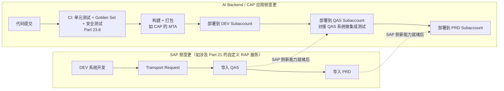
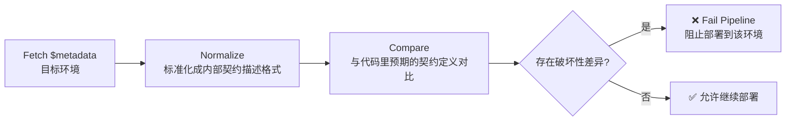

# Part 25：DEV / QAS / UAT / PRD + Transport + API Contract Drift

前面所有章节大多假设"有一个 SAP 系统可以调用"，本章补上真实企业项目里绕不开的一环：**你面对的从来不是一个 SAP 系统，而是一组分环境的系统（Landscape），配置、数据、甚至 API 行为在不同环境之间都可能有差异**，这一章讲清楚怎么把 AI Backend 安全、可控地从"本地能跑"推进到"生产可用"。

## 25.1 Local / DEV / QAS / UAT / PRD 的职责

| 环境 | 全称 | 职责 | AI Backend 侧的对应环境 |
|---|---|---|---|
| Local | 本地开发环境 | 开发者本机调试，通常连接 Mock SAP（Part 11）或共享的 DEV 系统 | 本地运行 Agent Backend + Mock SAP Client |
| DEV | Development（开发） | SAP 侧的开发配置环境，功能开发、单元测试、初步联调 | 对接 DEV 系统做 SAP Integration Test（Part 23.1 第 2 层） |
| QAS | Quality Assurance（质量保证/测试） | 相对稳定的测试环境，用于系统测试、集成测试，数据通常是脱敏或专门构造的测试数据集 | 跑完整的 End-to-End Test（Part 23.1 第 5 层）、安全对抗测试（Part 23.7） |
| UAT | User Acceptance Testing（用户验收测试） | 业务用户参与验收，验证系统是否满足真实业务需求，通常更贴近生产配置 | 邀请真实业务用户参与 Golden Dataset 之外的探索性测试，收集反馈补充进 Golden Dataset |
| PRD | Production（生产） | 真实业务运行环境，一切变更都需要经过前面环境的验证 | 正式对外服务的 AI Backend 部署 |

⚠️ 不同企业的 SAP Landscape 命名和环境数量可能有差异（有的企业没有独立的 UAT，有的企业在 QAS 和 PRD 之间还有 Staging/Pre-Prod），具体以你所在项目的实际 Landscape 设计为准，本表给出的是最常见的通用模式。

## 25.2 SAP Landscape 基础

**Landscape** 指一组相互关联、按环境分层的 SAP 系统集合，通常配合 **Transport（传输）机制**把开发环境里做的配置/开发变更，按受控的流程逐级搬运到 QAS、再到 PRD——这保证了"生产环境的变更永远是先在下游环境验证过的"，而不是直接在生产系统里改。理解 Landscape 的存在，对"AI + SAP"项目至少有两层意义：

1. 你的 AI Backend 需要**分别对接每一个环境**，而不是"开发时连 DEV，写死配置，上线时手动改成 PRD"这种脆弱的做法（25.3 会展开）。
2. 如果你的项目里包含"给 SAP 侧新增自定义 API/CDS 视图"（比如 Part 21 提到的 Developer Extensibility），这部分 SAP 侧的开发同样要走标准的 Transport 流程，不能只在 DEV 系统里改完就直接指望 PRD 系统"自动"有这个新能力。

## 25.3 为什么不能"本地能跑就直接生产"

| 差异维度 | 具体风险 |
|---|---|
| 数据不同 | DEV/QAS 里的客户号、物料号很可能和 PRD 完全不是同一批，Demo 里硬编码测试用的 `"0010001234"` 这种客户号，在生产环境可能根本不存在或者对应完全不同的客户 |
| 配置不同 | Sales Organization、Order Type 等默认值的 Customizing 配置，各环境可能不一致 |
| API 可用性不同 | 一个 API 可能在 DEV 已经开通，但 PRD 的 Communication Arrangement 还没配置（尤其 S/4HANA Cloud 场景，见 Part 5.6） |
| 字段/契约可能有差异 | 见 25.9 的 API Contract Drift——不同环境的系统版本、Feature Pack、甚至補丁级别都可能不完全一致 |
| 权限模型不同 | DEV 环境的技术账号权限往往被放得很宽（方便开发调试），PRD 的权限应该严格按最小权限配置（Part 14.3），本地测试通过不代表生产权限配置也没问题 |
| 性能特征不同 | DEV/QAS 系统的负载和硬件规格通常远低于 PRD，本地测试觉得"响应很快"，不代表生产环境在真实负载下同样表现良好 |

## 25.4 每个环境要分开的配置项

以下配置**必须按环境隔离**，绝不能在代码里写死或跨环境共用：

| 配置项 | 说明 |
|---|---|
| Destination | 每个环境指向不同的目标系统，见 Part 5.7——这也是为什么强调"用 Destination Service 而不是硬编码 URL"的另一个理由：Destination 天然支持按环境切换 |
| OAuth Client | 各环境应使用独立的 OAuth Client（不同的 Client ID/Secret），避免一个环境的凭据泄露波及其他环境 |
| Communication Arrangement | S/4HANA Cloud 场景下，每个环境的 Communication Arrangement 需要独立配置（Part 5.6） |
| SAP URL | 显而易见，但仍要强调：不应该出现在任何代码或版本控制的配置文件里，应该来自环境变量/密钥管理服务 |
| Credential | 各环境凭据独立管理、独立轮转（Part 14.6） |
| Sales Org 默认值 | 不同环境的测试数据/Customizing 可能对应不同的默认 Sales Organization，硬编码会导致"DEV 测试通过，PRD 直接报错"这种典型事故 |
| Approval threshold（审批阈值） | 测试环境的审批阈值可能被临时调低/调高以方便测试，必须在部署到 PRD 前确认已经切换回生产应有的业务规则 |
| Feature flags | 控制哪些能力对哪些环境/用户开放，见 25.13 |
| Model configuration | 使用的 LLM 模型版本、API Key，各环境可能不同（比如测试环境用更便宜的模型节省成本） |
| Prompt version | 见 25.14，Prompt 本身也需要版本化和环境隔离 |

**核心原则：配置永远不能硬编码在 Prompt 或代码里，一律通过环境变量 + 密钥管理服务/Destination Service 注入**——这不只是工程卫生问题，也是安全问题（Part 14.6）：如果 Sales Org、Approval Threshold 这类业务规则被写进了 System Prompt 的文本里，不仅难以按环境切换，还违反了 Part 14.1"Prompt 不是安全边界"的核心原则——业务规则应该是代码里的确定性逻辑，不是指望模型"记住"Prompt 里写的某个阈值数字。

## 25.5 BTP Destination 的环境隔离

延续 Part 5.7、Part 10.4.4 的内容：在 BTP 上，不同环境（DEV/QAS/PRD）通常对应不同的 **Subaccount**（Part 10.1），每个 Subaccount 各自维护自己的 Destination 配置集合。应用代码里引用的 Destination **名称**（如 `S4HANA_SALES_ORDER_API`）在所有环境里保持一致，但这个名称在不同 Subaccount 里指向的实际连接信息（URL、认证方式、凭据）是环境特定的——这正是"代码不变、配置随环境切换"这条原则的具体落地方式。

## 25.6 SAP Transport 概念

**Transport（传输请求，Transport Request）** 是 SAP 经典的变更管理机制：开发者在 DEV 系统里做的配置变更或开发对象（ABAP 程序、CDS 视图、Customizing 设置等）会被记录进一个 Transport Request，之后通过标准的传输流程把这个 Request 依次导入 QAS、再导入 PRD，从而保证变更是**受控、可追溯、按顺序**在各环境生效的，而不是各环境各自"手工改一遍"（那样极易产生环境间不一致）。

## 25.7 Customizing Transport vs Workbench Transport

| 类型 | 内容 | 说明 |
|---|---|---|
| Customizing Transport | 业务配置类变更（如 Sales Document Type 定义、Sales Area 组合配置） | 通常与具体客户端（Client）绑定 |
| Workbench Transport | 开发对象类变更（如 ABAP 程序、CDS 视图、RAP Business Object 定义，对应 Part 21 的开发内容） | 与客户端无关，是"代码"层面的变更 |

⚠️ 具体的 Transport 分类机制、S/4HANA Cloud 场景下是否还沿用完全相同的经典 Transport 概念（Public Cloud 场景的变更管理机制与 On-Premise 有显著差异，很多配置通过 Fiori 应用里的"传输"能力或专门的云端变更管理流程完成），需要按目标系统的实际部署形态（Part 6）核实，不要把 On-Premise 时代的经典 Transport 概念不加区分地套用到所有场景。

## 25.8 BTP / CAP 应用部署流程与 CI/CD Pipeline



两条流水线（SAP 侧的 Transport 流程、应用侧的 CI/CD 流程）通常是**并行但互相依赖**的：如果一个新功能既需要 SAP 侧新增一个 Released API（Part 21 的 Developer Extensibility），又需要 AI Backend 侧新增对应的 Tool，两边的变更都需要按各自的环境顺序推进，且应用侧的部署顺序不能早于对应 SAP 能力在目标环境就绪的时间点——这也是 25.9 Contract Test 要在部署前置检查的原因之一。

## 25.9 Secret Rotation 与 Rollback

- **Secret Rotation（凭据轮转）**：延续 Part 14.6，在多环境场景下要注意——各环境的轮转周期和流程可以独立管理（比如 PRD 的凭据轮转应该有更严格的审计要求），但轮转操作本身不应该要求重新部署应用（凭据应该在运行时从密钥管理服务/Destination 动态获取）。
- **Rollback（回滚）**：AI Backend 的部署应该保留快速回滚到上一个已知良好版本的能力。**但要注意一个容易被忽视的点**：如果本次发布同时包含了 Prompt/Tool Schema 的变更和 Business Service 代码的变更，回滚时要确保两者一起回滚到匹配的版本（Prompt 版本和代码版本不匹配可能导致 Tool 调用参数与实际实现的期望不一致），这正是 25.14 强调"Prompt 也要版本化并与代码版本绑定"的原因。

## 25.10 Blue/Green 与 Canary 在 AI Backend 中的应用

| 策略 | 说明 | 在 AI Backend 场景下的特别考量 |
|---|---|---|
| Blue/Green | 同时维护两套完整环境（Blue 是当前生产、Green 是待发布版本），切流量时整体切换，出问题可以立刻切回 | 适合 Prompt/模型版本这类"一刀切"更安全的变更——避免同一批用户在对话过程中，前几轮用旧版本、后几轮突然换成新版本行为，导致体验不一致或触发 23.5 提到的回归问题 |
| Canary | 先把一小部分流量（或一小部分用户）切到新版本，观察指标正常后再逐步扩大比例 | 特别适合验证 Part 23.3 的核心指标（Hallucinated Identifier Rate、Confirmation Bypass Rate、False Success Rate 等）在真实生产流量下是否符合预期，比只依赖 Golden Dataset 的离线评估更能发现真实世界的边界情况；但**灰度期间的 WRITE 操作仍然要走完整的安全机制，不能因为是"小流量试验"就放松确认/审批要求** |

## 25.11 Prompt 部署也应该版本化

延续 Part 23.5"System Prompt 变更需要触发回归测试"的要求，本节强调工程实践上的落地：**System Prompt、Tool description、JSON Schema 应该被当作代码一样纳入版本控制**（哪怕它们本质上是字符串/JSON 而不是可执行代码），每次变更都对应一个明确的版本号，且部署时要能清楚知道"当前生产环境跑的是哪个 Prompt 版本"。这不仅是为了 25.9 提到的回滚一致性，也是审计要求的一部分（Part 15：出问题时，你需要能查到"这次错误行为发生时，System Prompt 到底是什么内容"）。

## 25.12 API Contract Drift（API 契约漂移）

**这是本章除环境管理外的第二个核心主题。**

**问题场景**：DEV 环境的某个 OData 服务 `$metadata` 里有字段 X（比如某个可选字段），但 QAS 或 PRD 环境的系统版本/补丁级别不同，字段 X 可能不存在，或者类型/是否必填发生了变化——如果你的 Adapter 层代码是照着 DEV 环境的 `$metadata` 写死的字段映射，部署到 PRD 后可能直接报错，而且这类问题往往**在部署后才被发现**，而不是在开发阶段。

**这类漂移的常见形式**：

| 漂移类型 | 说明 |
|---|---|
| Schema Drift（结构漂移） | 环境间 `$metadata` 存在任何不一致，是本节所有子类型的统称 |
| Optional → Required | 某个环境里字段从可选变成必填（或反过来），Adapter 层如果没有传这个字段，在字段变必填的环境会直接报错 |
| Type Change（类型变化） | 字段的数据类型发生变化（如从字符串变成数值），可能导致序列化/反序列化错误 |
| Removed Entity（实体被移除） | 某个 Entity Set 在新版本中被移除或改名（通常发生在使用了未 Released 对象的情况下，见 Part 21.4 的 Stability Contract） |
| Renamed Navigation Property | Navigation Property 改名，导致 Deep Insert（Part 5.3.2）的关联结构失效 |

### 部署前的 Contract 检查流程



### Contract Test 伪代码示例

```typescript
// scripts/contractTest.ts —— 部署流水线中的一个步骤
interface FieldContract {
  name: string;
  type: string;
  nullable: boolean;
}

interface EntityContract {
  entitySet: string;
  fields: FieldContract[];
  navigationProperties: string[];
}

// 代码里"预期"的契约定义——应该随 Adapter 层代码一起维护、评审
const EXPECTED_CONTRACT: EntityContract = {
  entitySet: "A_SalesOrder",
  fields: [
    { name: "SalesOrderType", type: "Edm.String", nullable: false },
    { name: "SoldToParty", type: "Edm.String", nullable: false },
    { name: "RequestedDeliveryDate", type: "Edm.DateTime", nullable: true },
  ],
  navigationProperties: ["to_Item", "to_Partner"],
};

async function fetchAndNormalizeMetadata(destinationName: string, entitySet: string): Promise<EntityContract> {
  const metadataXml = await fetchODataMetadata(destinationName); // 实现略：调用 $metadata 端点
  return normalizeEdmxToContract(metadataXml, entitySet);        // 实现略：解析 EDMX，抽取字段/类型/关联
}

function diffContract(expected: EntityContract, actual: EntityContract): string[] {
  const breakingChanges: string[] = [];

  for (const field of expected.fields) {
    const actualField = actual.fields.find((f) => f.name === field.name);
    if (!actualField) {
      breakingChanges.push(`字段被移除: ${field.name}`);
      continue;
    }
    if (actualField.type !== field.type) {
      breakingChanges.push(`字段类型变化: ${field.name} (${field.type} → ${actualField.type})`);
    }
    if (!field.nullable && actualField.nullable) {
      // required → optional 通常不是破坏性变更（代码仍可正常工作），不阻断
    }
    if (field.nullable === false && actualField.nullable === true) {
      // 说明见上
    }
    if (field.nullable === true && actualField.nullable === false) {
      breakingChanges.push(`字段从可选变为必填: ${field.name}（可能导致缺少该字段时被拒绝）`);
    }
  }

  for (const nav of expected.navigationProperties) {
    if (!actual.navigationProperties.includes(nav)) {
      breakingChanges.push(`Navigation Property 被移除或改名: ${nav}`);
    }
  }

  return breakingChanges;
}

async function runContractTest(destinationName: string, envName: string) {
  const actual = await fetchAndNormalizeMetadata(destinationName, "A_SalesOrder");
  const breakingChanges = diffContract(EXPECTED_CONTRACT, actual);

  if (breakingChanges.length > 0) {
    console.error(`[${envName}] 检测到破坏性契约变更，阻止部署：`);
    breakingChanges.forEach((c) => console.error(`  - ${c}`));
    process.exit(1);
  }
  console.log(`[${envName}] 契约检查通过`);
}
```

要点：这个检查应该作为 25.8 CI/CD 流水线中，**部署到每一个环境之前**都执行一次的独立步骤（不能只在开发时测一次就假设永远有效），因为 SAP 系统本身也会随时间升级、打补丁，DEV 环境今天的 `$metadata` 和三个月后的 `$metadata` 完全可能不一样。

## 25.13 Feature Flags

用 Feature Flag 控制新能力（新 Tool、新的确认流程逻辑、新的 Prompt 版本）按环境/按用户群灰度开放，而不是"一次性全量切换"。这与 25.10 的 Canary 策略是配套的实践，且同样要遵守一条底线：**Feature Flag 决定的是"这个能力是否对某批用户可见/可用"，绝不能被用来绕过 Part 7/9 的确认、审批、权限校验逻辑**——比如不能用"这是灰度用户，跳过确认环节直接测试"这种方式做测试，安全机制应该在所有 Feature Flag 状态下保持一致。

## 25.14 Production Readiness Checklist

在把一个新能力/新版本正式推向 PRD 之前，建议逐项核对：

| 检查项 | 对应章节 |
|---|---|
| Authentication 配置正确（各环境独立凭据，优先证书/OAuth2） | Part 9.4、Part 5、本章 25.4 |
| RBAC / 最小权限已配置 | Part 9.5、Part 14.3 |
| Confirmation 机制由后端强制（非仅靠 Prompt） | Part 7.3、Part 11.6 |
| Approval 阈值和流程已按 PRD 业务规则配置（非测试环境的临时宽松值） | Part 9.3、本章 25.4 |
| Idempotency 存储已切换为生产级实现（非内存 Map） | Part 11.8、Part 13.2 |
| Audit Log 完整记录三层信息（AI/Backend/SAP） | Part 15 |
| Observability：结构化日志 + Correlation ID + 告警已配置 | Part 15、Part 24.11 |
| Rate Limit 已配置（出向/入向双向） | Part 24.9 |
| Retry Policy 已正确区分 READ/WRITE，WRITE 超时不会被自动重试 | Part 24.2-24.4 |
| Circuit Breaker 已在 Integration Layer 配置 | Part 24.7 |
| Secret Rotation 流程已就绪，凭据不硬编码 | Part 14.6、本章 25.9 |
| PII 处理符合合规要求（日志脱敏、LLM 供应商数据协议已审查） | Part 14.4 |
| Prompt Regression 已完成（Golden Dataset 全量通过，尤其 False Success Rate = 0） | Part 23.5、Part 23.8 |
| SAP Contract Test 已通过（针对目标环境的 `$metadata`） | 本章 25.12 |
| Rollback 方案已验证可行（含 Prompt 版本与代码版本的一致性） | 本章 25.9、25.11 |

**这份清单本质上是全书内容的一次"发布前汇总检查"**——它不引入新概念，而是把前 24 章分散讲解的各项要求，收敛成一个部署前必须逐条确认的门禁清单，这也是 Part 23.8"部署门禁"理念在组织流程层面的延伸。

## 25.15 项目中你需要记住什么

- 环境隔离不是"部署脚本里改几个变量"这么简单，凡是 25.4 列出的配置项，都必须在设计阶段就明确"按环境隔离"，绝不能硬编码或跨环境复用，尤其是业务规则类配置（Sales Org 默认值、Approval Threshold）不能写进 Prompt。
- SAP 侧的 Transport 流程和应用侧的 CI/CD 流程是两条并行但互相依赖的流水线，涉及 SAP 侧新增能力（如 Part 21 的自定义 RAP 服务）的功能，部署顺序要考虑两边环境就绪的先后关系。
- API Contract Drift 是"依赖 Released API"（Part 21.4）之外的第二道防线：即使用的是 Released 对象，不同环境/不同时间点的实际 `$metadata` 仍然可能存在差异，必须在每次部署前用自动化 Contract Test 检测，而不是假设"开发时测过一次就永远有效"。
- Prompt/Tool Schema 应该像代码一样版本化管理，并在回滚时保证与代码版本一致，这是很多项目容易忽视的一个环节。
- Production Readiness Checklist 是全书安全、可靠性、测试要求的汇总门禁，新功能上线前应该逐条过一遍，而不是凭经验判断"应该没问题"。
